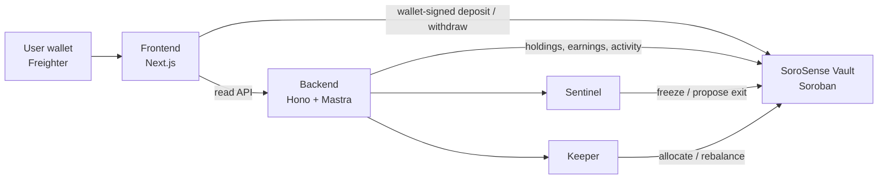
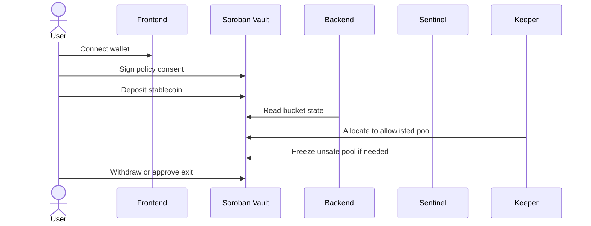

# SoroSense
### A non-custodial Stellar yield app with an invisible Sentinel keeper that allocates and protects your stablecoin buckets.

SoroSense lets a user deposit stablecoins into simple USD/EUR buckets. The app handles the protocol
complexity: wallet-signed deposits, keeper allocation, auto-compounding, and Sentinel freezes when a
pool turns unsafe.

APAC Stellar Hackathon - DeFi & Ecosystem Composability track

| Resource | Link |
| --- | --- |
| Site | https://sorosense.xyz |
| GitHub | https://github.com/AncungAulia/sorosense |
| Video | https://drive.google.com/drive/folders/1rWPd16_q5_nct4L4Dc6yRdjl0oaG9l3t?usp=sharing |
| Deck | https://canva.link/ykib0tnnny60uh8 |

---

## The problem

Most yield apps ask users to become pool researchers. They expose protocol catalogs, risk labels,
manual rebalancing, and timing decisions that ordinary users do not want to own.

The result is simple: users either do nothing, or they chase yield without understanding when the pool
became unsafe.

---

## What SoroSense does

SoroSense turns yield into a bucket-based flow:

1. Pick a stablecoin.
2. Deposit into a currency bucket.
3. Let the keeper allocate only into vetted pools.
4. Let Sentinel freeze unsafe routes before new money enters them.
5. Withdraw whenever you want.

The user signs all user-owned fund movements. The keeper can only act inside the vault's allowlisted
allocation surface.

---

## Live on Stellar testnet - verify it yourself

The core vault is deployed on Stellar testnet. The contract address is included here because the APAC
submission requires it.

| Contract | Address |
| --- | --- |
| SoroSense Vault | `CCK5G4FQ53Y7TIQY6CZLOSLCF5DKL44XV2LNFKCMHTSCWNWEAI3D457Y` |

| Proof | Link |
| --- | --- |
| Explorer | https://stellar.expert/explorer/testnet/contract/CCK5G4FQ53Y7TIQY6CZLOSLCF5DKL44XV2LNFKCMHTSCWNWEAI3D457Y |
| Deployment record | [`smart-contract/deployments/testnet.json`](smart-contract/deployments/testnet.json) |
| Contract docs | [`smart-contract/README.md`](smart-contract/README.md) |

The testnet deployment includes the upgradable vault, self-issued USDC/EURC demo assets, SAC wiring,
demo yield pools, and recorded smoke tests for deposit, allocation, and rising share price.

---

## How it works



The same flow, step by step:



---

## What is real in the demo

| Area | Status |
| --- | --- |
| Wallet signing | Real Freighter contract invocations on Stellar testnet |
| Vault | Real Soroban contract at the address above |
| Backend reads | Real HTTP API over holdings, earnings, activity, rates, pools |
| Demo assets | Self-issued testnet USDC/EURC, not production Circle assets |
| Yield pools | Demo `yield_pool` contracts for deterministic hackathon accrual |
| Simulator | Projection-only UI, not the accounting source |

---

## Try it locally

```bash
pnpm install
pnpm -C backend exec tsx src/http/server.ts
pnpm -C frontend dev
```

Open the frontend at `http://localhost:3000`.

The app runs in offline/mock mode if env is not configured. For live testnet configuration, copy the
blank env templates and fill your own values locally.

---

## Repositories in this monorepo

| Package | What's inside | Verify it |
| --- | --- | --- |
| [`smart-contract/`](smart-contract/README.md) | Soroban vault, deploy scripts, testnet record | `cd smart-contract && cargo test` |
| [`backend/`](backend/README.md) | Hono API, Sentinel, keeper, faucet, OpenAPI | `pnpm -C backend test` |
| [`frontend/`](frontend/README.md) | Wallet app, deposit/withdraw flows, dashboard | `pnpm -C frontend test` |
| [`landing-page/`](landing-page/README.md) | Marketing/demo site | `pnpm -C landing-page build` |
| [`packages/vault-client/`](packages/vault-client) | Shared vault interface, mock/real clients, bindings | `pnpm -C packages/vault-client test` |
| [`bruno/sorosense-api/`](bruno/sorosense-api/README.md) | Bruno API collection | `bru run --env local` |

---

## Environment policy

The README intentionally does not publish deploy env values such as WalletConnect project IDs,
backend URLs, or faucet/keeper secrets.

- Public contract proof lives in the contract section above.
- Frontend env names live in [`frontend/.env.example`](frontend/.env.example), with blank values.
- Backend env names live in [`backend/.env.example`](backend/.env.example), with secret values elided.
- Real secrets must stay in local `.env` files or deployment dashboards.

---

## Security and limitations

- The keeper never holds user funds.
- Deposits and withdrawals are wallet-signed by the user.
- Keeper movement is constrained by vault roles and pool allowlists.
- Testnet USDC/EURC are self-issued demo assets.
- Demo yield pools are hackathon infrastructure; real Blend integration is post-hackathon.
- Before mainnet, upgrade admin should move behind a timelock or multisig.
