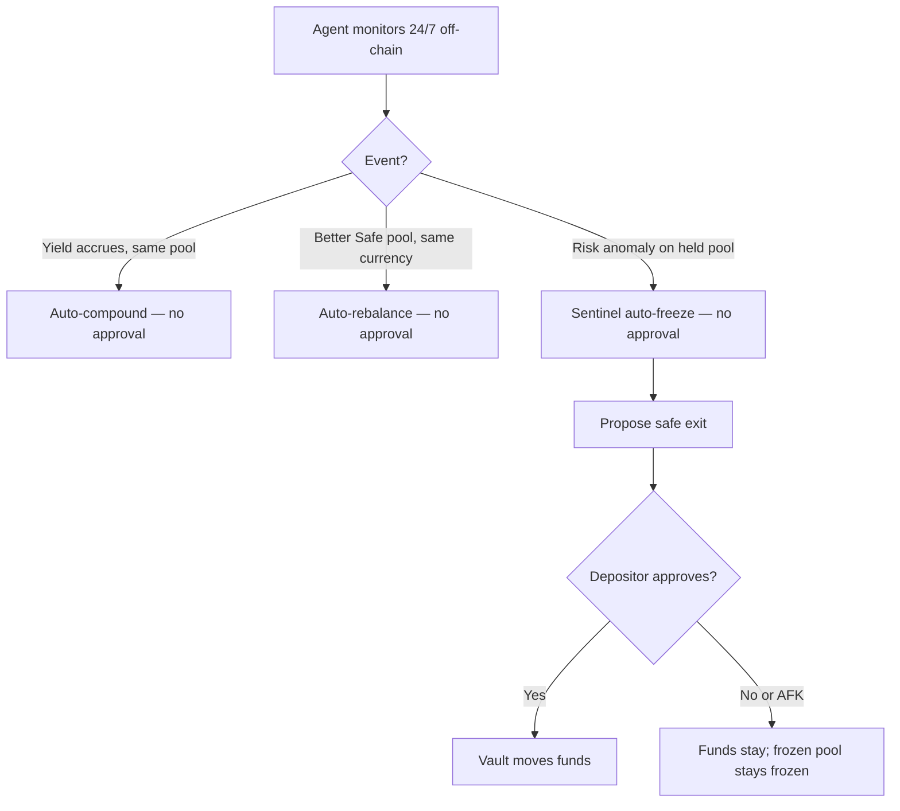

# SoroSense - Plan

## Goal Capsule

- **Objective:** Ship a demo-ready, non-custodial earn app for Stellar with a simple deposit-to-earn experience: connect a wallet, deposit stablecoins into per-currency buckets, and an AI agent auto-allocates and rebalances each bucket to the safest-highest yield in its currency with auto-compound and auto-reinvest — no user risk preference. A safety engine keeps funds in vetted pools and exits toxic ones behind the scenes — targeting the DeFi & Ecosystem Composability track of the APAC Stellar Hackathon.
- **Product authority:** Axel (PM, backend + AI).
- **Team → subrepos:** Axel `backend/`, James `smart-contract/`, Ancung `frontend/`, Nabil `landing-page/`.
- **Deadline:** Submit 2026-07-15 (~12 days out).
- **Open blockers:** None. All product decisions resolved; ready for planning.

---

## Product Contract

### Summary

SoroSense is a mobile-first, non-custodial earn app for Stellar with a deliberately simple deposit-to-earn experience. Users connect a Stellar wallet (Freighter and others) and deposit the supported stablecoins they already hold (USDC, EURC, CETES); each currency becomes its own bucket, allocated to the safest-highest yield in that currency, auto-compounded, with rewards auto-reinvested. The agent auto-rebalances within the Sentinel-vetted Safe set — no user risk preference — and never converts between currencies. A safety engine runs behind the scenes: it keeps funds in vetted pools and exits toxic ones without surfacing itself in the UI. There is a deterministic earnings simulator and no chatbot.

### Problem Frame

Stellar yield is real but scattered and treacherous. Live probes (2026-07-03) found ~20+ genuine earn opportunities across five permissionless platforms — Blend (USDC 6.6%), Gami (7.0%), DeFindex vaults (up to 8.59%), Ondo USDY (4.65%), Etherfuse CETES (5.57%) — with a real ~2pp spread on the same asset. But the same catalog is full of traps: a squatter asset posing as USST, MGUSD whose issuer keeps the yield, a $97 ghost protocol, KYC walls, and dead pools. No single place lists what is real, what it pays, and what will hurt you.

The risk that actually matters lives per-pool. In February 2026 the YieldBlox pool on Blend V2 was drained about $10.8M when Reflector's price feed degenerated to a single manipulated trade in a dead market; that pool's TVL is now near $380, effectively dead despite depositor compensation. No Stellar product sells defense against this failure mode. A depositor today either leaves USDC idle or manually picks a pool with no view of its risk and no protection if it turns toxic while they sleep.

### Key Decisions

- **Safety is invisible to users; it is the engine and the pitch.** The agent silently keeps funds in vetted pools, avoids the traps (squatter assets, issuer-keeps-yield, dead pools, exploited pools), and exits toxic positions. The app UI does not brand or surface this and stays a clean deposit-to-earn experience. The safety engine and the real trap data are the differentiator to judges, not an in-app feature.
- **Venue tiers ground the hub in probed data.** Tier 1 integrable core: Blend Fixed + DeFindex (most open APIs) executed live in the demo, Gami and RWA hold-to-earn (USDY, CETES) next; Tier 2 (Aquarius, Soroswap, KYC-gated RWAs) shown catalog-read-only until their data/access gaps close.
- **Non-custodial one-time safety-mandate consent — no risk tier.** The depositor signs a single policy at deposit: the agent may auto-compound and auto-rebalance to the safest-highest risk-adjusted pool **within the Sentinel-vetted Safe set and the same currency**, without per-move approval, so funds keep optimizing while the user is away. There is **no user-facing risk-tier choice** — the agent always seeks the safest-highest yield per bucket. The only signed fund movements are a Sentinel-freeze exit and a withdrawal; an emergency protective freeze runs automatically. Funds never leave the contract — the policy is enforced, not custodied.
- **Risk-adjusted allocation is the primary defense; Sentinel is the backstop.** The agent chases the highest yield among pools that pass Sentinel, never raw APY — high APY prices in risk. A periodic freeze cannot recover funds already drained in a single-block exploit, so staying out of dangerous pools is what protects the depositor; the freeze is the last resort for a held pool that turns toxic.
- **Delegated yield optimization, not open-ended trading.** The agent optimizes yield within the signed mandate; it never takes directional trades. Matches the DWF finding that AI wins at yield optimization but loses at open-ended trading.
- **Never convert currency; wallet-funded buckets.** The user funds each bucket by sending a supported stablecoin from their wallet; SoroSense receives and optimizes it in that currency and never swaps between currencies. This removes FX risk from the agent (the user owns the currency mix), removes swap/DEX complexity, and — with no AMM-LP — removes impermanent loss.
- **Event/threshold-driven cadence.** The agent monitors continuously off-chain and proposes only on a sustained yield delta above a threshold or a risk anomaly — not hourly (noise) and not monthly (too slow to catch a risk event).
- **Wallet-connect onboarding, Freighter-first.** Login connects a Stellar wallet via Stellar Wallets Kit; the same app runs inside Freighter's Discover browser and as a standalone web app, so it reaches Freighter users and any Stellar-wallet user through one auth path. Passkey/smart-wallet onboarding is deferred (redundant when the wallet is the identity, and it was the top frontend risk).
- **No chatbot; a deterministic simulator only.** The AI is the allocator plus the safety engine, both behind the scenes. The only user-facing surface is a deterministic earnings simulator (amount and period to projected earnings), computed by math, not an LLM. Free-form chat is deferred; this avoids the dead chat-to-trade category and keeps the demo reliable.
- **Smart logic off-chain, custody and simple guards on-chain.** The vault contract holds funds, tracks shares, executes approved allocations, and enforces pause/cap/risk-gate; risk scoring and monitoring live in the agent. Keeps 13-day complexity out of Rust.
- **Testnet-first, mainnet-ready.** The demo runs on testnet with Blend as the primary venue; the architecture is prepared for mainnet and additional venues without a redesign.

### Actors

- A1. Depositor — connects a wallet, deposits stablecoins, signs the one-time consent, approves a Sentinel-freeze exit and withdrawals, uses the simulator. Sets no risk preference.
- A2. Allocator agent (Mastra) — monitors yield, scores risk, generates allocation and rebalance proposals, narrates them.
- A3. Sentinel — monitors per-pool risk signals and trips the emergency freeze; supplies the per-pool risk score.
- A4. Vault contract — custodies pooled funds, tracks shares, executes approved allocations, enforces pause/cap/risk-gate.

### Key Flows

- F1. Deposit and auto-earn
  - **Trigger:** A depositor onboards and deposits USDC.
  - **Steps:** Passkey onboarding creates the smart wallet; funds enter the vault; the agent allocates to a supported safe pool; yield auto-compounds in place.
  - **Covered by:** R1, R2, R3, R4, R5, R12.
- F2. Auto-rebalance
  - **Trigger:** The agent detects a sustained better risk-adjusted pool within the Sentinel-vetted Safe set and the same currency.
  - **Steps:** The agent moves funds automatically, with no approval and no risk-tier check. (The only approval-gated movements are a Sentinel-freeze exit and a withdrawal.)
  - **Covered by:** R6, R7, R21, R22.
- F3. Sentinel emergency freeze
  - **Trigger:** Sentinel detects an anomaly (thin liquidity or oracle deviation) on a held pool.
  - **Steps:** The vault auto-freezes the affected pool without approval; the agent proposes a safe exit; the depositor approves the movement.
  - **Covered by:** R8, R9, R10.
- F4. Simulate and explain
  - **Trigger:** The depositor asks "what if I deposit $X" or "is my money safe".
  - **Steps:** The agent returns a yield projection and a per-pool risk breakdown; nothing executes.
  - **Covered by:** R11, R14, R15.

### Requirements

**Custody and funds**
- R1. Funds are held non-custodially by the vault contract; SoroSense never takes custody.
- R2. The vault tracks each depositor's share of the pooled funds.
- R3. Deposits and withdrawals are in supported stablecoins (USDC, EURC, CETES); SoroSense never swaps or converts between currencies.
- R23. Funds are organized into per-currency buckets; a bucket is created from whatever supported currency the depositor sends from their wallet, and each bucket is optimized and risk-managed independently within its own denomination. To hold a bucket in a currency, the depositor brings that currency — SoroSense does not split one currency into another.

**Allocation and yield**
- R4. The agent allocates deposits to the highest risk-adjusted stablecoin yield among supported pools, not the highest raw APY.
- R5. Yield auto-compounds into the same pool under a one-time depositor consent, without per-event approval.
- R6. The agent monitors continuously and acts on a sustained risk-adjusted-yield improvement or a risk anomaly, never on raw APY.
- R7. A rebalance to a better pool within the Sentinel-vetted Safe set and the same currency executes automatically with no per-move approval. There is no user-selected risk ceiling; the only approval-gated fund movements are a Sentinel-freeze exit (F3) and a withdrawal.
- R21. Rebalancing stays within a bucket's own currency; the agent never converts currency to chase yield (a higher APY in another currency is an FX bet, not a yield gain).
- R22. The agent executes only supply / vault / hold-to-earn positions, never AMM liquidity provision, so depositors are never exposed to impermanent loss.
- R24. Yield rewards auto-reinvest into the same-currency pool (auto-subscribe, on by default); reward emissions paid in a different token are out of scope for now (no swap).

**Sentinel risk defense**
- R8. Sentinel evaluates per-pool risk signals — at least liquidity depth and oracle price deviation — before and around allocation actions.
- R9. On a tripped anomaly, the vault auto-freezes the affected pool without waiting for approval.
- R10. Emergency auto-action is limited to a protective freeze; it never moves funds to a different pool without approval.
- R11. A per-pool risk score drives allocation internally; it is not surfaced as a user-facing element.

**Onboarding and identity**
- R12. Login connects a Stellar wallet via Stellar Wallets Kit (Freighter, xBull, Lobstr, WalletConnect); the app runs both inside Freighter's Discover browser and as a standalone web app.
- R13. Fund movements and approvals are signed in the connected wallet's own popup; SoroSense never holds keys.

**AI surface**
- R14. The MVP has no chatbot; agent actions appear as plain activity entries. Free-form chat is deferred.
- R15. The simulator projects expected yield for a hypothetical deposit and period, computed deterministically (no LLM).

**Hub catalog**
- R19. The agent draws from a vetted internal catalog of mainnet venues (Blend, Gami, DeFindex, USDY, CETES) with live APY and TVL; the deposit UI only shows the currencies the user can fund.
- R20. Traps and gated venues (squatter assets, issuer-keeps-yield, dead pools, KYC walls) are excluded internally by the safety engine; they are evidence for the pitch, not a user-facing screen.

**Platform**
- R16. The app is mobile-first web, with desktop web added after the mobile UI is done.
- R17. Transactions demo on Stellar testnet; the app reads real mainnet APY and TVL for allocation, and the architecture is prepared for mainnet execution.

### Acceptance Examples

- AE1. **Covers R5, R7.** Given a depositor with funds in Pool A, when yield accrues it re-compounds into Pool A automatically; when a better pool within the Sentinel-vetted Safe set and the same currency appears, the agent moves funds automatically with no approval prompt.
- AE2. **Covers R9, R10.** Given Sentinel trips on Pool A while the depositor is offline, then the vault freezes Pool A immediately without approval, and funds are not moved elsewhere until the depositor approves.
- AE3. **Covers R6.** Given Pool B's risk-adjusted yield beats Pool A's by less than the threshold, when the agent evaluates, then no rebalance is made.
- AE4. **Covers R14.** Given a depositor types "move me to the safest pool" in chat, then the agent explains options and surfaces a proposal to approve — it does not execute from chat.

### Scope Boundaries

**Deferred for later**
- Mainnet execution deployment.
- Fiat on/off-ramp (MoneyGram, Coins.ph).
- Execution wiring beyond Blend + DeFindex — Gami and RWA hold-to-earn (USDY, CETES) next; Aquarius/Soroswap when their per-pool data / API-key gaps close.
- KYC-gated RWA venues (YLDS, BENJI, CRDT) — internal-catalog only, not executable.
- In-app hub / explore catalog and free-form chatbot — the app stays deposit-to-earn simple.
- Passkey / smart-wallet onboarding — auth is wallet-connect via Wallets Kit.
- Reward-emission harvesting that needs a swap — auto-subscribe only reinvests same-currency rewards.
- Risk-score-as-a-service: publishing per-pool risk scores as a public contract other protocols can read.

**Outside this product's identity**
- Chat-to-execute and conversational trading.
- Open-ended AI trading that picks directional trades.
- In-app currency conversion / FX swaps — SoroSense never converts between currencies.
- AMM liquidity provision and any impermanent-loss-bearing position.
- Volatile-asset buckets (e.g. XLM) inside the "safe" experience; non-stablecoin yield.
- ROSCA/arisan, invoice financing, and prediction-market products.

### Dependencies / Assumptions

- Depends on Blend SDK (testnet + mainnet reads) and the DeFindex open REST API (`api.defindex.io`) as the first two execution venues; DefiLlama yields API, Horizon, and issuer TOMLs for catalog data; Reflector price data plus on-chain liquidity data for Sentinel signals; Mastra with an OpenRouter LLM for the agent; Stellar Wallets Kit plus @stellar/freighter-api and WalletConnect for multi-wallet connect and in-wallet signing; distribution via Freighter's Discover tab and as a standalone web app.
- Assumes the target user is anyone wanting safe stablecoin yield without DeFi expertise; $10k is an illustrative amount, not a minimum.
- Assumes Mastra has no built-in scheduler, so the 24/7 monitor is driven by an external cron or queue.
- Assumes the demo recreates a YieldBlox-like risky condition on testnet so Sentinel can detect and freeze it live.

### Outstanding Questions

**Deferred to Planning**
- Sentinel thresholds: liquidity floor, oracle-deviation percentage, and the sustained-delta window.
- How the off-chain Sentinel signal authorizes the on-chain freeze (keeper/oracle role design).
- Execution-venue demo order within Blend + DeFindex (which pools/vaults make the live demo set).
- Demo-trigger realism: an engineered testnet condition versus a scripted trigger.
- Whether SoroSense charges a protocol fee, and its shape.
- How the one-time safety-mandate consent is enforced on-chain non-custodially (a signed policy the vault or a smart-account policy checks before an auto-rebalance).
- Cadence thresholds: APY/display refresh (~hourly), Sentinel risk-signal poll (~minutes), and the sustained-delta window + net-of-cost threshold that actually triggers a rebalance.
- Demo currency set: which of USD (USDC/USDY), EUR (EURC), MXN (CETES) buckets ship live vs catalog-only.

### Sources / Research

- Live-probed mainnet yield catalog (endpoints + real APY/TVL, tiered, incl. traps): `docs/research/2026-07-03-stellar-yield-hub-catalog.md`.
- YieldBlox / Blend V2 oracle exploit (Feb 2026): Halborn and BlockSec write-ups.
- Blend Capital docs (`docs.blend.capital`), DeFindex docs (`docs.defindex.io`), Soroswap docs (`docs.soroswap.finance`).
- Aquarius (AMM-LP) as the first non-lending risk shape with a sized testnet venue.
- passkey-kit + Launchtube (smart wallet, fee sponsorship); Stellar Wallets Kit (multi-wallet fallback); x402 on Stellar (agentic-payments context).
- Mastra (agent/workflow framework; no built-in scheduler) with OpenRouter as the LLM gateway.
