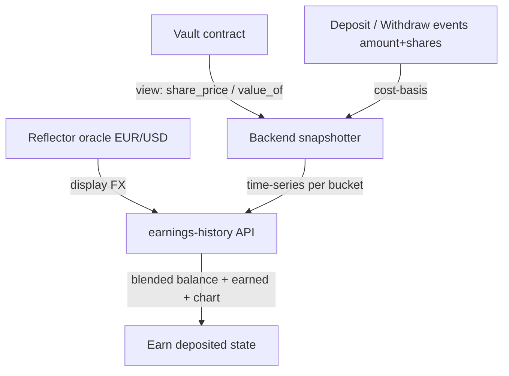

# Earn 2-State + Earnings History - Plan

## Goal Capsule

- **Objective:** Beri pengguna yang sudah deposit sebuah tampilan Earn "deposited" — saldo blended-USD dengan drill-down per-kantong, APY berjalan, chart earnings (Day/Week/Month/Year), dan rincian earned per bulan — ditopang kapabilitas backend earnings-history baru. State "belum deposit" tetap memakai proyeksi yang ada.
- **Product authority:** Axel (backend & AI, sekaligus PM).
- **Open blockers:**
  - Read-method nilai aset/NAV di kontrak (R12) belum ada — perlu tiket kecil untuk Ulin (track smart-contract, epik STE-6).
  - Permukaan frontend Earn belum dikerjakan — masuk perluasan STE-26 (U16, track frontend Ancung, belum mulai).

## Product Contract

### Summary

Tab Earn mendapat state "deposited" sesuai referensi: satu **Earn balance blended-USD** dengan drill-down per-currency, APY, **chart earnings** multi-granularitas, dan **breakdown earned per bulan**. Angka earned dihitung dari **yield murni per kantong** lalu dijumlahkan ke USD, sehingga pergerakan kurs tidak pernah tampil sebagai untung/rugi. Data time-series disediakan oleh **snapshotter backend** yang membaca nilai aset dari read-method kontrak.

### Problem Frame

Tab Earn saat ini hanya melayani satu keadaan — simulator proyeksi ("kalau taruh X, setahun jadi Y") lewat `backend/src/api/simulate.ts`. Begitu pengguna sudah deposit, mereka tidak punya cara melihat berapa yang benar-benar mereka hasilkan dari waktu ke waktu: tren, bulan ini vs bulan lalu, total sejauh ini. Feed `backend/src/api/activity.ts` yang ada hanya mencatat kejadian agent (allocated/compounded/froze), bukan agregasi earning per periode. Kesenjangan ini yang membuat produk terasa "menaruh uang lalu buta" — persis yang ingin dihindari dari positioning deposit-to-earn yang tenang.

### Key Decisions

- **Headline blended-USD, dana tetap per-kantong.** Earn balance adalah jumlah nilai tiap kantong dikonversi ke USD (mis. `100 EURC × $1,14 + 100 USDC × $1 = $214`). Konversi hanya untuk display; dana tidak pernah dipindah antar-currency. Alternatif per-kantong-terpisah ditolak karena satu angka lebih mudah dibaca dan tetap bisa di-drill-down.
- **Earned = yield native per kantong, dijumlahkan ke USD.** Earning dihitung dalam mata uang asli tiap kantong (yield saja), baru totalnya di-USD-kan. Konsekuensinya kurs EUR/USD tidak pernah muncul sebagai untung/rugi — "earned" selalu mencerminkan hasil yield, bukan gerakan valuta. Sesuai positioning aman.
- **NAV dibaca via read-method kontrak (Ulin), bukan rekonstruksi backend.** Kontrak menambah view read-only (mis. `share_price`/`value_of`) yang dibaca backend untuk konversi share→aset. Rekonstruksi murni backend (saldo SAC + pool holdings + jumlah event) ditolak: lebih rapuh, lebih berat, dan `total_shares` memang belum diekspos. Kontrak sudah upgradable sehingga penambahan view murah.

### Requirements

**State tab Earn**

- R1. Tab Earn merender dua state: "belum deposit" (proyeksi lewat `backend/src/api/simulate.ts` yang ada) dan "deposited" (saldo + histori earning).
- R2. State ditentukan per pengguna dari saldo kantong: "deposited" jika ada kantong dengan saldo > 0, selain itu "belum deposit".

**Tampilan earnings (blended-USD)**

- R3. State deposited menampilkan satu "Earn balance" blended-USD = jumlah atas semua kantong dari (nilai aset kantong × kurs USD). Konversi hanya untuk display.
- R4. Saldo blended dapat di-drill-down ke rincian per-kantong: jumlah yang dipegang tiap currency dan nilai USD-nya.
- R5. APY blended ditampilkan = APY kantong saat ini, ditimbang oleh nilai USD tiap kantong.
- R6. "You're earning" dan chart menampilkan total earned; earned dihitung sebagai yield native per kantong, lalu dijumlahkan ke USD.
- R7. Pergerakan kurs tidak pernah dihitung sebagai earning — earned mencerminkan yield saja.

**Earnings history (time-series)**

- R8. Chart mendukung granularitas Day / Week / Month / Year atas earned dari waktu ke waktu.
- R9. Rincian per bulan kalender menampilkan earned tiap bulan (mis. "This Month +$38.34", "November +$122.14").
- R10. Histori earning ditopang snapshotter backend yang merekam share price / earned per kantong dari waktu ke waktu.
- R11. Cost-basis per pengguna diturunkan dari event on-chain `Deposit`/`Withdraw` (yang membawa `amount` + `shares`), bukan disimpan terpisah.

**Seam baca kontrak**

- R12. Vault mengekspos view read-only untuk nilai aset / share price per kantong, dikonsumsi backend untuk konversi share → nilai aset.

**Reuse & invarian**

- R13. "Earn more" memakai ulang alur deposit; "Move to cash" memakai ulang withdraw. Tidak ada jenis pergerakan baru.
- R14. Tidak ada label risiko di mana pun pada Earn — keamanan tetap tak terlihat.

### Earnings data flow

### Acceptance Examples

- AE1. Kurs-saja, bukan earning. **Given** kantong EURC dengan yield 0 pada periode, **When** EUR/USD naik dari $1,14 ke $1,16, **Then** Earn balance blended naik tetapi "earned" tetap datar. **Covers R6, R7.**
- AE2. Pergantian state. **Given** pengguna tanpa saldo kantong, **When** membuka Earn, **Then** melihat proyeksi "belum deposit"; **When** melakukan deposit pertama, **Then** melihat state "deposited". **Covers R1, R2.**
- AE3. Rincian per bulan. **Given** snapshot per periode tersedia, **When** melihat breakdown, **Then** "This Month" = earned sejak awal bulan berjalan dan bulan-bulan sebelumnya menampilkan earned satu bulan penuh. **Covers R9, R10.**

### Scope Boundaries

**Ditunda (nanti, bukan sekarang):**

- Dukungan earning penuh kantong MXN — butuh kurs MXN/USD dan venue MXN; dahulukan USD/EUR.
- Granularitas "Day" dengan data intraday riil — untuk demo hackathon, seed/simulasikan horizon pendek karena histori testnet belum ada.

**Di luar identitas produk:**

- Tidak ada konversi dana antar-kantong untuk menghasilkan angka blended; blended murni display.

### Dependencies / Assumptions

- Ulin menambah view read-only nilai aset/share price (R12) — perubahan kontrak kecil; vault upgradable sehingga murah.
- Reflector oracle menyediakan kurs EUR/USD (dan MXN/USD bila MXN) via `backend/src/tools/price.ts`.
- `backend/src/api/simulate.ts` menopang state "belum deposit"; `backend/src/api/activity.ts` tetap feed kejadian agent, terpisah dari earnings history.
- Vault per-currency (satu kontrak) — kantong tak pernah dicampur.

### Outstanding Questions

**Diserahkan ke planning:**

- Cadence snapshot (per jam / per hari) dan pilihan store (in-memory untuk demo vs durable).
- Sumber data granularitas "Day" untuk demo (seed vs live).
- Apakah penimbang APY blended memakai kurs live saat baca.
