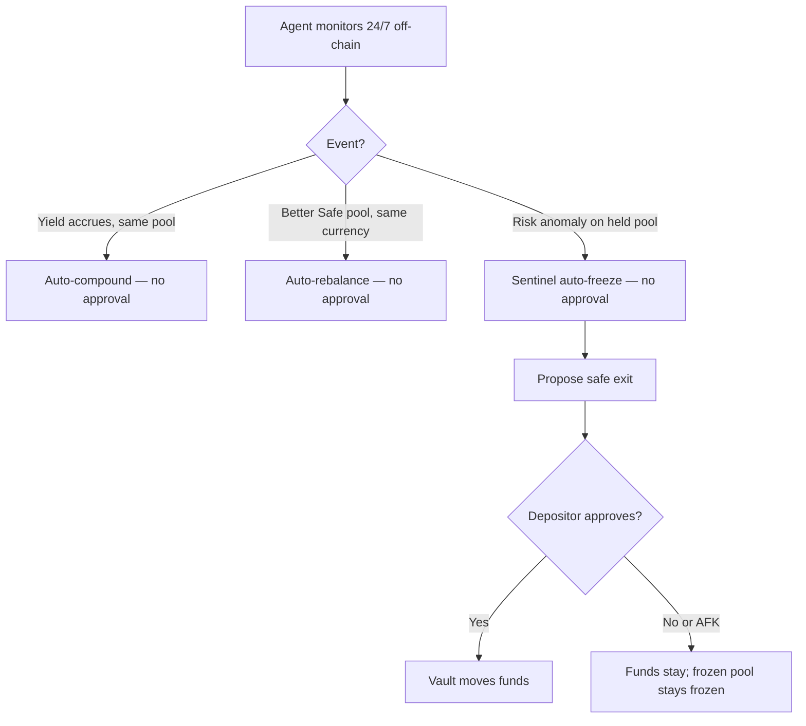
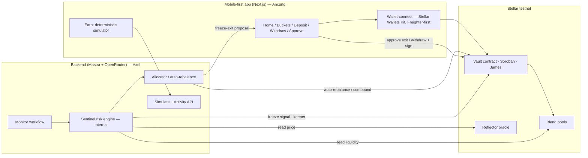
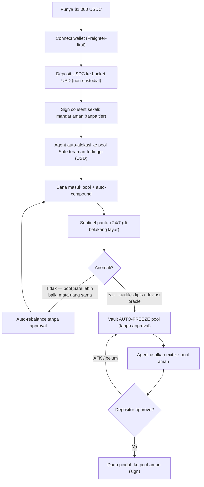
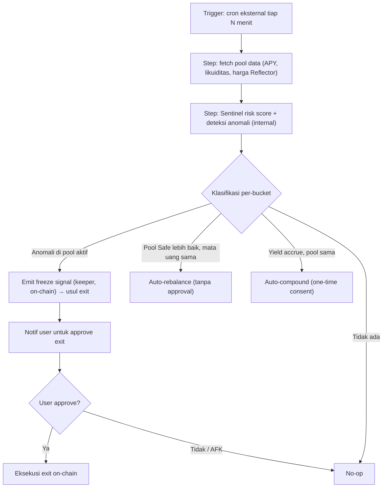
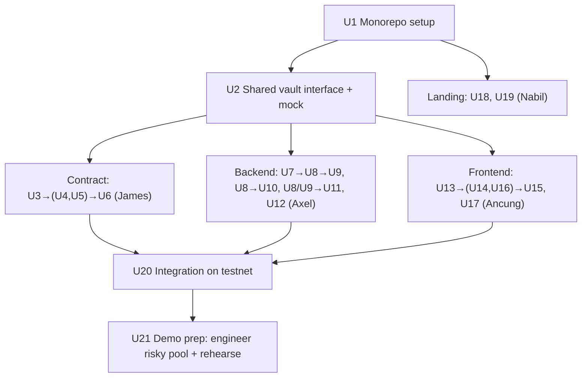

# SoroSense - Plan

> **Product Contract preservation:** **changed** vs the prior plan draft to re-align with the current brainstorm (`docs/brainstorms/2026-07-03-sorosense-requirements.md`) and Axel's 2026-07-03 decisions. Specifically: **R18 removed** (no user-facing risk tier — the agent always seeks the safest-highest yield per bucket); **R7 revised** (auto-rebalance within the Sentinel-vetted Safe set needs no per-move approval; only a Sentinel-freeze exit and a withdraw are signed); **R11/R14/R19/R20** synced to the brainstorm's *invisible-safety* shape (no surfaced risk labels, no chatbot, no user-facing hub catalog); **R12** is wallet-connect (Freighter-first via Stellar Wallets Kit), passkey deferred. The brainstorm's R7/R18/F2/AE1 are updated in the same pass so the source stays consistent. All other R/A/F/AE IDs carried forward verbatim.

## Goal Capsule

- **Objective:** Build SoroSense to demo-ready — a non-custodial, mobile-first **deposit-to-earn** app for Stellar. Connect a Stellar wallet, deposit the stablecoins you already hold into per-currency buckets, and an AI agent auto-allocates each bucket to the **safest-highest yield in that currency**, auto-compounds, and auto-reinvests. A **Sentinel** safety engine runs invisibly: it keeps funds in vetted pools, avoids the traps, and auto-freezes a held pool that turns toxic. No risk-tier picker, no chatbot, no explore-catalog — a clean deposit-to-earn surface. Targets the DeFi & Ecosystem Composability track of the APAC Stellar Hackathon (submit 2026-07-15).
- **Authority:** Axel (PM). The Product Contract is authoritative for WHAT; this plan owns HOW. Substantive product-scope changes route back to `ce-brainstorm`.
- **Execution profile:** Deep, greenfield monorepo, four parallel workstreams (contract · backend/agent · app frontend · landing), ~12 days.
- **Parallelism:** After the shared seam (U1→U2) lands, the four tracks run fully in parallel — as separate teammates **or** as concurrent Claude Code sub-agent tasks. The shared `packages/vault-client` (interface + mock) and a shared `frontend/components` token/primitive set are the single sources for cross-cutting code, so no track re-implements the vault surface or UI primitives (DRY boundary — see Parallelization).
- **Stop conditions:** Surface any blocker that changes scope or contradicts the brainstorm instead of guessing. Do not silently expand scope; tangential work goes to Deferred.
- **Tail ownership:** Axel owns integration (U20) and demo rehearsal (U21).
- **Demo success (the money-shot):** connect wallet → deposit → agent auto-allocates to the safest-highest pool → Sentinel auto-freezes a toxic pool → approve safe exit → simulate — end-to-end on testnet.
- **UI reference:** `docs/mockups/sorosense-mock.html` is the visual + interaction source of truth for the app frontend (screens, flows, tokens). UI menyesuaikan — implementers may refine within that language.

---

## Product Contract

### Summary

SoroSense is a mobile-first, non-custodial **deposit-to-earn** app for Stellar with a deliberately simple surface. Users connect a Stellar wallet (Freighter-first via Stellar Wallets Kit) and deposit the supported stablecoins they already hold (USDC, EURC, CETES); **each currency becomes its own bucket**, allocated to the safest-highest yield in that currency, auto-compounded, with rewards auto-reinvested. The agent auto-rebalances within the Sentinel-vetted **Safe** pool set — same currency, never converting, never AMM-LP — with **no per-move approval and no user risk preference**. A Sentinel safety engine runs behind the scenes: it keeps funds in vetted pools, avoids traps (squatter assets, issuer-keeps-yield, dead pools, exploited pools), and **auto-freezes a held pool on anomaly**. The only signed actions are the one-time deposit consent, a Sentinel-freeze **exit**, and **withdraw**. There is a deterministic earnings simulator and **no chatbot**; the safety engine and the real trap data are the differentiator to judges, not an in-app screen.

### Problem Frame

Stellar yield is real but scattered and treacherous. Live probes (2026-07-03) found ~20+ genuine earn opportunities across five permissionless platforms — Blend USDC 6.6%, Gami 7.0%, DeFindex vaults up to 8.59%, USDY 4.65%, CETES 5.57% — with a real ~2pp same-asset spread. The same catalog is full of traps: a squatter asset posing as USST, MGUSD whose issuer keeps the yield, a $97 ghost protocol, dead pools, KYC walls. And the risk lives per-pool: in Feb 2026 the YieldBlox pool on Blend V2 was drained ~$10.8M via a manipulated oracle feed; it sits near-dead today. No single place lists what is real, what it pays, and what will hurt you — and no Stellar product sells defense against the toxic-pool failure mode. A depositor today either leaves stablecoins idle or manually picks a pool with no view of its risk and no protection if it turns toxic while they sleep. (Full framing: see origin; probed catalog: `docs/research/2026-07-03-stellar-yield-hub-catalog.md`.)

### Actors

- A1. Depositor — connects a wallet, deposits stablecoins, signs the one-time consent, approves a Sentinel-freeze exit and withdrawals, uses the simulator. **Sets no risk preference.**
- A2. Allocator agent (Mastra) — monitors yield, scores risk, auto-allocates and auto-rebalances each bucket to the safest-highest Safe pool, and logs plain activity entries.
- A3. Sentinel — monitors per-pool risk signals and trips the emergency freeze; supplies the per-pool risk score used internally.
- A4. Vault contract — custodies pooled funds, tracks shares, executes approved allocations, enforces pause/cap/freeze.

### Key Flows

- F1. Deposit and auto-earn — connect wallet (Freighter-first) → deposit a supported stablecoin into its currency bucket → sign the one-time safety-mandate consent → agent auto-allocates to the safest-highest Safe pool → yield auto-compounds in place. (R1-R5, R12, R23, R24)
- F2. Auto-rebalance — the agent detects a sustained better risk-adjusted pool **within the Sentinel-vetted Safe set and the same currency**; it moves funds **automatically, with no approval**. (No risk ceiling, no per-move signing.) (R6, R7, R21, R22)
- F3. Sentinel emergency freeze — Sentinel detects an anomaly on a held pool → the vault auto-freezes the pool without approval → the agent proposes a safe exit → the depositor approves the movement. (R8, R9, R10)
- F4. Simulate — the depositor enters an amount + period → a deterministic calculator returns a yield projection; nothing executes and no risk label is shown. (R15)



### Requirements

**Custody and funds**
- R1. Funds are held non-custodially by the vault contract; SoroSense never takes custody.
- R2. The vault tracks each depositor's share of the pooled funds.
- R3. Deposits and withdrawals are in supported stablecoins (USDC, EURC, CETES); SoroSense never swaps or converts between currencies.
- R23. Funds are organized into per-currency buckets; a bucket is created from whatever supported currency the depositor sends, optimized and risk-managed independently within its own denomination.

**Allocation and yield**
- R4. The agent allocates deposits to the highest risk-adjusted stablecoin yield among the Sentinel-vetted Safe pools, not the highest raw APY.
- R5. Yield auto-compounds into the same pool under the one-time consent, without per-event approval.
- R6. The agent monitors continuously and acts on a sustained risk-adjusted-yield improvement or a risk anomaly, never on raw APY.
- R7. A rebalance to a better pool **within the Sentinel-vetted Safe set and the same currency executes automatically with no per-move approval**. There is no user-selected risk ceiling; the only approval-gated fund movements are a Sentinel-freeze exit (F3) and a withdrawal.
- R21. Rebalancing stays within a bucket's own currency; the agent never converts currency to chase yield.
- R22. The agent executes only supply / vault / hold-to-earn positions, never AMM liquidity provision, so depositors are never exposed to impermanent loss.
- R24. Yield rewards auto-reinvest into the same-currency pool (on by default); reward emissions paid in a different token are out of scope for now (no swap).

**Sentinel risk defense (invisible)**
- R8. Sentinel evaluates per-pool risk signals — at least liquidity depth and oracle price deviation — before and around allocation actions.
- R9. On a tripped anomaly, the vault auto-freezes the affected pool without waiting for approval.
- R10. Emergency auto-action is limited to a protective freeze; it never moves funds to a different pool without approval.
- R11. A per-pool risk score drives allocation internally; it is **not** surfaced as a user-facing element (no Safe/Watch/Risky labels in the app, including the simulator).

**Onboarding and identity**
- R12. Login connects a Stellar wallet via Stellar Wallets Kit (Freighter-first; xBull, Lobstr, WalletConnect); the app runs both inside Freighter's Discover browser and as a standalone web app. Passkey/smart-wallet onboarding is deferred.
- R13. Fund movements and approvals are signed in the connected wallet's own popup; SoroSense never holds keys.

**AI surface**
- R14. No chatbot. Agent actions appear as plain activity entries (Home "Agent activity", Account "Recent activity"). Free-form chat is deferred.
- R15. The simulator projects expected yield for a hypothetical deposit and period, computed deterministically (no LLM); it shows no risk label.

**Hub catalog (internal only)**
- R19. The agent draws from a vetted **internal** catalog of venues (Blend, Gami, DeFindex, USDY, CETES) with live APY and TVL; the deposit UI only shows the currencies the user can fund. There is no user-facing explore/hub screen.
- R20. Traps and gated venues (squatter assets, issuer-keeps-yield, dead pools, KYC walls) are excluded internally by the safety engine; they are evidence for the pitch, not a user-facing screen.

**Platform**
- R16. The app is mobile-first web, with desktop web added after the mobile UI is done.
- R17. Transactions demo on Stellar testnet; the app reads real mainnet APY and TVL for allocation, and the architecture is prepared for mainnet execution.

### Acceptance Examples

- AE1. **Covers R5, R7.** Given a depositor with funds in Pool A, when yield accrues it re-compounds into Pool A automatically; when a better pool **within the Sentinel-vetted Safe set and the same currency** appears, the agent moves funds **automatically with no approval prompt**.
- AE2. **Covers R9, R10.** Given Sentinel trips on Pool A while the depositor is offline, then the vault freezes Pool A immediately without approval, and funds are not moved elsewhere until the depositor approves the proposed exit.
- AE3. **Covers R6.** Given Pool B's risk-adjusted yield beats Pool A's by less than the threshold, when the agent evaluates, then no rebalance is made.
- AE4. **Covers R11, R15.** Given a depositor enters "$1,000 for 1 year" in the simulator, then a deterministic yield projection is shown with **no risk label** and nothing executes.

### Scope Boundaries

**Deferred for later** (post-hackathon, architecture-ready)
- Mainnet execution deployment; fiat on/off-ramp (MoneyGram, Coins.ph).
- Execution wiring beyond Blend + DeFindex — Gami and RWA hold-to-earn (USDY, CETES) next; Aquarius/Soroswap when their per-pool data / API-key gaps close.
- KYC-gated RWA venues (YLDS, BENJI, CRDT) — internal-catalog only, not executable.
- Passkey / smart-wallet onboarding — auth is wallet-connect via Wallets Kit.
- Reward-emission harvesting that needs a swap — auto-reinvest only same-currency rewards.
- Risk-score-as-a-service (per-pool scores as a public contract other protocols read).

**Outside this product's identity**
- **User-selected risk tiers / a risk-preference picker** — the agent always seeks the safest-highest yield per bucket; risk is invisible.
- **User-facing hub / explore catalog** and any surfaced risk labels — the app stays deposit-to-earn simple.
- **Free-form chatbot / chat-to-execute** and conversational trading; open-ended AI directional trading.
- In-app currency conversion / FX swaps — SoroSense never converts between currencies.
- AMM liquidity provision and any impermanent-loss-bearing position.
- Non-stablecoin / volatile-asset yield; ROSCA/arisan, invoice financing, prediction markets.

### Sources / Research

- YieldBlox / Blend V2 oracle exploit (Feb 2026): Halborn, BlockSec write-ups.
- Live-probed mainnet yield catalog (real APY/TVL per endpoint, tiered, incl. traps): `docs/research/2026-07-03-stellar-yield-hub-catalog.md`. Execution shortlist by API openness: DeFindex (open REST) → Blend (SDK) → Gami → RWA hold-to-earn.
- Blend Capital docs (`docs.blend.capital`), DeFindex docs (`docs.defindex.io`); Stellar Wallets Kit + @stellar/freighter-api + WalletConnect; Mastra (no built-in scheduler) + OpenRouter.

---

## Planning Contract

### Key Technical Decisions

- KTD1. **Mock-first seam (DRY + parallel enabler).** A shared vault interface + TS mock client (U2) lands before the workstreams fan out, so contract, backend, and frontend build against the same contract shape in parallel and integrate late (U20). It is the single source for the vault surface — no track re-declares vault types or a second mock. Rationale: with four workers and 12 days, serial dependency on the real contract would stall three tracks.
- KTD2. **Smart logic off-chain, custody + guards on-chain.** The contract holds funds, tracks shares, executes approved allocations, and enforces pause/cap/freeze; risk scoring, monitoring, and rebalance decisions live in the Mastra backend. Keeps Rust surface small.
- KTD3. **One-time safety-mandate consent — no risk tier.** At deposit the depositor signs a single policy: the agent may auto-allocate, auto-rebalance, and auto-compound **only** within Sentinel-vetted Safe pools, in the bucket's own currency, using supply/vault/hold-to-earn only. There is **no tier choice**. Within that mandate nothing is re-signed; a Sentinel freeze is protective and automatic; only a **freeze-exit movement** and a **withdrawal** require a per-event signed approval. This is the honest form of "keeps optimizing to the safest-highest yield and can't be drained while you sleep."
- KTD4. **Sentinel → freeze via a keeper role.** The contract exposes a `freeze(pool)` guarded by a keeper role held by the Sentinel backend. Freeze only pauses the pool; it never moves funds. This is the exact layer absent when YieldBlox drained.
- KTD5. **External scheduler.** Mastra has no built-in scheduler, so the monitor workflow is driven by an external cron/queue trigger (a scheduled route or job) that invokes the Mastra run.
- KTD6. **Rule-based risk + LLM narration only.** Sentinel computes signals (liquidity depth, oracle TWAP-vs-latest deviation, optional holder concentration) as rules; the LLM (via OpenRouter) narrates activity entries — it does not decide freezes or rebalances. Deterministic guardrail; the score is internal (R11), never a user label.
- KTD7. **Wallet-connect, Freighter-first; passkey deferred.** Onboarding connects a Stellar wallet via Stellar Wallets Kit with Freighter first (xBull/Lobstr/WalletConnect fallback). The same app runs inside Freighter's Discover browser and standalone. Init wallet code client-side only (`"use client"` + `useEffect`) to avoid the Next.js SSR `window is not defined` gotcha. Passkey/smart-wallet is deferred (it was the top frontend risk and is redundant when the wallet is the identity).
- KTD8. **Execution venues Blend + DeFindex; catalog reads mainnet internally.** Execution demo runs on testnet against Blend Fixed (SDK) and DeFindex (open REST) — the two most integrable venues from the live probe — with a second Blend pool deliberately conditioned "risky" for the Sentinel demo. The internal catalog (R19/R20) reads real mainnet data (DefiLlama yields, `api.defindex.io`, Horizon) to drive allocation; it is not rendered as a screen. Network/venue addresses live behind config so mainnet execution is a config swap.
- KTD9. **Demo trigger: engineered-real with scripted fallback.** The primary path engineers a genuinely toxic condition on a testnet pool (thin liquidity + oracle deviation) so Sentinel detects and freezes it live; a scripted signal-injection fallback is kept for demo safety. (Open item — see Open Questions.)
- KTD10. **Wallet-funded currency buckets, no conversion, no LP.** The vault tracks a per-currency bucket; a bucket exists only for a currency the depositor actually sent — SoroSense never swaps USDC↔EURC↔CETES. The allocator runs independently per bucket and only executes supply/vault/hold-to-earn. This removes DEX/swap integration, FX risk, and impermanent loss in one move.

### Assumptions

- USDC (SEP-41 SAC) is available and liquid on Stellar testnet; Blend has usable testnet pools and a TS SDK.
- Reflector (or equivalent) exposes readable price data on testnet for the deviation signal; where testnet oracle data is thin, Sentinel reads on-chain pool reserves directly for the liquidity signal.
- Mastra has no built-in scheduler, so the 24/7 monitor is driven by an external cron or queue.
- The demo recreates a YieldBlox-like risky condition on testnet so Sentinel can detect and freeze it live.
- $1k / $10k are illustrative amounts, not minimums; the target user wants safe stablecoin yield without DeFi expertise.

### Sequencing

1. **Foundation (serial):** U1 → U2. Everything else waits on the shared interface + mock.
2. **Parallel workstreams (after U2):** Contract (U3-U6), Backend (U7-U12), Frontend (U13-U17) proceed independently against the mock. Landing (U18-U19) needs only U1.
3. **Integration (serial):** U20 wires the real contract + backend + frontend on testnet.
4. **Demo prep (serial):** U21 engineers the risky pool and rehearses the money-shot.

### Parallelization & DRY boundary

- **Tracks are independent after U2** and can be run as four teammates **or** as concurrent Claude Code sub-agent tasks — one task per track (Contract / Backend / Frontend / Landing). Within a track, units with no intra-track dependency (e.g. U4 and U5, or U14 and U16) can also be dispatched concurrently.
- **Single sources of shared code (no duplication):**
  - `packages/vault-client` — the only place vault types, the callable interface, the mock, and (post-U6) the generated bindings live. Backend, frontend, and contract-bindings all import it; none redeclare vault shapes.
  - `frontend/components` (+ `frontend/lib`) — design tokens, primitives, and shared hooks extracted **once** from `docs/mockups/sorosense-mock.html` (colors, pill button, card, bottom-sheet, bottom-nav, bucket row). Screen units (U14/U15/U16) compose these; they do not re-style primitives per screen.
  - Backend Stellar reads live once in `backend/src/tools` (pool data, catalog, price) and are reused by Sentinel, allocator, and the simulator/activity API — not re-fetched ad hoc per module.
- **Integration owns the seam swap (U20), not the tracks** — tracks never wire the real contract; that convergence is deliberately single-owner to avoid three divergent wirings.

---

## High-Level Technical Design

### System architecture



### User flow — depositor with $1,000 USDC



### Mastra allocator workflow



### Unit dependency & parallelization



---

## Output Structure

```text
sorosense/
├── smart-contract/          # Soroban (Rust) — James
│   └── contracts/vault/src/lib.rs
├── backend/                 # Mastra + OpenRouter (TS) — Axel
│   └── src/{mastra,sentinel,tools,api,scheduler}/
├── frontend/                # Next.js app (mobile-first) — Ancung
│   └── app/, components/, lib/     # tokens/primitives extracted from the mockup
├── landing-page/            # Next.js landing + media — Nabil
│   └── app/
└── packages/
    └── vault-client/        # shared interface, types, mock, generated bindings — U2
```

---

## Implementation Units

### Unit Index

| U-ID | Title | Track / owner | Key files | Depends on |
|---|---|---|---|---|
| U1 | Monorepo + workspace foundation | Foundation / Axel | root `package.json`, `pnpm-workspace.yaml`, `.env.example` | — |
| U2 | Shared vault interface + TS mock | Foundation / Axel+James | `packages/vault-client/` | U1 |
| U3 | Vault: deposit/withdraw + shares | Contract / James | `smart-contract/contracts/vault/src/lib.rs` | U2 |
| U4 | Vault: allocate to Blend | Contract / James | `smart-contract/contracts/vault/src/allocate.rs` | U3 |
| U5 | Vault: guards + freeze + keeper role | Contract / James | `smart-contract/contracts/vault/src/guard.rs` | U3 |
| U6 | Contract tests + testnet deploy | Contract / James | `smart-contract/contracts/vault/src/test.rs`, `smart-contract/scripts/deploy.ts` | U4, U5 |
| U7 | Mastra + OpenRouter + Stellar data tools | Backend / Axel | `backend/src/mastra/`, `backend/src/tools/` | U2 |
| U8 | Sentinel risk engine (internal) | Backend / Axel | `backend/src/sentinel/` | U7 |
| U9 | Allocator workflow + consent + cron | Backend / Axel | `backend/src/mastra/allocator.ts` | U8 |
| U10 | Freeze-authorization path (keeper) | Backend / Axel | `backend/src/sentinel/freeze.ts` | U8 |
| U11 | Simulator + activity API | Backend / Axel | `backend/src/api/` | U8, U9 |
| U12 | Backend tests | Backend / Axel | `backend/src/**/*.test.ts` | U9, U10, U11 |
| U13 | Next.js scaffold + wallet-connect + app shell | Frontend / Ancung | `frontend/app/`, `frontend/lib/wallet.ts`, `frontend/components/ui/` | U2 |
| U14 | Home + Add funds + Deposit + Withdraw | Frontend / Ancung | `frontend/app/(app)/home/`, `frontend/components/deposit/` | U13 |
| U15 | Approve-exit + freeze status + withdraw signing | Frontend / Ancung | `frontend/components/proposal/`, `frontend/components/status/` | U14 |
| U16 | Earn simulator + Account UI | Frontend / Ancung | `frontend/app/(app)/earn/`, `frontend/app/(app)/account/` | U13 |
| U17 | Frontend e2e tests + wiring | Frontend / Ancung | `frontend/e2e/` | U15, U16 |
| U18 | Landing page | Landing / Nabil | `landing-page/app/` | U1 |
| U19 | Demo video (non-code) | Landing / Nabil | `docs/demo/` | U18, U20 |
| U20 | Integration on testnet | Integration / Axel | cross-cutting | U6, U12, U17 |
| U21 | Demo prep: engineer risky pool + rehearsal | Demo / Axel | `smart-contract/scripts/seed-risky-pool.ts` | U20 |

### U1. Monorepo + workspace foundation

- **Goal:** A pnpm workspace tying the four subrepos together with shared TS config, lint, and env scaffolding.
- **Requirements:** R16, R17.
- **Dependencies:** —
- **Files:** root `package.json`, `pnpm-workspace.yaml`, `turbo.json` (optional), `tsconfig.base.json`, `.env.example`, `.gitignore`.
- **Approach:** Workspaces for `backend`, `frontend`, `landing-page`, `packages/*`; `smart-contract` stays a Cargo project invoked via scripts. `.env.example` documents `OPENROUTER_API_KEY`, `STELLAR_RPC_URL`, `STELLAR_NETWORK_PASSPHRASE`, `KEEPER_SECRET`, contract IDs.
- **Patterns to follow:** standard pnpm + turbo monorepo layout.
- **Test scenarios:** Test expectation: none — scaffolding. Verification is a clean `pnpm install` + `pnpm -r typecheck`.
- **Verification:** Workspace installs; each package resolves shared config.

### U2. Shared vault interface + TS mock

- **Goal:** One authoritative description of the vault's callable surface plus a TS mock client, so all tracks build in parallel against one shape (KTD1 — the DRY seam).
- **Requirements:** R1, R2, R3, R4, R7, R9.
- **Dependencies:** U1.
- **Files:** `packages/vault-client/src/interface.ts` (types + method signatures), `packages/vault-client/src/mock.ts`, `packages/vault-client/src/index.ts`.
- **Approach:** Define the contract's operations as TS types: `deposit(currency, amount)`, `withdraw(currency, shares)`, `balanceOf(user, currency)`, `allocate(pool, amount)` (keeper/approved), `deallocate(pool, amount)`, `freeze(pool)` (keeper), `unfreeze(pool)`, `poolStatus(pool)`, `setPolicyConsent()` (one-time safety mandate — **no tier argument**). The mock simulates per-currency shares, a frozen-pool flag, and pending freeze-exit state in memory. Model the real two-phase build/sign/submit lifecycle (distinct depositor vs keeper signers) so the seam matches reality. James and Axel agree on this shape before fanning out.
- **Execution note:** Land the interface first; treat it as a contract between tracks — changes after fan-out ripple to three teams, so freeze it early. Run a short Blend SDK supply/withdraw spike before freezing the mock.
- **Test scenarios:** deposit then balanceOf returns correct per-currency shares; freeze(pool) flips poolStatus to frozen and blocks allocate into it; setPolicyConsent records consent once (idempotent); no method exposes a risk-tier parameter.
- **Verification:** Mock passes its own unit tests; frontend and backend can import and call it.

### U3. Vault: deposit/withdraw + share accounting

- **Goal:** Non-custodial Soroban vault that accepts stablecoin deposits and tracks per-user, per-currency shares.
- **Requirements:** R1, R2, R3, R23.
- **Dependencies:** U2.
- **Files:** `smart-contract/contracts/vault/src/lib.rs`, `smart-contract/contracts/vault/src/storage.rs`.
- **Approach:** Stablecoin via SAC (SEP-41) `token::Client`. Persistent storage for total shares and per-address shares keyed by currency; instance storage for admin/keeper/config. `deposit` pulls the token via `require_auth` on the depositor and mints shares proportional to net asset value **within that currency bucket**; `withdraw` burns shares and returns the token. Compute NAV from internal per-share accounting, not a live balance query; add a dead-share/virtual offset (or minimum first deposit) against the donation-inflation attack. Follow the `soroban` skill's storage-type + `require_auth` idioms.
- **Patterns to follow:** `soroban` skill — persistent vs instance storage + TTL, admin-auth pattern, SAC `token::Client`.
- **Test scenarios:** first deposit mints shares 1:1; second depositor gets proportional shares; withdraw burns and returns correct amount; withdraw more than owned panics; deposit without auth panics; a direct token donation before a second deposit does not let an attacker steal share value (inflation-attack test); currencies are accounted independently.
- **Verification:** `cargo test` green for deposit/withdraw/shares across currencies.

### U4. Vault: allocate to Blend

- **Goal:** Move pooled funds into a Blend pool and back, only via an approved/keeper path.
- **Requirements:** R4, R7.
- **Dependencies:** U3.
- **Files:** `smart-contract/contracts/vault/src/allocate.rs`.
- **Approach:** Cross-contract call into the Blend pool (supply/withdraw) via `contractimport!`. `allocate(pool, amount)` and `deallocate(pool, amount)` are callable only by the keeper role or via an approved-proposal path — never by an arbitrary caller. Define what the contract checks to accept an approved movement — a stored proposal bound to the specific depositor whose shares move — so one depositor's signature cannot move another's funds. Track which pool currently holds funds per currency.
- **Patterns to follow:** `soroban` skill — cross-contract calls (`contractimport!`), Blend `blend-contract-sdk` supply/withdraw.
- **Test scenarios:** allocate supplies to the Blend pool and updates active-pool state; deallocate returns funds; allocate by non-keeper panics; allocate into a frozen pool panics (integrates with U5); an approved exit bound to depositor A cannot move depositor B's funds (multi-depositor test).
- **Verification:** `cargo test` green against a Blend test double; integration deferred to U6.

### U5. Vault: guards + emergency freeze + keeper role

- **Goal:** On-chain guardrails — pause, per-pool cap, and a keeper-triggered protective freeze that blocks flows into a toxic pool without moving funds.
- **Requirements:** R9, R10.
- **Dependencies:** U3.
- **Files:** `smart-contract/contracts/vault/src/guard.rs`.
- **Approach:** A keeper role (address) set at init. `freeze(pool)` / `unfreeze(pool)` callable only by keeper; a frozen pool rejects `allocate`/`deposit`-into and `withdraw`-from-pool but never triggers a fund move. Per-pool allocation cap enforced in `allocate`. A global `pause` for emergencies. Freeze changes no balances — protective only (KTD4).
- **Patterns to follow:** `soroban` skill admin-auth idiom for the keeper gate; simple boolean pause-guard.
- **Test scenarios:** keeper freezes pool → allocate/deposit into it panic, existing balance untouched; non-keeper freeze panics; unfreeze restores flows; allocation beyond cap panics; freeze moves no funds (balances identical before/after).
- **Verification:** `cargo test` green for every guard path.

### U6. Contract tests + testnet deploy

- **Goal:** Full contract test suite plus a repeatable testnet deploy.
- **Requirements:** R1, R2, R3, R4, R9, R10, R17.
- **Dependencies:** U4, U5.
- **Files:** `smart-contract/contracts/vault/src/test.rs`, `smart-contract/scripts/deploy.ts`, `smart-contract/scripts/bindings.ts`.
- **Approach:** Integration tests wiring deposit → allocate → freeze → approved-exit → withdraw against a Blend test double. Deploy script builds, deploys to testnet via `stellar` CLI, funds via friendbot, and generates TS bindings into `packages/vault-client` (replacing the mock for U20).
- **Execution note:** Characterization-style — assert the full happy-path sequence end-to-end before optimizing.
- **Test scenarios:** Covers AE2. deposit→allocate→keeper-freeze→balances-unchanged→approved-deallocate→withdraw; concurrent depositors keep correct share ratios; deploy script produces a callable contract ID + bindings.
- **Verification:** `cargo test` green; deploy script yields a live testnet contract ID and generated client.

### U7. Mastra + OpenRouter + Stellar data tools

- **Goal:** A Mastra project with an OpenRouter LLM and tools that read on-chain pool data — the single place Stellar reads live (DRY).
- **Requirements:** R4, R8, R19.
- **Dependencies:** U2.
- **Files:** `backend/src/mastra/index.ts`, `backend/src/tools/pool-data.ts`, `backend/src/tools/catalog.ts`, `backend/src/tools/vault.ts`.
- **Approach:** Configure Mastra agent + OpenRouter model gateway. Tools: `getPoolData(pool)` (APY, reserves/liquidity via Stellar RPC/Horizon + Blend SDK), `getDefindexVaults()` (open REST `api.defindex.io`), `getCatalog()` (**internal** vetted venue set with mainnet APY/TVL + trap flags — drives allocation, not a UI feed), `getReflectorPrice(asset)`, and vault reads/writes via `packages/vault-client` (mock now, real after U6). Every module reuses these tools rather than re-fetching. Consult the `mastra` skill for current `createTool` / agent APIs.
- **Patterns to follow:** `mastra` skill (agent, `createTool`, memory); `data` skill for Stellar RPC/Horizon reads.
- **Test scenarios:** `getPoolData` returns normalized APY + liquidity for a known pool; `getCatalog` excludes flagged traps; `getReflectorPrice` returns a price; tools surface errors (RPC timeout) as typed failures, not throws.
- **Verification:** Agent boots; tools return live testnet/mainnet data.

### U8. Sentinel risk engine (internal)

- **Goal:** Deterministic per-pool risk signals + anomaly detection, used internally to gate allocation. Never surfaced as a user label.
- **Requirements:** R8, R11.
- **Dependencies:** U7.
- **Files:** `backend/src/sentinel/score.ts`, `backend/src/sentinel/signals.ts`.
- **Approach:** Rule-based signals — liquidity depth (pool reserves vs position size), oracle deviation (Reflector TWAP vs latest / spot), optional holder concentration. Compose a 0-100 risk score + a boolean `anomaly` when a signal crosses a threshold (thin liquidity + price deviation = the YieldBlox shape). A missing/stale/errored read is itself an anomaly (fail-closed), never silently dropped. The score classifies pools into an internal Safe set the allocator draws from; the LLM narrates activity, it never decides freezes (KTD6). No score leaves the backend as a user-facing value (R11).
- **Patterns to follow:** rule engine first, LLM for explanation only.
- **Test scenarios:** Covers AE3. healthy pool scores low, no anomaly; thin-liquidity + deviating-price pool trips `anomaly`; a missing price read trips fail-closed; a better-yield pool within threshold produces no rebalance signal; score is deterministic for fixed inputs.
- **Verification:** Given recorded pool fixtures, scores and anomaly flags match expected values.

### U9. Allocator workflow + consent + cron

- **Goal:** The monitor-and-decide workflow that classifies each per-bucket tick into compound / auto-rebalance / freeze-exit / no-op — no risk-tier branch.
- **Requirements:** R5, R6, R7, R21, R22, R24.
- **Dependencies:** U8.
- **Files:** `backend/src/mastra/allocator.ts`, `backend/src/scheduler/cron.ts`.
- **Approach:** A Mastra workflow that runs **independently per currency bucket**: fetch → score (U8) → classify. Rebalancing stays within the bucket's own currency (R21), only supply/vault/hold-to-earn (R22). Auto-compound same-pool under the one-time consent; a sustained better pool **within the Safe set** → **execute rebalance automatically (no proposal, no approval)**; an anomaly on the active pool → hand to the U10 freeze path and create a **freeze-exit proposal** for approval; else no-op. Rewards auto-reinvest same-currency (R24). An external cron/route triggers runs (KTD5). Name a durable store for sustained-delta tracking, the pending freeze-exit proposal, and freeze idempotency across runs.
- **Patterns to follow:** `mastra` skill workflow (`createWorkflow().then().commit()`); external trigger since Mastra has no scheduler.
- **Test scenarios:** Covers AE1. yield accrual on the active pool triggers compound without a proposal; a better Safe pool over threshold triggers an **automatic rebalance with no proposal created**; below threshold does nothing; an anomaly routes to freeze + exit-proposal, not a silent move; two ticks don't double-act.
- **Verification:** Workflow classifies each fixture correctly; cron invokes a run.

### U10. Freeze-authorization path (keeper)

- **Goal:** Turn a Sentinel anomaly into an on-chain `freeze(pool)` via the keeper key, safely and idempotently.
- **Requirements:** R9, R10.
- **Dependencies:** U8.
- **Files:** `backend/src/sentinel/freeze.ts`.
- **Approach:** When U8 flags an anomaly on the active pool, submit `freeze(pool)` signed by the keeper (KEEPER_SECRET). Idempotent (no double-freeze); emits an event/log the frontend surfaces. Freeze only — never a move (KTD3/KTD4).
- **Test scenarios:** anomaly on active pool submits exactly one freeze; already-frozen pool is a no-op; freeze failure (RPC) retries then alerts; the path never calls any move/allocate.
- **Verification:** Anomaly fixture results in a single testnet `freeze` tx; balances unchanged.

### U11. Simulator + activity API

- **Goal:** Read-only endpoints: a deterministic earnings projection and a plain agent-activity feed. **No chat.**
- **Requirements:** R14, R15.
- **Dependencies:** U8, U9.
- **Files:** `backend/src/api/simulate.ts`, `backend/src/api/activity.ts`.
- **Approach:** `simulate(currency, amount, period)` is a deterministic calculator (no LLM) returning a projected-earnings number for the current best Safe pool in that currency — **no risk label** in the payload (R11/R15). `activity()` returns plain entries the agent logged (allocated, compounded, rebalanced, froze, proposed exit) for the Home "Agent activity" and Account "Recent activity" surfaces. Guard: no endpoint performs a state-changing tx.
- **Test scenarios:** Covers AE4. simulate returns a deterministic projection for a given amount+period with no risk-label field; activity returns the logged entries in order; no state-changing call is reachable from either endpoint.
- **Verification:** Endpoints return projections/entries; no execution path exists.

### U12. Backend tests

- **Goal:** Cover Sentinel scoring, allocator classification (incl. auto-rebalance-no-proposal), freeze path, and the read-only API guarantee.
- **Requirements:** R5, R6, R7, R8, R9, R15.
- **Dependencies:** U9, U10, U11.
- **Files:** `backend/src/**/*.test.ts`.
- **Approach:** Vitest with recorded pool fixtures; assert classification, auto-rebalance creates no proposal, freeze idempotency, fail-closed on missing data, and that the API cannot mutate state.
- **Test scenarios:** the AE1/AE3/AE4 scenarios as automated tests; freeze idempotency; API-cannot-execute invariant; auto-rebalance-without-approval invariant.
- **Verification:** `pnpm test` green in `backend`.

### U13. Next.js scaffold + wallet-connect + app shell

- **Goal:** Mobile-first Next.js app with Freighter-first wallet-connect and the shared UI shell (bottom nav + tokens/primitives extracted from the mockup).
- **Requirements:** R12, R13, R16.
- **Dependencies:** U2.
- **Files:** `frontend/app/layout.tsx`, `frontend/app/page.tsx` (intro + connect), `frontend/lib/wallet.ts`, `frontend/components/ui/` (tokens, PillButton, Card, BottomSheet, BottomNav).
- **Approach:** Stellar Wallets Kit with Freighter first (xBull/Lobstr/WalletConnect fallback); `@stellar/freighter-api` for the in-Discover path. Init all wallet code inside `"use client"` + `useEffect` — never module scope — to avoid `window is not defined` / hydration issues (KTD7). Extract the mockup's design tokens and primitives **once** here (`docs/mockups/sorosense-mock.html` — colors, pill button, card, bottom-sheet, 3-tab bottom nav Home/Earn/Account); all screens import them (DRY). Mobile-first layout mirroring the mockup's intro hero + "Connect your wallet" screen.
- **Patterns to follow:** `dapp` skill (Stellar Wallets Kit); `frontend-design-guidelines`; the mockup as the visual source.
- **Test scenarios:** wallet-connect lists Freighter and connects, returning an address; no SSR `window` error on first paint; a signable tx round-trips (wallet mocked in test); bottom nav switches Home/Earn/Account.
- **Verification:** `pnpm build` clean; connect works on a mobile viewport and matches the mockup shell.

### U14. Home + Add funds + Deposit + Withdraw

- **Goal:** The core deposit-to-earn surface from the mockup: Home (per-currency buckets + agent activity), Add funds (stablecoins + RWA fund picker), the Deposit bottom-sheet (**amount + confirm, no risk tier**), and Withdraw.
- **Requirements:** R1, R2, R3, R5, R14, R19, R23, R24.
- **Dependencies:** U13.
- **Files:** `frontend/app/(app)/home/page.tsx`, `frontend/components/deposit/DepositSheet.tsx`, `frontend/components/deposit/AddFunds.tsx`, `frontend/components/withdraw/`, `frontend/components/bucket/BucketRow.tsx`.
- **Approach:** Home renders per-currency buckets (balance, venue, APY, "auto compounding") and an "Agent activity" preview from `activity()` — mirrors `docs/mockups/sorosense-mock.html` `v-home`. Add funds shows only the currencies the user can fund (R19 — no explore/hub catalog): stablecoins + RWA sections, each opening a Deposit sheet. The **Deposit sheet is exactly the mockup's** (title, "Goes to your X bucket. No conversion.", amount field, Confirm) with the risk-level block already removed and the footnote "The agent allocates to the safest highest yield in this currency." The one-time consent is signed on first deposit (KTD3). Withdraw mirrors the mockup's withdraw sub-screen. Vault reads/writes call `packages/vault-client` (mock, then real after U20); deposits/withdraws sign via the U13 wallet.
- **Patterns to follow:** the mockup screens; `frontend/components/ui` primitives from U13 (no re-styling).
- **Test scenarios:** deposit updates the currency bucket's shares/balance; first deposit triggers the one-time consent sign; the deposit sheet shows **no risk-tier control**; add-funds lists only fundable currencies; withdraw path renders and signs; loading/empty/error states covered.
- **Verification:** Deposit→home reflects state against the mock; wired to real in U20; visually matches the mockup.

### U15. Approve-exit + freeze status + withdraw signing

- **Goal:** The only approval surfaces: a Sentinel-freeze safe-exit approval and withdraw signing, plus a freeze status banner. **No rebalance-proposal UX** (rebalances are automatic).
- **Requirements:** R7, R9, R10, R13.
- **Dependencies:** U14.
- **Files:** `frontend/components/proposal/ExitApproval.tsx`, `frontend/components/status/FreezeBanner.tsx`.
- **Approach:** When Sentinel freezes a held pool, a prominent banner appears ("Sentinel froze this pool — funds protected; approve exit") and an exit proposal (rationale from `activity()`) offers Approve/Decline; Approve signs the movement via the wallet. Auto-compound and auto-rebalance happen with **no prompt** (surface them as activity entries only). Withdraw signing shares the same signing component. Enumerate the state machine: frozen-but-exit-not-yet-proposed interstitial → exit proposed → signing → pending → confirmed/failed.
- **Test scenarios:** Covers AE1, AE2. freeze banner appears when a pool is frozen and funds show as protected (not moved); exit proposal shows rationale + approve/decline; approve triggers a signed movement (mocked); **no approval prompt appears for auto-compound or auto-rebalance**; withdraw signs.
- **Verification:** Freeze + exit + withdraw states render and drive the right signing path; no rebalance ever prompts.

### U16. Earn simulator + Account UI

- **Goal:** The Earn tab (deterministic simulator, **no risk labels**) and the Account tab (recent activity + settings), per the mockup.
- **Requirements:** R11, R14, R15.
- **Dependencies:** U13.
- **Files:** `frontend/app/(app)/earn/page.tsx`, `frontend/app/(app)/account/page.tsx`, `frontend/components/simulator/Simulator.tsx`.
- **Approach:** Earn mirrors the mockup `v-earn`: amount + period → projected earnings from `simulate()`, with a pool selector by APY — but **strip the Safe/Watch risk labels** from the pool chips and the sim meta line (R11; the mockup's labels are removed). Account mirrors `v-account`: recent agent activity from `activity()` and basic settings. Both are read-only surfaces; any action routes back through U14/U15.
- **Patterns to follow:** the mockup screens; U13 primitives.
- **Test scenarios:** Covers AE4. simulator shows a projection for an entered amount+period with **no risk label** anywhere; changing the pool/period updates the projection deterministically; account lists recent activity; no execution path from either tab.
- **Verification:** Earn + Account return backend results; no risk label rendered; no execution path.

### U17. Frontend e2e tests + wiring

- **Goal:** End-to-end coverage of the demo journey against the mock/backend.
- **Requirements:** R12, R1, R7, R9, R15.
- **Dependencies:** U15, U16.
- **Files:** `frontend/e2e/demo-flow.spec.ts`.
- **Approach:** Playwright: connect wallet → deposit (consent) → observe auto-allocate/compound as activity → see a freeze banner → approve exit → simulate. Runs against the mock client + a backend stub; real wiring in U20.
- **Test scenarios:** the full happy journey; freeze banner + approve-exit path; the invariant that no risk label and no rebalance prompt appear at the UI level.
- **Verification:** `pnpm e2e` green against mock + stub.

### U18. Landing page

- **Goal:** A landing page that lands the invisible-safety narrative and the YieldBlox story.
- **Requirements:** R16 (mobile-first), supports positioning.
- **Dependencies:** U1.
- **Files:** `landing-page/app/page.tsx`, `landing-page/components/`.
- **Approach:** Hero ("Stablecoin yield, guarded around the clock" — the mockup's line), the YieldBlox $10.8M drain → near-dead story, the "safe by default, no knobs" explainer, and a CTA into the app. Mobile-first. Reuse the mockup's visual language where sensible (this is a separate surface — not `frontend/`).
- **Test scenarios:** Test expectation: none — marketing surface. Verification is `pnpm build` + a visual pass on mobile.
- **Verification:** Builds; reads well on mobile; links to the app.

### U19. Demo video (non-code)

- **Goal:** A short demo video showing the money-shot flow.
- **Requirements:** supports submission.
- **Dependencies:** U18, U20 (for real footage).
- **Files:** `docs/demo/script.md` (storyboard + narration).
- **Approach:** Non-code deliverable (Nabil). Storyboard the money-shot: connect → deposit → agent auto-allocates → Sentinel freeze → approve exit → simulate. Record after U20 so footage is real.
- **Execution note:** Non-code — media deliverable; tracked here for the parallel board.
- **Test scenarios:** Test expectation: none — media.
- **Verification:** Video covers the money-shot end-to-end.

### U20. Integration on testnet

- **Goal:** Replace the mock with the deployed contract and wire backend + frontend against live testnet.
- **Requirements:** R1-R15, R17.
- **Dependencies:** U6, U12, U17.
- **Files:** cross-cutting; `packages/vault-client` (real bindings), env wiring.
- **Approach:** Point the vault client at the deployed contract ID + generated bindings; set the keeper key for the backend; run the full journey against testnet. Fix seam mismatches surfaced now. Single-owner (Axel) — tracks do not wire the real contract themselves.
- **Test scenarios:** Covers AE1, AE2, AE4. full journey against testnet — deposit → allocate → auto-rebalance → (freeze on anomaly) → approve exit → simulate; keeper freeze reflected in the UI within one poll; no rebalance prompt; no risk label.
- **Verification:** The demo journey runs end-to-end on testnet with the real contract.

### U21. Demo prep: engineer risky pool + rehearsal

- **Goal:** Make Sentinel fire live and rehearse the money-shot.
- **Requirements:** R8, R9, R10.
- **Dependencies:** U20.
- **Files:** `smart-contract/scripts/seed-risky-pool.ts`, `docs/demo/runbook.md`.
- **Approach:** Engineer a testnet condition (thin-liquidity / oracle-deviating pool) that trips Sentinel for real (KTD9). Keep a scripted signal-injection fallback for demo safety. Write a runbook for the live demo.
- **Execution note:** Prove the engineered trigger early — pull a stripped-down "trip Sentinel against a thin/deviating Blend pool" spike into U8 so the live-trigger assumption is tested with ~a week of runway, not at U21. Commit to the scripted fallback by the rehearsal if testnet conditions are unreliable.
- **Test scenarios:** the seeded pool trips Sentinel → auto-freeze fires → approve-exit completes; fallback path injects the signal and produces the same on-screen result.
- **Verification:** A rehearsed run reliably reproduces the freeze + exit on testnet.

---

## Verification Contract

| Surface | Command | Proves |
|---|---|---|
| Contract | `cd smart-contract && cargo test` | Vault deposit/withdraw/shares, allocate, guards, freeze |
| Contract build/deploy | `stellar contract build` + `smart-contract/scripts/deploy.ts` | Deployable to testnet; bindings generated |
| Backend | `cd backend && pnpm test` | Sentinel scoring, allocator (auto-rebalance-no-proposal), freeze idempotency, API-read-only |
| Backend quality | `pnpm -C backend typecheck && pnpm -C backend lint` | Types + lint clean |
| Frontend | `cd frontend && pnpm test && pnpm build` | Components + build; no risk label rendered |
| Frontend e2e | `cd frontend && pnpm e2e` | Demo journey against mock/stub |
| End-to-end | manual testnet run per `docs/demo/runbook.md` | Money-shot flow on real testnet |

---

## Definition of Done

**Global**
- The demo money-shot runs end-to-end on testnet: connect → deposit → agent auto-allocates safest-highest → Sentinel auto-freeze → approve exit → simulate.
- All Verification Contract commands pass; e2e demo journey is green.
- Every feature-bearing unit's test scenarios are implemented and passing.
- No user-facing risk tier, no chatbot, no explore/hub catalog, and no surfaced risk labels anywhere in the app (incl. the simulator).
- Shared code lives only in `packages/vault-client` and `frontend/components/ui` — no duplicated vault types, mocks, or re-styled primitives across tracks.
- Abandoned/experimental code from approaches that didn't pan out is removed from the diff.
- README per subrepo documents local run + testnet deploy.

**Per-unit**
- Each unit meets its stated Verification line and advances its cited requirements.
- The mock (U2) is fully replaced by the real contract client at U20 — no mock paths remain in shipped code.

---

## Open Questions

**Deferred to Planning-of-record → resolve during implementation**
- Sentinel thresholds (liquidity floor, oracle-deviation %, sustained-delta window) — tune against live testnet pool data in U8/U21.
- Keeper-role trust model for freeze — single keeper key now; multisig is post-hackathon.
- Execution-demo set within Blend + DeFindex — which Blend pools and DeFindex vaults make the live demo; the risky pool for the Sentinel trigger stays a conditioned Blend testnet pool.
- **Demo trigger realism (KTD9)** — engineered-real is the goal; commit to the scripted fallback by the U21 rehearsal if testnet conditions are unreliable.
- On-chain consent enforcement — how the one-time safety-mandate consent is represented and checked non-custodially (a signed policy the vault or a smart-account policy verifies before an auto-rebalance).
- Cadence thresholds: APY refresh (~hourly), Sentinel poll (~minutes), and the sustained-delta window + net-of-cost threshold that triggers an auto-rebalance.
- Demo currency set: which of USD (USDC), EUR (EURC), MXN (CETES) buckets ship live vs internal-only.
- Protocol fee for SoroSense — out of scope for the demo; revisit post-hackathon.

**Resolve during implementation (hardening)**
- Share-accounting safety (U3): NAV from internal per-share accounting, not a live balance query; dead-share/virtual offset or minimum first deposit; test the direct-donation inflation attack.
- Fail-closed risk data (U8): a missing/stale/errored price or liquidity read is itself an anomaly; add a missing-data fixture. The oracle-deviation signal needs its own fallback (scripted injection) if Reflector testnet lacks trade history — decide before U8, not at U21.
- On-chain approval binding (U4): the contract accepts a movement only against a stored proposal bound to the specific depositor whose shares move; add a multi-depositor test.
- Backend persistence (U7/U9): name a durable store for sustained-delta tracking, the pending freeze-exit proposal, and freeze idempotency across cron runs.
- UI state machines (U13–U16): enumerate deposit/withdraw and approve-exit lifecycles (input → review → sign → pending → confirmed/failed), the Freighter error/unsupported plus wallet-kit fallback branch, and the frozen-but-exit-not-yet-proposed interstitial — rather than a "loading/empty/error covered" catch-all.

---

## Risks & Dependencies

- **Live Sentinel trigger (U21)** depends on testnet conditions — mitigate with the scripted fallback (KTD9) and an early U8 spike.
- **Mock/real seam drift** — mitigate by freezing the U2 interface early and integrating at U20 with time to spare.
- **Thin testnet oracle data** — Sentinel leans on on-chain liquidity signals when Reflector testnet data is sparse (Assumptions), fail-closed on missing reads.
- **Wallet-connect in Freighter Discover vs standalone** — verify both the in-Discover (`@stellar/freighter-api`) and standalone (Wallets Kit) paths early in U13.
- **12-day timebox** — the four-track parallelism (teammates or concurrent Claude Code tasks) and the demo-critical-path priority are the schedule mitigations; non-critical polish is explicitly cuttable.
