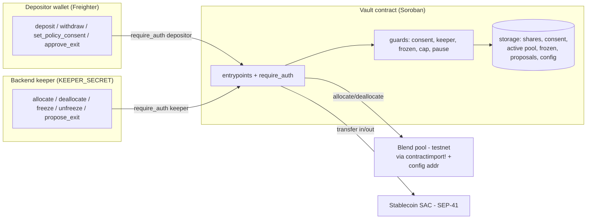
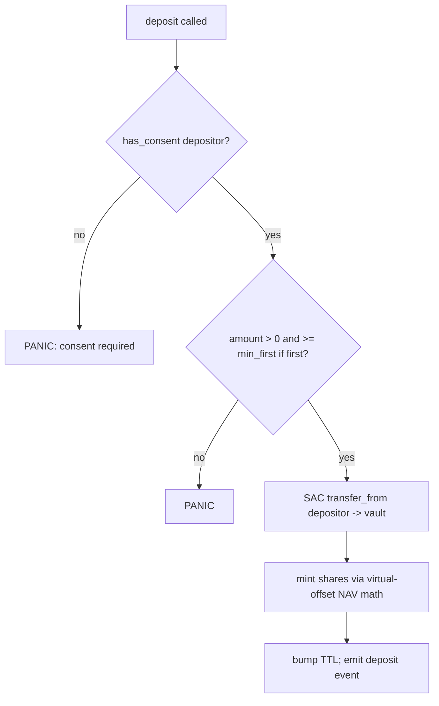
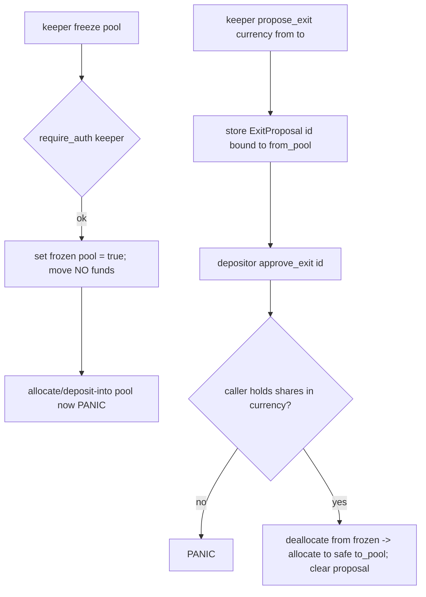

# SoroSense Smart Contract (Soroban Vault) - Plan

> **Product Contract preservation:** unchanged. This is a track-scoped HOW plan for the Smart Contract workstream (units U3–U6 of the product-wide plan `docs/plans/2026-07-03-001-feat-sorosense-plan.md`). It resolves two of that plan's Open Questions into decisions — **on-chain consent enforcement** and **Blend integration realism** — plus the share-accounting and proposal-binding hardening questions. No product-scope (R/A/F/AE) IDs change; requirement citations reference the origin's IDs.

## Goal Capsule

- **Objective:** Ship the SoroSense Soroban vault (Rust) to `cargo test`-green + testnet-deployed + TS-bindings-generated, implementing the callable surface in `packages/vault-client/src/interface.ts` so the backend and frontend can swap the mock for the real contract at integration (origin U20). Covers Linear STE-11 (U3), STE-12 (U4), STE-13 (U5), STE-14 (U6) under epic STE-6.
- **Authority:** Axel (PM) owns product WHAT via the origin Product Contract; this plan owns the SC-track HOW. The `packages/vault-client` interface is a frozen cross-track contract — a change here ripples to backend + frontend, so treat it as fixed and match it.
- **Owner:** m.ulinasidiki (Smart Contract dev).
- **Critical path:** The backend track is already Done and waiting on real bindings; origin U20 depends on this track's U6. This is on the demo critical path.
- **Open blockers:** none. Dependency (origin U2 vault interface) is Done. Multi-depositor freeze-exit governance is deferred (see Open Questions), not blocking for the demo.
- **Two brainstorm decisions woven in (authoritative):**
  1. **Blend = real testnet via `contractimport!`**, behind a swappable config seam (pool address + network from config/env), with a scripted signal-injection fallback for demo safety.
  2. **Consent = on-chain enforced** — the vault stores a per-depositor consent flag; deposit requires consent, and keeper allocate/rebalance re-checks it, so the agent cannot move funds without a stored mandate.

---

## Product Contract

### Summary

A non-custodial Soroban vault that custodies pooled stablecoins in per-currency buckets, tracks per-depositor shares, executes keeper/approved allocations into Blend pools, and enforces protective guards (pause, per-pool cap, keeper-triggered freeze). The vault never converts between currencies, never provides AMM liquidity, and never moves funds on a freeze — freeze is protective only. The only depositor-signed fund movements are deposit, the one-time consent, a Sentinel-freeze exit approval, and withdraw. (Origin R1–R3, R7, R9, R10, R23; KTD2, KTD3, KTD4, KTD10.)

### Problem Frame

The vault is the on-chain custody + guard layer for SoroSense. Off-chain (backend, already built) does risk scoring and decides *when* to allocate/rebalance/freeze; the contract enforces *that only legitimate, consented, guarded movements execute*. The exact layer absent when the YieldBlox Blend V2 pool was drained ~$10.8M in Feb 2026 is a keeper-held protective freeze — this plan builds it. (Origin Problem Frame; sources in origin.)

### Requirements (traced to origin)

- **R1** Non-custodial custody by the contract; SoroSense never takes custody.
- **R2** Track each depositor's share of pooled funds.
- **R3** Deposits/withdrawals in supported stablecoins (USD/EUR/MXN buckets); never swap/convert.
- **R23** Per-currency buckets, accounted independently.
- **R4** Allocate to the (keeper-selected) safest-highest Safe pool; the contract executes, it does not score.
- **R7** Auto-rebalance within a currency runs under consent with no per-move depositor signature; the only depositor-signed movements are a freeze-exit and a withdrawal.
- **R9** On a keeper-tripped anomaly the vault freezes the affected pool without approval.
- **R10** Emergency action is limited to a protective freeze; it never moves funds.
- **R17** Deploy/demo on Stellar testnet; architecture prepared for mainnet (config swap).
- **KTD3 (consent)** One-time safety-mandate consent, no risk tier; enforced on-chain.

### Interface contract (must match exactly)

The vault's callable surface is `packages/vault-client/src/interface.ts`. Each contract entrypoint maps to a `VaultClient` method; base-unit amounts are `i128` (TS `bigint`), currency is an enum `USD | EUR | MXN`, pool/address are Soroban addresses. Two-phase build→sign→submit is native to Soroban (the TS `PreparedTx` wraps an XDR envelope + `requiredSigner`). Signer roles: `deposit`/`withdraw`/`setPolicyConsent`/`approveExit` are depositor-signed (`require_auth` on the depositor); `allocate`/`deallocate`/`freeze`/`unfreeze`/`proposeExit` are keeper-signed (`require_auth` on the keeper role).

Entrypoint ↔ interface method map:

| Contract fn | interface.ts method | Signer |
|---|---|---|
| `deposit(depositor, currency, amount)` | `deposit` | depositor |
| `withdraw(depositor, currency, shares)` | `withdraw` | depositor |
| `set_policy_consent(depositor)` | `setPolicyConsent` | depositor |
| `approve_exit(depositor, exit_id)` | `approveExit` | depositor |
| `allocate(pool, currency, amount)` | `allocate` | keeper |
| `deallocate(pool, currency, amount)` | `deallocate` | keeper |
| `freeze(pool)` | `freeze` | keeper |
| `unfreeze(pool)` | `unfreeze` | keeper |
| `propose_exit(currency, from_pool, to_pool)` | `proposeExit` | keeper |
| `balance_of(user, currency)` | `balanceOf` | read |
| `pool_status(pool)` | `poolStatus` | read |
| `has_consent(depositor)` | `hasConsent` | read |
| `active_pool(currency)` | `activePool` | read |
| `pending_exit(currency)` | `pendingExit` | read |

### Acceptance Examples (traced to origin)

- **AE2** (origin R9/R10): keeper freeze on Pool A → allocate/deposit-into-A panic, existing balances identical before/after, funds not moved until a depositor approves the proposed exit.
- **Share correctness**: two depositors into the same currency bucket hold shares proportional to net asset value; a direct token donation before a second deposit does not let an attacker steal share value (inflation attack).
- **Consent invariant**: allocate/deposit for a bucket panics when the depositor has not recorded consent.

### Scope Boundaries

**In scope:** deposit/withdraw + share accounting (inflation-guarded), consent recording + enforcement, allocate/deallocate to Blend via `contractimport!` behind a config seam, keeper role + freeze/unfreeze + per-pool cap + global pause, freeze-exit propose/approve, full `cargo test` suite against a Blend test-double, testnet deploy script, TS bindings generation into `packages/vault-client`.

**Deferred for later** (origin-aligned): mainnet execution deployment (config swap); execution venues beyond Blend (DeFindex/Gami/RWA); multisig keeper; reward-emission harvesting; protocol fee.

**Deferred to Follow-Up Work** (plan-local sequencing): the engineered risky-pool seed script and demo rehearsal are origin U21 (STE-22), owned downstream of this track's U6 — this plan builds the config seam and scripted-fallback hook they need, but the seed/rehearsal itself is out of this plan.

**Outside this product's identity:** currency conversion / FX swaps; AMM liquidity provision / impermanent-loss positions; user-selected risk tiers; on-chain risk scoring (stays off-chain in the backend).

---

## Planning Contract

### Key Technical Decisions

- **KTD-SC1. Blend real testnet via `contractimport!`, config-swappable.** The vault cross-contract-calls a Blend pool through a Rust client generated from the Blend pool WASM/spec (`blend-contract-sdk` `pool` client, or a local `contractimport!` of the pool interface). Pool addresses and network are never hardcoded — they live in instance-storage config set at `init` (and swappable by admin), so testnet→mainnet is a config change, not a code change. Rationale: highest demo realism (origin KTD8) while keeping the seam clean. *Risk mitigation:* `cargo test` runs against a Blend **test-double** (a minimal in-repo pool contract exposing the same `supply`/`withdraw` surface) so tests are deterministic and offline; real Blend is exercised only at deploy/integration. A scripted signal-injection fallback (origin U21) is enabled by the same config seam if live testnet conditions are unreliable.
- **KTD-SC2. Consent enforced at the deposit boundary; allocate re-checks (defense in depth).** `set_policy_consent(depositor)` records a per-depositor boolean (idempotent, no tier arg). `deposit` panics unless the depositor has consent, so **every principal in a pooled bucket has necessarily consented** — this makes pooled `allocate` inherently consented without an O(n) per-depositor scan. `allocate`/`deallocate` additionally assert a cheap bucket-level consent invariant flag, so a future non-deposit inflow path can't bypass the mandate. Honest "the agent can't move funds without your stored mandate." (Resolves origin Open Question "on-chain consent enforcement".)
- **KTD-SC3. Inflation-attack defense: virtual dead-share offset (primary) + minimum first deposit (secondary).** Share math uses a virtual-shares/virtual-assets offset (ERC-4626-style) so the first-depositor donation-inflation attack rounds to negligible; a minimum first-deposit floor is a secondary guard. NAV is computed from internal per-share accounting, **not** a live token balance query, so a direct token donation does not move share price. (Resolves origin Open Question "share-accounting safety".)
- **KTD-SC4. Keeper role, single key for the demo.** A keeper address set at `init` gates `allocate`/`deallocate`/`freeze`/`unfreeze`/`propose_exit` via `require_auth`. Freeze is protective only — it flips a per-pool `frozen` flag and moves zero funds. Multisig keeper is deferred (origin). (Origin KTD4.)
- **KTD-SC5. Proposal-bound freeze exit.** `propose_exit(currency, from_pool, to_pool)` (keeper) stores a per-currency `ExitProposal` with a unique id bound to the frozen `from_pool`. `approve_exit(depositor, exit_id)` (depositor) verifies the caller holds shares in that currency bucket before authorizing the bucket-level move to `to_pool`, so an arbitrary address cannot trigger a fund move. Multi-depositor governance (quorum vs first-approver) for shared buckets is deferred — see Open Questions. (Resolves origin Open Question "on-chain approval binding".)
- **KTD-SC6. Storage discipline.** Instance storage: admin, keeper, config (network + per-currency Blend pool addresses + per-pool cap + min-first-deposit + virtual-offset constants). Persistent storage keyed for TTL bumping: per-`(depositor,currency)` shares, per-currency total shares + total assets (NAV), per-currency active pool + per-pool holdings, per-depositor consent, per-pool frozen flag, per-currency pending exit, global pause. Every persistent read/write bumps TTL. (Origin U3 approach; `soroban` skill storage idioms.)

### Assumptions

- USDC/EURC SEP-41 SACs are available and liquid on Stellar testnet; Blend has usable testnet Fixed pools (origin Assumptions; catalog: Blend V2 Fixed USDC 6.60%, EURC 6.20%).
- The `blend-contract-sdk` crate (or the Blend pool WASM) exposes a `supply`/`withdraw`-shaped interface importable via `contractimport!`; if the exact crate API differs at execution time, the test-double defines the seam the vault codes against and the real client is adapted behind it (execution-time detail).
- `stellar` CLI 27.x is available for build/deploy/bindings (verified: `stellar 27.0.0`, `cargo 1.95.0`).
- MXN/CETES bucket ships internal-only for the demo; USD (USDC) is the primary live bucket, EUR (EURC) secondary — which buckets go live is an origin Open Question and does not change contract code (buckets are data, not code).

### Sequencing

1. **U1 scaffold** (Cargo workspace, config seam, Blend `contractimport!` + test-double) — everything depends on this.
2. **U2 storage** — data model all entrypoints use.
3. **U3 deposit/withdraw/shares/consent** (STE-11) and, after it, **U5 guards/freeze** (STE-13) and **U4 allocate** (STE-12) can proceed; U4 depends on U5's frozen-flag for its frozen-pool guard.
4. **U6 test suite** (STE-14) after U3/U4/U5.
5. **U7 deploy + bindings** (STE-14) after U6.

Origin unit ↔ this plan ↔ Linear: U3(origin)=U3(here)=STE-11; U4=U4=STE-12; U5=U5=STE-13; U6=U6+U7=STE-14. U1/U2 here are scaffolding split out of origin U3 for clarity.

---

## Output Structure

```text
smart-contract/
├── Cargo.toml                      # workspace
├── contracts/
│   └── vault/
│       ├── Cargo.toml
│       └── src/
│           ├── lib.rs              # contract entrypoints + init (U1, U3–U5)
│           ├── config.rs           # instance config: keeper, network, pool addresses, caps, constants (U1)
│           ├── storage.rs          # persistent/instance keys + TTL-bumping accessors (U2)
│           ├── shares.rs           # NAV + virtual-offset share math (U3)
│           ├── allocate.rs         # Blend supply/withdraw via contractimport! (U4)
│           ├── guard.rs            # keeper role, freeze/unfreeze, cap, pause, exit proposals (U5)
│           ├── blend.rs            # contractimport! of the Blend pool client + config-resolved address (U1/U4)
│           └── test.rs             # unit + integration tests (U6)
├── contracts/
│   └── mock_pool/                  # Blend test-double for deterministic cargo test (U1)
│       ├── Cargo.toml
│       └── src/lib.rs
└── scripts/
    ├── deploy.ts                   # build + deploy testnet + friendbot fund + set config (U7)
    └── bindings.ts                 # stellar contract bindings typescript → packages/vault-client (U7)
```

---

## High-Level Technical Design

### Component & trust boundary



### Deposit + consent gate (state)



### Freeze → protective → exit (covers AE2)



---

## Implementation Units

### Unit Index

| U-ID | Title | Linear | Depends on |
|---|---|---|---|
| U1 | Cargo scaffold + config seam + Blend `contractimport!` + test-double | STE-11/14 | — |
| U2 | Storage model + TTL-bumping accessors | STE-11 | U1 |
| U3 | deposit / withdraw / share accounting + consent recording | STE-11 | U2 |
| U4 | allocate / deallocate to Blend + consent gate + proposal binding | STE-12 | U3, U5 |
| U5 | Guards: keeper role, freeze/unfreeze, cap, pause, exit proposals | STE-13 | U2 |
| U6 | Test suite (unit + integration vs Blend test-double) | STE-14 | U3, U4, U5 |
| U7 | Testnet deploy script + TS bindings into vault-client | STE-14 | U6 |

### U1. Cargo scaffold + config seam + Blend `contractimport!` + test-double

- **Goal:** A buildable Soroban workspace with the vault contract crate, a Blend test-double crate, and a config seam that resolves the Blend pool address + network from storage config (never hardcoded).
- **Requirements:** R17; KTD-SC1, KTD-SC6.
- **Dependencies:** —
- **Files:** `smart-contract/Cargo.toml`, `smart-contract/contracts/vault/Cargo.toml`, `smart-contract/contracts/vault/src/lib.rs` (skeleton `#[contract]` + `init`), `smart-contract/contracts/vault/src/config.rs`, `smart-contract/contracts/vault/src/blend.rs` (`contractimport!` of the Blend pool client, address resolved from config), `smart-contract/contracts/mock_pool/Cargo.toml`, `smart-contract/contracts/mock_pool/src/lib.rs`.
- **Approach:** Workspace with `soroban-sdk` (matching CLI 27.x). `init(admin, keeper, config)` stores admin, keeper, and a `Config` struct (network passphrase id, per-currency Blend pool address map, per-pool cap, min-first-deposit, virtual-offset constant). `blend.rs` wraps a `contractimport!`-generated pool client whose contract address comes from `Config`, so the same code targets the test-double in tests and real Blend on testnet. `mock_pool` implements `supply(from, amount)` / `withdraw(to, amount)` mirroring the Blend surface the vault uses, holding a simple balance — the deterministic test-double (KTD-SC1). Add an admin-only `set_pool_address(currency, pool)` so the demo can point a bucket at the engineered risky pool (origin U21 seam) without redeploying.
- **Patterns to follow:** `soroban` skill — project setup, `#[contract]`/`#[contractimpl]`, instance storage for config, `contractimport!` for cross-contract clients.
- **Test scenarios:** `cargo build` produces both WASMs; `init` stores config and is not re-callable by non-admin; `set_pool_address` by non-admin panics; the vault's Blend client, pointed at `mock_pool`, round-trips a `supply` then `withdraw`. (Scaffolding unit — behavioral coverage lives in U6; these are smoke checks.)
- **Verification:** `stellar contract build` (or `cargo build --target wasm32v1-none`) succeeds for both crates; `init` + `set_pool_address` auth guards hold.

### U2. Storage model + TTL-bumping accessors

- **Goal:** One module owning every storage key and typed accessor, so no entrypoint re-derives keys or forgets a TTL bump.
- **Requirements:** R2, R23; KTD-SC6.
- **Dependencies:** U1.
- **Files:** `smart-contract/contracts/vault/src/storage.rs`.
- **Approach:** A `DataKey` enum: `Shares(Address, Currency)`, `TotalShares(Currency)`, `TotalAssets(Currency)`, `ActivePool(Currency)`, `PoolHoldings(Address)`, `Consent(Address)`, `Frozen(Address)`, `PendingExit(Currency)`, `Paused`, plus instance `Admin`/`Keeper`/`Config`. Typed getters/setters that bump persistent-entry TTL on every access (extend by a configured ledger window). Reads default sensibly (`0` shares, `active`/unfrozen pool, no pending exit). Currency and amounts sized to match the interface (`i128` for amounts/shares).
- **Patterns to follow:** `soroban` skill — persistent vs instance storage, TTL extension, enum `DataKey` keying.
- **Test scenarios:** set-then-get round-trips shares per `(depositor,currency)` independently across currencies (R23); unset keys return defaults (0 shares, unfrozen, no proposal); a write bumps TTL (accessor invoked without panic on a near-expiry entry in a unit test). `Test expectation: covered further in U6 integration.`
- **Verification:** Accessors compile and unit-round-trip; currencies are isolated.

### U3. deposit / withdraw / share accounting + consent recording

- **Goal:** Non-custodial deposit/withdraw with correct per-currency share math, inflation-attack defense, and on-chain consent (STE-11 / origin U3).
- **Requirements:** R1, R2, R3, R23; KTD-SC2, KTD-SC3. Covers the share-correctness and consent-invariant Acceptance Examples.
- **Dependencies:** U2.
- **Files:** `smart-contract/contracts/vault/src/shares.rs`, entrypoints in `smart-contract/contracts/vault/src/lib.rs`, tests in `smart-contract/contracts/vault/src/test.rs`.
- **Approach:** `set_policy_consent(depositor)` → `require_auth(depositor)`, set `Consent(depositor)=true`, idempotent, **no tier argument** (KTD3). `deposit(depositor, currency, amount)` → `require_auth(depositor)`; panic if `!Consent(depositor)` (KTD-SC2); panic if `amount<=0`; if first deposit in the bucket, enforce `amount >= min_first_deposit`; pull the currency's SAC via `token::Client::transfer` from depositor to vault; mint shares from `TotalShares`/`TotalAssets` NAV using the **virtual-offset** formula (`shares = amount * (total_shares + VIRT) / (total_assets + VIRT)`), never a live balance query (KTD-SC3); update `TotalShares`/`TotalAssets`. `withdraw(depositor, currency, shares)` → `require_auth`; panic if `shares<=0` or `> Shares(depositor,currency)`; compute asset amount from NAV; burn shares; `token::Client::transfer` back. Emit `deposit`/`withdraw` events. NAV tracks internal accounting only; yield accrual is realized by the keeper's allocate/deallocate deltas, not modeled here.
- **Execution note:** Implement the inflation-attack test first (characterization of the attack), then the virtual-offset math that defeats it.
- **Patterns to follow:** `soroban` skill — `require_auth`, SAC `token::Client`, persistent storage; ERC-4626 virtual-offset share math.
- **Test scenarios:** first deposit mints shares per the virtual-offset formula; second depositor gets proportional shares; withdraw burns and returns the correct amount; withdraw > owned panics; withdraw/deposit without auth panics; deposit without prior consent panics (consent invariant); deposit below `min_first_deposit` on an empty bucket panics; **inflation attack** — attacker deposits 1 unit, donates a large token amount directly to the vault, victim then deposits; assert the victim's redeemable value is not stolen (virtual offset holds); currencies are accounted independently (deposit USD does not change EUR shares).
- **Verification:** `cargo test` green for all deposit/withdraw/shares/consent/inflation cases.

### U4. allocate / deallocate to Blend + consent gate + proposal binding

- **Goal:** Move pooled bucket funds into/out of a Blend pool only via the keeper or an approved exit, gated by consent, frozen-flag, and cap (STE-12 / origin U4).
- **Requirements:** R4, R7; KTD-SC1, KTD-SC2, KTD-SC5.
- **Dependencies:** U3, U5 (needs the frozen flag + cap + proposal store from guard).
- **Files:** `smart-contract/contracts/vault/src/allocate.rs`, entrypoints in `smart-contract/contracts/vault/src/lib.rs`.
- **Approach:** `allocate(pool, currency, amount)` → `require_auth(keeper)`; assert bucket consent invariant (KTD-SC2); panic if `Frozen(pool)`; panic if `PoolHoldings(pool)+amount > cap` (cap from U5); call Blend `supply` via the `blend.rs` client (address resolved from config, KTD-SC1); set `ActivePool(currency)=pool`, bump `PoolHoldings(pool)`. `deallocate(pool, currency, amount)` → `require_auth(keeper)`; panic if `amount > PoolHoldings(pool)`; call Blend `withdraw`; decrement holdings. `approve_exit(depositor, exit_id)` → `require_auth(depositor)`; load `PendingExit(currency)`, verify id matches and caller holds shares in that currency (KTD-SC5); execute the move (deallocate from `from_pool`, allocate to `to_pool`); clear the proposal. Approved-exit is the one depositor-signed path that moves pooled funds; auto-rebalance uses the keeper `allocate`/`deallocate` pair with no depositor signature (R7).
- **Patterns to follow:** `soroban` skill — cross-contract calls via `contractimport!`, keeper-auth gate; Blend `supply`/`withdraw`.
- **Test scenarios:** allocate supplies to the (test-double) pool and sets `ActivePool` + holdings; deallocate returns funds and decrements holdings; allocate by non-keeper panics; allocate into a frozen pool panics (integrates U5); allocate beyond the per-pool cap panics; allocate for a bucket with a non-consented principal panics; `approve_exit` by an address with no shares in the currency panics; a valid `approve_exit` moves funds frozen→safe and clears the proposal; **multi-depositor binding** — depositor A's `approve_exit` cannot move a currency bucket in which A holds no shares.
- **Verification:** `cargo test` green against the Blend test-double; real-Blend path is exercised at U7/integration.

### U5. Guards: keeper role, freeze/unfreeze, cap, pause, exit proposals

- **Goal:** On-chain guardrails — protective freeze that blocks flows into a toxic pool without moving funds, per-pool cap, global pause, and the keeper-created exit proposal store (STE-13 / origin U5).
- **Requirements:** R9, R10; KTD-SC4, KTD-SC5.
- **Dependencies:** U2.
- **Files:** `smart-contract/contracts/vault/src/guard.rs`, entrypoints in `smart-contract/contracts/vault/src/lib.rs`.
- **Approach:** `freeze(pool)` / `unfreeze(pool)` → `require_auth(keeper)`; flip `Frozen(pool)`; move **zero** funds (KTD-SC4, R10). `propose_exit(currency, from_pool, to_pool)` → `require_auth(keeper)`; store `ExitProposal { id, currency, from_pool, to_pool }` at `PendingExit(currency)` with a monotonically derived id (from a stored counter, not host randomness). A global `pause`/`unpause` (admin) short-circuits state-changing entrypoints. The per-pool cap constant lives in config (U1) and is read by `allocate` (U4). Freeze changes no balances — assert this as an invariant in tests. Emit `frozen`/`unfrozen`/`exit_proposed` events for the frontend banner.
- **Patterns to follow:** `soroban` skill — admin/keeper auth idiom, boolean pause guard.
- **Test scenarios:** Covers AE2. keeper freezes pool → allocate/deposit-into-it panic while existing balances are byte-identical before/after (freeze moves no funds); non-keeper freeze panics; unfreeze restores flows; `propose_exit` stores a proposal readable via `pending_exit(currency)`; pause blocks deposit/allocate and unpause restores; ids are unique across sequential proposals.
- **Verification:** `cargo test` green for every guard path; freeze-moves-no-funds invariant asserted.

### U6. Test suite (unit + integration vs Blend test-double)

- **Goal:** Full contract test suite proving the happy-path sequence end-to-end and every guard, deterministic and offline (STE-14 / origin U6).
- **Requirements:** R1, R2, R3, R4, R9, R10; AE2.
- **Dependencies:** U3, U4, U5.
- **Files:** `smart-contract/contracts/vault/src/test.rs` (organized modules: `shares`, `consent`, `allocate`, `guard`, `integration`).
- **Approach:** `soroban_sdk::testutils` env; register the vault + the `mock_pool` test-double + a SAC test token per currency. Integration test wires the money-shot: consent → deposit → allocate → keeper-freeze → balances-unchanged → propose_exit → approve_exit → deallocate/withdraw. Characterization-style: assert the full happy-path sequence before edge cases. Include the inflation-attack and multi-depositor tests from U3/U4 in the suite.
- **Execution note:** Characterization-first — assert the end-to-end happy sequence, then layer edge/guard cases.
- **Test scenarios:** Covers AE2. deposit→allocate→keeper-freeze→balances-identical→approve-exit→deallocate→withdraw runs green; concurrent depositors keep correct share ratios across a rebalance; all U3/U4/U5 scenarios pass as one suite; a missing/oversized cap and a non-consented deposit both panic where specified.
- **Verification:** `cd smart-contract && cargo test` is green across all modules.

### U7. Testnet deploy script + TS bindings into vault-client

- **Goal:** A repeatable testnet deploy and generated TS bindings that replace the mock at integration (STE-14 / origin U6, feeds origin U20).
- **Requirements:** R17.
- **Dependencies:** U6.
- **Files:** `smart-contract/scripts/deploy.ts`, `smart-contract/scripts/bindings.ts`.
- **Approach:** `deploy.ts`: `stellar contract build`, deploy the vault to testnet via the `stellar` CLI, fund the deployer + keeper via friendbot, call `init` with the testnet keeper address + config (real Blend testnet pool addresses per currency, from `.env`), and write `VAULT_CONTRACT_ID` back to `.env`. `bindings.ts`: `stellar contract bindings typescript` for the deployed id, emitting a generated client into `packages/vault-client` that implements the same `VaultClient` interface the mock implements — consumers swap the import at origin U20 with no signature change. Network + pool addresses come from `.env` (`STELLAR_RPC_URL`, `STELLAR_NETWORK_PASSPHRASE`, `KEEPER_SECRET`, `VAULT_CONTRACT_ID`, plus new per-currency Blend pool address vars this unit adds to `.env.example`).
- **Patterns to follow:** `soroban` skill / `data` skill — `stellar` CLI deploy + `bindings typescript`; friendbot funding.
- **Test scenarios:** `Test expectation: none — deploy tooling.` Verification is a live testnet contract id + a generated client that type-checks against `packages/vault-client`'s interface.
- **Verification:** deploy script yields a callable testnet `VAULT_CONTRACT_ID`; generated bindings type-check and expose every `VaultClient` method; a smoke `has_consent`/`pool_status` read returns from testnet.

---

## Verification Contract

| Surface | Command | Proves |
|---|---|---|
| Contract build | `cd smart-contract && stellar contract build` | Vault + mock_pool compile to WASM |
| Contract tests | `cd smart-contract && cargo test` | deposit/withdraw/shares, inflation defense, consent gate, allocate, guards, freeze invariant, end-to-end (AE2) |
| Deploy | `smart-contract/scripts/deploy.ts` | Deployable to testnet; `init` + config set; `VAULT_CONTRACT_ID` produced |
| Bindings | `smart-contract/scripts/bindings.ts` + `pnpm -C packages/vault-client typecheck` | Generated client matches the `VaultClient` interface |

---

## Definition of Done

- `cd smart-contract && cargo test` is green; every unit's test scenarios are implemented and passing.
- The contract implements every `packages/vault-client/src/interface.ts` method with the correct signer role; a deposit→allocate→freeze→approve-exit→withdraw sequence passes end-to-end against the Blend test-double.
- Consent is enforced on-chain (deposit panics without it; allocate re-checks); freeze moves zero funds (asserted invariant); the inflation-attack test passes; a depositor cannot approve an exit for a bucket they hold no shares in.
- Blend integration goes through the config-swappable `contractimport!` seam — no hardcoded pool address or network; `set_pool_address` lets the demo point a bucket at the engineered risky pool.
- `deploy.ts` yields a live testnet `VAULT_CONTRACT_ID`; `bindings.ts` emits a TS client into `packages/vault-client` that type-checks against the interface (ready for origin U20 to swap the mock).
- `smart-contract/README.md` documents local build/test + testnet deploy.
- No abandoned/experimental code remains in the diff.

---

## Open Questions

**Deferred — resolve during implementation:**
- Exact `blend-contract-sdk` crate API vs a hand-written `contractimport!` of the Blend pool WASM — decide at U1/U4 against the real crate; the test-double defines the seam either way.
- Per-pool cap value, `min_first_deposit`, and the virtual-offset constant — tune at U3/U5 (safe non-zero defaults; no security dependence on the exact number given the virtual offset).
- SAC test-token setup in `testutils` (register-stellar-asset vs a minimal SEP-41 mock) — execution-time detail in U6.

**Deferred — post-demo (origin-aligned):**
- Multi-depositor freeze-exit governance for shared buckets (quorum vs first-approver). Demo assumes effectively single-approver per bucket; the `approve_exit` share-holding check is the guard for now.
- Multisig keeper; mainnet pool addresses; protocol fee; yield-accrual modeling beyond keeper allocate/deallocate deltas.

---

## Risks & Dependencies

- **Blend testnet flakiness (KTD-SC1)** — mitigated by the deterministic test-double for `cargo test` and the config-swappable scripted fallback for the live demo (origin U21).
- **Interface drift** — `packages/vault-client/src/interface.ts` is a frozen cross-track contract; the entrypoint map above is the conformance checklist. Bindings (U7) are the late verification that the real contract matches.
- **`soroban-sdk` / `stellar` CLI version alignment** — pin `soroban-sdk` to the 27.x-compatible release matching the installed CLI (`stellar 27.0.0`); resolve at U1.
- **Share-math correctness** — highest-consequence code; the inflation-attack and multi-depositor tests are the guardrails and are written first (U3 execution note).
