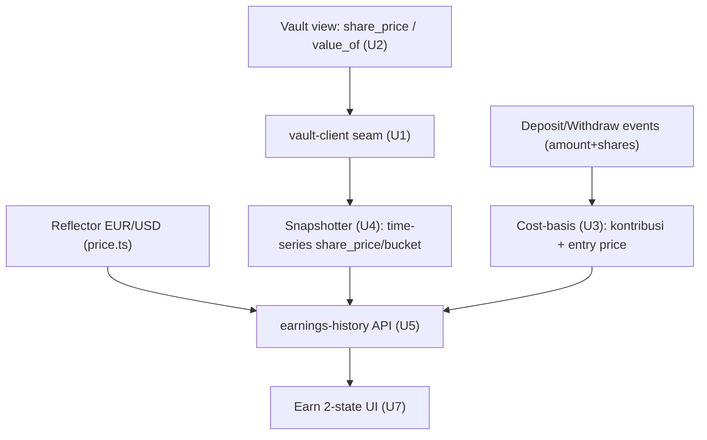

# Earn 2-State + Earnings History - Plan

## Goal Capsule

- **Objective:** Bangun state Earn "deposited" (saldo blended-USD + drill-down per-kantong, APY, chart earnings, breakdown per bulan) yang ditopang kapabilitas backend earnings-history baru, sambil menegakkan invarian produk (FX display-only, tanpa label risiko, read-only).
- **Product authority:** `docs/brainstorms/2026-07-06-earn-history-requirements.md` (WHAT). Plan ini menambah HOW; Product Contract di bawah tidak diubah.
- **Track & routing Linear:** backend (U1, U3, U4, U5, U6) → Axel, epik STE-5. Read-method kontrak (U2) → Ulin, epik STE-6 (tiket baru). Earn 2-state UI (U7) → Ancung, perluasan STE-26 (U16). **Axel hanya implement unit backend**; U2/U7 jadi tiket rekan.
- **Execution posture:** unit backend dibangun & diuji lawan mock `@sorosense/vault-client`; wiring live (event nyata + read kontrak) divalidasi di integrasi STE-21/U20. Pola sama seperti unit backend U7–U12 dari track backend sebelumnya (STE-5) — bukan U7 di plan ini.
- **Stop conditions:** blocker jika read-method kontrak (U2) mengubah bentuk seam yang sudah disepakati di U1, atau jika simbol FX Reflector tak tersedia untuk sebuah currency.

---

## Product Contract

**Preservation:** Product Contract tidak berubah dari origin (R1–R14, AE1–AE3 dibawa verbatim).

### Summary

Tab Earn mendapat state "deposited": satu **Earn balance blended-USD** dengan drill-down per-currency, APY, **chart earnings** Day/Week/Month/Year, dan **breakdown earned per bulan**. Earned dihitung dari **yield native per kantong** lalu dijumlahkan ke USD, sehingga kurs tidak pernah tampil sebagai untung/rugi. Time-series disediakan **snapshotter backend** yang membaca NAV dari view kontrak.

### Problem Frame

Tab Earn kini hanya melayani proyeksi ("kalau taruh X, setahun jadi Y") lewat `backend/src/api/simulate.ts`. Setelah deposit, pengguna tak punya cara melihat berapa yang benar-benar dihasilkan dari waktu ke waktu. Feed `backend/src/api/activity.ts` hanya mencatat kejadian agent, bukan agregasi earning per periode. Kesenjangan ini membuat produk terasa "menaruh uang lalu buta".

### Requirements

**State tab Earn**

- R1. Tab Earn merender dua state: "belum deposit" (proyeksi via `backend/src/api/simulate.ts`) dan "deposited" (saldo + histori earning).
- R2. State ditentukan per pengguna dari saldo kantong: "deposited" jika ada kantong dengan saldo > 0.

**Tampilan earnings (blended-USD)**

- R3. State deposited menampilkan satu "Earn balance" blended-USD = Σ (nilai aset kantong × kurs USD). Konversi hanya untuk display.
- R4. Saldo blended dapat di-drill-down ke rincian per-kantong (jumlah tiap currency + nilai USD-nya).
- R5. APY blended = APY kantong saat ini, ditimbang nilai USD tiap kantong.
- R6. "You're earning" dan chart menampilkan total earned; earned = yield native per kantong, dijumlahkan ke USD.
- R7. Pergerakan kurs tidak pernah dihitung sebagai earning.

**Earnings history (time-series)**

- R8. Chart mendukung granularitas Day / Week / Month / Year atas earned dari waktu ke waktu.
- R9. Rincian per bulan kalender menampilkan earned tiap bulan.
- R10. Histori earning ditopang snapshotter backend yang merekam share price / earned per kantong dari waktu ke waktu.
- R11. Cost-basis per pengguna diturunkan dari event on-chain `Deposit`/`Withdraw` (membawa `amount` + `shares`), bukan disimpan terpisah.

**Seam baca kontrak**

- R12. Vault mengekspos view read-only untuk nilai aset / share price per kantong, dikonsumsi backend untuk konversi share → nilai aset.

**Reuse & invarian**

- R13. "Earn more" memakai ulang deposit; "Move to cash" memakai ulang withdraw. Tanpa jenis pergerakan baru.
- R14. Tidak ada label risiko di mana pun pada Earn.

### Acceptance Examples

- AE1. Kurs-saja, bukan earning. **Given** kantong EURC yield 0, **When** EUR/USD naik $1,14→$1,16, **Then** Earn balance blended naik tetapi "earned" tetap datar. **Covers R6, R7.**
- AE2. Pergantian state. **Given** pengguna tanpa saldo, **When** membuka Earn, **Then** melihat proyeksi "belum deposit"; **When** deposit pertama, **Then** melihat state "deposited". **Covers R1, R2.**
- AE3. Rincian per bulan. **Given** snapshot per periode ada, **When** melihat breakdown, **Then** "This Month" = earned sejak awal bulan berjalan; bulan sebelumnya = earned satu bulan penuh. **Covers R9, R10.**

### Scope Boundaries

**Ditunda:**

- Dukungan earning penuh kantong MXN (butuh kurs MXN/USD + venue MXN); dahulukan USD/EUR.
- Granularitas "Day" dengan data intraday riil — untuk demo, seed/simulasikan horizon pendek.

**Di luar identitas produk:**

- Tidak ada konversi dana antar-kantong untuk menghasilkan angka blended; blended murni display.

### Dependencies / Assumptions

- Ulin menambah view read-only nilai aset/share price (R12, U2) — perubahan kontrak kecil; vault upgradable.
- Reflector oracle menyediakan kurs EUR/USD via `backend/src/tools/price.ts`.
- `backend/src/api/simulate.ts` menopang state "belum deposit"; `backend/src/api/activity.ts` tetap feed kejadian, terpisah.
- Vault per-currency (satu kontrak) — kantong tak pernah dicampur.

---

## Planning Contract

### Key Technical Decisions

- KTD1. **Blended-USD via seam tunggal.** Saldo & earned dijumlahkan ke USD memakai kurs Reflector (`getReflectorPrice`), USD=1. Konversi hanya display; dana tetap per-kantong. Menghindari sistem angka ganda.
- KTD2. **Earned = yield native, FX dikecualikan.** Earned tiap kantong dihitung dalam mata uang asli (`nilai − kontribusi`), baru di-USD-kan. Gerakan kurs tak masuk earned (R7). Ini yang membedakan AE1.
- KTD3. **NAV lewat view kontrak + seam `vault-client`.** Kontrak ekspos `share_price(currency)` (dan/atau `value_of(user,currency)`); backend menurunkan nilai user = `shares × share_price`. `balance_of` yang ada hanya kembalikan shares — tak cukup. Ditambahkan ke interface `VaultClient` supaya backend & frontend baca lewat satu seam (DRY, seperti U2 lama).
- KTD4. **Cost-basis dari event, bukan storage.** `Deposit`/`Withdraw` sudah membawa `amount`+`shares`, jadi kontribusi bersih & entry share-price direkonstruksi off-chain (R11). Tak perlu field cost-basis on-chain baru.
- KTD5. **Time-series via snapshotter, store in-memory untuk demo.** Job berkala (reuse `backend/src/scheduler/cron.ts`) merekam `share_price` per kantong + timestamp ke store in-memory di balik interface; swap ke durable saat deploy — mengikuti pola `ActivityLog`/`InMemoryBucketStore`. Clock diinjeksi (tanpa `Date.now` di inti) agar deterministik.
- KTD6. **Read-only, tanpa LLM, tanpa label.** Earnings-history adalah permukaan baca (seperti `simulate`/`activity`), tak pernah menulis on-chain, dan tak mengekspos field risk/label/score (R14) — diuji seperti test R11 di `simulate.test.ts`.

### High-Level Technical Design

Sumber kebenaran fan-out — satu view kontrak + event memberi makan snapshotter & cost-basis, lalu API menyusun tampilan Earn:

### Sequencing

U1 (seam) lebih dulu → membuka U2 (kontrak, Ulin), U3, U4 (paralel). U5 (API) setelah U3+U4. U6 (integrasi) setelah U5. U7 (frontend) setelah U5 (API kontrak stabil). Unit backend diuji lawan mock; U2 hanya memblok wiring **live** (integrasi STE-21), bukan implementasi/test U5.

---

## Implementation Units

### U1. Seam vault-client: baca share price / nilai aset

- **Goal:** Perluas interface `VaultClient` + mock dengan baca NAV per-kantong, agar backend & frontend menurunkan nilai aset dari shares lewat satu seam.
- **Requirements:** R3, R6, R12.
- **Dependencies:** none (foundation).
- **Files:** `packages/vault-client/src/interface.ts`, `packages/vault-client/src/mock.ts`, `packages/vault-client/src/mock.test.ts`.
- **Approach:** Tambah `sharePrice(currency): Promise<Result<bigint>>` (NAV per share ray, aset per share × skala) dan convenience `assetValueOf(depositor, currency): Promise<Result<bigint>>` = `shares × sharePrice / skala`. Result-typed (baca remote tak pernah throw). Currency-scoped sesuai tipe `Currency`. **Mock butuh akumulator baru:** tambah `totalShares`/`totalAssets` per-currency (mirror virtual-offset `redeem_assets` kontrak) — `MockVaultClient` sekarang hanya simpan map `shares` 1:1 tanpa agregat, jadi `sharePrice` belum bisa dihitung tanpa ini. Tambah hook test-only `simulateYield(currency, amount)` yang menaikkan `totalAssets` **tanpa** mint shares (satu-satunya cara menaikkan share price di test).
- **Patterns to follow:** bentuk method `interface.ts` + pola `Result`; akunting bigint `mock.ts`.
- **Test scenarios:** `sharePrice` fresh bucket = harga dasar (belum ada yield); naik setelah `simulateYield`; `assetValueOf(user)` = `shares × price`; currency tanpa deposit → nilai 0; jalur `Result` err saat baca gagal (mock injectable).
- **Verification:** `pnpm -C packages/vault-client typecheck && pnpm -C packages/vault-client test` hijau; backend konsumen tetap compile.

### U2. Kontrak: view share price + bindings + upgrade testnet

- **Track:** smart-contract (Ulin, STE-6 — tiket baru).
- **Goal:** Ekspos nilai aset/share price on-chain agar seam punya sumber nyata.
- **Requirements:** R12.
- **Dependencies:** U1 (bentuk seam disepakati).
- **Files:** `smart-contract/contracts/vault/src/lib.rs` (fn `share_price` / `value_of`), `smart-contract/contracts/vault/src/test.rs`, regenerasi `packages/vault-client/bindings/`, skrip upgrade di `smart-contract/scripts/`.
- **Approach:** View read-only mengembalikan NAV per share (`total_assets`, `total_shares` + virtual offset) per currency, dan/atau `value_of(user,currency)` = `redeem_assets(shares)`. Tanpa perubahan state, tanpa gate admin (public read, seperti `pool_allowed`/`active_pool`). Upgrade kontrak testnet upgradable yang ada (tanpa deploy baru). Cocokkan signature dengan seam U1.
- **Patterns to follow:** fn read publik yang ada di `lib.rs` (`pool_allowed`, `active_pool`, `pending_exit`).
- **Execution note:** read-only tanpa auth — cermin fn read yang sudah ada.
- **Test scenarios:** `share_price` setelah deposit = NAV harapan; `value_of(user)` = preview redeem; bucket kosong → harga dasar/nol; view tak admin-gated.
- **Verification:** `cargo test` hijau; bindings ter-regenerasi; upgrade tercatat di `smart-contract/deployments/testnet.json`.

### U3. Rekonstruksi cost-basis dari event

- **Goal:** Turunkan kontribusi bersih + entry share-price per kantong dari event `Deposit`/`Withdraw`, agar `earned = nilai − kontribusi` bisa dihitung tanpa cost-basis on-chain.
- **Requirements:** R6, R7, R11.
- **Dependencies:** U1.
- **Files:** `backend/src/earnings/cost-basis.ts`, `backend/src/earnings/cost-basis.test.ts`.
- **Approach:** Konsumsi event `Deposit{amount,shares}`/`Withdraw{amount,shares}` (sumber injectable; reader event nyata ditunda ke integrasi, unit test pakai fixture). Lacak per `(user,currency)`: kontribusi native, shares dipegang, entry price tertimbang. Withdraw mengurangi kontribusi proporsional terhadap shares yang ditebus. Murni/deterministik atas daftar event.
- **Patterns to follow:** pola `Result`; sumber data injectable seperti `backend/src/tools/pool-data.ts`.
- **Test scenarios:** satu deposit → kontribusi = amount; dua deposit harga beda → entry tertimbang; deposit lalu withdraw sebagian → kontribusi turun pro-rata; tanpa event → nol; independen urutan. **Covers R11.**
- **Verification:** `pnpm -C backend typecheck && pnpm -C backend test` hijau.

### U4. Snapshotter earnings

- **Goal:** Rekam share price per kantong dari waktu ke waktu agar chart & breakdown punya seri.
- **Requirements:** R8, R9, R10.
- **Dependencies:** U1.
- **Files:** `backend/src/earnings/snapshotter.ts`, `backend/src/earnings/snapshotter.test.ts`.
- **Approach:** Tiap tick (reuse `backend/src/scheduler/cron.ts` `runOnce`/`startScheduler`) baca `sharePrice(currency)` per currency via seam, append `{currency, priceRay, ts}` ke store time-series in-memory (interface untuk swap durable). Clock diinjeksi (tanpa `Date.now` di inti). Snapshotter hanya menyimpan **seri share-price global per kantong** + helper bucketing Day/Week/Month/Year. Atribusi earned per-user (yang butuh timeline shares) dilakukan di U5, bukan di sini — snapshotter tak tahu shares per user.
- **Patterns to follow:** `backend/src/scheduler/cron.ts`; bentuk store in-memory `ActivityLog` (monotonik, catatan swap-at-deploy).
- **Test scenarios:** append + query kembalikan seri terurut; bucketing Day/Week/Month/Year benar; earned-per-bulan dari selisih harga; store kosong → seri kosong; clock terinjeksi menggerakkan timestamp (tanpa dependensi wall-clock).
- **Verification:** `pnpm -C backend typecheck && pnpm -C backend test` hijau.

### U5. API earnings-history

- **Goal:** Endpoint read-only penopang state Earn deposited — saldo blended-USD, APY blended, total earned, seri chart, breakdown per bulan — dengan FX display-only dan tanpa label risiko.
- **Requirements:** R1, R2, R3, R4, R5, R6, R7, R14.
- **Dependencies:** U3, U4.
- **Files:** `backend/src/api/earnings.ts`, `backend/src/api/earnings.test.ts`.
- **Approach:**
  - Saldo blended-USD = `Σ_c assetValueOf(user,c) × fxUsd(c)`; `fxUsd` dari `price.ts`, USD=1. Drill-down = per kantong `{currency, nativeValue, usdValue}`.
  - APY blended = `Σ bucketApy(c) × usdValue(c) / totalUsd`; `bucketApy` dari `getCatalog` best-safe (seperti `simulate`).
  - Earned = `Σ nativeEarned(c) × fxUsd(c)`; `nativeEarned` dari cost-basis (U3), yield native saja — FX dikecualikan.
  - **Atribusi earned per-periode (join timeline):** untuk tiap periode, jalankan timeline saldo-shares user (rekonstruksi U3 dari event) terhadap delta harga tersnapshot (U4) dalam periode itu, sehingga apresiasi hanya dikreditkan ke shares yang benar-benar dipegang di sub-interval. Ini mencegah deposit/withdraw tengah-periode menggelembungkan earned. Formula naif `shares_now × (price_end − price_start)` **tidak** dipakai untuk user yang saldonya berubah di periode.
  - Seri chart + breakdown per bulan disusun dari atribusi di atas.
  - Selektor state: `hasDeposit(user)` = ada kantong nilai > 0. Tanpa LLM. Tanpa field risk/label/score.
  - Kegagalan baca FX → error typed (bukan $0 diam-diam).
- **Patterns to follow:** `backend/src/api/simulate.ts` (deterministik, tanpa label), `backend/src/api/activity.ts` (permukaan baca), pola `Result` untuk baca FX.
- **Test scenarios:** **Covers AE1** — EURC yield 0 + EUR/USD naik → saldo blended naik, earned datar. **Covers AE2** — nol saldo → `hasDeposit` false; setelah deposit → true. **Covers AE3** — breakdown per bulan sesuai batas bulan. Deposit tengah-bulan tak menggelembungkan earned bulan itu (atribusi per timeline shares); withdraw sebagian mengurangi earned periode berikut sesuai shares tersisa. Penimbang APY blended benar 2 kantong; drill-down menjumlah ke headline; TIDAK ada field terlarang (`risk`/`label`/`score`); kegagalan FX → error typed (bukan $0).
- **Verification:** `pnpm -C backend typecheck && pnpm -C backend test` hijau; suite backend penuh hijau.

### U6. Test integrasi earnings backend

- **Goal:** Coverage lintas-modul yang menyambung cost-basis + snapshotter + API + FX lawan mock vault, menegakkan invarian produk end-to-end.
- **Requirements:** R1–R14.
- **Dependencies:** U5.
- **Files:** `backend/src/earnings/integration.test.ts`.
- **Approach:** Seed deposit `MockVaultClient`, naikkan share price via `simulateYield` (hook U1), gerakkan tick snapshotter dengan clock terinjeksi, assert saldo/earned/seri; assert FX-bukan-earning, read-only (state tak berubah), tanpa label. Sertakan skenario deposit tengah-periode untuk memvalidasi atribusi earned (U5).
- **Patterns to follow:** `backend/src/integration.test.ts` (pola U12).
- **Test scenarios:** alur deposited end-to-end; gerak FX-saja tanpa earned (AE1); jaminan read-only (saldo tak berubah setelah panggilan API); blended multi-currency.
- **Verification:** `pnpm -r test` hijau.

### U7. Frontend Earn 2-state

- **Track:** frontend (Ancung, perluasan STE-26 / U16).
- **Goal:** Render Earn deposited vs belum-deposit sesuai mockup, mengonsumsi API earnings-history.
- **Requirements:** R1, R2, R4, R8, R9, R13, R14.
- **Dependencies:** U5.
- **Files:** komponen tab Earn (path pasti mengikuti scaffold STE-23), spec e2e Earn.
- **Approach:** Switch state via `hasDeposit`; deposited tampilkan saldo blended + drill-down, APY, chart (Day/Week/Month/Year, **default Month** saat masuk), daftar per bulan; "Earn more"→deposit, "Move to cash"→withdraw (reuse). Tanpa label risiko. Belum-deposit reuse proyeksi `simulate`. **State degradasi FX:** saat API kembalikan error FX typed, tampilkan nilai native per-kantong terakhir dengan headline blended disembunyikan + afordans "saldo tak tersedia" — **jangan** $0/blank/crash. **State low-data chart:** granularitas dengan snapshot tak cukup (khususnya "Day" yang di-seed) tampilkan state kosong berlabel, bukan garis datar/area kosong yang terbaca rusak.
- **Patterns to follow:** `docs/mockups/sorosense-mock.html` (sumber kebenaran UI); shell/token dari STE-23.
- **Test scenarios:** **Covers AE2** pergantian state; drill-down mengembang; toggle granularitas chart (default Month); error FX → headline disembunyikan, native terakhir tampil, bukan $0; granularitas Day low-data → state kosong berlabel; tak ada teks label risiko.
- **Verification:** e2e hijau; cocok mockup (bukti before/after `pr-e2e-evidence`).
- **Deferred to implementation:** path komponen frontend pasti ditentukan scaffold STE-23 milik Ancung.

---

## Verification Contract

| Gate | Command | Berlaku untuk |
|---|---|---|
| Typecheck seluruh workspace | `pnpm -r typecheck` | U1, U3, U4, U5, U6 |
| Test backend | `pnpm -C backend test` | U3, U4, U5 |
| Test vault-client | `pnpm -C packages/vault-client test` | U1 |
| Test integrasi (semua) | `pnpm -r test` | U6 |
| Test kontrak | `cargo test` (di `smart-contract/`) | U2 |
| Bindings + upgrade | bindings ter-regenerasi; `deployments/testnet.json` terupdate | U2 |
| E2E frontend | runner e2e Earn (per scaffold STE-23) | U7 |

Invarian yang harus lulus di test: FX bukan earning (AE1), read-only (tanpa mutasi state), tanpa field `risk`/`label`/`score` (R14).

---

## Definition of Done

- Unit backend (U1, U3, U4, U5, U6) hijau di `pnpm -r typecheck` & `pnpm -r test`; API earnings-history read-only, tanpa field label, FX display-only.
- U3 cost-basis, U4 snapshotter, U5 API masing-masing punya test dari kategori yang berlaku (happy/edge/error/integration).
- U2 (Ulin): view kontrak live di testnet, bindings ter-regenerasi, upgrade tercatat.
- U7 (Ancung): Earn 2-state cocok mockup, e2e hijau, bukti before/after terlampir.
- Tanpa kode eksperimental/buntu tertinggal di diff.
- Wiring live (reader event nyata + read kontrak) divalidasi di integrasi STE-21/U20 — ekor, di luar DoD per-unit backend yang dibangun lawan mock.

---

## Open Questions

Semua non-blocking (deferred to implementation/wiring):

- Cadence snapshot (per jam/per hari) dan pilihan store durable saat deploy.
- Sumber data granularitas "Day" untuk demo (seed vs live).
- Format simbol aset FX Reflector per currency (mis. `EUR` vs `EURUSD`) — dipastikan saat wiring.
