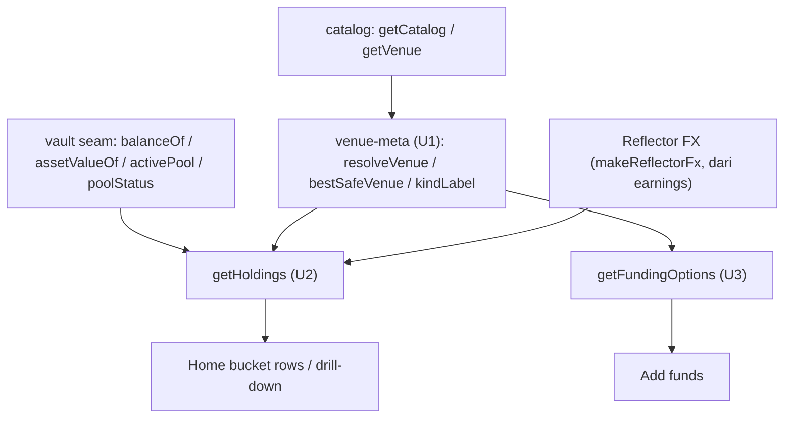

# Holdings + Funding-Options Read (venue metadata) - Plan

## Goal Capsule

- **Objective:** Backend read-only sumber-kebenaran venue/holdings/funding, supaya frontend berhenti hardcode data venue/APY dan integrasi STE-21 tinggal colok.
- **Product authority:** Axel (backend & AI, PM). Rekaman temuan #6 dari review mock-2 (Linear STE-36 → tiket **STE-37**).
- **Execution profile:** unit backend dibangun & diuji lawan mock `@sorosense/vault-client` + catalog; **tanpa keys, tanpa perubahan frontend, tanpa wiring live** (swap seed-frontend → read ini terjadi di STE-21).
- **Parallelization:** U1 (venue-meta) fondasi → **U2 (holdings) & U3 (funding) paralel** (file disjoint). 1 unit = 1 branch = 1 PR.
- **Stop conditions:** blocker jika bentuk `BucketView` di frontend berubah signifikan sebelum ini landing, atau jika mapping pool-id↔catalog-id ternyata tak 1:1 (lihat KTD5).

---

## Product Contract

**Preservation:** Product Contract ditulis di sini (sumber `ce-plan-bootstrap`; tak ada brainstorm terpisah).

### Summary

Tiga fungsi backend read-only: `getHoldings(depositor)` (holdings per-kantong drop-in untuk `BucketView` frontend), `getFundingOptions()` (daftar Add funds), dan modul venue-metadata bersama. Disusun dari seam vault + catalog vetted + Reflector FX (display-only). Meniru bentuk `backend/src/api/earnings.ts`: deps injectable, `Result`-typed, tanpa field risk/label/score.

### Problem Frame

Frontend Home (bucket rows) & Add funds butuh **nama venue + kind + APY per-kantong**. `getEarnings` (STE-34) hanya kasih APY blended + `buckets{currency,nativeValue,usdValue}` — tanpa venue/kind/APY per-kantong. Peta `poolId → {venue,kind,apy}` ada di `backend/src/tools/catalog.ts` yang tak bisa di-import frontend. Akibatnya U14 sekarang **hardcode/seed** venue+APY di `frontend/lib/vault/data.ts` (`BUCKET_META`) & `STABLECOINS` — bukan sumber kebenaran, dan integrasi STE-21 tak bisa "tinggal colok".

### Requirements

**Holdings**

- R1. `getHoldings(depositor, deps)` mengembalikan, per kantong dengan `shares > 0`: `{ currency, name, venue, kind, tags, apy, shares, value, valueUsd, frozen }` — **drop-in** untuk `BucketView` (`frontend/hooks/useBuckets.ts`).
- R2. `shares` = seam `balanceOf`; `value` (native) = `assetValueOf`; `frozen` = `poolStatus(activePool) === 'frozen'`; `valueUsd` = `value × fx` (display-only, USD=1).
- R3. `venue`/`name`/`kind`/`apy` dari venue **aktif** (`activePool(currency)` → `getVenue(poolId)`); bila belum teralokasi → **best-safe** venue currency itu. `tags` = `[venue, kindLabel(kind)]`.
- R4. Kegagalan baca FX → error `Result` typed (bukan $0 diam-diam).

**Funding options**

- R5. `getFundingOptions()` mengembalikan daftar yang bisa didanai per currency: stablecoin `{ sym, currency, chains }` (USDC/EURC/CETES) + opsi RWA; **RWA (`kind:'rwa'`) tanpa field APY** (rate muncul saat deposit). Tanpa trap venue & tanpa explore/hub.

**Venue metadata (bersama)**

- R6. Modul venue-meta bersama: `resolveVenue(poolId) → { id, venue, name, kind, apy } | null` (menyubsumsi `getPoolMeta` exit-target frontend), `bestSafeVenue(currency)`, dan `kindLabel(kind) → string`.

**Invarian**

- R7. Ketiganya **read-only** — tak memindah dana, tak menulis on-chain, tanpa LLM.
- R8. Tanpa field `risk`/`label`/`score` di mana pun (keamanan tak terlihat).
- R9. Kantong per-currency tak dicampur; USD blended murni display.

### Acceptance Examples

- AE1. Kantong teralokasi. **Given** USD teralokasi ke `defindex-usdc`, **When** `getHoldings`, **Then** kantong USD: `venue:"DeFindex"`, `kind:"vault"`, `apy:8.59`, `tags:["DeFindex","Vault"]`, `value` dari `assetValueOf`. **Covers R1, R3.**
- AE2. Kantong beku. **Given** pool aktif EUR frozen, **When** `getHoldings`, **Then** kantong EUR `frozen:true`. **Covers R2.**
- AE3. Punya shares tapi belum teralokasi. **Given** shares USD tapi `activePool` null, **When** `getHoldings`, **Then** `venue`/`apy` = best-safe (`defindex-usdc`, 8.59). **Covers R3.**
- AE4. FX gagal. **Given** baca FX EUR error, **When** `getHoldings`, **Then** balikan err typed, bukan $0. **Covers R4.**
- AE5. Funding RWA. **When** `getFundingOptions`, **Then** entri RWA tanpa field `apy`; tanpa trap venue; stablecoin USDC/EURC/CETES ada. **Covers R5.**
- AE6. Tanpa field terlarang. **When** `getHoldings`/`getFundingOptions`, **Then** hasil tak punya key `risk`/`label`/`score`. **Covers R8.**

### Scope Boundaries

- **Di luar scope:** perubahan frontend (swap `frontend/lib/vault/data.ts` seed → read ini terjadi di **STE-21**), wiring live/keys on-chain, jalur write/pergerakan baru, dan feed activity (sudah ada `activity()`).
- **Deferred to Follow-Up Work:** ganti hardcode frontend dengan konsumsi `getHoldings`/`getFundingOptions` (STE-21 integrasi).

---

## Planning Contract

### Key Technical Decisions

- KTD1. **Tiru pola `earnings.ts`.** Deps injectable (seam reads, `FxSource`, currencies), `Result`-typed, deterministik, tanpa field label. **Reuse `makeReflectorFx`/`FxSource`** yang sudah diekspor `backend/src/api/earnings.ts` untuk FX (DRY) — jangan buat sumber FX kedua.
- KTD2. **`tags`: struktur + drop-in.** `getHoldings` kembalikan `venue`+`kind` terstruktur **dan** `tags` terhitung (`[venue, kindLabel(kind)]`) supaya benar-benar drop-in `BucketView.tags`. `kindLabel`: `vault→"Vault"`, `lending→"Fixed pool"`, `rwa→` diturunkan dari nama venue (mis. "CETES"). (Keputusan call-out #1.)
- KTD3. **APY = venue aktif, fallback best-safe.** Kantong teralokasi pakai APY pool aktif; belum-teralokasi pakai best-safe. (Keputusan call-out #2.)
- KTD4. **Modul venue-meta bersama (U1) untuk hindari duplikasi** antara holdings & funding (DRY). Ini yang bikin U2/U3 tetap ramping & paralel.
- KTD5. **Pool-id = catalog venue-id saat integrasi.** Seed frontend pakai id placeholder (`pool-defindex-usd`) yang **tak** cocok id catalog (`defindex-usdc`); pemetaan nyata terjadi di STE-21. **Test unit ini alokasikan ke id catalog** agar `resolveVenue` menemukan venue.

### High-Level Technical Design

Sumber-kebenaran fan-out — seam + catalog + FX diringkas venue-meta lalu disajikan dua read:

### Sequencing

U1 (venue-meta) lebih dulu → membuka **U2 & U3 paralel** (file disjoint: `holdings.ts` vs `funding.ts`, keduanya hanya import U1 + surface backend yang sudah ada). Tes per-unit. Tak ada barrier lain.

---

## Implementation Units

### U1. Modul venue-metadata (bersama)

- **Goal:** Helper murni berbasis catalog yang meresolusi venue per pool-id & per currency, dipakai bersama U2/U3 (DRY).
- **Requirements:** R6.
- **Dependencies:** — (fondasi; memblok U2, U3).
- **Files:** `backend/src/api/venue-meta.ts`, `backend/src/api/venue-meta.test.ts`.
- **Approach:** Ekspor `VenueMeta { id, venue, name, kind, apy }`; `resolveVenue(poolId): VenueMeta | null` via `getVenue(poolId)`; `bestSafeVenue(currency): CatalogEntry | null` = APY tertinggi `getCatalog(currency)`; `kindLabel(kind): string` (`vault→"Vault"`, `lending→"Fixed pool"`, `rwa→` dari nama venue). Murni; tak sentuh seam/FX. Tanpa field terlarang.
- **Patterns to follow:** `backend/src/tools/catalog.ts` (`getCatalog`/`getVenue`/`CatalogEntry`); pola pure-module `backend/src/api/simulate.ts`.
- **Test scenarios:** `resolveVenue('defindex-usdc')` → DeFindex/vault/8.59; `resolveVenue` id trap/unknown → null; `bestSafeVenue('USD')` → defindex-usdc (8.59, tertinggi); `bestSafeVenue` currency tanpa venue → null; `kindLabel` tiap kind benar; tak ada field `risk`/`label`/`score`.
- **Verification:** `pnpm -C backend typecheck && test` hijau.

### U2. `getHoldings` API

- **Goal:** Read-only per-kantong holdings, drop-in untuk `BucketView` frontend.
- **Requirements:** R1, R2, R3, R4, R7, R8, R9.
- **Dependencies:** U1. **Paralel dengan U3.**
- **Files:** `backend/src/api/holdings.ts`, `backend/src/api/holdings.test.ts`.
- **Approach:** `getHoldings(depositor, deps)` dengan deps `{ vault: Pick<VaultClient,'balanceOf'|'assetValueOf'|'activePool'|'poolStatus'>, fx: FxSource, currencies? }`. Per currency: `shares = balanceOf`; skip bila `≤ 0`; `value = assetValueOf`; `pool = activePool`; `frozen = pool ? poolStatus==='frozen' : false`; venue = `pool ? resolveVenue(pool) : bestSafeVenue(currency)` (U1); `apy/name/venue/kind/tags` dari situ (`tags = [venue, kindLabel(kind)]`); `fx` gagal → return err; `valueUsd = Number(value)/UNIT × rate` (skala unit display sesuai `frontend/lib/vault/units.ts` UNIT=1e7 — dokumentasikan konversi). Kembalikan `Result<Holding[]>`. Tanpa field terlarang. Reuse `FxSource`/`makeReflectorFx` dari earnings.
- **Patterns to follow:** `backend/src/api/earnings.ts` (`getEarnings`: deps injectable, FX Result, no-label, `assetValueOf` loop); `frontend/hooks/useBuckets.ts` (bentuk `BucketView` target).
- **Test scenarios:** **Covers AE1** kantong teralokasi (venue/kind/apy/tags/value benar); **Covers AE2** pool beku → `frozen:true`; **Covers AE3** punya shares tapi `activePool` null → best-safe venue/apy; **Covers AE4** FX EUR error → err typed (bukan $0); kantong `shares:0` di-skip; `valueUsd = value × rate`; multi-currency blended (USD+EUR); **Covers AE6** tak ada field terlarang.
- **Verification:** `pnpm -C backend typecheck && test` hijau; bentuk selaras `BucketView`.

### U3. `getFundingOptions` API

- **Goal:** Read-only daftar Add funds (stablecoin + RWA), RWA tanpa APY.
- **Requirements:** R5, R7, R8, R9.
- **Dependencies:** U1. **Paralel dengan U2.**
- **Files:** `backend/src/api/funding.ts`, `backend/src/api/funding.test.ts`.
- **Approach:** `getFundingOptions()` menyusun dari `getCatalog()` (semua Safe, trap sudah dikecualikan): stablecoin fundable per currency `{ sym, currency, chains }` (USDC/EURC/CETES → USD/EUR/MXN; `chains` dari data yang ada / default `["Stellar"]`) + opsi RWA `{ id, name, venue, kind:'rwa', currency }` **tanpa** field `apy`. Non-RWA boleh sertakan `apy`. Tak ada explore/hub (R19). Pakai `kindLabel`/`resolveVenue` (U1) untuk tag. Deterministik, tanpa field terlarang.
- **Patterns to follow:** `backend/src/tools/catalog.ts`; `frontend/lib/vault/data.ts` (`STABLECOINS` target shape + komentar "no explore/RWA catalog (R19)").
- **Test scenarios:** **Covers AE5** entri RWA tanpa key `apy`; hasil tak memuat trap venue; stablecoin USDC/EURC/CETES hadir dengan currency benar; non-RWA punya `apy`; **Covers AE6** tak ada field `risk`/`label`/`score`.
- **Verification:** `pnpm -C backend typecheck && test` hijau.

---

## Verification Contract

| Gate | Command | Unit |
|---|---|---|
| Typecheck backend | `pnpm -C backend typecheck` | U1, U2, U3 |
| Test backend | `pnpm -C backend test` | U1, U2, U3 |
| Suite penuh (regresi) | `pnpm -r test` | setelah tiap merge |

Invarian yang diuji: read-only (tak ada mutasi state), tanpa field `risk`/`label`/`score` (R8), FX gagal → err typed (R4), RWA tanpa apy (R5).

---

## Definition of Done

- U1, U2, U3 hijau di `pnpm -C backend typecheck` & `pnpm -r test`; masing-masing punya test dari kategori yang berlaku (happy/edge/error).
- `getHoldings` bentuknya **drop-in** `BucketView` (verifikasi manual terhadap `frontend/hooks/useBuckets.ts`).
- Tanpa field `risk`/`label`/`score`; semua read-only; FX gagal → err typed.
- Tanpa perubahan frontend & tanpa kode eksperimental tertinggal.
- Konsumsi oleh frontend (ganti seed) tercatat sebagai kerja lanjutan di **STE-21**.

---

## Open Questions

Non-blocking (diserahkan ke integrasi):

- Pemetaan pool-id kontrak nyata ↔ id catalog di STE-21 (KTD5).
- `chains` per stablecoin (mis. CETES multi-chain) — sumber datanya saat wiring; sementara default `["Stellar"]` / cermin seed frontend.
- Simbol FX Reflector final per currency (sudah placeholder di `makeReflectorFx`).
