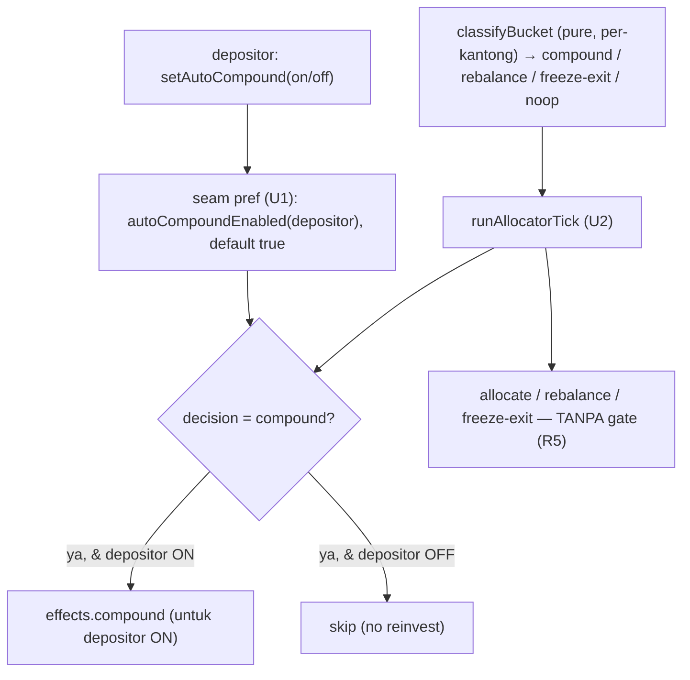

# Keeper Honors Auto-Compound Preference - Plan

## Goal Capsule

- **Objective:** Backend keeper/allocator berhenti me-reinvest reward untuk depositor yang mematikan auto-compound; **allocate & rebalance tetap jalan**. Bagian BE dari fitur "revocable auto-reinvest" (Linear **STE-40**, parent STE-38, Opsi 2 yang sudah di-ACC).
- **Product authority:** Axel (BE + PM). Keputusan invarian STE-38 Opsi 2 sudah di-ACC.
- **Execution profile:** dibangun & diuji **lawan mock** `@sorosense/vault-client` (seam-first). Backing kontrak nyata (STE-39, Ulin) mendarat paralel; **tanpa keys, tanpa perubahan frontend**.
- **Parallelization:** hanya 2 unit dengan dependensi (U1 seam → U2 allocator) — **berurutan**, bukan paralel (U2 butuh read seam dari U1). 1 unit = 1 branch = 1 PR.
- **Dependency lintas-tiket:** backing kontrak = STE-39 (Ulin); plan ini buildable lawan mock tanpa menunggunya. Switch frontend = tiket FE terpisah (nanti).

---

## Product Contract

**Preservation:** Product Contract ditulis di sini (`ce-plan-bootstrap`; keputusan produk/invarian sudah di-ACC di STE-38).

### Summary

Tambah preferensi **`autoCompound` per-depositor** (default ON) ke seam bersama + mock, lalu buat langkah **compound** di allocator menghormatinya: depositor OFF tak di-reinvest, tapi allocate & rebalance tetap. Consent (`set_policy_consent`) tak disentuh — KTD3 utuh. `classifyBucket` tetap pure/per-kantong; gating terjadi di layer eksekusi (Opsi (a)).

### Problem Frame

`docs/mockups/sorosense-mock-2.html` menggambar switch "Auto reinvest rewards" di Account, tapi seam & kontrak **tak punya "off"**: `setPolicyConsent` idempotent, no-arg (KTD3), dan satu mandate mencakup allocate+rebalance+compound sekaligus. Switch apa pun sekarang berbohong. STE-38 memutuskan (Opsi 2): `autoCompound` jadi **preferensi ekonomi terpisah** yang bebas di-toggle, consent tetap. Tiket ini mengerjakan bagian **backend keeper**-nya.

### Requirements

**Seam preferensi**

- R1. `setAutoCompound(depositor, on): PreparedTx` (requiredSigner `'depositor'`) — depositor men-toggle preferensinya. `setPolicyConsent` tak disentuh.
- R2. `autoCompoundEnabled(depositor): Promise<boolean>` — read, **default true** (depositor lama / belum set = ON).
- R3. Mock mengimplement keduanya (in-memory), tanpa mengubah perilaku seam yang ada.

**Allocator gating**

- R4. Langkah **compound** allocator membaca `autoCompoundEnabled` dan **skip compound untuk depositor OFF**; `classifyBucket` tetap pure/per-kantong.
- R5. **Allocate & rebalance tak terpengaruh** preferensi — tetap jalan untuk semua depositor.
- R6. Consent (`hasConsent`/`setPolicyConsent`) tak berubah; KTD3 tetap.

**Invarian**

- R7. Tanpa field `risk`/`label`/`score`; deterministik/injectable (pola allocator: pure classify + injected effects/store).

### Acceptance Examples

- AE1. Toggle & default. **Given** `setAutoCompound(alice, false)` di-submit, **When** `autoCompoundEnabled(alice)`, **Then** `false`; depositor yang belum set → `true`. **Covers R1, R2.**
- AE2. Compound di-skip saat OFF. **Given** bucket dengan yield accrued & depositor OFF, **When** tick, **Then** compound **tak** dijalankan untuk depositor itu; depositor ON → compound jalan. **Covers R4.**
- AE3. Rebalance tak terpengaruh. **Given** depositor OFF **dan** ada pool lebih baik (lewat threshold), **When** tick, **Then** rebalance tetap fire. **Covers R5.**
- AE4. Consent utuh. **Given** `setAutoCompound(alice, false)`, **When** `hasConsent(alice)`, **Then** tak berubah. **Covers R6.**

### Scope Boundaries

- **Di luar scope:** backing kontrak (STE-39, Ulin), switch UI Account (tiket FE terpisah), wiring live/keys.
- **Deferred to Follow-Up Work:** konsumsi seam oleh keeper nyata + segregasi-reward pooled sejati saat integrasi (STE-21) — lihat Open Questions.

---

## Planning Contract

### Key Technical Decisions

- KTD1. **Opsi (a): gate di layer eksekusi, `classifyBucket` tetap pure.** Classify per-kantong tetap memutuskan *apakah* bucket compound (yieldAccrued); layer eksekusi (`runAllocatorTick`/effects) memfilter ke depositor `autoCompoundEnabled`. Right-sized MVP — efek compound saat ini **stub** (efek keeper nyata ditunda ke integrasi), jadi tak perlu merombak allocator. Alternatif (b) — allocator per-depositor-aware penuh — ditolak sebagai over-build untuk tahap ini.
- KTD2. **`autoCompound` = preferensi terpisah, bukan consent (STE-38 Opsi 2).** Seam menambahnya di samping; `setPolicyConsent` utuh; KTD3 tetap. Default true → depositor lama tak terpengaruh.
- KTD3. **Seam-first, buildable lawan mock.** Axel jaga seam (`interface.ts` + `mock.ts`); backing kontrak (STE-39) paralel; swap saat integrasi. (Menghindari insiden ubah-seam-dari-PR-lain seperti #15.)
- KTD4. **Segregasi-reward pooled ditunda (Open Question).** Di bucket pooled sejati, re-supply reward hasil-harvest menguntungkan semua shareholder — opt-out per-user dengan kebenaran ekonomi penuh butuh akunting reward per-user (level kontrak). MVP memodelkan compound per-depositor di layer efek (benar untuk demo); segregasi penuh = Open Question untuk STE-39/integrasi.

### High-Level Technical Design

Preferensi mengalir dari depositor → seam → gate compound di tick; allocate/rebalance tak lewat gate:

### Sequencing

U1 (seam pref) lebih dulu — memberi `autoCompoundEnabled` yang dibaca U2. U2 (allocator gating) menyusul. Hanya 2 unit dan U2 bergantung read U1 → **berurutan**, bukan paralel.

---

## Implementation Units

### U1. Seam: preferensi auto-compound

- **Goal:** Tambah toggle + read preferensi `autoCompound` ke seam bersama + mock, tanpa menyentuh consent.
- **Requirements:** R1, R2, R3, R6.
- **Dependencies:** — (fondasi; memblok U2).
- **Files:** `packages/vault-client/src/interface.ts`, `packages/vault-client/src/mock.ts`, `packages/vault-client/src/mock.test.ts`.
- **Approach:** Di `VaultClient`: tambah write `setAutoCompound(depositor, on): PreparedTx` (requiredSigner `'depositor'`, pola `setPolicyConsent`) + read `autoCompoundEnabled(depositor): Promise<boolean>`. Mock: simpan **himpunan depositor yang OFF** (default = ON, jadi `autoCompoundEnabled` mengembalikan `!off.has(depositor)`); `setAutoCompound(...,false)` menandai off, `true` menghapusnya. Tak menyentuh `consent`/`setPolicyConsent`/read lain. Seam read langsung (`Promise<T>`, bukan `Result`) sesuai konvensi seam.
- **Patterns to follow:** `packages/vault-client/src/interface.ts` (`setPolicyConsent`/`hasConsent` sebagai cermin write+read depositor-scoped); `mock.ts` (`consent` Set + `prepare('depositor', ...)`).
- **Test scenarios:** default (belum set) → `autoCompoundEnabled` true; `setAutoCompound(off)` lalu read → false; `setAutoCompound(on)` lagi → true; **Covers AE1**; toggle depositor A tak mempengaruhi B; `setAutoCompound` di-sign **wrong role** (keeper) → reject; **Covers AE4** `setAutoCompound` tak mengubah `hasConsent`.
- **Verification:** `pnpm -C packages/vault-client typecheck && test` hijau; backend tetap compile.

### U2. Allocator: gating compound per-depositor

- **Goal:** Langkah compound menghormati `autoCompoundEnabled`; allocate/rebalance tak terpengaruh; `classifyBucket` tetap pure.
- **Requirements:** R4, R5, R7.
- **Dependencies:** U1. **Berurutan (butuh read seam U1).**
- **Files:** `backend/src/mastra/allocator.ts`, `backend/src/mastra/allocator.test.ts`.
- **Approach:** `classifyBucket` **tidak diubah** (tetap memutuskan `compound` per-kantong saat yieldAccrued). Gating di layer eksekusi: `runAllocatorTick` (atau efek compound) menerima **preferensi + depositor bucket** dan hanya menjalankan compound untuk depositor `autoCompoundEnabled === true`; bila tak ada yang ON → tak ada efek compound (noop-ish, boleh dicatat sebagai alasan). Cabang `rebalance`/`freeze-exit`/`allocate` **tidak** melewati gate (R5). Sumber daftar depositor per-bucket = detail integrasi (untuk demo: depositor ter-seed); injectable seperti effects/store yang ada.
- **Technical design (directional, bukan spesifikasi):** tambah ke `TickContext` sebuah pembaca preferensi injektabel (mis. `autoCompoundEnabled(depositor) => Promise<boolean>`) + depositor yang relevan; pada `decision.kind === 'compound'`, filter depositor lalu panggil efek compound hanya untuk yang ON. Bentuk pasti signature efek (per-depositor vs enabled-set) diserahkan ke implementasi.
- **Patterns to follow:** `backend/src/mastra/allocator.ts` (`runAllocatorTick` switch, `AllocatorEffects` injectable, `InMemoryBucketStore`); `backend/src/integration.test.ts` (pola tes allocator + spy effects).
- **Execution note:** tulis tes gating dulu (mudah TDD karena classify pure + effects injectable).
- **Test scenarios:** **Covers AE2** bucket yieldAccrued + depositor OFF → efek compound **tak** dipanggil; depositor ON → dipanggil; **Covers AE3** depositor OFF + kandidat pool lebih baik → rebalance **tetap** fire; bucket 2-depositor (satu ON, satu OFF) → compound hanya untuk yang ON; `classifyBucket` tetap mengembalikan `compound` (keputusan tak berubah, hanya efek yang di-gate); tanpa field `risk`/`label`/`score`.
- **Verification:** `pnpm -C backend typecheck && test` hijau; suite penuh hijau; allocate/rebalance test lama tetap lulus.

---

## Verification Contract

| Gate | Command | Unit |
|---|---|---|
| Typecheck + test vault-client | `pnpm -C packages/vault-client typecheck && pnpm -C packages/vault-client test` | U1 |
| Typecheck + test backend | `pnpm -C backend typecheck && pnpm -C backend test` | U2 |
| Regresi penuh | `pnpm -r test` | setelah tiap merge |

Invarian teruji: allocate/rebalance tak terpengaruh preferensi (R5), consent tak disentuh (R6), tanpa field terlarang (R7).

---

## Definition of Done

- U1 & U2 hijau di typecheck + `pnpm -r test`; tes lama allocator/mock tetap lulus (allocate/rebalance/consent tak berubah).
- `autoCompoundEnabled` default true; compound di-skip untuk depositor OFF; rebalance/allocate tetap jalan.
- Consent & KTD3 tak disentuh; tanpa field `risk`/`label`/`score`.
- Seam ditambah dari backend (koordinasi dgn STE-39 untuk backing kontrak); tanpa perubahan frontend; tanpa kode eksperimental tertinggal.

---

## Open Questions

Non-blocking (diserahkan ke integrasi / kontrak):

- **Segregasi-reward pooled sejati** — saat efek keeper nyata mendarat (integrasi), re-supply harvested reward di pool pooled menguntungkan semua shareholder; opt-out ekonomi penuh butuh akunting reward per-user (level kontrak, koordinasi STE-39). MVP ini memodelkan compound per-depositor di layer efek.
- **Sumber daftar depositor per-bucket** untuk keeper nyata (event/state) — untuk demo memakai depositor ter-seed.
- **Bentuk final backing kontrak** `set_auto_compound`/`auto_compound` + event (STE-39, Ulin) — seam sudah mendefinisikan kontraknya.
