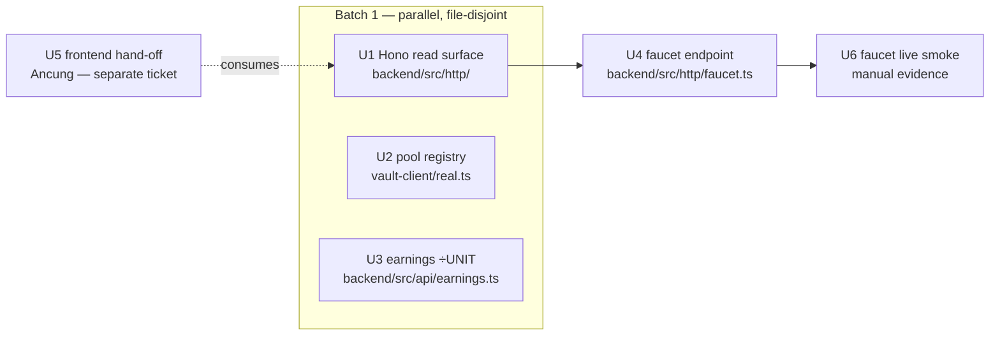

# feat: Testnet integration Fase B — HTTP surface + faucet + pool registry

## Summary

Fase A (PR #28, merged) proved the seam reads the live contract: `RealVaultClient` over generated
bindings, config-selected (mock default), keeper signer. **Fase B makes the demo fundable and the
backend reachable** — the pieces between "reads work" and "a judge can deposit."

Four backend units, **parallel-safe** (file-disjoint) so they run as Claude Code subagents or split to
a teammate:

- a thin **Hono** HTTP surface exposing the existing read APIs (the backend has none today);
- a **pool registry** so the adapter's write path can turn seam pool slugs into the contract's `Address`;
- the **faucet** endpoint (`POST /faucet`) that mints self-issued testnet USDC/EURC (STE-46);
- the **earnings `÷ UNIT`** scaling fix.

The frontend surface (Get-test-funds button, real trustline balance, HTTP consumption) is carried as a
**separable hand-off unit** for the frontend track (Ancung). This plan **sharpens Fase B of the umbrella
plan** (`docs/plans/2026-07-10-004-…`); it does not duplicate it — see that doc for the whole-journey
arc (Fase C readers, Fase D live journey).

**Product Contract preservation:** bootstrap from STE-21/STE-45; no product behavior changes beyond
enabling a real deposit. MXN stays out of the live demo (origin scope).

---

## Problem Frame

- **No HTTP surface.** `backend/` has zero routes (deps: `@mastra/core`, `@sorosense/vault-client`,
  `@stellar/stellar-sdk`, `zod`). The composed reads (`getHoldings`, `getActivity`, `getEarnings`,
  `getFundingOptions`) are pure functions the frontend cannot reach. This also blocks STE-41.
- **Write path can't name a pool.** The contract's pool params are `Address` (contract-id); the seam's
  `PoolId` is a slug (`'blend-usdc'`). `RealVaultClient`'s writes (`allocate` / `proposeExit` /
  `poolStatus` / `deallocate`) have no slug→Address mapping, so they cannot target a real pool.
- **Empty wallets can't deposit.** The real contract pulls tokens on deposit; a judge's fresh wallet
  panics. STE-46 deployed self-issued USDC/EURC SACs + `mock_pool` and verified a live mint→deposit; the
  faucet endpoint that fronts the issuer mint is the missing backend piece.
- **Earnings magnitude is wrong.** `backend/src/api/earnings.ts` `valueUsd` uses `value × rate` without
  `÷ UNIT` (holdings.ts divides correctly) — ~1e7× too large against real 7-decimal amounts.

---

## Requirements

- **R-B1** — The frontend can read the backend's composed views over HTTP; routes are read-only and carry
  no `risk`/`label`/`score` field.
- **R-B2** — `RealVaultClient` write methods that take a pool resolve the seam slug to the contract
  `Address` from a **single injected source**, with no pool address hardcoded in `packages/vault-client`.
- **R-B3** — `POST /faucet` mints self-issued USDC/EURC to a requesting address; the issuer secret is
  backend-only, never in a response or commit; the route is env-gated (inert on mainnet); USD/EUR only.
- **R-B4** — `getEarnings` reports human-scale USD (the `÷ UNIT` fix), with FX-failure still a typed
  error, never a silent $0.
- **R-B5** — The mock stays the default; the existing offline suites (314 tests) stay green with no
  network. Every backend unit ships an **object-real integration test**.

---

## Key Technical Decisions

### KTD1 — Thin Hono surface that wraps, never re-implements, the reads

A minimal Hono app exposes GET routes that call the existing `getHoldings` / `getActivity` /
`getEarnings` / `getFundingOptions` and return their JSON verbatim. No read logic is duplicated in the
route layer — the route is transport only. `bigint` is serialized as a decimal string at the boundary
(mirroring the U17 `bridge.ts` convention). Hono chosen for a minimal TS-first footprint.

### KTD2 — Pool registry injected into the adapter (single source, no duplication)

`RealVaultClient` gains an optional `resolvePool(poolId) → Address` (or an equivalent `Record<PoolId,
Address>`) supplied at construction. The **backend** builds it from env (`BLEND_POOL_USD` / `BLEND_POOL_EUR`
+ the catalog's per-currency pool slug) and injects it — so pool addresses live in **one** place (backend
config), never hardcoded in `packages/vault-client`. Reads that take a currency are unaffected. Write
methods resolve slug→Address before encoding; an unknown slug is a clear error, never a silent wrong
target.

### KTD3 — Faucet fronts the issuer mint; secret stays server-side and env-gated

`POST /faucet { address, currency }` ensures the recipient's trustline (or returns a `changeTrust`-needed
hint), then mints via `StellarAssetClient` using `FAUCET_ISSUER_SECRET`. The secret is read in the backend
and never serialized; the route is registered only when the faucet env is present (dead on mainnet); MXN
is rejected. Per-address rate-limit. Live mint is proven by a **manual smoke** (needs testnet + issuer);
CI covers the endpoint with a **mocked issuer client**.

---

## High-Level Technical Design

Dependency + parallelism shape (batch 1 is fully disjoint):

---

## Implementation Units

Batch 1 — **U1 ∥ U2 ∥ U3** (disjoint files). Then **U4** (needs U1). **U5** is a frontend hand-off that
can run fully in parallel. **U6** is manual evidence after U4.

### U1. Hono read surface

- **Goal:** Expose the composed backend reads over HTTP so the frontend can consume them.
- **Requirements:** R-B1, R-B5.
- **Dependencies:** none.
- **Files:** `backend/src/http/server.ts` + `backend/src/http/routes.ts` (or one module) + `backend/src/http/http.integration.test.ts` (new); `backend/package.json` (+`hono`, `@hono/node-server`).
- **Approach:** GET routes wrapping `getHoldings(depositor)` / `getActivity(query)` / `getEarnings(depositor)` / `getFundingOptions()`; return their JSON as-is. `bigint`→decimal string at the boundary (reuse/mirror the U17 bridge convention — do not re-encode per-route). CORS for the frontend origin; a `/health` route. Read-only: no route calls a write path. The app is exported (not force-listened at import) so tests boot it without a socket.
- **Patterns to follow:** the read APIs' existing signatures; `frontend/e2e/support/bridge.ts` bigint-as-string boundary.
- **Test scenarios (integration, object-real):**
  - Boot the Hono app with a real `MockVaultClient`-backed read; GET holdings → 200 JSON with `bigint` fields as strings, no `risk`/`label`/`score` key.
  - GET activity/earnings/funding each return the underlying read's shape.
  - A read that yields a typed error (e.g. FX failure for earnings) → non-200 with a shaped error body, not a silent 200.
  - No route reaches a write method (assert the vault write methods are never invoked during a read).
- **Verification:** routes serve the reads over a booted app; `pnpm -C backend test` green.

### U2. Pool registry — slug→Address in the adapter write path

- **Goal:** Let `RealVaultClient` writes target a real pool by resolving the seam slug to a contract `Address` from an injected source.
- **Requirements:** R-B2, R-B5.
- **Dependencies:** none (touches `packages/vault-client/src/real.ts` — disjoint from U1/U3).
- **Files:** `packages/vault-client/src/real.ts` (add `resolvePool` option + use it in pool-taking writes), `packages/vault-client/src/real.test.ts` (extend).
- **Approach:** Add an optional constructor field `resolvePool?: (poolId: PoolId) => Address`. In `allocate` / `deallocate` / `proposeExit` / `poolStatus`, resolve the slug to an `Address` before encoding; when `resolvePool` is absent, keep today's behavior for a slug that is already a valid address (so unit tests without a registry still pass), and throw a clear error for an unresolvable slug. **No pool address is hardcoded in vault-client** — the map is always injected. Reads by currency unchanged.
- **Patterns to follow:** the existing encode helpers in `real.ts`; the mock's wrong-input guards.
- **Test scenarios (integration, object-real with mocked transport):**
  - `allocate('blend-usdc', …)` with a registry mapping the slug to an Address → the bindings method is called with the resolved Address (assert via a fake bindings client).
  - `poolStatus('blend-usdc')` with the registry → resolved Address; without a registry, an unresolvable slug throws a clear error (not a raw ScVal encode failure).
  - A read (`sharePrice`, `assetValueOf`) is unaffected by the registry.
- **Verification:** write methods encode the resolved Address; `pnpm -C packages/vault-client test` green.

### U3. Earnings `÷ UNIT` scaling fix

- **Goal:** Correct `valueUsd` so real amounts read as human-scale USD.
- **Requirements:** R-B4, R-B5.
- **Dependencies:** none (touches `backend/src/api/earnings.ts` — disjoint).
- **Files:** `backend/src/api/earnings.ts`, `backend/src/api/earnings.test.ts`.
- **Approach:** Divide `valueUsd` by `UNIT` (`10_000_000n`) mirroring `holdings.ts`; add a regression test pinning the corrected magnitude (fails on the old `value × rate`). Do not touch the FX-failure path (still a typed `Result` error, never a silent $0).
- **Test scenarios:**
  - `getEarnings` for a known balance × FX rate → the human-scale USD figure, not 1e7× it (regression that fails pre-fix).
  - FX-read failure still returns a typed error, not $0 (existing invariant intact).
- **Verification:** earnings magnitude correct; existing earnings tests still green.

### U4. Faucet endpoint `POST /faucet`

- **Goal:** Mint self-issued testnet USDC/EURC to a requesting address so a judge can deposit.
- **Requirements:** R-B3, R-B5.
- **Dependencies:** U1 (mounts on the Hono app).
- **Files:** `backend/src/http/faucet.ts` (+ route registration in U1's app), `backend/src/http/faucet.integration.test.ts`, env docs.
- **Approach:** `POST /faucet { address, currency }` → ensure/verify trustline (or return a `changeTrust`-needed hint), then `StellarAssetClient.mint` from `FAUCET_ISSUER_SECRET` to the address for the currency's SAC (`USDC_SAC`/`EURC_SAC`). **Issuer secret backend-only, env, never serialized.** Per-address rate-limit. USD/EUR only (MXN → 4xx). The route is registered only when faucet env is present (inert on mainnet). Inject the issuer/mint client so tests never hit the network.
- **Patterns to follow:** `backend/src/tools/keeper-signer.ts` (secret→signer, backend-only); U1's app + bigint-string boundary.
- **Test scenarios (integration, mocked issuer client):**
  - `POST /faucet {address, USD}` → mint invoked with the `USDC_SAC` + address; response body carries no secret.
  - Unknown/`MXN` currency → 4xx, no mint.
  - Repeated calls beyond the rate limit → throttled (429).
  - Faucet env unset → route not registered (404).
  - The issuer secret never appears in any response body or log.
- **Verification:** mint path covered with a mocked issuer client; secret never serialized; `pnpm -C backend test` green.

### U5. Frontend hand-off — Get-test-funds button + real balances (Ancung)

- **Goal:** Surface the faucet in the UI and read real trustline balances so the button appears only when a wallet is empty; consume the backend reads over HTTP.
- **Requirements:** R-B1, R-B3.
- **Dependencies:** U1, U4 (backend surface).
- **Files:** `frontend/` (Add-funds/Deposit component, `frontend/lib/vault/data.ts` `getWalletBalance`, a small faucet/HTTP client).
- **Approach:** Env-gated "Get test funds" button (visible only in integration mode AND trustline balance 0), calls `POST /faucet`, refetches balance. Replace the fixture `getWalletBalance` with a real trustline read in integration mode (fixture stays in mock mode). Point frontend reads at the Hono surface where a backend composition is needed. Dead on mainnet (`NEXT_PUBLIC_E2E` pattern). Also drop the MXN simulator tab (USD/EUR-only demo) — coordinate with STE-41.
- **Execution note:** Frontend track — hand off to Ancung as a separate ticket/PR; **not** built in this backend ce-work run. Listed here so the dependency and contract are explicit.
- **Test scenarios:** button hidden in mock/mainnet mode; shown in integration mode + zero balance; click calls `/faucet` then re-reads balance; e2e unaffected in mock mode.
- **Verification:** button appears only in the gated state; frontend suite green in mock mode.

### U6. Faucet live smoke — evidence

- **Goal:** Prove the faucet mints on real testnet, end to end.
- **Requirements:** R-B3.
- **Dependencies:** U4, integration env.
- **Files:** `docs/tests/linear-STE-45/` (evidence: address, tx hash, before/after balance).
- **Approach:** With faucet env set, `POST /faucet` to a fresh trustline'd account; confirm the SAC balance rises; capture the tx hash. Manual, not a CI gate (needs testnet + issuer secret).
- **Test scenarios:** `Test expectation: manual smoke — the live mint is the evidence.`
- **Verification:** balance rises on testnet; tx hash + before/after recorded in the PR.

---

## Scope Boundaries

**In scope:** U1–U4 (backend) + U6 (evidence); U5 defined as a frontend hand-off.

### Deferred to Follow-Up Work
- **U5 frontend** → Ancung (separate ticket/PR): button, real trustline read, HTTP consumption, MXN tab removal (ties to STE-41).
- **Fase C — on-chain event readers** (earnings/activity) → umbrella plan.
- **Fase D — live journey + depositor write-path (real wallet signing) + keeper live runner** → umbrella plan; the depositor write-path and a live keeper driver are the highest-risk remaining pieces.
- **Real Blend pools** → post-hackathon; demo uses `mock_pool`.

**Out of scope:** changing the Rust contract, redeploying, mainnet, MXN in the live demo.

---

## Verification Contract

- **Mock-default gate (CI):** `pnpm -r typecheck && pnpm -r test` green with **no** integration env — the
  314-test offline suite unchanged. Non-negotiable.
- **Integration tests (object-real):** U1 boots the Hono app against a real `MockVaultClient` read; U4
  drives the faucet with a mocked issuer client; U2 exercises the adapter write path with a fake bindings
  client + registry; U3 pins the earnings magnitude.
- **Faucet live smoke (manual):** mint on testnet, tx hash + before/after balance in the PR.
- **Secret hygiene:** grep the diff — `FAUCET_ISSUER_SECRET` / `KEEPER_SECRET` never in client code,
  responses, or commits.

## Definition of Done

- Frontend can reach the backend reads over HTTP (read-only, no risk/label/score).
- The adapter write path resolves pool slugs to real Addresses from a single injected source.
- `POST /faucet` mints USDC/EURC (secret server-side, env-gated, USD/EUR only), proven by a live smoke.
- Earnings report human-scale USD.
- Mock stays default; all offline tests green; each backend unit has an object-real integration test.

---

## System-Wide Impact

- **New backend process surface** (Hono server) + deps (`hono`, `@hono/node-server`) — the repo's first
  API layer; note deploy/runbook.
- **STE-41 unblocked** by U1 (frontend can consume backend catalog/APY via HTTP).
- **Cross-team:** U5 is Ancung's; the faucet + registry consume STE-46's SAC/pool ids (already in env).

## Risks & Dependencies

- **Faucet needs a live testnet + issuer secret** for the smoke — cannot be a CI gate; CI uses a mocked
  issuer. Testnet reset (~quarterly) invalidates SACs → re-run STE-46's `faucet-assets.ts`.
- **Trustline-before-mint:** minting a SAC to an account with no trustline may fail; U4 must ensure/verify
  the trustline (or return a `changeTrust` hint) rather than assume it — resolve against the live SAC in U4.
- **Rate-limit store** is in-memory (per-process) for the demo — fine for one backend; note for scale.

## Open Questions (execution-time)

- **Slug↔currency pool mapping:** which catalog pool slug is the demo pool per currency (the one the env
  `BLEND_POOL_USD/EUR` addresses back)? Settle in U2 against the catalog + env; keep the map injected.
- **Mint auth vs trustline:** does the SAC `mint` require the recipient's trustline first, and can the
  backend create it, or must the user sign `changeTrust`? Resolve in U4 against the live SAC; if the user
  must sign, the faucet returns a `changeTrust`-needed response and U5 handles it.
