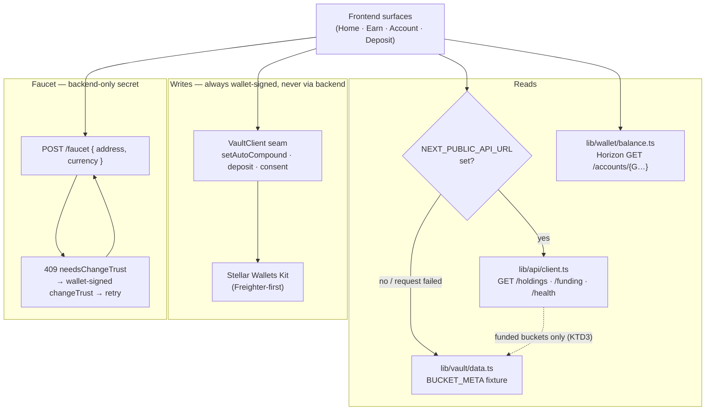
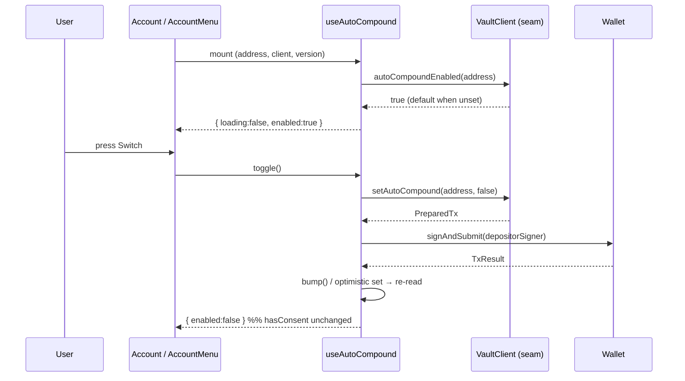

# feat: Frontend wiring — auto-compound toggle · drop-MXN simulator · HTTP client + faucet + real balance

## Summary

The frontend is the last track still running on fixtures. Three tickets close that gap, in four
parallel-safe units:

- **U1 (STE-38)** — the Account "Auto reinvest rewards" switch becomes a **live, revocable toggle**
  backed by the seam's `setAutoCompound` / `autoCompoundEnabled`. Today it is a read-only display
  wired to the *wrong* source (`useConsent`), which conflates the safety mandate (KTD3, irrevocable)
  with an economic preference (revocable). Contract + keeper for STE-38 are already done — this is
  pure frontend wiring.
- **U2 (STE-41, part 1)** — the simulator's currency picker drops **MXN**; the live demo funds USD/EUR
  only (the faucet mints USD/EUR, `tools/vault.ts` has demo pools for USD/EUR only). Simulating a
  bucket nobody can fund is a lie in the UI.
- **U3 (STE-52b)** — the frontend has **no HTTP client at all** (no `fetch(`, no `NEXT_PUBLIC_API_URL`,
  empty `next.config.ts`). Build the seam to the backend's Hono surface from nothing: a typed fetch
  module, env-gated base URL, shaped-error handling, bigint-as-decimal-string decoding.
- **U4 (STE-41 part 2 + STE-52a)** — consume real data through that seam: **APY from `GET /holdings`**
  instead of the hardcoded `BUCKET_META`, a **real wallet balance** (Horizon trustline read) instead of
  the `getWalletBalance` fixture, and a **"Get test funds" faucet button** (`POST /faucet`, with the
  `changeTrust` retry path) so a judge's empty wallet can deposit.

Every unit stays offline-green: with no `NEXT_PUBLIC_API_URL` set (dev default, vitest, Playwright),
the frontend keeps its current local derivations. The backend seam is **additive**, never a hard
dependency of the demo.

---

## Problem Frame

- **The auto-reinvest switch lies.** `frontend/app/(app)/account/page.tsx` and
  `frontend/components/desktop/AccountMenu.tsx` render `<Switch checked={enabled} readOnly />` where
  `enabled` comes from `useConsent()` — i.e. the switch labelled "Auto reinvest rewards" is actually
  displaying *consent*. The seam has carried `setAutoCompound` / `autoCompoundEnabled` since STE-38's
  contract+keeper work landed; nothing on a user surface reaches them.
- **The simulator offers a bucket the demo cannot fund.** `Simulator.tsx` lists `["USD","EUR","MXN"]`;
  the faucet mints USD/EUR only (`backend/src/http/faucet.ts` `FaucetCurrency = 'USD' | 'EUR'`) and
  `demoPoolFor` throws for MXN.
- **APY is a hardcoded fixture in three places.** `BUCKET_META` in `frontend/lib/vault/data.ts` feeds
  `useBuckets`, the Earn hero, and `lib/earn/simulate.ts`. The backend already derives APY from the
  vetted catalog (`backend/src/api/venue-meta.ts`) and serves it on `GET /holdings`.
- **There is no frontend→backend transport.** The backend HTTP surface (STE-21 Fase B) has been live
  for a week and no frontend code calls it.
- **A judge with an empty wallet cannot deposit.** `getWalletBalance()` returns fixture balances
  (`USDC: 9076`), so the deposit keypad shows funds that do not exist on testnet, and there is no way
  to acquire real ones from the UI. `AddFundsDrawer.tsx` already reserves the mount point for this.

---

## Requirements

- **R1** — The Account auto-reinvest switch reads `autoCompoundEnabled(depositor)` and writes
  `setAutoCompound(depositor, next)` with a depositor signature. Toggling it never calls
  `setPolicyConsent` and never changes `hasConsent` (KTD3 — the safety mandate is a separate, one-time,
  irrevocable grant). Both surfaces (mobile Account, desktop AccountMenu) behave identically.
- **R2** — Auto-compound is revocable: OFF then ON again must round-trip. Revoking stops reinvest only;
  allocate / rebalance / freeze-exit are unaffected (the keeper's `gateCompound` already enforces this).
- **R3** — The simulator and the Earn empty-state hero offer USD and EUR only. No MXN control on any
  user surface.
- **R4** — The frontend can call the backend's read surface (`/health`, `/holdings`, `/funding`) and
  its `POST /faucet` through one typed client module, with `NEXT_PUBLIC_API_URL` as the only config
  knob. Failure is shaped and non-fatal — a dead backend degrades to today's local behavior, never a
  blank screen or an unhandled rejection.
- **R5** — Bucket APY on Home rows and the funded Earn views comes from `GET /holdings` when the API is
  configured, falling back to the local fixture otherwise.
- **R6** — The deposit surfaces (mobile `DepositKeypad`, desktop `AddFundsDrawer`) show the user's
  **real** stablecoin balance when the API/network is configured, and a **"Get test funds"** button
  that mints testnet USDC/EURC via `POST /faucet`. A `409 needsChangeTrust` response is recoverable in
  the UI: the user signs a `changeTrust` in their wallet, then the mint retries.
- **R7 (invariants, all units)** — No `risk` / `label` / `score` / `tier` field or copy on any surface.
  3-tab nav Home/Earn/Account unchanged. No chatbot. Wallet code stays client-only (`"use client"` +
  `useEffect`, never module scope — KTD7). `FAUCET_ISSUER_SECRET` and `KEEPER_SECRET` never reach the
  client: the frontend posts `{ address, currency }` and receives only a public tx hash. Per-currency
  buckets are never converted (USD blending stays display-only).

---

## Assumptions

Bets taken without a synchronous product owner in the loop; each is cheap to reverse.

- **A1 — The VaultProvider stays on `MockVaultClient` in this plan.** Swapping in `RealVaultClient`
  (direct-RPC writes against the deployed contract) changes *every* write path (deposit, withdraw,
  consent, approve-exit, and the new auto-compound toggle) plus the assumptions of the whole vitest +
  Playwright suite, which drive the in-memory singleton through `lib/e2e/bridge.ts`. That is its own
  unit, not a rider on four others. Consequence: U1's write lands on the mock today and on the real
  contract the day the provider is swapped — **no U1 code changes** at that point, because it goes
  through the seam. See *Deferred to Follow-Up Work*.
- **A2 — Wallet balance is read from Horizon, not through the vault seam.** The user's stablecoin
  balance is a classic trustline balance on their own account, not vault state — `RealVaultClient` has
  no method for it and adding one would pollute the seam. Horizon's `GET /accounts/{G…}` returns both
  the balance *and* whether the trustline exists, which is exactly what the faucet's `changeTrust` path
  needs.
- **A3 — MXN stays in the `Currency` type, `BUCKET_META`, and `STABLECOINS`.** U2 removes MXN from the
  *simulator control* only (minimal scope). Purging MXN from the seam type is a cross-package change
  (contract enum included) and is not on the demo's critical path. Recorded as an open question.
- **A4 — The unfunded-bucket APY has no backend source yet** (see KTD3 and Open Questions). U4
  consumes `/holdings` APY for *funded* buckets and keeps the fixture for the empty-state hero and
  simulator until a backend rate route exists.

---

## Key Technical Decisions

### KTD1 — Two transports, one seam each: HTTP for composed reads, the wallet for writes

`GET /holdings` (and later `/earnings`, `/activity`, `/funding`) are **composed** reads: they blend the
vault seam with the catalog and FX, and that composition lives in the backend. The frontend consumes
them over HTTP and re-implements none of it.

Writes are the opposite: they must be signed in the user's wallet, so they never route through the
backend (the backend holds no depositor key, by design). `setAutoCompound` goes
`client.setAutoCompound(address, next).signAndSubmit(depositorSigner(address, signTransaction))` —
identical to the existing deposit/consent flow in `DepositKeypad.tsx`.

The faucet is the one exception in the other direction: it is a *backend write with a backend-only
secret*, so it is an HTTP `POST` and the client never sees a key.

### KTD2 — The API is additive and env-gated; absent API ⇒ today's behavior

`NEXT_PUBLIC_API_URL` is the single switch. Unset (dev default, vitest, Playwright) ⇒ the frontend uses
its existing local derivations (`BUCKET_META`, `getWalletBalance`) and never issues a request. Set ⇒
reads come from the backend, and a request that fails (network error, non-2xx, malformed body) logs and
**falls back to the local value** rather than blanking the UI.

This is not a nicety — it is what keeps the 8/8 Playwright baseline and the vitest suite offline. It
also protects the demo: a backend that dies mid-judging degrades the app to fixtures instead of
breaking it.

**Why not a `next.config.ts` rewrite proxy?** A rewrite hides the failure mode (a dead backend becomes a
Next 500, not a catchable fetch error) and buys nothing here — the backend already sends CORS for
`http://localhost:3000` (`backend/src/http/app.ts`, `FRONTEND_ORIGIN`). Direct `fetch` to an absolute
base URL keeps the failure catchable and the config surface at one variable.

### KTD3 — `/holdings` covers *funded* buckets only; the empty-state APY keeps its fixture

`getHoldings` skips buckets with zero shares (`if (shares <= 0n) continue`) — correctly, they are not
holdings. But the Earn **empty state** and the **simulator** need an APY for a bucket the user has
*not* funded, and no backend route exposes a per-currency rate for an unfunded bucket
(`bestSafeVenue(currency)` exists in `venue-meta.ts` but is not served).

So U4 splits the source honestly: funded buckets take APY from `/holdings`; the empty-state hero and
simulator keep `BUCKET_META` until a backend rate route lands. Both paths flow through **one** frontend
accessor (`useApy` / an `apy` argument to `simulate`), so the day the route exists it is a one-file
change, not a re-hunt through three call sites. The follow-up is filed below and flagged to the backend
track.

### KTD4 — Fail-**open** for auto-compound (default ON), unlike `useConsent`'s fail-closed

`useConsent` fails closed: a read that rejects renders "Off", because claiming a safety mandate we
cannot confirm is a lie about the user's funds. Auto-compound is the inverse case: the seam's documented
default is **enabled** (`autoCompoundEnabled` returns `true` when unset; the mock tracks only an
`autoCompoundOff` set), and reinvesting rewards moves nothing out of the user's bucket — it is an
economic preference, not a mandate. Rendering "Off" on a failed read would misreport a user whose
preference is actually ON and invite a pointless write.

So `useAutoCompound` renders **ON** on a failed read, logs the error (never swallows it), and keeps the
control enabled. The safety-critical direction is already fail-closed where it matters: the *keeper's*
`gateCompound` treats an unreadable preference as OFF and never reinvests unverified.

### KTD5 — `Switch` gains an optional `onChange`; it is not forked

`components/ui/Switch.tsx` already has correct `role="switch"` / `aria-checked` semantics and its
docstring predicts exactly this change ("after which this component gains an `onChange` and drops
`readOnly`"). It gains `onChange?: () => void` and keeps `readOnly` — the primitive stays one component
serving both a live control and a state display (primitives-DRY invariant), and the consent row (if any
survives) keeps working untouched.

### KTD6 — STE-26's "no write from the Account tab" does not bind `setAutoCompound`

The inline note at `account/page.tsx:86-92` forbids a write from this tab because *consent* is
irrevocable and granting it belongs in the deposit flow. `setAutoCompound` is explicitly **revocable**
(seam docstring: "a freely-revocable economic preference, not a risk/pool choice") and grants no
mandate. The constraint does not transfer. This plan supersedes that note; U1 rewrites it rather than
leaving a comment that contradicts the code beneath it.

---

## High-Level Technical Design

Where each piece of data comes from, after all four units. The env gate (KTD2) is the only branch.

Auto-compound (U1), end to end — note that consent is never touched:

---

## Implementation Units

Four units, three batches. Files are disjoint **within** each batch.

| Batch | Units | Rationale |
|---|---|---|
| 1 | U1 ∥ U2 | Disjoint file sets (account/hooks/Switch vs. simulator). |
| 2 | U3 | All-new files — safe to start in batch 1 too if a worker is free. |
| 3 | U4 | Depends on U2 (simulator) and U3 (client). |

### U1. Live auto-compound toggle (STE-38)

**Goal** — The "Auto reinvest rewards" switch on both Account surfaces reads and writes the depositor's
auto-compound preference through the seam, replacing the read-only consent display.

**Requirements** — R1, R2, R7. **Dependencies** — none.

**Files**
- `frontend/hooks/useAutoCompound.ts` (new)
- `frontend/hooks/__tests__/useAutoCompound.test.tsx` (new)
- `frontend/components/ui/Switch.tsx` (add optional `onChange`; keep `readOnly`; rewrite the docstring)
- `frontend/components/ui/__tests__/Switch.test.tsx` (new — the primitive has no test today)
- `frontend/app/(app)/account/page.tsx` (bind the row to `useAutoCompound`; rewrite the stale STE-26 note)
- `frontend/app/(app)/account/__tests__/account.test.tsx`
- `frontend/components/desktop/AccountMenu.tsx` (same row, same hook — desktop redirects `/account` to Home, so this is the *only* desktop surface for it)
- `frontend/components/desktop/__tests__/AccountMenu.test.tsx`

**Approach**
- `useAutoCompound()` mirrors `useConsent()`'s shape (keyed on `[address, client, version]`, cancelled
  on unmount) and returns `{ loading, enabled, pending, toggle }`. Fail-**open** on a failed read
  (KTD4): render ON, `console.error` the cause.
- `toggle()` runs `client.setAutoCompound(address, next).signAndSubmit(depositorSigner(address, signTransaction))`
  — the same two-phase `PreparedTx` pattern as `DepositKeypad.tsx:66-71` / `:84-91`, with
  `signTransaction` from `useWallet()`. On success call `useVault().bump()` so the re-read is the source
  of truth; set `pending` while in flight so a double-press cannot fire two writes.
- On a rejected signature (the user closes the wallet modal — `WalletError` / `USER_CLOSED_MODAL`),
  revert to the prior state and toast; do not leave the switch in a lying position.
- Rename the row's hook binding *only*. The `data-testid="consent-state"` handle now names the wrong
  thing — replace it with `data-testid="auto-compound-state"` on both surfaces and update the two tests
  that assert on it. Consent itself keeps no switch (it is granted once in the deposit flow); if a
  consent status row is still wanted, that is a separate design change, not this unit.
- Toast on both surfaces: mobile Account already has a local `<Toast>` (`page.tsx:3,122`); desktop uses
  the global `useToast().show`.

**Patterns to follow** — `frontend/hooks/useConsent.ts` (hook shape, cancellation, error logging);
`frontend/components/deposit/DepositKeypad.tsx` (write + sign + submit); `frontend/lib/vault/signer.ts`.

**Test scenarios** (vitest, real `MockVaultClient` — no mocking of the seam)
- Unset preference renders the switch **on** (mock default `autoCompoundEnabled === true`).
- Pressing an ON switch calls `setAutoCompound(address, false)`, signs, and the switch renders **off**.
- Pressing it again round-trips back to **on** (R2 — revocable).
- After a toggle, `client.hasConsent(address)` is **unchanged** (R1 — the mandate is never touched).
  Assert this explicitly; it is the invariant the whole ticket rests on.
- A rejected signature (signer throws) leaves the switch in its prior position and surfaces a toast.
- A rejecting `autoCompoundEnabled` read renders **on** and logs (KTD4 fail-open) — not "off".
- No wallet connected: the row renders its loading/absent state without throwing (the page already
  early-returns on `!address`; assert the hook does not crash).
- `Switch` primitive: with `onChange` it is pressable and fires once per press; with `readOnly` it stays
  `disabled` + `aria-disabled` and `onChange` is never called; `role="switch"` / `aria-checked` track
  `checked` in both modes.

**Verification** — `pnpm -C frontend test` green; `pnpm -r typecheck` green; `pnpm -C frontend lint`
clean; Playwright 8/8 (mobile + desktop) unchanged. Manually: connect Freighter, toggle the switch, see
the wallet pop, and confirm the Activity feed shows no new consent event.

---

### U2. Drop MXN from the simulator (STE-41, part 1)

**Goal** — The currency picker offers USD and EUR only; the Earn empty-state hero follows (it is driven
by the same `currency` state).

**Requirements** — R3, R7. **Dependencies** — none. Parallel-safe with U1.

**Files**
- `frontend/components/simulator/Simulator.tsx` (`CURRENCIES` → `["USD","EUR"]`)
- `frontend/components/simulator/__tests__/Simulator.test.tsx`
- `frontend/app/(app)/earn/__tests__/earn-empty.test.tsx` (line 33 clicks the `MXN` button — retarget to `EUR`)

**Approach**
- One constant changes. `SYMBOL` keeps its `MXN` entry: it is typed `Record<Currency, string>` and
  `Currency` still includes MXN (A3), so removing the key is a type error, not a cleanup.
- Do **not** touch `lib/vault/data.ts` (`BUCKET_META`, `STABLECOINS`/CETES) — that file is U4's, and the
  Add-funds list is a separate product question (Open Questions). Keeping this unit to the simulator is
  what makes it parallel-safe with U1.
- `earn/page.tsx` needs no change: its `currency` state defaults to `"USD"` and only ever receives what
  the simulator hands back.

**Test scenarios**
- The picker renders exactly two currency buttons: USD and EUR. No `MXN` control exists in the DOM.
- Selecting EUR re-renders the projection in `€` and redraws the bars (the existing currency-switch
  assertions still hold with EUR as the target).
- Earn empty state: switching the simulator to EUR moves `data-testid="hero-apy"` to the EUR rate — the
  hero and the simulator stay in lockstep.
- `lib/earn/simulate.ts` is untouched and its MXN unit test still passes (the math surface keeps MXN;
  only the *control* drops it).

**Verification** — `pnpm -C frontend test` green; typecheck green; Playwright 8/8 (no spec clicks MXN —
verified by grep, but re-run to be sure).

---

### U3. HTTP client to the backend read surface (STE-52b)

**Goal** — One typed frontend module that talks to the backend's Hono surface, env-gated and
fail-soft. Infra only: nothing consumes it yet, so it lands as a self-contained commit with unit tests.

**Requirements** — R4, R7. **Dependencies** — none (all-new files; startable in batch 1 if a worker is
free, though the coordinator's batching runs it second).

**Files**
- `frontend/lib/api/config.ts` (new — `API_BASE_URL` from `NEXT_PUBLIC_API_URL`, `apiEnabled()`)
- `frontend/lib/api/client.ts` (new — `apiGet<T>` / `apiPost<T>`, shaped errors, bigint-string decode)
- `frontend/lib/api/types.ts` (new — response shapes mirroring the backend contract)
- `frontend/lib/api/__tests__/client.test.ts` (new)
- `frontend/.env.example` (new — `NEXT_PUBLIC_API_URL`, plus the U4 vars, all `NEXT_PUBLIC_`, no secrets)
- `frontend/README.md` (a short "talking to the backend" section: how to boot the mock-mode server)

**Approach**
- **Env gate.** `apiEnabled()` is `Boolean(process.env.NEXT_PUBLIC_API_URL)`, read the same way
  `lib/wallet.ts:12` reads `NEXT_PUBLIC_E2E` — Next inlines `NEXT_PUBLIC_*` at build time, so an unset
  var makes every API branch statically dead. Default when unset: **no request**, callers use their
  local fallback. Do not default the base URL to `http://localhost:8787` — a silent default would make
  a production build hammer a host that isn't there.
- **Result-shaped, never-throwing.** `apiGet` returns a discriminated union
  (`{ ok: true; value: T } | { ok: false; code: string; message: string }`), mirroring the backend's own
  `Result` discipline. Network error, non-2xx, and malformed JSON all collapse into the error arm. It
  never throws, so a caller cannot forget a `try`.
- **Error decoding.** The backend's shaped body is `{ error: { code, message } }`
  (`app.ts` `jsonErr`/`badRequest`); the faucet's is `{ error: { message } }` or the 409
  `{ needsChangeTrust, currency, sac, message }`. Decode both; on an undecodable body, synthesize
  `{ code: 'parse', message }` rather than guessing.
- **bigint boundary.** The backend serializes `bigint` as a decimal **string** (one shared
  `bigintReplacer`). The client's typed shapes declare those fields as `string` and expose a
  `toBigInt(field)` helper — the frontend's own bigint convention (`lib/vault/units.ts` `UNIT`,
  `e2e/support/bridge.ts`) is unchanged, the string is decoded at the edge and never leaks inward.
- **Types are declared, not imported.** The frontend cannot depend on `backend` (it is not a workspace
  dependency, and the seam rule forbids the coupling). `types.ts` re-declares `Holding` /
  `FundingOptions` / the error body with a docstring naming the backend file each mirrors, and the
  contract test below pins them against a real booted server.
- **Timeout.** `AbortController` with a short deadline (≈5s) so a hung backend cannot wedge a render.

**Test scenarios**
- `apiEnabled()` is false with no `NEXT_PUBLIC_API_URL` and `apiGet` short-circuits to the error arm
  **without calling `fetch`** (assert on a spy: zero calls — this is the offline guarantee).
- A 200 with a valid body returns `{ ok: true, value }`; a `bigint`-carrying field arrives as a string
  and `toBigInt` converts it losslessly (use a value beyond `Number.MAX_SAFE_INTEGER` — a plain
  `Number()` would corrupt it, and this test is what catches that).
- A 400/502/503/504 with `{ error: { code, message } }` returns the error arm with that code preserved.
- A network rejection returns the error arm (code `unavailable`), never throws.
- A malformed (non-JSON) 200 body returns the error arm with code `parse`.
- An aborted (timed-out) request returns the error arm, never a dangling promise.
- **Contract test** (`http.contract.test.ts`, tagged so it can be skipped offline): boot the backend's
  mock-mode server (`backend/src/http/app.ts` `createApp` with the mock vault + the stub FX
  `server.ts` already uses offline), `fetch` `/health` and `/holdings?depositor=…` through the real
  client, and assert the declared `types.ts` shapes decode. This is the only thing that stops the
  frontend types from drifting from the backend's.

**Verification** — `pnpm -C frontend test` green; typecheck green; lint clean. Manually:
`pnpm -C backend dev` (mock mode, offline stub FX), set `NEXT_PUBLIC_API_URL=http://localhost:8787`,
and confirm `/health` returns `{status:"ok"}` through the client. Playwright unaffected (the var is
unset under `NEXT_PUBLIC_E2E`).

---

### U4. Consume backend APY · real wallet balance · faucet button (STE-41 part 2 + STE-52a)

**Goal** — Replace the last three fixtures on the deposit/earn path: bucket APY, wallet balance, and the
absence of any way to get testnet funds.

**Requirements** — R5, R6, R7 (and R3's second half). **Dependencies** — U2 (simulator), U3 (client).

**Files**
- `frontend/hooks/useHoldings.ts` (new — `GET /holdings`, env-gated, falls back to the seam+fixture path)
- `frontend/hooks/useApy.ts` (new — the one APY accessor; `/holdings` for funded, `BUCKET_META` otherwise)
- `frontend/hooks/useBuckets.ts` (APY via `useApy`; the seam still owns shares/value/frozen)
- `frontend/lib/earn/simulate.ts` (`simulate`/`simulateCurve` take `apy` as an input — pure, no `getBucketMeta` import)
- `frontend/lib/earn/__tests__/simulate.test.ts`
- `frontend/components/simulator/Simulator.tsx` (pass `apy` down)
- `frontend/app/(app)/earn/page.tsx` (hero + per-bucket APY from `useApy`)
- `frontend/app/(app)/earn/__tests__/*.test.tsx`
- `frontend/lib/vault/data.ts` (`BUCKET_META` demoted to a documented fallback; `getWalletBalance` renamed to `getFixtureWalletBalance` and confined to the mock path)
- `frontend/lib/wallet/balance.ts` (new — Horizon trustline read + `hasTrustline`)
- `frontend/lib/wallet/changeTrust.ts` (new — build the `changeTrust` XDR, signed by the wallet)
- `frontend/lib/wallet/__tests__/balance.test.ts` (new)
- `frontend/hooks/useWalletBalance.ts` (new — live balance when configured, fixture otherwise)
- `frontend/components/deposit/FaucetButton.tsx` (new)
- `frontend/components/deposit/__tests__/FaucetButton.test.tsx` (new)
- `frontend/components/deposit/DepositKeypad.tsx` (balance via `useWalletBalance`; mount `FaucetButton`)
- `frontend/components/desktop/AddFundsDrawer.tsx` (same; the mount point is already reserved at `:154-160`)
- `frontend/components/deposit/__tests__/DepositKeypad.test.tsx`, `frontend/components/desktop/__tests__/AddFundsDrawer.test.tsx`
- `frontend/.env.example` (add `NEXT_PUBLIC_STELLAR_HORIZON_URL`, `NEXT_PUBLIC_USDC_ISSUER`, `NEXT_PUBLIC_EURC_ISSUER`)

**Execution note** — Land as two commits inside the one PR: (a) APY, (b) balance + faucet. They share no
logic, and a bisect should be able to separate them.

**Approach — APY (R5)**
- `useApy(currency)` is the single accessor. With the API enabled it takes the rate from the
  `GET /holdings` row for that currency; with no row (unfunded bucket — KTD3) or no API it returns
  `BUCKET_META[currency].apy`. Every APY call site goes through it: `useBuckets`, the Earn hero, the
  funded per-bucket views, and the simulator.
- `simulate()` / `simulateCurve()` stop importing `getBucketMeta` and take `apy: number` in their input.
  This is what makes the source swappable: the math module becomes pure (mirroring
  `backend/src/api/simulate.ts`) and the *component* decides where the rate came from.
- `useBuckets` keeps reading shares/value/frozen from the seam — those are per-user vault state the
  browser's mock owns, and in mock mode the backend's own in-memory vault is a **different instance**
  with no deposits in it. Only APY (catalog-derived, user-independent) is safe to take from HTTP.
  Do not "simplify" this by sourcing balances from `/holdings` — that would blank the demo's Home screen
  in mock mode.

**Approach — wallet balance (R6, A2)**
- `lib/wallet/balance.ts` reads `GET {HORIZON}/accounts/{address}` and finds the balance whose
  `asset_code` + `asset_issuer` match the configured stablecoin. Returns
  `{ trustline: false }` when the asset is absent from `balances[]` (a 404 on the account means the
  account is unfunded — surface that distinctly, it is a different fix for the user: they need XLM).
- `useWalletBalance(sym)` returns the live value when `NEXT_PUBLIC_STELLAR_HORIZON_URL` + the issuer vars
  are set, and `getFixtureWalletBalance(sym)` otherwise — so vitest, Playwright and a bare `pnpm dev`
  keep today's behavior with zero network.
- Client-only, without exception (KTD7): the fetch runs inside `useEffect`, never at module scope.

**Approach — faucet (R6)**
- `FaucetButton` (`variant="glass"`, `components/ui/Button.tsx`) renders only when the API is enabled
  and the currency is USD/EUR; it is otherwise absent (mainnet and mock runs never show it). It posts
  `{ address, currency }` — **never a secret, never an amount the client picks**.
  - `200 { ok, hash, currency, amount }` → toast success, re-read the balance.
  - `409 { needsChangeTrust, currency, sac, message }` → build a `changeTrust` op for the classic asset,
    sign it in the wallet (`lib/wallet-real.ts` `signTransaction` — real XDR, so it takes the real
    signing path, not the `mock-xdr-` message branch), submit, then retry the mint **once**.
  - `429` → toast "try again in a minute" (the backend rate-limits per address).
  - `404` → the route is not mounted (no faucet env on the backend): hide the button rather than
    surfacing a dead control.
- `changeTrust` needs the asset **code + issuer**, which the 409 does not carry (it returns the SAC
  contract id). Hence `NEXT_PUBLIC_USDC_ISSUER` / `NEXT_PUBLIC_EURC_ISSUER` — public keys, safe to ship.
  This also means the frontend needs `@stellar/stellar-sdk` as a direct dependency to build the
  operation; it is already in the tree transitively via `@creit.tech/stellar-wallets-kit`, but declare it
  explicitly rather than reaching through another package's dependency.

**Patterns to follow** — `frontend/hooks/useBuckets.ts` (hook shape, cancellation); `AddFundsDrawer.tsx`
`:154-160` (the reserved mount point and its intent); `backend/src/http/faucet.ts` (the exact response
shapes); `providers/ToastProvider.tsx` + `useToast()` (global toast, 2500ms).

**Test scenarios**
- **APY:** with the API enabled and a `/holdings` row for USD at 8.2%, Home's USD row and the funded
  Earn hero both render 8.2% — not the 8.59% fixture.
- With the API enabled but **no** row for EUR (unfunded), the simulator and empty-state hero render the
  EUR fixture rate and do not render `NaN`, `0.00%`, or an empty string (KTD3's seam is the thing most
  likely to break silently).
- With the API disabled, every APY surface renders exactly today's fixture values (regression guard on
  the whole gated path).
- A `/holdings` request that 502s falls back to the fixture and logs; the page still renders (R4).
- `simulate({ apy, amount, periodDays })` is pure: the same inputs produce the same projection, and no
  call site reaches `getBucketMeta` any more (assert by import, or by passing an APY the fixture does
  not contain and seeing it in the output).
- **Balance:** a Horizon account holding 250 USDC renders "250.00" in the keypad's available line and
  drives the 10%/50%/Max quick-fills off that number.
- A Horizon account with **no USDC trustline** renders a zero balance *and* the faucet button — not a
  "not enough balance" dead end.
- A Horizon 404 (unfunded account) renders zero and does not throw.
- With no Horizon env, the fixture balance renders (offline guard).
- **Faucet:** a 200 mint toasts success and re-reads the balance (the keypad's available line moves).
- A 409 signs a `changeTrust`, submits it, retries the mint exactly **once**, and succeeds. Assert the
  retry count — an unbounded retry loop against a rate-limited endpoint is the failure mode here.
- A 429 toasts the rate-limit message and does **not** retry.
- A 404 (route unmounted) hides the button.
- A user who rejects the `changeTrust` signature sees a toast and no mint attempt.
- The faucet button is **absent** when the API is disabled and when the currency is MXN.
- **Secret hygiene:** the request body is exactly `{ address, currency }` — assert the serialized body,
  so no future refactor can smuggle a key or an amount through it.

**Verification** — `pnpm -C frontend test`, `pnpm -r typecheck`, `pnpm -C frontend lint` all green;
Playwright 8/8 mobile + desktop unchanged (the vars are unset under E2E, so this path is dead there).
Manually, against testnet: point `NEXT_PUBLIC_API_URL` at a faucet-enabled backend, connect a **fresh**
Freighter account with no trustline, press "Get test funds", sign the `changeTrust`, and watch the
balance appear — then deposit it. That round-trip is the demo this ticket exists for; capture it as PR
evidence (`pr-e2e-evidence`).

---

## Verification Contract

Gates every unit must pass before its PR is opened:

1. `pnpm -r typecheck` — hard gate. `tsc` is strict with `noUncheckedIndexedAccess`; indexed access is
   `T | undefined`. Tests passing does **not** mean typecheck passes.
2. `pnpm -C frontend test` (vitest, jsdom) — unit tests exercise **real objects** (a real
   `MockVaultClient`, a real fetch against a booted mock-mode app), not mocks of our own seams.
3. `pnpm -C frontend lint`.
4. `pnpm -C frontend e2e` — 8/8 green (mobile-chromium + desktop-chromium), the current baseline. No
   unit may reduce it, and no unit needs to add a spec: the API/Horizon paths are statically dead under
   `NEXT_PUBLIC_E2E=1`.
5. U3/U4 only: the HTTP path is verified against a **booted mock-mode backend** (offline — `server.ts`
   substitutes a deterministic stub FX when the integration env is absent), not a stubbed `fetch`.

## Definition of Done

- The Account switch (mobile **and** desktop) turns auto-compound off and back on with a wallet
  signature, and `hasConsent` is provably unchanged across the round-trip.
- No MXN control appears in the simulator or the Earn hero.
- With `NEXT_PUBLIC_API_URL` set, bucket APY on Home and funded Earn comes from the backend; with it
  unset, every screen behaves exactly as it does today.
- A fresh testnet wallet can press "Get test funds", sign a `changeTrust` if prompted, receive USDC or
  EURC, and deposit it — end to end, with no secret ever reaching the browser.
- Four PRs (`pr-e2e-evidence` template), one per unit, each with the gates above green.

---

## Scope Boundaries

**In scope** — the four units above.

**Not in scope (non-goals)**
- Any risk/label/score/tier surface. Behavior descriptions only.
- A chatbot or any LLM-adjacent user surface. The simulator stays deterministic math.
- Changing the 3-tab nav, or adding an explore/hub catalog.
- Converting funds between buckets. USD blending stays display-only.

**Deferred to Follow-Up Work**
- **Swap `VaultProvider` to `RealVaultClient`** (config-selected, mirroring `backend/src/tools/vault.ts`
  `isIntegrationEnv`, with `NEXT_PUBLIC_VAULT_CONTRACT_ID` / `_RPC_URL` / `_NETWORK_PASSPHRASE` and an
  injected `resolvePool`). It touches every write path and the entire test suite's in-memory assumptions
  — its own unit (A1). U1's write needs **no change** when it lands.
- **A backend rate route** (`GET /rates`, or an `apy` field on `/funding`'s stablecoins) so the unfunded
  simulator/empty-state APY has a backend source and `BUCKET_META` can be deleted outright (KTD3).
  Small — `bestSafeVenue(currency)` already computes it — but it is a backend change: it needs an
  OpenAPI entry (`openapi.integration.test.ts` fails any undocumented route) and a Bruno request.
  **Owned by the backend track, not this plan.**
- Wiring `/earnings` and `/activity` through the new HTTP client (`useEarnings` still reads
  `lib/earnings/fixtures.ts`; `useActivity` still reads `getActivity()` in `data.ts`). The client from
  U3 is what makes those one-hook changes; they are not on this ticket.
- Removing MXN from `Currency`, `STABLECOINS`/CETES, and the Add-funds list (A3, and the open question
  below).

---

## Open Questions

- **Q1 — Does MXN disappear from Add-funds too, or only from the simulator?** This plan takes the
  minimal read (simulator only, A3). If the demo must not offer CETES at all, `STABLECOINS` in
  `data.ts:12-16` and `backend/src/api/funding.ts` both drop it — a second, cross-track scope. Not
  blocking: U2 is correct either way, and the wider cut is additive.
- **Q2 — Does a consent status row survive on Account?** U1 repurposes the only switch there for
  auto-compound. Consent is still a real fact the user might want to see, but it has no control (it is
  granted once, in the deposit flow, and cannot be revoked). Rendering it as a static row is a design
  call, not a wiring one — left out until asked.
- **Q3 — Rate-limit UX.** The backend faucet is 60s per address. If a judge presses twice, the second
  press toasts a rate-limit message. A client-side cooldown on the button would be friendlier; it is not
  correctness, so it is not in U4.

---

## Risks & Dependencies

- **Mock-mode state divergence** (highest) — the frontend's `MockVaultClient` and a mock-mode backend's
  are *different in-memory instances*. Sourcing per-user balances from `/holdings` would show an empty
  Home screen in the demo's default configuration. Mitigated by KTD3 + U4's approach note: only
  user-independent, catalog-derived data (APY) crosses the HTTP seam; shares/value stay on the seam.
- **Frontend/backend type drift** — `lib/api/types.ts` re-declares the backend's response shapes because
  the packages must not couple. Mitigated by U3's contract test against a booted app; a shape change on
  either side fails it.
- **Next 16 breaking changes** — read `node_modules/next/dist/docs/` before writing Next-specific code
  (per `frontend/AGENTS.md`). Relevant here for env inlining and client-component boundaries.
- **Wallet signing path** — `wallet-real.ts` routes `mock-xdr-*` envelopes through `signMessage` and real
  XDR through `signTransaction`. The faucet's `changeTrust` is a **real** XDR and must take the real
  branch; U1's `setAutoCompound` on the mock client emits a `mock-xdr-*` and takes the message branch.
  Both are already handled — do not "fix" that ternary.
- **Depends on** — the backend HTTP surface (STE-21 Fase B, on `main`), the seam's `setAutoCompound` /
  `autoCompoundEnabled` (STE-38 contract + keeper, on `main`), and a faucet-enabled backend
  (`FAUCET_ISSUER_SECRET`, `USDC_SAC`, `EURC_SAC`) for U4's manual verification only.

---

## Sources & Research

- `packages/vault-client/src/interface.ts` — `setAutoCompound` (depositor-signed, revocable, separate
  from `setPolicyConsent`/KTD3) and `autoCompoundEnabled` (default true when unset); `mock.ts` tracks
  only an `autoCompoundOff` set.
- `backend/src/http/app.ts` — routes, CORS (`FRONTEND_ORIGIN`, default `http://localhost:3000`), the
  shared `bigintReplacer`, and the `Result`→HTTP status mapping (400/404/502/503/504).
- `backend/src/http/faucet.ts` — `POST /faucet`, USD/EUR only, 409 `needsChangeTrust`, 429 rate-limit;
  `FAUCET_ISSUER_SECRET` never leaves the backend (`server.ts` gates the mount).
- `backend/src/http/server.ts` — the deterministic offline stub FX that lets a mock-mode server run with
  no network (what U3/U4's HTTP verification boots against).
- `backend/src/api/holdings.ts` + `venue-meta.ts` — `Holding` is a superset of the frontend `BucketView`;
  APY is catalog-derived; zero-share buckets are skipped (the origin of KTD3).
- `frontend/hooks/useConsent.ts`, `frontend/components/ui/Switch.tsx` (its docstring predicts U1),
  `frontend/components/deposit/DepositKeypad.tsx` (the write+sign pattern),
  `frontend/components/desktop/AddFundsDrawer.tsx:154-160` (the reserved faucet mount point).
- `frontend/playwright.config.ts` — port 3100, `NEXT_PUBLIC_E2E=1`, `workers: 1`; the 8/8 baseline this
  plan must not disturb.
