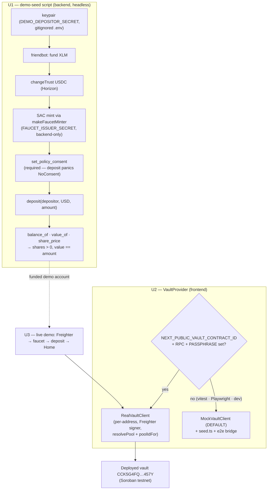
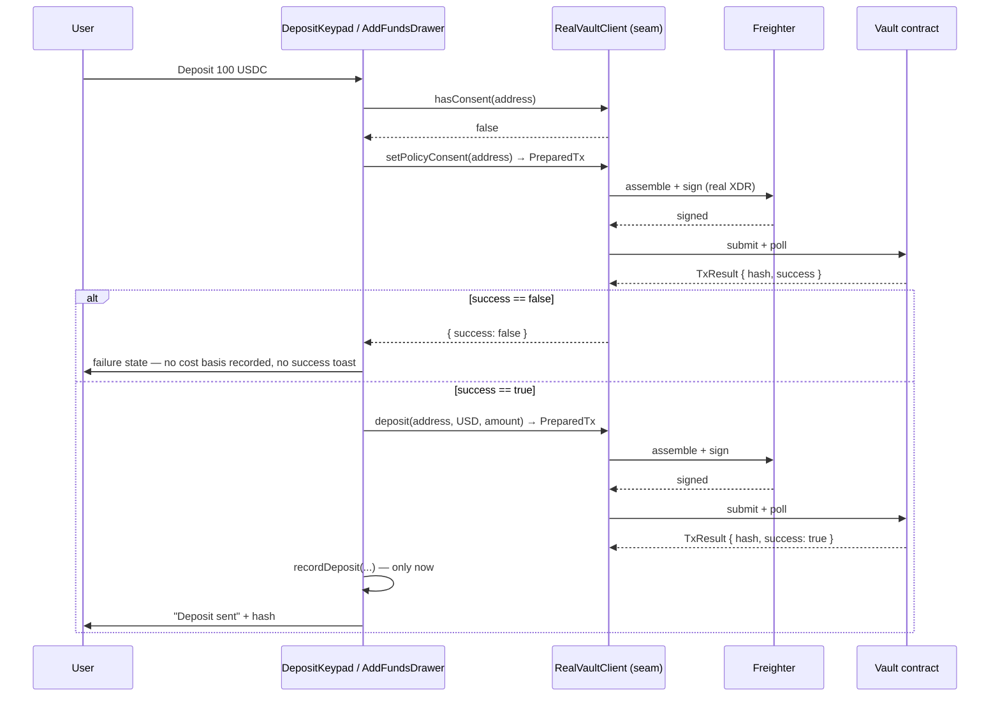

# feat: Live testnet demo — connect wallet · faucet mint · real on-chain deposit (RealVaultClient wired to the frontend)

## Summary

Today a judge can click through SoroSense end-to-end and never touch Stellar. `frontend/providers/VaultProvider.tsx`
hardcodes `MockVaultClient`, so every deposit, withdrawal and consent signature lands in an in-memory
map that dies on reload. The contract is deployed (`CCK5G4FQ53Y7TIQY6CZLOSLCF5DKL44XV2LNFKCMHTSCWNWEAI3D457Y`),
the backend already talks to it (`backend/src/tools/vault.ts`), and `RealVaultClient` already implements
the seam — nothing on a user surface reaches any of it.

Three units close that gap, in strict order:

- **U1 — prove the chain path with a script, not the UI.** A `demo-seed` script drives the whole
  depositor journey headlessly: keypair → friendbot → `changeTrust` → SAC mint → **consent** → deposit →
  read back shares. It is the fastest possible falsifier for "does the deployed contract accept a
  deposit from a fresh account", and it leaves behind a funded demo account the live demo can reuse.
- **U2 — swap the provider, config-gated.** `VaultProvider` selects `RealVaultClient` when the
  `NEXT_PUBLIC` integration env is present and `MockVaultClient` otherwise (**mock stays the default** —
  the offline vitest suite and the 8/8 Playwright baseline never touch the network). The swap makes three
  latent defects load-bearing, so U2 fixes them in the same unit: writes that report success without
  checking `TxResult.success`, a cost-basis ledger that records unconditionally, and a pool
  double-resolve in `real.ts` that would throw on the very first Home render.
- **U3 — run the demo live and capture evidence.** Freighter → faucet → deposit → Home reflects
  on-chain shares, with tx hashes and screenshots for the `pr-e2e-evidence` PR template.

**The honest constraint, stated once and carried everywhere:** yield does **not** accrue on-chain yet.
The contract moves `total_assets` only on deposit/withdraw, so `share_price` reads exactly
`SHARE_PRICE_SCALE` and a vault balance never grows on its own. Deposits, withdrawals and shares are
**real**; accrual is not. Every APY on a user surface is the **advertised catalog rate** for the pool the
agent allocates to (`backend/src/api/venue-meta.ts`) plus the deterministic `simulate()` projection —
never a claim about realized on-chain yield.

---

## Problem Frame

- **The frontend never touches the chain.** `frontend/providers/VaultProvider.tsx:12-16` constructs a
  module-singleton `MockVaultClient`. Every write path in the app signs a `mock-xdr-N` placeholder that
  `frontend/lib/wallet-real.ts:76-84` routes through `signMessage` — the wallet pops, the user signs, and
  nothing reaches Stellar. `frontend/lib/vault/seed.ts` then fakes a funded portfolio on mount.
- **The seam is ready; the consumer is not.** `packages/vault-client/src/real.ts` implements the full
  `VaultClient` against the generated bindings, and `backend/src/tools/vault.ts` already selects it from
  env. The frontend cannot: `VaultProvider`'s context type is `MockVaultClient` (not `VaultClient`), and
  `seed.ts` / `lib/e2e/bridge.ts` call the mock-only `simulateYield` hook on the same instance.
- **No `NEXT_PUBLIC` contract env exists.** `frontend/.env.example` declares the API, Horizon and issuer
  vars but no contract id, RPC URL, or network passphrase — the passphrase is hardcoded to
  `Networks.TESTNET` in `frontend/lib/wallet-real.ts`.
- **Success is assumed, not checked.** Seven of the eight seam-write call sites discard the `TxResult`
  (`DepositKeypad.tsx:74,93`, `AddFundsDrawer.tsx:83,102`, `WithdrawKeypad.tsx:59`,
  `WithdrawDrawer.tsx:83`, `ExitApprovalBody.tsx:35`). Only `hooks/useAutoCompound.ts:96-105` checks it.
  `RealVaultClient` reports a submitted-but-rejected transaction as `success: false` **without throwing**
  (`real.ts:196`), so on the real client the UI would show "Deposit sent" for a transaction the chain
  refused. `MockVaultClient` hardcodes `success: true` (`mock.ts:71`), which is exactly why no test
  catches this today.
- **The cost-basis ledger records unconditionally.** `recordDeposit` / `recordWithdraw`
  (`frontend/lib/vault/contributions.ts`) run on the line after `await signAndSubmit(...)`, with no
  success check — and the ledger is an in-memory `Map` that resets on reload. On the real client, `value`
  persists on-chain while contributions reset to zero, so Earn's `earned = value − contributions`
  (`hooks/useEarnings.ts:69`) would render the user's entire principal as "earned". That is a lie about
  money, and it is the single most dangerous surface in this swap.
- **A pool address round-trips through a slug registry.** `useBuckets.ts` reads
  `activePool(currency)` → `poolStatus(pool)`. On the real client `activePool` returns the pool's raw
  `C…` **address** (`real.ts:301-304`), while `poolStatus` pushes it back through `resolvePool`
  (`real.ts:286-289`), whose registry is keyed by **slug** (`blend-usdc`). It throws `unknown pool: C…`.
  Home's bucket loop catches it and renders an error state — the demo dies on the first screen.
- **The contract requires consent before a deposit.** `smart-contract/contracts/vault/src/lib.rs:87-89`
  panics with `NoConsent` unless `set_policy_consent` was signed first. Any headless deposit path that
  skips it fails on-chain. (The UI's deposit flow already signs consent first.)

---

## Requirements

- **R1** — A scripted, idempotent path takes a **fresh** testnet account from nothing to a confirmed
  on-chain vault deposit: fund (friendbot) → trustline → mint stablecoin → sign the safety mandate →
  deposit → read back `balance_of` / `value_of` / `share_price`. Re-running it must not re-fund,
  re-trustline, or duplicate work.
- **R2** — The script's proof is on-chain and inspectable: it prints the depositor public key, the
  transaction hashes, the minted shares, and the read-back value. Shares must be > 0 and value must equal
  the deposited amount (share price is exactly the scale — see the constraint above).
- **R3** — `VaultProvider` selects `RealVaultClient` when the frontend integration env is fully present
  (`NEXT_PUBLIC_VAULT_CONTRACT_ID` + `NEXT_PUBLIC_STELLAR_RPC_URL` + `NEXT_PUBLIC_STELLAR_NETWORK_PASSPHRASE`),
  and `MockVaultClient` otherwise. **Mock is the default.** With the env unset, the vitest suite and the
  Playwright baseline behave exactly as they do today and issue zero network requests.
- **R4** — With the env set, deposit / withdraw / consent / auto-compound / approve-exit are signed in
  Freighter as **real transaction XDR** and submitted to the deployed contract; Home's shares, value and
  frozen state are read from that contract.
- **R5** — No write path reports success the chain did not confirm. A `TxResult` with `success: false`
  surfaces a failure state, records **no** cost basis, and fires no success toast — on every write
  surface, not just auto-compound.
- **R6** — No surface fabricates earnings. With the real client, "total earned" is never derived from the
  in-memory contributions ledger (which does not survive a reload). APY displayed anywhere is the
  advertised catalog rate; the projection is `simulate()` math, labelled as a projection.
- **R7** — A pool identifier survives a round trip through the seam: an address returned by `activePool`
  can be passed straight back into `poolStatus` without a resolver error.
- **R8 (invariants, every unit)** — `DEMO_DEPOSITOR_SECRET`, `FAUCET_ISSUER_SECRET` and `KEEPER_SECRET`
  are backend-only: never in a response body, never in a `NEXT_PUBLIC_*` var, never committed (`.env` is
  gitignored). No `risk` / `label` / `score` / `tier` field or copy on any user surface. Per-currency
  buckets are never converted (USD blending stays display-only). Wallet code stays client-only
  (`"use client"` + `useEffect`, never module scope — KTD7). Read `node_modules/next/dist/docs/` before
  writing Next-specific code (Next 16 breaking changes).

---

## Assumptions

Bets taken without a synchronous product owner; each is cheap to reverse.

- **A1 — The deployed vault is reused as-is.** `VAULT_CONTRACT_ID=CCK5G4FQ53Y7TIQY6CZLOSLCF5DKL44XV2LNFKCMHTSCWNWEAI3D457Y`,
  already wired with the USDC/EURC SACs and a mock pool (STE-46 proved a 1000-USDC mint + 100-USDC deposit
  against it). No redeploy, no migration, no contract change in this plan.
- **A2 — The demo mints through the existing faucet minter**, not a new issuer-payment path.
  `backend/src/http/faucet-minter.ts` (`makeFaucetMinter`) already does the SAC `mint` as issuer/admin and
  already returns `no-trustline` for the missing-trustline case. The seed script reuses it, so the script
  and the UI's "Get test funds" button exercise the **same** code path — one thing to keep working.
- **A3 — The demo funds USD (and optionally EUR) only.** The faucet mints USD/EUR only and `demoPoolFor`
  throws for MXN. MXN stays in the `Currency` type; nothing in this plan funds it.
- **A4 — Earnings and Activity stay on their current sources.** Wiring `GET /earnings` and `GET /activity`
  (the backend derives both from chain events and is the correct long-term source of cost basis) is a
  separate unit. This plan only ensures no surface *lies* in real mode (R6); it does not build the real
  earnings read.
- **A5 — The keeper is driven manually.** No autonomous allocation loop runs during the demo; if a bucket
  needs an active pool, an operator runs the existing keeper CLI (`backend/src/keeper/cli.ts`). Home
  handles `activePool === null` (no pool yet) without erroring — U2 verifies that explicitly.

---

## Key Technical Decisions

### KTD1 — Script first, UI second

U1 is a headless script, not a browser flow, because it isolates the variable that matters: does the
deployed contract accept a deposit from a fresh account, in the exact sequence a user will follow? A
failure in the browser confounds four suspects at once (wallet, bundling, env, contract). The script
answers the contract question in one run, and hands U3 a pre-funded demo account so the live walkthrough
starts from a known-good state. It also documents the on-chain prerequisites (trustline, consent) that no
amount of frontend code can skip.

### KTD2 — `isIntegrationEnv` mirrors the backend, and mock stays the default

The frontend gets `frontend/lib/vault/client.ts` with the same shape as `backend/src/tools/vault.ts`:
an `isIntegrationEnv()` predicate over the `NEXT_PUBLIC_*` vars and a `createVaultClient()` factory.
Unset ⇒ `MockVaultClient` ⇒ today's behavior with zero network. This is not a nicety: it is what keeps
the offline vitest suite and the 8/8 Playwright baseline green (Playwright sets `NEXT_PUBLIC_E2E=1` and
no contract env, so the real branch is statically dead there), and it means a dead RPC endpoint during
judging degrades the demo to the mock rather than breaking it.

The frontend's env vars carry **only public values** — a contract id, an RPC URL, a network passphrase,
and pool contract addresses. No secret is ever `NEXT_PUBLIC_*` (R8).

### KTD3 — The real client is rebuilt per connected address; the mock stays a module singleton

`RealVaultClient` seeds the generated bindings client with a `publicKey` (the source account used to
assemble and simulate a write) and a `signTransaction`. Both come from the connected wallet, so the
client is **address-scoped**: it must be rebuilt when the connected address changes, or writes would
assemble against the wrong source account. `VaultProvider` therefore memoizes the real client on
`[address]`.

The mock keeps its module singleton — the whole test suite and the E2E bridge depend on one shared
in-memory instance across screens. Two lifetimes, one seam: the context type becomes `VaultClient`, and
the mock-only paths (`seed.ts`, `lib/e2e/bridge.ts`, which both call the test-only `simulateYield`) run
**only** when the resolved client is a `MockVaultClient`, guarded by an `instanceof` narrow. That is the
honest boundary — `simulateYield` is not part of the seam and must not be faked onto the real client.

### KTD4 — `success: false` is a failure, everywhere — and the mock gains a way to prove it

`RealVaultClient.signAndSubmit` resolves with `{ hash, success: false }` when the chain rejects a
submitted transaction (`real.ts:196`); it does not throw. So `await`-ing it is not proof of anything.
Every write path checks `success` and, on false, surfaces the failure, skips the cost-basis write, and
suppresses the success toast — the discipline `hooks/useAutoCompound.ts:96-105` already applies alone.

This is untestable against today's mock, which hardcodes `success: true` and forces
`useAutoCompound.test.tsx:184` to hand-patch a fake `signAndSubmit`. The mock therefore gains a
**test-only** `simulateFailure(enabled)` hook — sibling to `simulateYield`, explicitly outside
`VaultClient` — so each write surface gets a real rejection test instead of a bespoke stub.

### KTD5 — Pool identity resolves in both directions, from one registry

`RealVaultClient` takes `resolvePool(slug) → Address` today. It needs the inverse as well, because
`active_pool` / `pending_exit` return **addresses** while the seam's other pool-taking methods expect
**slugs** — the round trip in `useBuckets` currently throws. Add an optional `poolIdFor(address) → PoolId`
used to decode contract outputs back to seam slugs (absent ⇒ pass through, today's behavior). Both
directions are built from the **same** map (`backend/src/tools/vault.ts` for the backend; the
`NEXT_PUBLIC_BLEND_POOL_*` vars for the frontend), so a pool cannot resolve one way and not the other.

An address the registry does not know decodes to itself rather than throwing — an unknown pool is a
display concern, not a reason to blank the user's balance.

### KTD6 — In real mode, earned is 0, not `value − contributions`

The contributions ledger is in-memory and resets on reload; on-chain value does not. Deriving earnings
from it against the real client shows a user's entire principal as profit. And there is nothing to
derive: `share_price` is pinned to the scale until mark-to-market NAV ships, so native yield is
**exactly zero** by construction. So in real mode, `useEarnings` reports earned = 0 and the surface says
what is true — the balance is real, the yield has not accrued yet. The rate on screen stays the
advertised catalog APY, and the growth curve stays a labelled `simulate()` projection. When
`GET /earnings` is wired (deferred), it becomes the real source, because the backend reconstructs cost
basis from chain events rather than from browser memory.

---

## High-Level Technical Design

The demo path and the env gate. The gate is the only branch, and it is off by default.

The write path once the provider is real — note that `success: false` never reaches a success screen:

---

## Implementation Units

| Batch | Units | Rationale |
|---|---|---|
| 1 | U1 ∥ U2 | Disjoint file sets (backend script + seam tweaks vs. frontend provider). U2's `real.ts`/`mock.ts` edits are additive and do not collide with U1's script. |
| 2 | U3 | Depends on both: it needs a funded demo account (U1) and a real-client frontend (U2). |

### U1. Demo seed script — the on-chain proof

**Goal** — One idempotent command takes a fresh testnet account from zero to a confirmed vault deposit and
prints the evidence. Proves the deployed contract accepts the depositor journey, and leaves a funded demo
account behind for U3.

**Requirements** — R1, R2, R8. **Dependencies** — none.

**Files**
- `backend/src/scripts/demo-seed.ts` (new — the script; a thin `main` over pure step helpers)
- `backend/src/scripts/__tests__/demo-seed.test.ts` (new — offline unit tests over the pure helpers)
- `backend/src/tools/keeper-signer.ts` (generalize: one `makeSecretSigner(secret, passphrase, role)`;
  `makeKeeperSigner` becomes a thin wrapper over it — the XDR-signing logic is not duplicated)
- `backend/src/tools/vault.ts` (export the pool registry builder so the script and the keeper share one
  source of pool identity; add a depositor-signed client factory alongside the keeper-signed singleton)
- `backend/.env.example` (new — documents every var by name, **values elided**: `VAULT_CONTRACT_ID`,
  `STELLAR_RPC_URL`, `STELLAR_HORIZON_URL`, `STELLAR_NETWORK_PASSPHRASE`, `KEEPER_SECRET`,
  `FAUCET_ISSUER_SECRET`, `USDC_SAC`, `EURC_SAC`, `BLEND_POOL_USD`, `BLEND_POOL_EUR`,
  `DEMO_DEPOSITOR_SECRET`)
- `backend/package.json` (a `demo:seed` script entry so the command is discoverable, run under
  `tsx --env-file=.env`)

**Approach**

The script is a sequence of idempotent steps, each of which checks the chain before acting:

1. **Depositor key.** Read `DEMO_DEPOSITOR_SECRET` from env. If absent, generate a keypair, **append** it
   to `backend/.env` (gitignored — never committed, never logged as a secret), and print only the public
   `G…`. Every later run reuses it — that is what makes the script idempotent rather than a wallet
   factory.
2. **Fund.** If Horizon returns 404 for the account, call friendbot
   (`https://friendbot.stellar.org?addr=G…`) and wait for the account to exist. Already funded ⇒ skip.
3. **Trustline.** Read the account's balances; if the USDC trustline
   (code `USDC`, issuer `GDOWW3KR…UL3T`) is absent, submit a `changeTrust` signed by the demo key via
   Horizon. Present ⇒ skip. (This is the same prerequisite the UI's faucet 409 path exists for.)
4. **Mint.** Call `makeFaucetMinter({ issuerSecret: FAUCET_ISSUER_SECRET, … }).mint(USDC_SAC, G, amount)`
   — the *existing* minter (A2), so the script exercises the same SAC-mint path as `POST /faucet`. Skip
   when the SAC balance already covers the deposit amount.
5. **Consent.** `hasConsent(G)`; if false, `setPolicyConsent(G)` signed by the demo key.
   **This step is mandatory** — the contract panics with `NoConsent` otherwise
   (`smart-contract/contracts/vault/src/lib.rs:87-89`). Do not treat it as optional ceremony.
6. **Deposit.** `deposit(G, 'USD', amount)` through `RealVaultClient` — the seam's two-phase
   `PreparedTx.signAndSubmit(depositorSigner)`, which assembles (simulate), signs and submits, then polls.
   Assert `TxResult.success` and stop loudly if false.
7. **Read back.** `balanceOf`, `assetValueOf`, `sharePrice`. Assert `shares > 0` and
   `value == depositedAmount` (share price is exactly `SHARE_PRICE_SCALE` — an assertion that value has
   *grown* would be false by construction and must not be written). Print the tx hashes, the public key,
   the shares, and a testnet explorer link for each hash.

Amounts are 7-decimal base units (`UNIT = 1e7`); the deposit amount is a CLI argument with a sane default
(e.g. 100 USDC). The `RealVaultClient` is constructed with the depositor signer (so the bindings client's
source account is the demo account) and the pool registry from env.

**Patterns to follow** — `backend/src/http/faucet-minter.ts` (simulate → assemble → sign → submit →
poll, and the `no-trustline` classification); `backend/src/tools/keeper-signer.ts` (secret → seam
`Signer`); `backend/src/tools/vault.ts` (`isIntegrationEnv`, `demoPoolFor`, the env-built registry);
`backend/src/keeper/cli.ts` (thin CLI over a module core, `tsx --env-file=.env`).

**Test scenarios**

The network run *is* the proof (see Verification); the offline tests cover the decision logic that would
otherwise only be exercised by burning testnet state:

- The step planner is idempotent: given an account that is funded, trustlined, holds enough USDC, and has
  consent, it plans **only** the deposit — no friendbot, no `changeTrust`, no mint, no consent write.
- Given a brand-new key, it plans all six steps in order, with consent strictly before deposit (a plan
  that deposits before consent is the bug the contract punishes — assert the ordering explicitly).
- A missing `FAUCET_ISSUER_SECRET` / `VAULT_CONTRACT_ID` fails fast with a named, actionable error before
  any network call — never a half-run.
- Refuses to run against a non-testnet passphrase (a mainnet passphrase is a hard stop).
- Amount parsing: `100` → `1_000_000_000n` base units; a zero or negative amount is rejected before
  signing (the contract would panic with `NonPositiveAmount`).
- Secret hygiene: the printed/logged output contains the public `G…` and never the `S…` secret — assert
  on the captured log lines.

**Verification** — Run it live against testnet:
`pnpm -C backend demo:seed` (i.e. `tsx --env-file=.env src/scripts/demo-seed.ts`). Complete means: the
script prints the demo public key, a `changeTrust` hash (first run), a mint hash, a consent hash, a
deposit hash, and a read-back showing `shares > 0` and `value == amount`; each hash resolves on a testnet
explorer. Then run it a **second** time and confirm it skips straight to (or past) the deposit — no
duplicate funding. `pnpm -r typecheck` and `pnpm -C backend test` green.

---

### U2. `RealVaultClient` in `VaultProvider` — config-gated, with the three defects the swap activates

**Goal** — With the integration env set, every frontend write is a real Freighter-signed transaction
against the deployed contract and every read comes from it. With the env unset, nothing changes: mock,
offline, green.

**Requirements** — R3, R4, R5, R6, R7, R8. **Dependencies** — none (parallel-safe with U1).

**Files**

*Seam (`packages/vault-client/`)*
- `src/real.ts` — add the optional reverse pool decoder (`poolIdFor`) and use it in `activePool` /
  `pendingExit` so an address returned by the contract can be fed straight back into `poolStatus` (KTD5, R7)
- `src/real.test.ts` — offline, with the injected fake bindings client already used there
- `src/mock.ts` — add the **test-only** `simulateFailure(enabled)` hook (KTD4); document it beside
  `simulateYield` as explicitly outside `VaultClient`
- `src/mock.test.ts`

*Frontend*
- `frontend/lib/vault/client.ts` (new — `isIntegrationEnv()` + `createVaultClient({ address, signTransaction })`,
  mirroring `backend/src/tools/vault.ts`; builds `resolvePool` / `poolIdFor` from `NEXT_PUBLIC_BLEND_POOL_*`)
- `frontend/lib/vault/__tests__/client.test.ts` (new)
- `frontend/providers/VaultProvider.tsx` — context type becomes `VaultClient`; config-select; real client
  memoized per connected address; `seedVault` and `installE2EBridge` run only on a `MockVaultClient`
- `frontend/providers/__tests__/VaultProvider.test.tsx`
- `frontend/lib/vault/seed.ts`, `frontend/lib/e2e/bridge.ts` — keep their `MockVaultClient` parameter
  types (they use the mock-only `simulateYield`); only their call sites become guarded
- `frontend/components/deposit/DepositKeypad.tsx`, `frontend/components/desktop/AddFundsDrawer.tsx`,
  `frontend/components/withdraw/WithdrawKeypad.tsx`, `frontend/components/desktop/WithdrawDrawer.tsx`,
  `frontend/components/proposal/ExitApprovalBody.tsx` — guard `TxResult.success` (R5)
- `frontend/hooks/useTransferFlow.ts` — a rejected write must land in the flow's failure phase, not
  "success"
- `frontend/hooks/useEarnings.ts` — earned is 0 in real mode; never `value − contributions` (KTD6, R6)
- Tests for each guarded surface: `components/deposit/__tests__/DepositKeypad.test.tsx`,
  `components/desktop/__tests__/AddFundsDrawer.test.tsx`,
  `components/withdraw/__tests__/WithdrawKeypad.test.tsx`,
  `components/desktop/__tests__/WithdrawDrawer.test.tsx`,
  `components/proposal/__tests__/ExitApproval.test.tsx`, `hooks/__tests__/useEarnings.test.tsx`
- `frontend/.env.example` — add `NEXT_PUBLIC_VAULT_CONTRACT_ID`, `NEXT_PUBLIC_STELLAR_RPC_URL`,
  `NEXT_PUBLIC_STELLAR_NETWORK_PASSPHRASE`, `NEXT_PUBLIC_BLEND_POOL_USD`, `NEXT_PUBLIC_BLEND_POOL_EUR`
  (all public values; documented as "unset ⇒ mock, the default")
- `frontend/README.md` — a short "running against testnet" section (build bindings, set the env, connect
  Freighter on **Testnet**)

**Execution note** — Land as three commits inside the one PR, in this order: (a) seam fixes
(`real.ts` reverse-resolve + `mock.ts` failure hook, with their tests — provably green on their own),
(b) the write-path success guards + earnings guard (offline, all-mock, no provider change yet),
(c) the provider swap + env. Each is independently revertable, and (b) is the one a bisect should be able
to isolate.

**Approach**

- **Config select (KTD2).** `createVaultClient()` returns `MockVaultClient` unless the three
  `NEXT_PUBLIC` contract vars are all present. Read them the way `frontend/lib/api/config.ts` and
  `frontend/lib/wallet.ts` already read `NEXT_PUBLIC_*` — Next inlines them at build time, so an unset var
  makes the real branch statically dead in vitest and Playwright.
- **Per-address real client (KTD3).** `RealVaultClient` seeds its bindings client with the connected
  address as the source account and the wallet's `signTransaction`; `VaultProvider` memoizes it on
  `[address]` and passes the seam type (`VaultClient`) down. `frontend/lib/vault/signer.ts`
  (`depositorSigner`) is unchanged — `wallet-real.ts` already routes real XDR through `signTransaction`
  and only `mock-xdr-*` through `signMessage`, so the real path needs no wallet change.
- **Mock-only paths.** `seedVault` and `installE2EBridge` call `simulateYield`, which exists only on the
  mock. Guard both call sites with an `instanceof MockVaultClient` narrow. In real mode there is no seed —
  Home starts from the user's actual on-chain state, which is the point.
- **Success guards (R5, KTD4).** Every write becomes: submit → `if (!success)` surface the failure, record
  nothing, no success toast. The consent-then-deposit chain in `DepositKeypad` / `AddFundsDrawer` must
  **stop** if the consent write fails rather than depositing into a `NoConsent` panic. Cost-basis writes
  (`recordDeposit` / `recordWithdraw`) move strictly behind the success check.
- **Earnings (R6, KTD6).** In real mode `useEarnings` reports earned = 0 (native yield is exactly zero
  until NAV accrual ships) rather than `value − contributions`, which would render principal as profit
  after a reload. Mock mode keeps today's derivation (the mock *can* accrue, via `simulateYield`).
- **Null active pool (A5).** With no keeper allocation yet, `activePool` returns `null`; `useBuckets`
  already treats that as `frozen: false`. Cover it with a test against the real-shaped client — it is the
  state the demo actually starts in.

**Patterns to follow** — `backend/src/tools/vault.ts` (`isIntegrationEnv` + factory + env-built
registry — mirror its shape, do not invent a second one); `frontend/hooks/useAutoCompound.ts:96-105` (the
one correct `success` guard in the codebase — the other five copy it);
`frontend/lib/api/config.ts` (env gating); `frontend/lib/vault/signer.ts`.

**Test scenarios** (vitest, against a real `MockVaultClient` — no mocking of our own seam)

*Config gate (R3)*
- With no contract env, `createVaultClient()` returns a `MockVaultClient` and constructs **no** RPC client
  (assert zero network calls — this is the offline guarantee the whole suite rests on).
- With all three vars set, it returns a `RealVaultClient` carrying the injected address and signer.
- With a *partial* env (contract id but no RPC URL), it falls back to the mock rather than half-building a
  real client that fails at submit time.

*Seam (R7, KTD5)*
- `activePool` returns a pool address; passing that value straight into `poolStatus` resolves without
  throwing (the exact `useBuckets` round trip — today it throws `unknown pool`).
- With a registry, a seam slug still encodes to its configured address for `allocate` / `freeze`.
- An address absent from the registry decodes to itself and does not throw.
- `pendingExit`'s `fromPool` / `toPool` decode through the same reverse map.

*Write guards (R5)*
- Deposit with `simulateFailure` on: the UI shows a failure state, `recordDeposit` did **not** run
  (assert the contributions ledger is unchanged), and no success toast fired.
- Same for withdraw (`recordWithdraw` unchanged), approve-exit (no "Exit approved" toast), and both
  desktop drawers.
- Consent fails ⇒ the deposit that follows it is **not** attempted (assert the seam's `deposit` was never
  called — this is the `NoConsent` panic the chain would otherwise throw).
- The happy path is unchanged: success ⇒ cost basis recorded exactly once, success toast fires once.
- A double-press cannot fire two writes (the in-flight guard holds).

*Earnings (R6)*
- Real mode: a bucket with an on-chain value and an empty contributions ledger reports earned = 0 —
  not the full balance. This is the regression that would put a fabricated profit on screen.
- Mock mode: today's `value − contributions` derivation still holds (guarded by the existing tests).

*Provider*
- Env unset: the provider seeds the mock and installs the E2E bridge exactly as today.
- Env set: it does **not** seed and does **not** install the bridge (no `simulateYield` on a real client),
  and no fixture portfolio appears.
- Changing the connected address rebuilds the real client (the source account follows the wallet).

**Verification** — `pnpm -r typecheck` green (strict, `noUncheckedIndexedAccess`).
`pnpm -C frontend test` green with the contract env **unset** — the current baseline (71 files / 271
tests; re-measure at the start of the unit and do not regress it). `pnpm -C frontend e2e` 8/8 (mobile +
desktop). `pnpm -C frontend lint` clean. `pnpm -C packages/vault-client test` green.
Prerequisite for any frontend run: `pnpm -C packages/vault-client build:bindings` — the seam barrel
re-exports `real.ts`, which imports the generated bindings' **build output** (`bindings/dist`, gitignored),
so an unbuilt `dist` fails the frontend build/test before a single test runs.
Then, with the env **set**: connect Freighter on Testnet, deposit, and see the transaction in the wallet
popup as a real contract invocation (not a signed message) — that is the smoke test that the swap took.

---

### U3. Live demo run — evidence for the PR

**Goal** — Walk the judge's path against testnet and capture the proof: connect → mint → deposit → Home
reflects real on-chain shares.

**Requirements** — R2, R4, R6, R8. **Dependencies** — U1 (funded demo account, proven contract path),
U2 (real client in the frontend).

**Files**
- `docs/tests/live-demo/` (new — evidence: screenshots + a short `README.md` listing each transaction
  hash with its explorer link and what step it proves)
- `frontend/README.md` / `backend/README.md` (only if the run surfaces a missing operator step)

**Approach**

Manual, operator-run — **not a CI gate** (it needs a browser wallet, a funded account, and live testnet).

1. Build the bindings, boot the backend against the real env
   (`tsx --env-file=.env src/http/server.ts` — faucet mounted, keeper real), and the frontend with the
   `NEXT_PUBLIC` contract + API + Horizon + issuer vars set.
2. Connect Freighter on **Testnet** with a **fresh** account (not the seed script's — the empty-wallet
   path is the one a judge takes).
3. Press "Get test funds": the mint 409s with `needsChangeTrust`, the UI has the user sign a
   `changeTrust`, and the mint retries and lands. The balance appears.
4. Deposit. Two wallet popups on the first deposit (consent, then deposit) — expected, and worth calling
   out in the demo narration: the mandate is signed once, ever.
5. Home reflects on-chain state: shares and value from the contract, APY as the advertised catalog rate,
   earned = 0 (nothing has accrued — say so plainly rather than hiding it).
6. Optional: run the keeper CLI to allocate the bucket to its demo pool and re-check Home.

**Test scenarios** — none automated (`Test expectation: none` — this unit is manual verification of code
already covered by U1's live run and U2's suites). What must be *captured*:
- The `changeTrust`, mint, consent and deposit transaction hashes, each resolving on a testnet explorer.
- A screenshot of Home showing the deposited bucket, with the value matching the deposited amount.
- A screenshot of the Freighter popup showing a **contract invocation** (proof the app is not signing a
  mock message).
- The negative case seen at least once: a rejected signature leaves the UI in a failure state and the
  bucket unchanged (R5 in the wild).

**Verification** — Complete when `docs/tests/live-demo/` contains the hashes and screenshots above and the
PR (`pr-e2e-evidence` template) carries them. If any step fails, the failure — not a workaround — is the
finding to report.

---

## Verification Contract

Gates for U1 and U2 before their PRs open:

1. `pnpm -r typecheck` — hard gate. Strict `tsc` with `noUncheckedIndexedAccess`; passing tests do **not**
   imply a passing typecheck.
2. `pnpm -r test` — the whole workspace, **offline**. The frontend suite runs with the contract env unset
   (mock default) and must not regress its baseline (71 files / 271 tests — re-measure at unit start).
3. `pnpm -C frontend e2e` — 8/8 (mobile-chromium + desktop-chromium). Playwright sets `NEXT_PUBLIC_E2E=1`
   and no contract env, so the real-client branch is statically dead there.
4. `pnpm -C frontend lint` clean.
5. Prerequisite for every frontend run: `pnpm -C packages/vault-client build:bindings` (the seam barrel
   pulls the generated bindings' build output, which is gitignored).
6. U1 additionally: a **live** run against testnet, with hashes and a `shares > 0` read-back, and a second
   run proving idempotence.

## Definition of Done

- A single command takes a fresh testnet account to a confirmed on-chain vault deposit and prints the tx
  hashes and the resulting shares; re-running it is a no-op where it should be.
- With the integration env set, the frontend's deposits, withdrawals, consent and auto-compound are real
  Freighter-signed contract invocations against `CCK5G4FQ…457Y`, and Home reads its shares and value from
  that contract.
- With the env unset, the app, the vitest suite and the 8/8 Playwright baseline behave exactly as they do
  today, with zero network access.
- No write path reports a success the chain did not confirm, and no surface shows earnings that did not
  happen.
- The live walkthrough is captured as evidence (hashes + screenshots) on the PR.
- No secret is in a `NEXT_PUBLIC_*` var, a response body, or a commit.

---

## Scope Boundaries

**In scope** — the three units above.

**Not in scope (non-goals)**
- Any risk / label / score / tier surface. Behavior descriptions only.
- A chatbot or any LLM-adjacent user surface. The projection stays deterministic `simulate()` math.
- Redeploying or changing the vault contract (A1). No mark-to-market NAV, no on-chain yield accrual.
- Converting funds between buckets. USD blending stays display-only.
- Funding an MXN bucket (A3).
- An autonomous keeper loop. Allocation stays a manual operator action (A5).

**Deferred to Follow-Up Work**
- **Wire `GET /earnings` and `GET /activity` through the HTTP client.** The backend already reconstructs
  cost basis and the activity feed from chain events (`backend/src/earnings/cost-basis.ts`,
  `backend/src/chain/event-reader.ts`) — that is the correct source for "total earned" and the Activity
  tabs, replacing the in-memory contributions ledger and the `getActivity()` fixture. U2 only ensures the
  current surfaces do not lie (KTD6); it does not build the read.
- **Mark-to-market NAV in the contract**, after which `share_price` moves and earnings become real. Until
  then, no surface may claim on-chain yield.
- **Persisting the wallet id** in `wallet-real.ts` (a known limitation documented there: after a reload,
  signing always targets Freighter even if the user connected xBull/Lobstr).
- **A backend rate route** so the unfunded-bucket APY has a backend source and `BUCKET_META` can be
  deleted (carried from the previous plan's KTD3).

---

## Open Questions

- **Q1 — Does the demo fund EUR as well as USD?** The plan proves USD end-to-end; EUR is the same path
  with a second trustline and SAC. Not blocking — the script takes the currency as an argument, so adding
  EUR is a flag, not a code change.
- **Q2 — Does the demo run with the bucket allocated to a pool, or idle in the vault?** Allocation is a
  keeper action (A5) and shows off the agent, but adds a manual step and a failure surface mid-demo. U3
  treats it as optional and verifies Home is correct in **both** states.
- **Q3 — Is the demo account's secret ever needed outside the script?** The plan says no: U3 connects a
  *fresh* Freighter wallet, because the empty-wallet path is the one a judge takes. The seeded account is
  the fallback if the wallet path fails on stage.

---

## Risks & Dependencies

- **Browser bundling of the generated bindings** (highest, and the first thing to smoke-test in U2). The
  seam barrel already re-exports `real.ts`, so the frontend module graph already reaches
  `bindings/dist` + `@stellar/stellar-sdk` + the `buffer` polyfill — but the client is never
  *constructed* there today. Constructing it in the browser is where a Node-shaped dependency (`Buffer`,
  `global`) would surface under Next 16 / Turbopack. Mitigate by building the real client in a throwaway
  page first, before wiring five write paths to it; a `next.config.ts` polyfill or a dynamic import is the
  fallback.
- **Unbuilt `bindings/dist`** — gitignored, and not present in a fresh worktree. Every frontend and
  backend run needs `pnpm -C packages/vault-client build:bindings` first, or the failure looks like a
  module-resolution bug rather than a missing build step. There is no CI workflow in this repo — the gates
  are local, so this bites a human, not a runner.
- **Freighter on the wrong network** — a wallet on Mainnet will sign a transaction the testnet RPC
  rejects. Surface the network mismatch in the UI rather than letting the submit fail obscurely.
- **`NoConsent` / `BelowMinFirstDeposit` panics** — the contract's guards
  (`smart-contract/contracts/vault/src/lib.rs:84-97`) become user-visible errors the moment the client is
  real. Map them to plain language; never show a raw panic code.
- **Faucet rate limit** (60s per address) — a judge pressing twice sees the 429. Toast it; do not retry.
- **`.env` does not travel between worktrees** — it is gitignored, so this worktree has none. Both U1 and
  U3 need `backend/.env` and `frontend/.env.local` populated from the values already held by the operator
  (see `backend/.env.example`, added in U1).
- **Depends on** — the deployed vault (A1), the SACs and faucet issuer already configured (STE-46), the
  frontend HTTP client + faucet button (PR #36, on this branch's base), and the seam's `RealVaultClient`
  (STE-21 Fase C/D, on `main`).

---

## Sources & Research

- `packages/vault-client/src/interface.ts` — the seam: reads return `Promise<T>`, writes return a
  two-phase `PreparedTx`; `SHARE_PRICE_SCALE`; `TxResult { hash, success }`.
- `packages/vault-client/src/real.ts` — `signAndSubmit` derives `success` from the finalized status and
  **does not throw** on rejection (`:196`); `activePool` returns the raw contract address (`:301-304`)
  while `poolStatus` re-resolves through `resolvePool` (`:286-289`) — the double-resolve fixed in U2.
- `packages/vault-client/src/mock.ts` — `prepare()` hardcodes `success: true` (`:71`), which is why no
  test catches an unchecked write today; `simulateYield` is documented as a test-only hook outside the
  seam (`:203-211`).
- `smart-contract/contracts/vault/src/lib.rs:84-113` — `deposit` requires depositor auth, a non-paused
  vault, **prior consent** (`NoConsent`), a positive amount, and a first deposit above
  `min_first_deposit`; it moves `total_assets` only here and in `withdraw` — the origin of the
  no-on-chain-yield constraint.
- `backend/src/tools/vault.ts` — `isIntegrationEnv`, `demoPoolFor`, the env-built pool registry, and the
  mock-default factory the frontend's `lib/vault/client.ts` mirrors.
- `backend/src/http/faucet-minter.ts` — the SAC mint the seed script reuses: simulate → assemble → sign →
  submit → poll, with `no-trustline` classified rather than thrown.
- `backend/src/tools/keeper-signer.ts` — secret → seam `Signer` (`sign(xdr)` decodes, signs, re-encodes);
  generalized in U1 so the depositor signer is not a copy.
- `frontend/providers/VaultProvider.tsx:8,12-16` — the `MockVaultClient` context type and singleton this
  plan replaces; `frontend/lib/vault/seed.ts:39-40` and `frontend/lib/e2e/bridge.ts:51` — the
  `simulateYield` calls that pin those modules to the mock.
- `frontend/hooks/useAutoCompound.ts:96-105` — the only correct `success` guard in the frontend, and the
  model for the other five.
- `frontend/hooks/useBuckets.ts` — the `activePool` → `poolStatus` round trip that breaks Home on the real
  client; also the KTD that shares/value never cross the HTTP seam.
- `frontend/hooks/useEarnings.ts:69` + `frontend/lib/vault/contributions.ts` — the in-memory cost-basis
  ledger behind the fabricated-earnings risk (KTD6).
- `frontend/lib/wallet-real.ts:76-84` — real XDR takes `signTransaction`, `mock-xdr-*` takes
  `signMessage`; the real path needs no wallet change.
- Stellar grounding (`stellar-dev:dapp`, `stellar-dev:assets`) — Freighter/Wallets-Kit signing,
  simulate → assemble → submit → poll, SAC mint as issuer, `changeTrust` + trustline checks via Horizon,
  friendbot funding on testnet.
