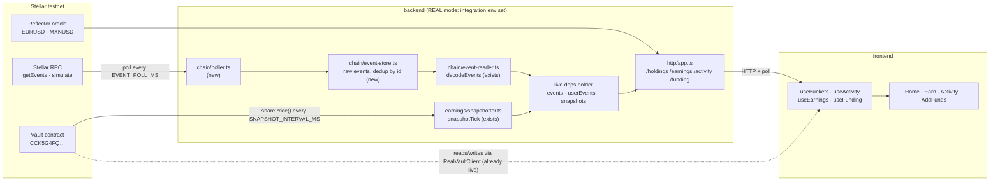

# feat: Real on-chain + realtime — every data path reads the chain, mock survives only as the offline fallback

## Summary

The vault is live on testnet, the frontend signs real deposits with Freighter (`2026-07-14-002`), the
faucet mints real SAC balances — and yet **most of what a judge reads on screen is still a fixture.**
The Activity feed is eight hand-written rows. The Earn chart is a sine wave. The value-over-time chart
on the desktop Overview is literally `Math.sin(i * 0.7)`. The backend's `/activity` route returns `[]`
in *both* modes because `server.ts` hands it an empty `ActivityLog`, and `/earnings` computes
`earned = value − 0` because it is handed an empty event list.

Everything needed to fix this **already exists and is already tested** — it was just never wired:

| Built | Where | State |
|---|---|---|
| On-chain event decoder | `backend/src/chain/event-reader.ts` | ✅ tested, ❌ never called outside its test |
| Share-price snapshotter | `backend/src/earnings/snapshotter.ts` | ✅ tested, ❌ never scheduled |
| Interval scheduler | `backend/src/scheduler/cron.ts` | ✅ tested, ❌ never started |
| Composed reads `/holdings` `/earnings` `/activity` `/funding` | `backend/src/http/app.ts` | ✅ live, ❌ two of them fed empty inputs, two unconsumed by the frontend |

This plan closes the gap in one direction only: **in REAL mode (integration env set), every user-facing
number comes from chain or backend. In OFFLINE mode (env unset), the mock fixtures still render, and the
offline vitest suite plus the 8/8 Playwright baseline stay green with zero network.** That symmetry is
the whole point — it is what makes the eventual mainnet cutover *a change of environment variables,
not a change of code*.

**The honest constraint, carried into every unit:** yield does **not** accrue on-chain yet.
`total_assets` moves only on deposit/withdraw, so `share_price` reads exactly `SHARE_PRICE_SCALE`
(`smart-contract/contracts/vault/src/lib.rs`, and CLAUDE.md says so out loud). Therefore in real mode:

- **Earned = 0.** Not "small". Zero. The growth chart and the monthly breakdown are honestly flat/empty.
- **Value-over-time is a step function**, stepping on each real deposit and withdrawal, flat in between.
  That is a *real* chart of *real* money — it just doesn't curve upward, because nothing is curving upward.
- Replacing a fabricated upward wobble with an honest flat line is the **deliverable**, not a regression.
  A chart that grows requires mark-to-market NAV accrual in the contract — scoped here as **U5, optional
  and explicitly not required** (see Scope Boundaries).

---

## Problem Frame

Two independent mock leaks, one on each side of the HTTP seam, meet in the middle.

**Backend leak — the composed reads are starved.** `backend/src/http/server.ts` builds the app with real
dependencies for the vault (`getVaultClient()` → `RealVaultClient` when live) and real FX
(`makeReflectorFx()`), and then hardcodes the history sources to nothing:

```
earnings: { events: [], snapshots: new InMemorySnapshotStore() },   // ← empty in BOTH modes
activity: { log: new ActivityLog(), userEvents: [] },               // ← empty in BOTH modes
```

The consequences are not cosmetic: `getEarnings` computes `earned = value − contributions`, and with no
`Deposit` events the reconstructed contributions are `0n`, so **a user's entire principal is reported as
profit**. `/activity` returns an empty list to anyone who calls it. Both routes are shaped correctly and
both are lying.

**Frontend leak — the real reads are ignored.** `GET /activity` and `GET /funding` exist and no component
calls them. `GET /holdings` *is* called, but `useApy` keeps only the `apy` field and **discards the
`name`, `venue`, `tags` and `valueUsd` the backend already computed** — `useBuckets` re-derives all four
from `BUCKET_META` and a hardcoded `getFxRateToUsd` (`{USD: 1, EUR: 1.08, MXN: 0.055}`), even when the
API is on. So the blended-USD headline on Home is computed from a **stale constant** while a real
Reflector rate sits unread in the response body.

**Missing mechanism — nothing is realtime.** Stellar RPC has **no streaming** (`getEvents` is poll-only;
grounded in the `stellar-dev:data` skill), so "realtime" here means a poll loop. `startScheduler` exists
to run one and is never started. Without it, even a correctly-wired backend would answer with whatever it
read at boot, forever.

---

## Requirements

Traceable to the audit that produced this plan. `MUST` = gates the unit; `SHOULD` = strongly recommended,
may be deferred with a note.

| ID | Requirement | Priority |
|---|---|---|
| R1 | In REAL mode, `/earnings` and `/activity` are sourced from decoded on-chain events, not injected fixtures | MUST |
| R2 | The backend refreshes chain state on an interval (poll loop), so a deposit made now appears without a restart | MUST |
| R3 | The share-price series is populated by a scheduled `snapshotTick`, so the chart and monthly breakdown have a real time axis | MUST |
| R4 | In OFFLINE mode (integration env unset) the backend issues **zero network calls** and every existing test stays green | MUST |
| R5 | The frontend consumes `name` / `venue` / `tags` / `valueUsd` / `apy` from `GET /holdings` in real mode — no `BUCKET_META`, no hardcoded FX | MUST |
| R6 | The Activity feed (Home + `/account/activity`) is sourced from `GET /activity` in real mode | MUST |
| R7 | The Add-funds list is sourced from `GET /funding` in real mode | MUST |
| R8 | The Earn screen (balance, APY, earned, chart, monthly) is sourced from `GET /earnings` in real mode | MUST |
| R9 | The desktop Overview value-over-time chart plots a **real** value series; the synthetic `organicSeries` wobble is deleted | MUST |
| R10 | Earned and the growth chart report **zero / flat** in real mode rather than fabricating growth | MUST |
| R11 | Mock stays the default: env unset ⇒ fixtures, offline vitest green, Playwright 8/8 green | MUST |
| R12 | Reflector FX symbols (`EURUSD` / `MXNUSD`) are confirmed against the live oracle, and a wrong symbol is fixable by config, not code | SHOULD |
| R13 | The remaining display fixtures (`BUCKET_META`, `POOL_META`) are replaced by a backend rate/pool route in real mode | SHOULD |
| R14 | Mainnet cutover requires no code change — only environment variables | MUST |

**Invariants (violating any of these fails the unit, regardless of R-coverage):** no `risk`/`label`/`score`/`tier`
field on any surface · per-currency buckets are never converted (blended USD is display-only) ·
`KEEPER_SECRET` / `FAUCET_ISSUER_SECRET` stay backend-only · wallet code is client-only (KTD7) ·
read surfaces (`backend/src/api/*`, `backend/src/http/*`) never write on-chain.

---

## High-Level Technical Design

### Where the data comes from, per mode



In OFFLINE mode the entire `be` poll column is **never constructed**: `server.ts` keeps today's empty
history sources and the stub FX, and the frontend's `apiEnabled()` gate short-circuits before `fetch`.
No arrow above crosses a network boundary.

### The refresh loop (why nothing is a WebSocket)

Stellar RPC does not stream. Both loops below are `setInterval` under the existing overlap-guarded
`startScheduler`; the frontend polls the composed reads on its own interval. Three cheap polls, no new
infrastructure.

```mermaid
sequenceDiagram
  participant S as scheduler
  participant P as poller
  participant R as Stellar RPC
  participant H as deps holder
  participant A as /activity /earnings
  participant F as frontend hook

  Note over S,P: boot: one immediate tick so the first request is never empty
  S->>P: tick (every EVENT_POLL_MS)
  P->>R: getEvents(cursor ?? startLedger)
  R-->>P: page(events, cursor, latestLedger)
  P->>P: ingest → dedupe by id → sort by ledger → decodeEvents (seq re-assigned over the whole set)
  P->>H: deps.earnings.events = … ; deps.activity.userEvents = …
  S->>H: snapshotTick → sharePrice(ccy) → snapshots.append
  F->>A: GET (on mount · on vault version bump · every ~15s)
  A->>H: read current holder fields
  A-->>F: fresh composed view
```

**Why the holder works without touching `app.ts`:** `createApp(deps)` captures the *object*, and every
route dereferences `deps.earnings.events` / `deps.activity.userEvents` **at request time**. Reassigning
those fields on the same object is therefore visible to the next request immediately — no interface
change, no re-created app, and every existing `http.integration.test.ts` assertion stays valid.

### Mode matrix — the contract this plan is judged against

| Surface | OFFLINE (env unset) — must stay exactly as today | REAL (env set) — must be chain/backend sourced |
|---|---|---|
| Home bucket rows | seam (`MockVaultClient`) + `BUCKET_META` + `getFxRateToUsd` | `GET /holdings` (name · venue · tags · apy · shares · value · valueUsd · frozen) |
| Activity feed | `getActivity()` fixture (8 rows) | `GET /activity` (agent log + decoded `deposit`/`withdraw`/`consent_set`/`auto_compound_set`) |
| Add-funds list | `STABLECOINS` const | `GET /funding` |
| Earn headline / chart / monthly | seam + `contributions.ts` + `buildEarningsFixture` | `GET /earnings` (cost-basis from chain events + snapshot series) |
| Value-over-time chart | series derived from the mock's own earnings view | series derived from `/earnings` chart points (**step function; honest**) |
| Earned | mock accrues via `simulateYield` → non-zero, honest *for the mock* | **0** — no on-chain accrual (R10) |
| Network calls | **zero** | RPC + Reflector (backend), HTTP (frontend) |

---

## Key Technical Decisions

**KTD1 — The event poller accumulates; it does not re-drain from genesis.**
Stellar RPC retains events for roughly **7 days** (`stellar-dev:data`), so "just re-read everything from
the deploy ledger each tick" is a trap that works today and starts throwing the day the vault turns eight
days old. The poller therefore keeps an accumulating in-process raw-event store (deduped by RPC event
`id`, ordered by ledger) and advances a cursor. `startLedger` is clamped into the retention window on the
first poll. *Consequence, stated honestly:* history older than the retention window and older than the
process's own lifetime cannot be reconstructed after a restart. For the demo the vault is days old and
this never bites; a durable event store is the follow-up (Scope Boundaries).

**KTD2 — Refresh by field-reassignment on the deps object, not by rebuilding the app.**
Routes dereference `deps.earnings.events` per request. Reassigning that field is enough. The alternative
(changing `HttpAppDeps` to getter functions) would touch every existing HTTP test for no behavioral gain.
Chosen: mutate the holder in `server.ts`; `app.ts` is untouched.

**KTD3 — `share_price` history for a `ts` older than the first snapshot resolves to `SHARE_PRICE_SCALE`.**
This is already what `priceAt()` does, and — precisely because the contract does not accrue — it is not an
approximation, it is the **fact**. It is what lets the value chart show a real step at a deposit that
happened before the server booted. The day U5 (NAV accrual) ships, this assumption expires and the
snapshot series becomes load-bearing; it is annotated as such in the code.

**KTD4 — `useBuckets` must NOT source per-user vault state from `/holdings` in mock mode.**
The naive reading of the audit ("stop discarding `/holdings`") is a bug in offline mode: the browser's
`MockVaultClient` and a mock-mode backend are **different in-memory instances**, so a deposit made in the
browser this session does not exist in the backend's mock and Home would render **blank**. The rule is:
*real mode → `/holdings` is the source of truth for the whole row; offline → the seam plus the local
fixtures, exactly as today.* Same two-honest-sources shape `useApy` already uses. In real mode both the
browser and the backend read the same chain, so there is no divergence to reconcile.

**KTD5 — Earned USD needs no FX route.** The audit lists "earned USD needs an FX oracle/route" as a gap.
It is not one: the backend already blends to USD server-side with the real Reflector rate inside
`getEarnings` and `getHoldings`. Once the frontend consumes `valueUsd` / `earnedUsd` from those responses,
`getFxRateToUsd` is dead on the real path and survives only as the offline fallback. No new route.

**KTD6 — Reflector symbols are config, not code.** `makeReflectorFx` already takes an injectable
`symbolOf`. `EURUSD` / `MXNUSD` are flagged "provisional, confirm at wiring" in the source. Wire them to
optional `FX_SYMBOL_EUR` / `FX_SYMBOL_MXN` env vars with today's values as defaults, so a wrong symbol
discovered during a live smoke is a `.env` edit, not a patch release. A failed FX read stays a typed
`Result` error → non-200 → the UI says "unavailable"; it must **never** degrade to a silent `$0` (R12).

**KTD7 — Frontend realtime is a 15s poll, not SSE.** The upstream source (RPC) is poll-only, so an SSE
layer would add a hop and a failure mode without adding freshness. Hooks refetch on mount, on a vault
`version` bump (an actual write), and on a ~15s interval **only when `apiEnabled()`** — offline mode polls
nothing. SSE/WebSocket is a documented follow-up, not a demo requirement.

---

## Implementation Units

Dependency order: **U1 ∥ U1b → U2 → U3 → (U4) → (U5)**. U1 and U1b are file-disjoint and safely parallel.
U2 and U3 are file-disjoint **except** `frontend/lib/api/types.ts` (append-only additions) — parallelizable
with a rebase, serial by default.

### U1. Backend: wire the chain event reader + start the realtime loops

**Goal:** In real mode, `/earnings` and `/activity` are fed by decoded on-chain events and a live
share-price series, refreshed on an interval. In offline mode nothing changes and no socket opens.

**Requirements:** R1, R2, R3, R4, R12, R14
**Dependencies:** none (foundation)

**Files:**
- `backend/src/chain/event-store.ts` *(new)* — accumulating raw-event store: `ingest(page)`, dedupe by event `id`, ledger-ordered `raw()`, cursor state.
- `backend/src/chain/poller.ts` *(new)* — `makeChainPoller({ source, store, onUpdate })`; one `poll()` = fetch from cursor → ingest → re-decode the accumulated set → `onUpdate({ vaultEvents, userEvents })`. Fail-soft: an RPC error is logged and the last good decode is retained; it never throws into the interval.
- `backend/src/chain/event-reader.ts` *(modify)* — extract the pure `decodeEvents(ordered: RawEvent[]): { vaultEvents, userEvents }` (assigning `seq` over the **whole accumulated** set) and have `readVaultEvents` call it. Behavior-preserving; existing tests must pass untouched.
- `backend/src/http/server.ts` *(modify)* — in live mode only: build the deps object, construct `makeRpcEventSource`, run **one immediate poll + one immediate snapshot at boot**, then `startScheduler(EVENT_POLL_MS, poll)` and `startScheduler(SNAPSHOT_INTERVAL_MS, snapshot)`. `onUpdate` reassigns `deps.earnings.events` / `deps.activity.userEvents` (KTD2).
- `backend/src/api/earnings.ts` *(modify, small)* — `makeReflectorFx` symbol resolution reads optional `FX_SYMBOL_EUR` / `FX_SYMBOL_MXN` (KTD6).
- `backend/.env.example` *(modify)* — document `VAULT_START_LEDGER`, `EVENT_POLL_MS` (default 10000), `SNAPSHOT_INTERVAL_MS` (default 60000), `FX_SYMBOL_EUR`, `FX_SYMBOL_MXN`. All optional; none is a secret.
- `backend/src/chain/poller.test.ts` *(new)*, `backend/src/chain/event-store.test.ts` *(new)*, `backend/src/http/realtime.integration.test.ts` *(new)*.

**Approach:**
`isIntegrationEnv()` (`backend/src/tools/vault.ts`) is already the one source of truth for "are we live?" —
reuse it; do not re-derive the gate in `server.ts` (it currently duplicates the check as a local `live`
const — collapse that onto `isIntegrationEnv()` while you are here).

`startLedger` resolution, in order: `VAULT_START_LEDGER` if set → else `getLatestLedger()` minus a
conservative retention margin (7 days ≈ 120 000 ledgers at ~5s/ledger; clamp to ≥ 1). Clamping is what
keeps a >7-day-old contract from making every poll 400 (KTD1). Log the resolved start ledger once at boot.

The snapshot handler is `snapshotTick(vault, snapshots, Date.now, ['USD','EUR','MXN'])` — the module core
still takes its clock injected; only the boot wiring supplies `Date.now`.

**Patterns to follow:** `backend/src/keeper/runner.ts` for "build real effects only when live, refuse
otherwise"; `backend/src/tools/vault.ts` for env-gated construction; `backend/src/chain/event-reader.integration.test.ts`
for driving canned `ScVal` pages through the *real* decoder (object-real, no network).

**Test scenarios:**
- `event-store`: ingesting two overlapping pages that share an event `id` yields that event once; events arriving out of ledger order come back ledger-ascending; an empty page leaves the store unchanged.
- `poller`: with a fake `EventSource` yielding page 1 (a `deposit`) then page 2 (a `withdraw`), two successive `poll()` calls leave `onUpdate` holding **both**, with `seq` monotonic across the two polls (the regression guard for re-decoding over the accumulated set, not per-page).
- `poller`: a source that throws on the second poll → the holder still carries the first poll's decode, and `poll()` resolves rather than rejecting (fail-soft, so `startScheduler` is never poisoned).
- `poller`: a source that returns the same cursor forever terminates (no infinite drain).
- `realtime.integration`: boot `createApp` with a holder, drive one poll from a canned page containing `deposit(USD, 1000)` for depositor G…, then `GET /earnings?depositor=G…` → contributions are **1000**, so `earned` is **0**, not 1000. *This is the test that proves the "entire principal reported as profit" bug is dead.*
- `realtime.integration`: after the same poll, `GET /activity?depositor=G…&actor=you` returns the deposit row (was `[]`).
- `realtime.integration`: two `snapshotTick`s against a stub price source populate the store, and `GET /earnings` returns chart points at those timestamps.
- `server` (offline): with the integration env unset, no poller and no scheduler are constructed and no `rpc.Server` is instantiated (assert by injection/spy, not by network) — R4.
- FX: `FX_SYMBOL_EUR=EURUSDT` overrides the default symbol passed to Reflector; an FX failure still surfaces as a non-200 from `/earnings`, never a 200 with `$0`.

**Verification:** `pnpm -C backend test` green (including the untouched `event-reader.integration.test.ts`);
`pnpm -r typecheck` clean. Live smoke: boot with the integration env, `GET /activity?depositor=<demo>` shows
the seeded deposit from `demo-seed`, wait one poll interval after a fresh testnet deposit and the row appears
**without a restart** (that is R2, demonstrated).

---

### U1b. Backend: a value-over-time series and per-bucket earned on `/earnings`

**Goal:** `/earnings` carries everything the two frontend charts need, so U3 never has to re-derive a number
the backend already knows. Honest by construction: value steps on real deposits, earned is zero.

**Requirements:** R8, R9, R10
**Dependencies:** none at the file level (parallel-safe with U1); U3 depends on this shape.

**Files:**
- `backend/src/api/earnings.ts` *(modify)* — `ChartPoint` gains `valueUsd`; `BucketBreakdown` gains `earnedUsd`; the chart's sample timestamps become the **union of snapshot timestamps and event timestamps**.
- `backend/src/http/openapi.ts` *(modify)* — document the new fields (the OpenAPI integration test forbids drift).
- `backend/src/api/earnings.test.ts` *(modify)* — existing chart assertions change shape.
- `backend/src/http/openapi.integration.test.ts` *(runs, not modified)*.

**Approach:**
`earnedCumulativeUsdAt` already replays cost basis to time `t` and values it at `priceAt(t)`. Emitting
`valueUsd` alongside `earnedUsd` is the same replay — extract a single `stateAt(t) → { valueUsd, earnedUsd }`
and have both fields fall out of it, rather than replaying twice.

Sampling at `union(snapshot ts, event ts)` is what makes a deposit visible **before** the next snapshot
tick, and what gives a freshly-booted server a non-empty chart at all (KTD3). Per-bucket `earnedUsd` is
`(nativeValue − contributed) / UNIT × rate` — the value the hero's BucketToggle needs and the frontend
currently computes for itself from a browser-local cost basis that does not survive a reload.

**Patterns to follow:** the existing `getEarnings` composition — a failed FX read short-circuits to a typed
`Result` error before anything is computed.

**Test scenarios:**
- One deposit of 1000 USD at `t0`, one snapshot at `t1 > t0`, price pinned at the scale → the chart has a point at `t0` with `valueUsd ≈ 1000` and `earnedUsd = 0`, and a point at `t1` with the same values. **The step is real; the growth is zero.**
- A second deposit at `t2` → `valueUsd` steps up at `t2`; `earnedUsd` stays 0 (a deposit is never profit).
- A withdrawal → `valueUsd` steps **down**; `earnedUsd` stays 0.
- With a snapshot series where the mock's price *has* risen (`simulateYield` in the mock path), `earnedUsd` rises and `valueUsd` rises with it — the math still works the day the contract accrues (forward-compatibility guard for U5).
- Per-bucket `earnedUsd` values sum to the top-level `earnedUsd`.
- An empty event list + empty snapshot store → `chart: []`, `monthly: []`, `earnedUsd: 0`, and **no crash** (the fresh-vault case the frontend must render).
- `openapi.integration.test.ts` still passes: the new fields are documented.

**Verification:** `pnpm -C backend test` green; `GET /openapi.json` describes `valueUsd`; a live
`GET /earnings?depositor=<demo>` after `demo-seed` returns a chart whose last `valueUsd` equals the Home
balance and whose `earnedUsd` is `0`.

---

### U2. Frontend: consume `/holdings` in full, plus `/activity` and `/funding`

**Goal:** In real mode, Home's bucket rows, the Activity feed and the Add-funds list are backend-sourced.
`BUCKET_META`, `getFxRateToUsd`, `getActivity()` and `STABLECOINS` survive **only** on the offline path.

**Requirements:** R5, R6, R7, R11
**Dependencies:** U1 (a real `/activity` to consume; the `/holdings` and `/funding` halves could land first, but ship the unit whole).

**Files:**
- `frontend/lib/api/types.ts` *(modify)* — add `FeedEntry` / `ActivityResponse` (mirroring `backend/src/api/activity-feed.ts`) and re-export the existing `FundingOptions`.
- `frontend/hooks/useHoldings.ts` *(modify)* — add the ~15s poll when `apiEnabled()` (KTD7); keep the in-flight dedupe and the `version` key.
- `frontend/hooks/useBuckets.ts` *(modify)* — **two honest sources (KTD4):** real mode ⇒ rows built from `/holdings` (`name`/`venue`/`tags`/`apy`/`valueUsd` used as sent, `shares`/`value` decoded with `toBigInt`); offline ⇒ today's seam + `BUCKET_META` + `getFxRateToUsd`, unchanged.
- `frontend/hooks/useActivity.ts` *(modify)* — real mode ⇒ `GET /activity?depositor=…`, mapping `FeedEntry` → `ActivityItem` (`actor: 'you' → cat: 'you'`, else `'auto'`; `seq → id`; `ts →` relative "3h ago"; `kind: 'froze' → flag`, `'proposed-exit' → review`). Offline ⇒ the fixture.
- `frontend/hooks/useFunding.ts` *(new)* — `GET /funding`, falling back to `STABLECOINS` offline.
- `frontend/components/deposit/AddFunds.tsx`, `frontend/components/desktop/AddFundsDrawer.tsx` *(modify)* — consume `useFunding`.
- `frontend/lib/vault/data.ts` *(modify)* — annotate `BUCKET_META` / `getFxRateToUsd` / `getActivity` / `STABLECOINS` as **offline-fallback only** (mirroring the existing `getFixtureWalletBalance` comment). `stablecoinByCurrency` stays — the faucet's currency→asset mapping needs it in both modes.
- `frontend/hooks/__tests__/useBuckets.test.tsx`, `useActivity.test.tsx`, `useFunding.test.tsx` *(new/modify)*.

**Approach:**
Do **not** delete the fixtures (R11). The failure mode this unit must avoid is the one KTD4 describes:
sourcing per-user vault state over HTTP in mock mode blanks Home, because the browser's mock vault and a
mock-mode backend hold different memory. The gate is the same one `useApy` already uses —
`apiEnabled() && holdings !== null` — so a dead backend mid-demo degrades to fixtures instead of a blank
screen, exactly as it does today.

Note the *relative-time* mapping needs `Date.now()`, which must be read **after mount only** (KTD7 /
hydration) — follow the `now === null` pattern already in `useEarnings`.

**Patterns to follow:** `frontend/hooks/useApy.ts` (two honest sources, one seam);
`frontend/hooks/useHoldings.ts` (fail-soft `null`, in-flight dedupe, `version` key).

**Test scenarios:**
- `useBuckets`, API off: renders seam rows with `BUCKET_META` names and the fixture FX — byte-for-byte today's behavior (the offline-regression guard).
- `useBuckets`, API on with a `/holdings` row: the row's `name`/`venue`/`tags` come from the response, and `valueUsd` equals the backend's number, **not** `value × 1.08`.
- `useBuckets`, API on but the read fails (503): falls back to the seam + fixtures, renders, and does not blank.
- `useBuckets`: `shares`/`value` decimal strings decode to exactly the right `bigint` past `Number.MAX_SAFE_INTEGER` (the `toBigInt` guarantee, on a value > 900M base units).
- `useActivity`, API on: an agent row and a user row map to `cat: 'auto'` and `cat: 'you'`; a `froze` row sets `flag`; a `proposed-exit` row sets `review`; ordering is most-recent-first.
- `useActivity`, API off: the 8-row fixture renders (Playwright's Home + `/account/activity` depend on it).
- `useFunding`, API on: the list comes from the response, including RWA entries **with no `apy` field**; API off: `STABLECOINS`.
- No test asserts a `risk` / `label` / `score` / `tier` field exists anywhere — and none does.

**Verification:** `pnpm -C frontend test` green; `pnpm -C frontend e2e` **8/8 with the env unset**;
with `NEXT_PUBLIC_API_URL` + the integration env set, Home's USD row shows the venue and blended USD the
backend computed, and the Activity feed shows the **real** deposit from the live demo — screenshot for the
`pr-e2e-evidence` template.

---

### U3. Frontend: consume `/earnings`, and delete the two fabricated charts

**Goal:** The Earn screen and the desktop value chart plot real numbers. `organicSeries` (the sine wobble)
is deleted outright. In real mode the growth chart is honestly flat and earned is honestly `$0.00`.

**Requirements:** R8, R9, R10, R11
**Dependencies:** U1 (real events), U1b (`valueUsd` + per-bucket `earnedUsd`), U2 (`useBuckets` shape).

**Files:**
- `frontend/lib/api/types.ts` *(modify)* — add `EarningsView` / `ChartPoint` / `MonthlyEarned` / `BucketBreakdown` wire shapes.
- `frontend/hooks/useEarnings.ts` *(modify)* — real mode ⇒ `GET /earnings?depositor=…` verbatim (backend already blends USD and reconstructs cost basis from chain); offline ⇒ today's hybrid (seam + `contributions.ts` + `buildEarningsFixture`), untouched. The `onChain ⇒ earned = 0` special-case in this file **goes away** — in real mode the backend now supplies the true (zero) figure instead of the hook faking a zero.
- `frontend/components/home/DesktopOverview.tsx` *(modify)* — **delete `organicSeries` and `RANGE_SHAPE`.** The chart series is derived from `view.chart`: filter to the selected range window (Day/Week/Month/Year), map to `valueUsd`. Fewer than 2 points ⇒ a flat 2-point series at the current value — never a fabricated curve.
- `frontend/components/home/ValueChart.tsx` *(modify only if needed)* — it already takes `data: number[]`; a monotone step series must render without NaN.
- `frontend/components/desktop/GrowthChart.tsx`, `frontend/components/earn/GrowthCard.tsx`, `frontend/components/earn/MonthlyBreakdown.tsx`, `frontend/components/earn/Bars.tsx` *(modify)* — an all-zero `monthly` renders an honest zero-state, not fake bars and not `NaN%`.
- `frontend/lib/earnings/fixtures.ts` *(modify)* — retained as the **offline-only** source; add `valueUsd` to its normalized points so both modes feed the same chart component.
- `frontend/hooks/__tests__/useEarnings.test.tsx`, `frontend/components/home/__tests__/DesktopOverview.test.tsx` *(new/modify)*.

**Approach:**
This is where the plan's honesty bites, so state it in the code: with `share_price` pinned to the scale,
the growth chart in real mode **is a flat line at zero**, and that is the correct rendering of the truth.
The zero-state must read as intentional (an empty "no earnings yet" state), never as a broken chart.

The value chart, by contrast, is *not* boring: it steps on every real deposit and withdrawal. Judges see a
chart that moves when they move money — which is exactly what is actually happening on chain.

Keep `lib/earn/simulate.ts` untouched: the deterministic projection is honest math and an explicit product
surface (no chatbot, no LLM) — it is not a mock.

**Patterns to follow:** the `now === null` post-mount clock read already in `useEarnings` (hydration, KTD7);
`useHoldings`'s fail-soft `null` → fall back.

**Test scenarios:**
- `useEarnings`, API on: the view is the backend's response (balance, apy, earned, buckets, chart, monthly) — no client-side re-derivation, and `contributions.ts` is not consulted.
- `useEarnings`, API on, real-mode zero-yield fixture: `earnedUsd === 0` and every `monthly[].earnedUsd === 0` — asserted explicitly, because a nonzero here means a mock leaked back in.
- `useEarnings`, API on but the read fails: falls back to the offline hybrid and renders (no blank Earn screen mid-demo).
- `useEarnings`, API off: today's fixture-scaled view, unchanged.
- `DesktopOverview`: with a `/earnings` chart of `[{t0, value 1000}, {t1, value 1500}]`, the rendered series is `[1000, …, 1500]` — **monotone**, with no interior value above 1500 (the guard that proves the sine wobble is gone).
- `DesktopOverview`: an empty chart (fresh vault, no deposits) renders a flat series at the current total and does not throw.
- `GrowthCard` / `MonthlyBreakdown`: an all-zero `monthly` renders the zero-state, no `NaN`, no bar taller than zero.
- Chart timestamps outside the selected range window are excluded; a range with no points still renders.

**Verification:** `pnpm -C frontend test` green; `pnpm -C frontend e2e` **8/8, env unset**;
`grep -rn "organicSeries\|RANGE_SHAPE" frontend/` returns **nothing**. Live: deposit on testnet → within one
poll interval the value chart steps up, earned still reads `$0.00`, and the Activity feed shows the deposit.
Capture the step in a screenshot: it is the single most convincing artifact this plan produces.

---

### U4. Backend + frontend: `GET /rates` and the pool catalog — kill the last two display fixtures *(recommended, deferrable)*

**Goal:** Remove `BUCKET_META` and `POOL_META` from the real path. After this unit, **no frontend fixture is
reachable when the integration env is set** — which is the literal statement of the plan's goal.

**Requirements:** R13, R14
**Dependencies:** U2 (the consuming hooks exist)

**Files:**
- `backend/src/api/rates.ts` *(new)* — `getRates()`: per currency `{ currency, name, venue, kind, tags, apy }` for the **unfunded** case, derived from `bestSafeVenue` / `resolveVenue` / `kindLabel` in `backend/src/api/venue-meta.ts` (the existing DRY seam — do not add a second catalog).
- `backend/src/api/pools.ts` *(new)* — `getPool(poolId)`: `{ id, name, venue, apy }` for an exit-proposal target.
- `backend/src/http/app.ts` *(modify)* — `GET /rates`, `GET /pools/:id`. Read-only, no seam write, no risk field.
- `backend/src/http/openapi.ts` *(modify)* — document both (the drift test enforces it).
- `frontend/hooks/useApy.ts` *(modify)* — the unfunded fallback becomes `/rates`, not `BUCKET_META`.
- `frontend/hooks/usePendingExit.ts` *(modify)* — the exit target's name/APY comes from `/pools/:id`, not `POOL_META`.
- `frontend/lib/vault/data.ts` *(modify)* — `BUCKET_META` / `POOL_META` become offline-only, annotated.
- Tests: `backend/src/api/rates.test.ts`, `backend/src/api/pools.test.ts`, `frontend/hooks/__tests__/useApy.test.tsx`.

**Approach:** Both routes are thin catalog reads — no seam, no FX, no chain. The unfunded-bucket APY (the
Earn empty-state hero and the simulator) is the last number on a user surface that comes from a frontend
constant while the API is on; `/rates` is the smallest honest thing that removes it. The exit-target
name/APY is only visible when a pool is frozen, which is why this unit is **deferrable for a demo that does
not exercise a freeze** — but it is *not* deferrable for the claim "no mock in the data path".

**Test scenarios:**
- `/rates` returns one row per currency, derived from the catalog, with **no** `risk`/`label`/`score` field.
- `/rates` for an RWA-only currency reports the RWA venue and its `kind`.
- `useApy` with `/rates` on: an **unfunded** bucket's APY comes from the route; a **funded** bucket still prefers its `/holdings` row (the funded path must not regress).
- `useApy` with the API off: `BUCKET_META`, unchanged.
- `/pools/:id` for an unknown pool → 404 with the shaped error body (never a silent `null` rendered as a blank exit sheet).
- `usePendingExit` with the API on renders the target pool's real name/APY; with it off, `POOL_META`.

**Verification:** `pnpm -r test` green; e2e 8/8 env-unset;
`grep -rn "BUCKET_META\|POOL_META" frontend/` shows them referenced **only** behind an `apiEnabled()`-guarded
fallback.

---

### U5. Smart contract: mark-to-market NAV accrual *(OPTIONAL — explicitly not required by this plan)*

**Goal:** Make `share_price` actually rise, so earned is nonzero and the growth chart genuinely grows.

**Requirements:** none of R1–R14 depend on this. It exists so the honest flatness of U3 has a named exit.
**Dependencies:** U1, U1b, U3 (the read path must be real before it is worth accruing into)

**Do not start this unit without an explicit product decision.** It is Rust/Soroban work in
`smart-contract/contracts/vault/`, it changes the economics of the share price, and it opens a class of
risk the rest of this plan does not touch (price manipulation across a deposit boundary, rounding, pool
adapter trust). `SHARE_PRICE_SCALE` in `shares.rs` must stay equal to the seam's, and the mock's
virtual-offset NAV math must keep mirroring whatever lands.

Sketch, directional only: a keeper-signed `report_yield(currency, amount)` (or a pool-adapter-read
`total_assets`) that raises NAV without minting shares — the on-chain twin of the mock's test-only
`simulateYield`. Everything downstream is already prepared for it: `snapshotter` records the rising price,
`getEarnings` values shares at it, and U1b's forward-compatibility test already asserts the math works when
the price moves.

**Test expectation:** deferred with the unit. If it is picked up, it needs its own plan.

---

## Verification Contract

Every unit must pass all four gates. A unit is not done until it does.

| Gate | Command | Bar |
|---|---|---|
| Typecheck | `pnpm -r typecheck` | Clean. `noUncheckedIndexedAccess` is on — indexed access is `T \| undefined`. Tests passing does **not** mean typecheck passes. |
| Unit + integration | `pnpm -r test` | Green **with the integration env unset** — mock mode, zero network. |
| End-to-end | `pnpm -C frontend e2e` | **8/8**, env unset (2 authgate + 1 desktop-overview + 1 desktop-overlays + 4 demo-flow). |
| Live smoke | boot backend + frontend with the integration env set | Real data with a real tx hash: the deposit lands, the Activity row appears **without a restart**, and the value chart steps. Evidence goes in the PR (`pr-e2e-evidence`). |

**Prerequisite:** `packages/vault-client` bindings/dist are gitignored — run the workspace build before
typecheck on a fresh worktree, or `RealVaultClient` will not resolve.

---

## Scope Boundaries

**In scope:** the backend realtime wiring; the frontend consumption of all four composed reads; the deletion
of the fabricated charts; the offline fallback remaining intact and green.

**Deferred to follow-up work (planned, not now):**
- **Durable event + snapshot store.** Today's holder is in-process: history is lost on restart, and events older than the RPC's ~7-day retention window cannot be re-fetched (KTD1). A Postgres/SQLite store, or a hosted indexer (Mercury, SubQuery), is the scale path. The demo does not need it; a long-lived deployment does.
- **`exit_approved` attribution.** The on-chain event carries no depositor, so an approve-exit cannot be attributed to a "Yours" row from the event XDR alone (already documented in `event-reader.ts`). Correlating the exit id back to its approver is its own unit. **Never fabricate the row.**
- **SSE / WebSocket push** to replace the frontend's 15s poll (KTD7).
- **An autonomous keeper loop.** The keeper is real but manually invoked (`backend/src/keeper/cli.ts`); this plan does not automate it.

**Out of scope (identity):** any risk label, tier or score reaching a user surface · any chatbot or LLM on a
user surface (the `simulate()` projection is deterministic math and **stays**) · converting funds between
currency buckets · shipping any secret to the client.

---

## Assumptions

Recorded because this plan was produced non-interactively; each is a bet a reviewer may overturn.

1. **The demo vault is younger than the RPC retention window**, so `startLedger` from deploy is fetchable today. The clamp in U1 is what keeps this from being load-bearing later.
2. **A ~10s event poll and a ~60s snapshot interval** are appropriate for a demo. Both are env-tunable; neither is a contract.
3. **`EURUSD` / `MXNUSD` are the correct Reflector symbols.** The source flags them provisional. KTD6 makes a wrong guess a config fix rather than a code change; the live smoke is where it gets confirmed.
4. **The Activity fixture stays** as the offline fallback rather than being deleted, because the Playwright baseline renders it and R11 requires the offline suite to stay green. The audit's "delete `getActivity`" is honored on the *real* path, not the offline one.
5. **U4 is recommended but deferrable** for the demo; it is **not** deferrable for the claim "no mock remains in the data path."
6. **U5 is not attempted** unless the PM asks for it.

---

## Risks

| Risk | Impact | Mitigation |
|---|---|---|
| A stale `startLedger` outside the RPC retention window makes every poll fail | `/activity` and `/earnings` silently go empty in real mode | Clamp on the first poll (KTD1); log the resolved start ledger; the poller is fail-soft and retains the last good decode |
| `useBuckets` sources per-user state from `/holdings` in **mock** mode | Home renders blank in the offline demo and in Playwright | KTD4 is the explicit guard; the "API off ⇒ seam" test scenario in U2 is the regression fence |
| An FX failure degrades to `$0` instead of "unavailable" | A user is shown a zero balance that is a lie | Already fail-closed in `getEarnings` (typed `Result` → non-200); U1's FX test asserts it stays that way |
| The honest flat growth chart reads as "broken" to a judge | Perceived as a bug, not as integrity | Render an intentional zero-state; the **value** chart still steps visibly on every real deposit — lead the demo with that |
| Seq collision between the agent log and user events | Activity ordering scrambles | Already flagged in `activity-feed.ts` (KTD4 there); U1's monotonic-seq-across-polls test covers the user side |
| Bindings/dist absent on a fresh worktree | Typecheck fails confusingly | Build the workspace before the gates (Verification Contract prerequisite) |

---

## Definition of Done

- With the integration env **set**: Home, Earn, Activity and Add-funds render data that came from the chain
  or the backend. A deposit made on testnet appears in the Activity feed and steps the value chart **without
  a server restart**. Earned reads `$0.00` and the growth chart is flat — **and that is correct**.
- With the integration env **unset**: `pnpm -r test` is green, `pnpm -C frontend e2e` is 8/8, and not one
  network request is issued.
- `grep -rn "organicSeries\|RANGE_SHAPE" frontend/` returns nothing.
- No `risk` / `label` / `score` / `tier` field exists on any API result or user surface.
- No secret is reachable from the client.
- Mainnet cutover is a change of environment variables only — no code path branches on "which network".
