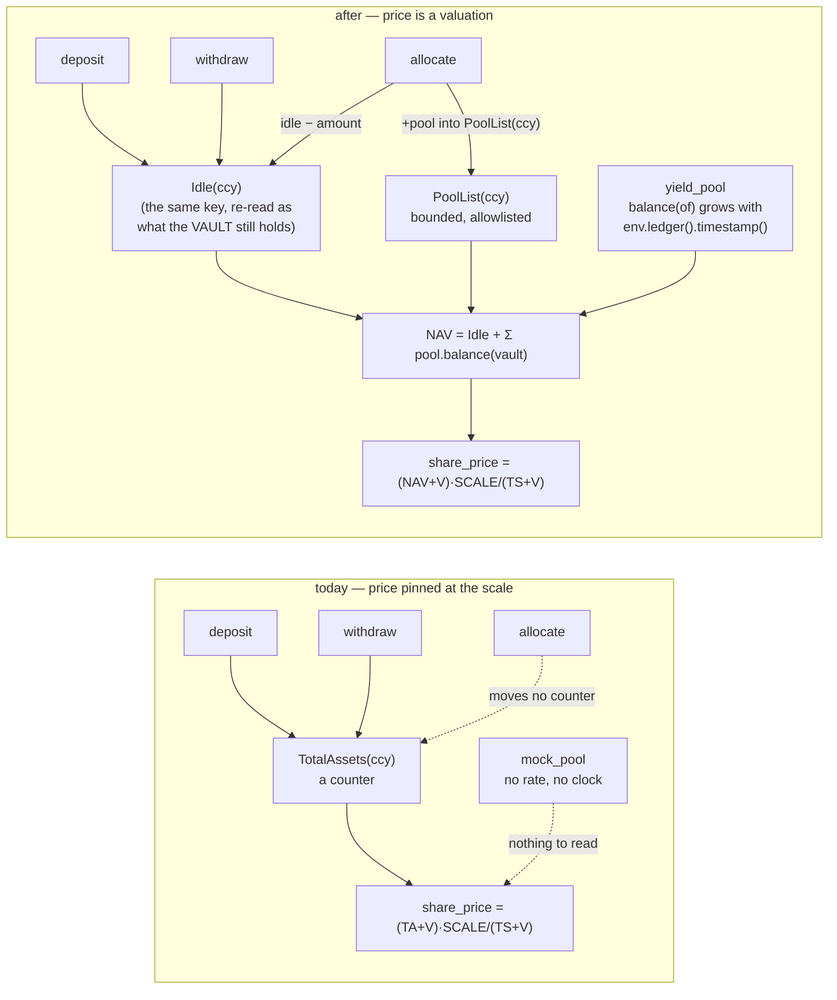
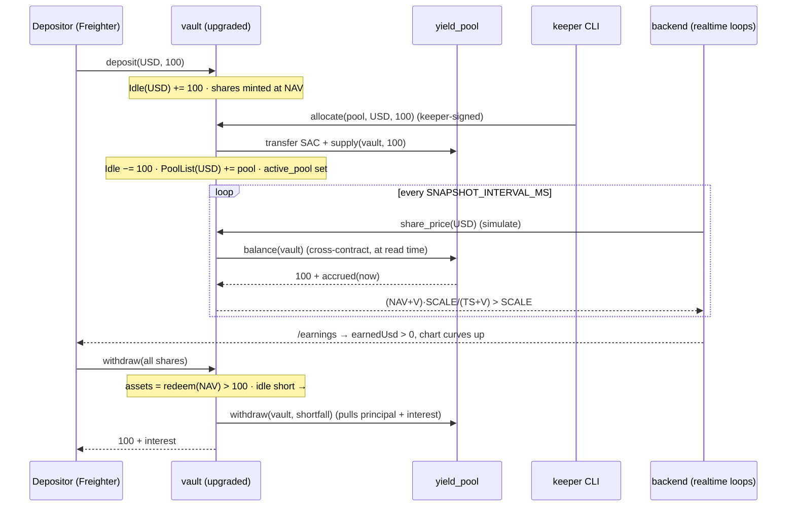

# feat: A real yield pool + mark-to-market NAV — the chart grows because the money grows

## Summary

The previous plan (`2026-07-14-003`) made every number on screen real, and then had to tell the truth
about one of them: **earned is zero.** Not small — zero. `share_price` reads exactly `SHARE_PRICE_SCALE`,
the growth chart is flat, and the monthly breakdown is empty. That plan called the flat line "the
deliverable, not a regression", and scoped its exit as an optional U5 it explicitly refused to attempt:
*"a chart that grows requires mark-to-market NAV accrual in the contract."*

This is that unit, promoted to its own plan.

Three things are wrong on-chain, and they are wrong in a chain of causation:

1. **The pool cannot pay yield.** The deployed `BLEND_POOL_USD` (`CAO5…HFDW`) is `mock_pool` — 75 lines,
   `init` / `supply` / `withdraw` / `holdings`. It has no rate, no clock, no accrual. Nothing about it grows.
2. **The vault cannot see a pool's value.** `blend.rs` generates its `PoolClient` from a trait with exactly
   two methods — `supply(from, amount)` and `withdraw(to, amount)`. There is no `balance`. The vault has no
   way to ask a pool what its position is worth, and `PoolHoldings` (`storage.rs:30`) books only the
   *principal* it pushed out — a number that rises on allocate and falls on deallocate and can never
   represent growth.
3. **The vault's NAV is a counter, not a valuation.** `total_assets` (`storage.rs:157-162`) moves in exactly
   two places: `deposit` (`lib.rs:108-112`) and `withdraw` (`lib.rs:142-146`). Both move shares and assets
   together, so `share_price = (TA+V)·SCALE/(TS+V)` is pinned at the scale forever.

Nothing downstream is broken. The snapshotter records the price it is given. `getEarnings` values shares at
that price. The chart plots what it receives. **Give them a price that moves and all three already work** —
the previous plan's forward-compatibility test says so out loud.

So this plan builds the one thing missing: a Soroban pool that accrues a real 10%+ annual rate against the
ledger clock, a vault that marks its position in that pool to market, and a backend that quotes the rate it
*reads from the pool* rather than a constant in a TypeScript file.

**The decision is settled: we build the pool ourselves; we do not integrate Blend.** See KTD1 — Blend's
testnet supply APY is ~0%, its testnet pools are wired to Circle's USDC, not our self-issued faucet asset,
and it exposes no `apy()` view. Every one of those is fatal to a demo whose whole claim is *the number is
real*.

---

## Problem Frame

### The seam has no read side

```
// smart-contract/contracts/vault/src/blend.rs — the entire pool interface
#[contractclient(name = "PoolClient")]
pub trait BlendPool {
    fn supply(env: Env, from: Address, amount: i128);
    fn withdraw(env: Env, to: Address, amount: i128);
}
```

Push-only. The vault transfers the SAC to the pool's address and then *notifies* it. It never asks anything
back. A pool could double our money overnight and the vault would not know.

### The three numbers, and which one is the lie

| Number | Where it lives | What it means today | What it can represent |
|---|---|---|---|
| `PoolHoldings(ccy, pool)` | `storage.rs:30` | principal pushed into a pool | exposure — **never** growth |
| `TotalAssets(ccy)` | `storage.rs:157` | deposits − withdrawals | principal — **never** growth |
| `share_price(ccy)` | `lib.rs:317` | `(TA+V)·SCALE/(TS+V)` | pinned at `SHARE_PRICE_SCALE` |

None of them is *wrong*. They are all honest counters of principal. There is simply no third number — a
*valuation* — anywhere in the system, so there is nothing for `share_price` to price.

### And the rate the user is promised is not the rate the money chases

`bestSafeVenue('USD')` (`backend/src/api/venue-meta.ts`) ranks the catalog by a hardcoded APY and returns
**DeFindex at 8.59%** (`tools/catalog.ts:37`). But `demoPoolFor('USD')` (`tools/vault.ts`) returns the slug
`blend-usdc`, whose `BLEND_POOL_USD` address is the `mock_pool` that pays **0%**. So the Earn hero quotes a
venue the keeper will never allocate to, at a rate no pool on this network pays. Both halves of that are
fixed by the same change: a pool with a real on-chain rate, read on-chain, ranks itself.

---

## Requirements

`MUST` = gates the unit. `SHOULD` = strongly recommended, may be deferred with a note in the PR.

| ID | Requirement | Priority |
|---|---|---|
| R1 | A testnet pool accrues interest **on-chain, from the ledger timestamp** — no keeper "report_yield" write, no off-chain number injected into the chain | MUST |
| R2 | The pool's annual rate is **≥ 10%** and is readable on-chain as a view | MUST |
| R3 | A supplier's position value grows with elapsed time and is readable as a view (`balance(of)`), between writes as well as at them | MUST |
| R4 | The vault marks its pool position to market: `share_price` rises above `SHARE_PRICE_SCALE` while funds sit in an accruing pool | MUST |
| R5 | NAV is **never** derived from the vault's raw token balance — the donation-inflation attack stays dead (KTD-SC3) | MUST |
| R6 | `SHARE_PRICE_SCALE` in `shares.rs` stays exactly equal to the seam's `interface.ts` value | MUST |
| R7 | A depositor can withdraw principal **+ accrued interest**; the vault sources the shortfall from the pool rather than panicking on an empty token balance | MUST |
| R8 | In real mode `/earnings` reports `earnedUsd > 0` and the value chart's last point is above its first | MUST |
| R9 | The APY on `/rates` and `/holdings` in real mode is **read from the pool on-chain**; the catalog figure survives only as the offline fallback | MUST |
| R10 | The keeper allocates a bucket's idle funds into the pool (so `active_pool(USD)` stops reading `null`), driven from the existing runner | MUST |
| R11 | The pool holds enough token liquidity to pay the interest it promises | MUST |
| R12 | Offline/mock mode is unchanged: `pnpm -r test` green with **zero network**, Playwright **8/8** | MUST |
| R13 | The vault ships as an `upgrade(new_wasm_hash)` — same contract id, storage (funds, shares, consent) preserved | MUST |
| R14 | A rate change is admin-only, bounded, and **never retroactive** | SHOULD |
| R15 | The pool address is config, not code — no consumer hardcodes it, mainnet cutover stays an env change | MUST |
| R16 | Every doc/test that states "yield never accrues on-chain" is corrected in the same PR series that makes it false | MUST |

**Invariants (violating any of these fails the unit regardless of R-coverage):** no `risk`/`label`/`score`/`tier`
field on any surface · per-currency buckets are never converted (blended USD stays display-only) ·
`KEEPER_SECRET` / `FAUCET_ISSUER_SECRET` stay backend-only · `backend/src/api/*` and `backend/src/http/*`
never write on-chain · the mock stays the default everywhere the integration env is absent.

---

## High-Level Technical Design

### Where a share price comes from — before and after



The load-bearing detail: **NAV sums allowlisted pool positions, never `token.balance(vault)`.** A stranger
can send USDC straight to the vault's address all day; it moves no counter, so it moves no price. KTD-SC3
survives the change intact — see KTD3.

### The accrual, and why it is an index

Directional only — the shape of the math, not its implementation.

```
INDEX_SCALE = 1e12,  BPS = 10_000,  YEAR = 31_536_000   // seconds

index_now(env) = index + INDEX_SCALE · rate_bps · (now − last_index_ts) / (BPS · YEAR)

Position { principal, index }                            // per supplier
balance(of) = principal + principal · (index_now − pos.index) / INDEX_SCALE

roll(pos)   = { principal := balance(pos); pos.index := index_now }   // on every supply/withdraw
set_rate(b) = { refresh index to now; rate_bps := b }                 // so the past keeps its old rate
```

Two properties fall out, and both are requirements:

- **`balance()` grows between writes.** It is computed from `env.ledger().timestamp()` at *read* time — and a
  Soroban view is simulated against the latest ledger — so a snapshot taken 60 seconds after the last write
  reads a higher number. Without this the chart would be a staircase that only steps when someone touches the
  pool, which is the flat chart wearing a hat.
- **A rate change is not retroactive (R14).** Naively storing `(principal, last_ts)` and multiplying by the
  *current* rate re-prices all of history every time the admin moves the dial. Rolling a monotone index first
  is what makes the past keep the rate it was earned at.

### The demo, end to end



### The mode matrix — the contract this plan is judged against

| | Offline (integration env unset) | Live (env set) |
|---|---|---|
| Vault client | `MockVaultClient` | `RealVaultClient` |
| Share price | scale, unless a test calls `simulateYield` | **> scale**, rising with the ledger clock |
| APY on `/rates` | catalog fallback (stub source, no network) | **`rate_bps()` read from the pool** |
| Earned | 0 (nothing accrued) | **> 0** |
| Network calls | **zero** | RPC only |
| Suites | `pnpm -r test` green, Playwright 8/8 | live smoke + evidence |

---

## Key Technical Decisions

**KTD1 — We build the yield pool; we do not integrate Blend.** Verified before it was settled: Blend's
**testnet** supply APY sits at ~0% (supply yield is a function of borrow demand, and there is none on
testnet — the ~8% figure quoted around Blend is *mainnet*); Blend's testnet pools are wired to **Circle's**
USDC (`CAQCFVLO…`, issuer `GBBD47IF…`), while our faucet mints a **self-issued** USDC (`GDOWW3KR…`, STE-46),
so our users' balances cannot even enter a Blend pool; Blend's ABI is `submit(Request[])` plus
`get_reserve` + whitepaper rate math, not a `supply`/`withdraw`/`apy()` shape; and its testnet oracle is a
mock that has been exploited. A pool we own gives us a rate we control (10%+), keeps the faucet path
working, keeps `blend.rs`'s seam shape unchanged, and is self-contained enough to demo. Real Blend stays a
post-hackathon adapter behind the same seam — **the seam is why that swap is cheap.**

**KTD2 — Accrual is an index, not `elapsed × rate` per position.** See the HTD sketch. The index makes
`balance()` a continuous function of ledger time (so the chart curves) and makes a rate change apply only
forward (R14). Integer math throughout: `i128`, `checked_mul`/`checked_add`, **multiply before divide**
(CoinFabrik Scout's `divide-before-multiply` detector is the exact bug we would otherwise ship — dividing by
`BPS·YEAR` first floors every sub-year accrual to zero).

**KTD3 — NAV = idle + Σ allowlisted pool value. Never a raw token balance.** The existing `TotalAssets(ccy)`
key is re-read as **idle** (what the *vault itself* still holds for that bucket): `+amount` on deposit,
`−assets` on withdraw, `−amount` on allocate, `+amount` on deallocate. Pool value is summed over a bounded
`PoolList(ccy)` whose only writer is `supply_to_pool` — which already enforces the allowlist, the frozen
flag, and the cap. So a pool can only enter NAV by being admin-vetted first (KTD-SC1). The donation attack
that `virtual_offset` was built to defeat (`shares.rs:4-7`) is *still* defeated, by construction: a SAC
transfer to the vault's address moves no counter, so it moves no price.

**KTD4 — `yield_pool.supply(from, ..)` requires `from`'s authorization.** Without it, the push model reopens
the donation channel through the back door: anyone could transfer tokens to the pool and call
`supply(vault_address, huge)` to inflate the vault's NAV — and with it, the share price. `from.require_auth()`
means only the vault can credit the vault's position (a contract authorizes the sub-invocations it makes
itself, which is the same mechanism that already lets `allocate.rs` move the vault's own SAC without a
signature). This is a **security requirement, not a nicety**, and it gets its own test.

**KTD5 — `withdraw` pulls the shortfall from the pool.** Today's contract assumes "the redeemed value is
liquid in the vault (backend deallocates first)" (`lib.rs:122`). Mark-to-market makes that assumption a bug:
after accrual, part of what a depositor is owed *lives in the pool*, so the SAC transfer would panic with an
opaque insufficient-balance error on the first post-yield withdrawal. `withdraw` therefore pulls the
shortfall from `PoolList` (bounded, in order) before paying, and surfaces a typed `InsufficientLiquidity` if
it is still short. A user who earned interest must be able to take it home without an operator in the loop.

**KTD6 — A freeze-exit moves the pool's *value*, not its booked principal.** `execute_exit` currently moves
`get_pool_holdings(..)` — the principal. Post-accrual that strands the interest inside the frozen pool, which
is precisely the pool we no longer trust. Exit moves `pool.balance(vault)`.

**KTD7 — The APY is an on-chain read with the `tools/price.ts` posture.** Not a REST call, not a constant:
simulate `rate_bps()` on the pool over Stellar RPC, through an **injectable source** (the real one wraps
`rpc.simulateTransaction`, built once, 8s timeout; tests feed canned `ScVal`s through the real decode path,
so the suite never touches the network). Everything fails closed as a typed `Result` — including
construction, because a typo'd contract id in `.env` must be a shaped 503 and not an unshaped 500. A failed
live read renders "unavailable", **never a stale catalog constant dressed up as truth** — that silent
fallback is the same class of lie as the sine-wave chart we just deleted.

**KTD8 — One rate constant, mirrored like `SHARE_PRICE_SCALE`.** `DEFAULT_YIELD_RATE_BPS` in
`packages/vault-client/src/interface.ts` mirrors the contract's default (1000 = 10%), documented with the
same "the two must agree" note, pinned by a contract test. The offline APY stub reads it. The demo's 10%
therefore has exactly one home, and the catalog's number is explicitly labelled a fallback.

**KTD9 — Ship the vault by `upgrade(new_wasm_hash)` (binver 1.3.0).** Admin-only, storage preserved, same
contract id — the path `deployments/testnet.json` already records twice (1.1.0, 1.2.0). The pool is a fresh
deploy wired in with `set_pool_allowed` + `set_configured_pool`, exactly the `scripts/faucet-assets.ts`
pattern. No funds move to upgrade.

**KTD10 — Rounding at a non-unit price rounds toward the vault, and gets tested for the first time.** Every
existing share-math test runs at `price == SCALE`, where the floor divisions are invisible. Above the scale
they are not: `mint` floors (the depositor may get one share-unit less) and `redeem` floors (the withdrawer
may get one base-unit less). Both directions favor the remaining holders, which is the safe direction — but
"safe" is a claim, and it must be pinned by tests in both the contract and the mock, or the two will drift.

---

## Implementation Units

Dependency order: **U1 → U2 → U3 → U4 → U5 → U6.** U3 and U4 are file-disjoint from each other and may be
worked in parallel once U2 lands. One unit = one branch = one PR (`pr-e2e-evidence`).

### U1. `yield_pool` — a Soroban pool that actually pays

**Goal:** a contract that accrues a real, on-chain, time-based rate and can say what a position is worth.

**Requirements:** R1, R2, R3, R11, R14
**Dependencies:** none

**Files:**
- `smart-contract/contracts/yield_pool/Cargo.toml` (new — mirrors `contracts/mock_pool/Cargo.toml`)
- `smart-contract/contracts/yield_pool/src/lib.rs` (new — entrypoints)
- `smart-contract/contracts/yield_pool/src/accrual.rs` (new — the index math, pure)
- `smart-contract/contracts/yield_pool/src/storage.rs` (new — keys + TTL-bumping accessors)
- `smart-contract/contracts/yield_pool/src/types.rs` (new — `Position`, `Error`)
- `smart-contract/contracts/yield_pool/src/test.rs` (new)
- `smart-contract/Cargo.toml` — no change needed (`members = ["contracts/*"]`)

**Approach.** Callable surface, deliberately a **superset of what `blend.rs` already calls** so the vault's
existing client keeps compiling against it:

| Method | Auth | Notes |
|---|---|---|
| `__constructor(admin, token, rate_bps)` | — | atomic at deploy (P22), so there is no `initialize` to front-run and no reinit path |
| `supply(from, amount)` | `from.require_auth()` | **KTD4.** Push model: the vault has already transferred the SAC; this rolls `from`'s position and credits `amount` |
| `withdraw(to, amount)` | `to.require_auth()` | rolls first, so `amount` may legitimately exceed everything ever supplied — that difference *is* the interest |
| `balance(of) -> i128` | public read | principal + interest accrued to the **current ledger timestamp** (R3) |
| `rate_bps() -> u32` | public read | the annual rate in bps; `1000` = 10% (R2) |
| `total_supplied() -> i128` | public read | ops: booked principal across suppliers |
| `liquidity() -> i128` | public read | ops: the pool's own SAC balance — *can it pay what it owes?* (R11) |
| `set_rate(bps)` | `admin.require_auth()` | refreshes the index **first** (R14); rejects `bps > MAX_RATE_BPS` |

Storage: instance `Admin` / `Token` / `RateBps` / `Index` / `LastIndexTs`; persistent `Position(Address)`.
TTL bumped on every touch, in one module, the way `vault/src/storage.rs` does it (KTD-SC6).

Naming honesty: the view is `rate_bps()`, not `apy()`. Accrual is simple interest **rolled at each touch**,
so the realized annual yield is ≥ the nominal rate; quoting the nominal rate is the conservative direction
(we never over-promise). The backend presents it as the display APY (`rate_bps / 100`) — U4.

**Patterns to follow:** `smart-contract/contracts/vault/src/storage.rs` (typed `DataKey` enum, TTL-bumping
accessors, no key derived twice) · `vault/src/types.rs` (`#[contracterror]` so tests assert the exact
failure via `try_*`) · `vault/src/lib.rs` `__constructor` (atomic setup).

**Execution note:** test-first for `accrual.rs`. It is pure math over `i128` and it is the one thing in this
plan that must not be subtly wrong — a rounding error there is a silent, permanent mispricing of everyone's
money.

**Test scenarios** (`cargo test`, deterministic, `env.ledger().set_timestamp`):
- supply `100_000`, advance one year → `balance` == `110_000` (±1 base unit for the floor)
- supply, advance **0** seconds → `balance` == principal, exactly (no phantom interest at t=0)
- two suppliers entering at different timestamps accrue independently; neither earns on the other's time
- **rate change is not retroactive (R14):** supply at 10%, advance 6 months, `set_rate(2000)`, advance 6
  months → interest == 5% + 10% of principal, **not** 20% of the year
- supply → advance → `withdraw(balance)` empties the position to exactly 0 and pays out of the pool's SAC
- `withdraw` above `balance` → typed error (not an SAC panic)
- **liquidity:** a pool holding principal but no surplus token, asked for principal + interest → typed
  `InsufficientLiquidity` (R11's fence: the failure is legible, not an opaque transfer error)
- **KTD4:** a third party calling `supply(vault_address, x)` with auth dropped (`env.set_auths(&[])`) panics —
  nobody can credit a position they do not control
- `set_rate` from a non-admin panics; `set_rate(MAX_RATE_BPS + 1)` → typed error
- zero and negative `amount` on supply/withdraw → typed error
- **overflow:** a principal near `i128::MAX` over a long elapsed → the checked math panics rather than wrapping
- `rate_bps()` reads `1000` on a default deploy — the assertion that pins `DEFAULT_YIELD_RATE_BPS` (KTD8)

**Verification:** `cargo test` green in `smart-contract/`; `stellar contract build` produces a WASM under the
64KB limit; the contract exposes `supply`/`withdraw` with signatures the vault's existing `PoolClient` can
call unchanged.

---

### U2. Vault: mark-to-market NAV (the upgrade)

**Goal:** `share_price` becomes a valuation instead of a counter, so it rises while funds accrue — and the
donation guard survives.

**Requirements:** R4, R5, R6, R7, R13, KTD3/5/6/10
**Dependencies:** U1

**Files:**
- `smart-contract/contracts/vault/src/blend.rs` — the pool seam gains `fn balance(env, of: Address) -> i128`
- `smart-contract/contracts/vault/src/shares.rs` — `mint`/`redeem`/`share_price` read a computed NAV
- `smart-contract/contracts/vault/src/storage.rs` — `TotalAssets` re-read as **idle**; new `PoolList(Currency)`
- `smart-contract/contracts/vault/src/allocate.rs` — idle bookkeeping, pool-list membership, `ensure_liquidity`
- `smart-contract/contracts/vault/src/lib.rs` — `withdraw` pulls the shortfall; `binver` → `1.3.0`
- `smart-contract/contracts/vault/src/types.rs` — `InsufficientIdle`, `InsufficientLiquidity`, `TooManyPools`
- `smart-contract/contracts/vault/src/test.rs` — new `nav` cases; existing cases must keep passing
- `smart-contract/contracts/mock_pool/src/lib.rs` — implements `balance(of)` (returns booked holdings)
- `smart-contract/contracts/vault/Cargo.toml` — `yield_pool` as a **dev-dependency** (the way `mock-pool` already is)

**Approach.**

*NAV.* `nav(env, ccy) = idle(ccy) + Σ_{p ∈ PoolList(ccy)} PoolClient::new(p).balance(vault)`. `shares.rs`'s
three functions take that instead of `get_total_assets`. `SHARE_PRICE_SCALE` **does not move** (R6).

*Idle.* The existing `DataKey::TotalAssets(Currency)` keeps its key and its type and changes only its
meaning — from "everything the bucket holds" to "what the **vault itself** still holds for the bucket":
`+amount` on deposit, `−assets` on withdraw, `−amount` on allocate, `+amount` on deallocate. Because
allocate/deallocate previously left it alone, and because allocate is only reachable on a bucket with
shares, **the migration is a no-op on live state**: the deployed vault has never allocated
(`active_pool(USD)` reads `null`), so today's `TotalAssets` is already exactly its idle. Storage-preserved
upgrade, no migration entrypoint (R13).

*The pool list.* Why not just use `active_pool`? Because it is a *hint*, not an invariant — nothing prevents
two live positions, and computing NAV from a hint means funds in a non-active pool silently vanish from the
share price. That is a money bug, so NAV enumerates. `PoolList(ccy)` is a `Vec<Address>` written **only** by
`supply_to_pool` (which already enforces allowlist + frozen + cap, so an un-vetted pool can never enter NAV),
bounded by `MAX_POOLS_PER_CURRENCY` (`TooManyPools` past it — Scout's `dos-unbounded-operation`), and a pool
is dropped from it only when its `balance(vault)` reads **0** (not when its booked principal does — the
interest outlives the principal).

*Withdraw (KTD5).* `assets = redeem(NAV)`; if `idle < assets`, pull the shortfall from `PoolList` in order,
then pay; still short → `InsufficientLiquidity`.

*Exit (KTD6).* `execute_exit` moves `pool.balance(vault)`, not `get_pool_holdings`.

*Unchanged on purpose:* `PoolHoldings` stays the **exposure** counter the per-pool cap is checked against.
The cap limits how much principal we push into one venue; it was never meant to track what that venue owes us.

**Technical design** (directional):

```
nav(ccy)          = idle(ccy) + Σ_{p ∈ PoolList(ccy)} pool(p).balance(vault)
mint(amount)      = amount · (TS + V) / (nav + V)          // nav read BEFORE the credit, as today
redeem(shares)    = shares · (nav + V) / (TS + V)
share_price       = (nav + V) · SCALE / (TS + V)

allocate(p, amt)  : require amt ≤ idle          → InsufficientIdle
                    idle −= amt; holdings += amt; PoolList ∪= {p}; transfer; p.supply(vault, amt)
deallocate(p,amt) : p.withdraw(vault, amt); idle += amt
                    holdings = max(0, holdings − amt)
                    if p.balance(vault) == 0 → PoolList −= {p}; clear active_pool
withdraw(shares)  : assets = redeem(shares)
                    if idle < assets → pull (assets − idle) across PoolList  → else InsufficientLiquidity
```

**Patterns to follow:** `allocate.rs`'s checks-effects-interactions ordering (state written before the
external calls) · `shares.rs`'s doc header, which states the donation-inflation invariant — **update that
header, it is now load-bearing in a new way** · the `try_*` typed-error assertions in `test.rs`.

**Execution note:** characterization-first. Run the vault suite **before** touching it and keep the output;
`mod nav` and `mod allocate` are the fence. The existing `simulate_yield` helper (`test.rs:166`) pokes
`total_assets` directly — under the new reading that is a poke to *idle*, which still lifts NAV, so those
tests should keep passing unchanged. If one of them moves, that is a finding, not a nuisance.

**Test scenarios:**
- a USD bucket allocated into a **`yield_pool`** (registered in the vault's test env) prices **above** the
  scale after `set_timestamp` advances; the untouched EUR bucket beside it still prices at exactly the scale
  (buckets never blend)
- `value_of` previews exactly what `withdraw` pays, **at a non-unit price** (the existing test only proves it
  at the scale)
- full withdrawal after accrual pulls the shortfall from the pool and pays **principal + interest** (KTD5),
  with the pool funded for the surplus
- **donation fence (R5):** a direct SAC transfer of a large amount to the vault's address moves neither NAV
  nor `share_price` nor any depositor's `value_of`
- **donation-through-the-pool fence (KTD4):** a third party calling `pool.supply(vault, x)` fails, so NAV
  cannot be inflated from outside
- `allocate` beyond the bucket's idle → `InsufficientIdle`
- the pool list drops a pool only when its `balance(vault)` hits 0 — deallocating exactly the booked
  principal after accrual leaves the interest in NAV, and the pool in the list
- **freeze-exit (KTD6):** the exit moves principal **+ interest** out of the frozen pool; the destination's
  `balance(vault)` reflects the whole value
- a second depositor buying in **after** real accrual mints fewer shares and is made whole on principal
  (the existing `yield_splits_by_share_not_by_deposit_order` case, now driven by the clock instead of a
  storage poke)
- **rounding (KTD10):** at `price > SCALE`, `mint` then immediate `redeem` never returns **more** than was
  deposited; a dust deposit that would mint 0 shares is rejected rather than silently confiscated
- `MAX_POOLS_PER_CURRENCY + 1` distinct pools → `TooManyPools`, and the NAV read stays bounded
- every existing vault test still passes (the regression bar for a storage-preserved upgrade)

**Verification:** `cargo test` green; the new WASM builds; a differential read against the deployed 1.2.0
WASM (`stellar contract fetch`) shows `balance_of` / `has_consent` / `value_of` answering identically for a
bucket with **no** pool position — i.e. the upgrade is inert until the keeper allocates.

---

### U3. The seam — `packages/vault-client` mirrors the new math

**Goal:** the mock keeps being a faithful twin of the contract (it is what 600+ offline tests run against),
and the demo's 10% has exactly one home.

**Requirements:** R6, R12, KTD8, KTD10
**Dependencies:** U2

**Files:**
- `packages/vault-client/src/interface.ts` — add `DEFAULT_YIELD_RATE_BPS`; `SHARE_PRICE_SCALE` untouched
- `packages/vault-client/src/mock.ts` — doc corrections on `simulateYield` and `sharePrice`
- `packages/vault-client/src/mock.test.ts` — the non-unit-price cases
- `packages/vault-client/src/real.ts` — doc only (its `sharePrice` now returns a moving number)

**Approach.** The mock needs **no math change**: its `totalAssets` already *is* NAV, and `simulateYield`
already raises it without minting shares — which is precisely the lift real accrual now produces. What
changes is that its doc comment stops being an apology ("standing in for pool yield the real contract does
not accrue") and becomes a mirror ("mirrors the NAV lift the vault now computes from `pool.balance()`").

`DEFAULT_YIELD_RATE_BPS = 1000` is added beside `SHARE_PRICE_SCALE`, with the same "the two must agree"
contract (KTD8) — the contract test in U1 is the enforcement, the offline APY stub in U4 is the consumer.

**No new method on `VaultClient`.** A pool's rate is not a vault call; adding it to the vault's seam would
make the seam stop describing the vault. It is read in U4 through its own reader, the way FX is.

**Patterns to follow:** the `SHARE_PRICE_SCALE` doc note in `interface.ts:38-39` — copy its shape verbatim
for the new constant.

**Test scenarios** (`mock.test.ts`, offline):
- after `simulateYield`, a new deposit mints **fewer** shares than the same deposit before it, and the first
  depositor's `assetValueOf` carries the whole gain
- `assetValueOf` equals what burning the full share balance returns (no double truncation) at a price above
  the scale
- a dust deposit at a high price rounds to 0 shares and behaves exactly as U2 pinned it in the contract —
  the two must agree, and this test is the only thing that keeps them from drifting
- `sharePrice` on an empty bucket still reads exactly `SHARE_PRICE_SCALE`

**Verification:** `pnpm -C packages/vault-client test` green; `pnpm -r typecheck` clean.

---

### U4. Backend: the APY is a chain read, and the keeper actually allocates

**Goal:** kill the last hardcoded number in the money path (`catalog.ts:37` `apy: 8.59`), and give the demo
the operator action that moves idle funds into the pool.

**Requirements:** R8, R9, R10, R12, R15, KTD7
**Dependencies:** U2 (U3 in parallel)

**Files:**
- `backend/src/tools/pool-rate.ts` (new) + `backend/src/tools/pool-rate.test.ts` (new)
- `backend/src/tools/catalog.ts` — the vetted entry for the pool the keeper actually drives; the figure
  becomes an explicitly-labelled offline fallback
- `backend/src/api/venue-meta.ts` — stays **pure**; gains the "apply a live rate" helper the two read
  surfaces share (there is still exactly one catalog)
- `backend/src/api/rates.ts`, `backend/src/api/holdings.ts`, `backend/src/api/pools.ts` — consume the APY source
- `backend/src/http/app.ts`, `backend/src/http/openapi.ts` — `/rates` and `/pools/:id` become failable reads
- `backend/src/http/server.ts` — wire the live source when the integration env is present, the stub otherwise
- `backend/src/tools/vault.ts` — `YIELD_POOL_<CCY>` registry (falling back to `BLEND_POOL_<CCY>`)
- `backend/src/keeper/runner.ts`, `backend/src/keeper/cli.ts` — an `allocate <ccy> <amount>` operator action
- `.env.example`

**Approach.**

*The reader (KTD7).* `pool-rate.ts` mirrors `tools/price.ts` line for line in posture: an injectable
`PoolSource` (real one wraps `rpc.simulateTransaction` on the pool's `rate_bps`, built **once** per reader,
8s timeout — the SDK's RPC client has none), a typed `Result`, and fail-closed on everything including
construction. Tests feed canned `ScVal`s through the real decode path, so **the suite never touches the
network**.

*The seam into the read surfaces.* `ApySource = (poolId) => Promise<Result<number>>`. Live → `rate_bps / 100`.
Offline → a deterministic stub over `DEFAULT_YIELD_RATE_BPS` and the catalog. `venue-meta.ts` stays pure (it
is the DRY seam between holdings/funding/rates and must not learn about RPC); the live figure is applied at
the API layer through one shared helper. `getRates` and `getPool` become async and `Result`-returning, the
way `getHoldings` already is; `/rates` and `/pools/:id` map a failure to a **shaped non-200**, never a stale
constant rendered as truth.

*The slug rename.* `blend-usdc` has not been true since STE-46 — the address behind it is a `mock_pool` we
deployed. The keeper's demo slugs become `sorosense-usd` / `sorosense-eur`, backed by `YIELD_POOL_USD` /
`YIELD_POOL_EUR` (with a `BLEND_POOL_*` fallback so an existing `.env` still boots). The old `blend-*`
catalog entries stay as unallocated Safe candidates.

*The consequence worth naming.* Once the rate is real, `bestSafeVenue('USD')` ranks our 10% pool above
DeFindex's 8.59% **on its own merits** — so the venue the Earn hero promises and the venue the keeper
allocates to become the same venue, without anyone hardcoding that they should be.

*The keeper.* `AllocatorEffects.compound` already calls `client.allocate(...)`; there is simply no operator
entrypoint that moves *idle* funds in for the first time. Add `allocate <ccy> <amount>` to the runner + CLI
(refusing in mock mode with the existing `MOCK_MODE_MESSAGE`, like every other real write).

**Patterns to follow:** `backend/src/tools/price.ts` — the injectable-source + typed-`Result` + fail-closed-on-
construction shape is the exact template · `backend/src/http/realtime.ts` — the "offline constructs *nothing*"
guarantee (asserted by spy, not by watching the network) · `backend/src/keeper/runner.ts` — `requireLive()`
before any client touch.

**Test scenarios:**
- a canned `rate_bps` `ScVal` of `1000` decodes to an APY of `10`
- a bad contract id / bad RPC URL at **construction** → `err('unavailable')` (a 503, not an unshaped 500 — the
  `.env` knobs we advertise as editable must fail legibly when typo'd)
- an RPC stall → `err('timeout')`; a malformed **or zero** rate → `err('parse')` (a 0% quote is a lie, not a
  degraded read)
- offline mode: the stub answers, and **no `rpc.Server` is constructed** (spy assertion, `realtime.ts` posture)
- `/rates` in mock mode returns today's shape and today's status — the offline contract does not move
- `/rates` when the live read fails → shaped non-200; a currency with no vetted venue is still **omitted**,
  never quoted at 0%
- `/holdings` for a funded, allocated bucket carries the **on-chain** APY, not the catalog figure
- `/pools/:id` for the keeper's pool names it and quotes the chain rate; an unknown/trap id is still a 404
- `openapi.integration.test.ts` stays green (no undocumented route, no drifted field)
- the keeper CLI refuses `allocate` in mock mode and never reads `KEEPER_SECRET` to do so

**Verification:** `pnpm -r test` green with the integration env **unset** and zero network; `pnpm -r typecheck`
clean; `/rates` in mock mode byte-identical to today.

---

### U5. Deploy, allocate, and watch it grow (live smoke + evidence)

**Goal:** the claim, on testnet, with tx hashes.

**Requirements:** R2, R4, R8, R10, R11, R13, R15
**Dependencies:** U1, U2, U3, U4

**Files:**
- `smart-contract/scripts/deploy-yield-pool.ts` (new — the `scripts/faucet-assets.ts:98-106` pattern:
  deploy WASM → constructor args → `set_pool_allowed` → `set_configured_pool` → write ids back to `.env`)
- `smart-contract/deployments/testnet.json` — the pool ids + a `1.3.0` entry in `upgrades[]`
- `.env` / `.env.example` — `YIELD_POOL_USD`, `YIELD_POOL_EUR`
- `docs/tests/` — the evidence the PR links

**Approach.** Order matters, and one step is easy to get wrong:

1. `stellar contract build`; upload the new vault WASM.
2. **`vault.upgrade(new_wasm_hash)` FIRST**, before any allocation. Storage is preserved; with no pool
   position the upgraded vault reads identically to 1.2.0 (that is U2's differential check), so the upgrade is
   observably inert — which is exactly what makes it safe to do on a vault holding real testnet deposits.
3. Deploy `yield_pool(admin, USDC_SAC, 1000)`; `set_pool_allowed`; `set_configured_pool(Usd, pool)`.
4. **Fund the pool's surplus (R11).** The faucet issuer mints USDC *to the pool's address* — the interest it
   promises has to come from somewhere, and a pool that cannot pay is a pool that panics on the first
   withdrawal. `liquidity()` is the view that proves it can.
5. `keeper allocate USD <amount>` → `active_pool(USD)` stops reading `null`.
6. Wait. Then read.

**Verification** (this list *is* the PR's evidence):
- `rate_bps()` reads `1000` on-chain
- `balance(vault)` read twice, minutes apart, is **strictly greater** the second time
- `share_price(USD)` > `1_000_000_000` — the number that has never moved since the vault was deployed
- `/earnings` returns `earnedUsd > 0`, and the chart's last point is above its first (screenshot)
- `/rates` quotes USD at 10% and names the pool the keeper actually allocated to
- a real depositor withdraws **more than they put in**, and the vault sources the difference from the pool
- `deployments/testnet.json` records the pool ids, the wasm hash, and the upgrade tx

---

### U6. Retire the "yield never accrues" invariant — everywhere it is written down

**Goal:** stop the next agent from "fixing" the growing chart back to flat.

**Requirements:** R16
**Dependencies:** U5

**Files:**
- `CLAUDE.md` — three separate places assert it (the seam section, the earnings section, and a standalone
  bolded paragraph)
- `backend/src/http/realtime.integration.test.ts` — the header comment and the `earned === 0` rationale
- `frontend/hooks/useEarnings.ts`, `frontend/lib/api/types.ts`,
  `frontend/lib/api/__tests__/http.contract.test.ts` — the "honest zero" comments
- `docs/plans/2026-07-14-003-feat-real-onchain-realtime-plan.md` — a one-line pointer that its U5 shipped here

**Approach — and the trap this unit exists to catch.** The load-bearing assertions
(`realtime.integration.test.ts:178` `price === SHARE_PRICE_SCALE`, and `earnedUsd ≈ 0` at every chart point)
are driven by the **`MockVaultClient`**, which — with no `simulateYield` call — still prices at exactly the
scale. **So they keep passing.** That is precisely the danger: the tests stay green while the *reason* printed
above them ("the contract does not accrue yet — the honest figure is 0") quietly becomes false. A green test
guarding a dead invariant is worse than a red one.

So: keep the mock-mode assertions (they still state something true — *an unaccrued bucket earns nothing*),
rewrite every stated reason, and add the twin that was missing: **when the price rises, earned rises with it,
and never before the first deposit.**

**Test scenarios:**
- mock-mode: an unaccrued bucket still reports `earned == 0` and a flat chart (unchanged — the honest zero is
  still honest when nothing has accrued)
- mock-mode with `simulateYield`: `earnedUsd > 0`, the chart rises, and **the pre-deposit points are still 0**
  (no retroactive profit — the bug that reported a user's whole principal as earnings must stay dead)
- `grep -rn "does not accrue\|never accrues\|honestly 0" CLAUDE.md backend/ frontend/` returns only the
  correctly-qualified survivors ("a bucket with **no pool position** does not accrue")

**Verification:** `pnpm -r test` green; the greps come back clean; CLAUDE.md describes the system that exists.

---

## Verification Contract

Every unit passes all five gates. A unit is not done until it does.

| Gate | Command | Bar |
|---|---|---|
| Contract | `cargo test` in `smart-contract/` | Green. Includes the existing vault suite — a storage-preserved upgrade may not break it. |
| Typecheck | `pnpm -r typecheck` | Clean. `noUncheckedIndexedAccess` is on. Tests passing does **not** mean typecheck passes. |
| Unit + integration | `pnpm -r test` | Green **with the integration env unset** — mock mode, zero network. |
| End-to-end | `pnpm -C frontend e2e` | **8/8**, env unset. |
| Live smoke | testnet, env set | `rate_bps()` = 1000 · `share_price(USD)` > `SHARE_PRICE_SCALE` · `/earnings` `earnedUsd > 0` · the value chart curves up. Evidence in the PR (`pr-e2e-evidence`). |

**Prerequisite:** `packages/vault-client` bindings/dist are gitignored — build the workspace before typecheck
on a fresh worktree, or `RealVaultClient` will not resolve. **Regenerate the vault bindings after U2** (the
contract's callable surface changed): `stellar contract bindings typescript --network testnet --contract-id <id>`.

---

## Scope Boundaries

**In scope:** the `yield_pool` contract; the vault's mark-to-market NAV upgrade; the seam's mirroring; the
backend's on-chain APY read and the keeper's allocate action; the testnet deploy and its evidence; retiring
the "never accrues" invariant from the docs and tests that state it.

**Deferred to follow-up work (planned, not now):**
- **The real Blend adapter.** Post-hackathon, behind the same `blend.rs` seam (KTD1). Adapting `submit(Request[])`
  and Blend's rate math is its own unit; the seam is what makes it a swap rather than a rewrite.
- **A timelock/multisig on `upgrade` and `set_rate`.** Both are admin-only single-key today. Already flagged
  for the vault in `deployments/testnet.json`; `set_rate` inherits the same exposure. Mainnet blocker, not a
  demo blocker.
- **Compound interest inside the pool.** We compound *at touch* (each supply/withdraw capitalizes). Continuous
  compounding is a different index and is not worth the CPU for a 10% demo.
- **NAV across many pools per bucket.** Bounded at `MAX_POOLS_PER_CURRENCY`; a bucket that genuinely needs to
  span more venues needs a different NAV read (batched, or a cached valuation with a freshness bound).
- **An autonomous keeper loop.** Still manually invoked; this plan only adds the missing `allocate` action.
- **MXN.** No token, no pool, no rate — it stays internal-only, and `getRates` correctly omits it rather than
  quoting 0%.

**Out of scope (identity):** any risk label, tier, or score reaching a user surface · any chatbot or LLM on a
user surface (the deterministic `simulate()` projection stays) · converting funds between currency buckets ·
shipping any secret to the client.

---

## Assumptions

Recorded because this plan was produced non-interactively. Each is a bet a reviewer may overturn.

1. **10% (1000 bps) is the demo rate.** High enough that a few minutes of testnet time produces a visible
   number, low enough not to look like a joke. It is a constructor argument and an admin-settable dial — the
   number is config, the *mechanism* is what this plan is about.
2. **Showing "SoroSense" as the venue name is acceptable for a testnet demo.** It is our pool; saying so is
   honest, and the alternative (labelling it "Blend") is the exact kind of lie this whole plan series exists to
   delete. If the pitch needs a different label, it is a one-line catalog change.
3. **The vault's live `TotalAssets` is already its idle**, because the deployed vault has never allocated
   (`active_pool(USD)` reads `null`). This is what makes the re-reading in U2 a no-op migration. **Verify it on
   testnet before the upgrade** — if a position exists, U2 needs a migration entrypoint and the plan grows a unit.
4. **The faucet issuer can mint enough surplus USDC to the pool** to cover the interest for the demo's lifetime
   (R11). It is a self-issued asset; this is a formality, but an unfunded pool panics on withdrawal.
5. **`MAX_POOLS_PER_CURRENCY = 4`** is enough for the demo and small enough that the NAV read's cross-contract
   cost stays inside simulation limits. Profile it with `--sim` in U2 rather than trusting the number.
6. **`rate_bps()` is the honest name.** The backend presents it as an APY (`/100`); accrual is simple interest
   rolled at touch, so realized ≥ nominal and we never over-promise.

---

## Risks

| Risk | Impact | Mitigation |
|---|---|---|
| **NAV reads a pool that lies.** Mark-to-market means a compromised pool can inflate the share price by over-reporting `balance()` | An attacker withdraws more than their fair share of a bucket | Only **admin-allowlisted** pools can enter `PoolList` (KTD3) — a lying pool is a vetted-pool compromise, i.e. the same trust we already extend by letting it hold the funds at all. The freeze + exit path (KTD6) is the response. Do **not** paper over it with a "growth looks too fast" heuristic |
| **Donation through the pool.** Anyone can transfer tokens to the pool and call `supply(vault, x)` | The classic inflation attack, resurrected through the back door | `from.require_auth()` on `supply` (KTD4) — only the vault can credit the vault. Explicit test in U1 **and** U2 |
| **`divide-before-multiply` in the accrual** — dividing by `BPS · YEAR` before multiplying floors every sub-year accrual to **zero** | The pool silently pays nothing, and the chart is flat again for a reason nobody can see | Multiply first, `checked_*` throughout (KTD2). The "advance 1 hour → balance grew" test is the fence. `cargo scout-audit` catches the class |
| **The pool cannot pay the interest it promises** | The first post-yield withdrawal panics on an SAC transfer | `liquidity()` view + the surplus mint in U5 (R11) + a typed `InsufficientLiquidity` so the failure is legible |
| **Rounding at a non-unit price is untested today** | A dust deposit could mint 0 shares and be confiscated, or a redeem could pay out more than NAV | KTD10: pin the behavior in the contract **and** the mock (U2 + U3), in the same PR series |
| **A green test guarding a dead invariant.** The `earned === 0` assertions are mock-driven and keep passing after the contract starts accruing | The next agent reads "the contract does not accrue" in CLAUDE.md and "fixes" the growing chart | U6 is not optional cleanup — it is the unit that stops the regression |
| **The upgrade touches a vault holding real testnet deposits** | Worst case, mispriced shares on live funds | Storage-preserved upgrade (R13), inert until a pool position exists, differential-tested against the deployed 1.2.0 WASM before the tx (U2's verification), and the assumption above is checked on-chain first |
| **The NAV read's cross-contract cost** blows a simulation budget on `share_price` | Every read surface 500s at once | Bounded pool list; profile with `--sim` in U2; the demo runs one pool per bucket |

---

## Definition of Done

- On testnet, with the integration env set: a deposit is allocated by the keeper into a pool that **accrues on
  its own**, `share_price(USD)` reads **above** `1_000_000_000`, `/earnings` reports `earnedUsd > 0`, and the
  value chart **curves upward** — with tx hashes, not a screenshot of a fixture.
- The APY on `/rates` and `/holdings` in real mode came from `rate_bps()` on the chain. `grep -n "apy: 8.59"`
  finds only a line explicitly labelled as the offline fallback.
- A depositor can withdraw **more than they deposited**, and the vault pulls the difference out of the pool
  without an operator in the loop.
- With the integration env **unset**: `pnpm -r test` is green, `pnpm -C frontend e2e` is 8/8, and not one
  network request is issued.
- `cargo test` is green — including every pre-existing vault test.
- No `risk` / `label` / `score` / `tier` field exists on any API result or user surface. No secret is reachable
  from the client. Buckets are still never converted.
- CLAUDE.md no longer claims the contract cannot accrue, because it can.

---

## Sources & Research

**Code, read directly (the analysis this plan is built on):**
- `smart-contract/contracts/vault/src/blend.rs` — the pool seam is `supply` + `withdraw`, nothing else
- `smart-contract/contracts/vault/src/storage.rs:30,157-162` — `PoolHoldings` (principal) and `TotalAssets` (counter)
- `smart-contract/contracts/vault/src/lib.rs:108-112,142-146,273,317-329` — the only two writers of `total_assets`; `upgrade`; the NAV views
- `smart-contract/contracts/vault/src/shares.rs:4-7,21` — the donation-inflation invariant; `SHARE_PRICE_SCALE`
- `smart-contract/contracts/vault/src/test.rs:160-270` — the `nav` module, and the `simulate_yield` helper that pokes storage because the contract cannot
- `smart-contract/contracts/mock_pool/src/lib.rs` — 75 lines, zero accrual; this is `BLEND_POOL_USD` (`CAO5…HFDW`)
- `packages/vault-client/src/interface.ts:39`, `src/mock.ts:214` — the seam scale, and `simulateYield`
- `backend/src/tools/price.ts` — the injectable-source, typed-`Result`, fail-closed-on-construction posture this plan copies for the rate read
- `backend/src/tools/catalog.ts:37`, `backend/src/api/venue-meta.ts`, `backend/src/api/rates.ts` — the hardcoded APY and the surfaces that quote it
- `backend/src/keeper/runner.ts`, `backend/src/tools/vault.ts` — the keeper's effects and the pool registry
- `smart-contract/scripts/faucet-assets.ts:98-106` — the deploy-then-wire pattern U5 reuses
- `smart-contract/deployments/testnet.json` — two prior storage-preserved upgrades (1.1.0, 1.2.0)

**External (verified, and the reason KTD1 went the way it did):** Blend's testnet supply APY is ~0% (supply
yield tracks borrow demand, and testnet has none — the ~8% figure is mainnet); Blend testnet pools are wired
to Circle's USDC (`CAQCFVLO…` / issuer `GBBD47IF…`), not our self-issued faucet USDC (`GDOWW3KR…`); Blend's
ABI is `submit(Request[])` + `get_reserve` + whitepaper rate math, with no `apy()` view; its testnet oracle
is a mock that has previously been exploited.

**Skills:** `soroban` (accrual, cross-contract calls, upgrades, checked math, allowlists, TTL, the Scout
detector set) · `stellar-dev:data` (RPC simulate for view reads; no streaming, hence the poll) ·
`stellar-dev:dapp` (contract invocation and simulation from the client).

**Origin:** `docs/plans/2026-07-14-003-feat-real-onchain-realtime-plan.md` — this plan is its U5, which it
deferred with the note *"Do not start this unit without an explicit product decision."* That decision is made.
