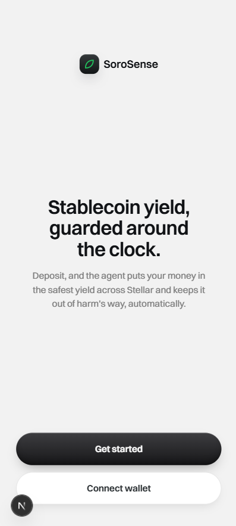
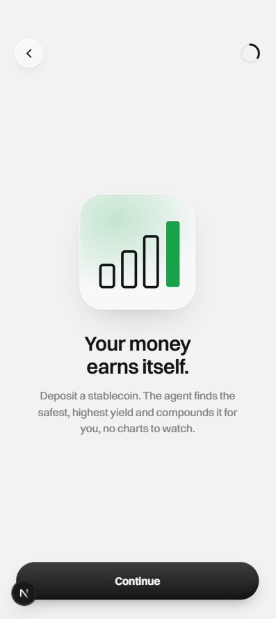
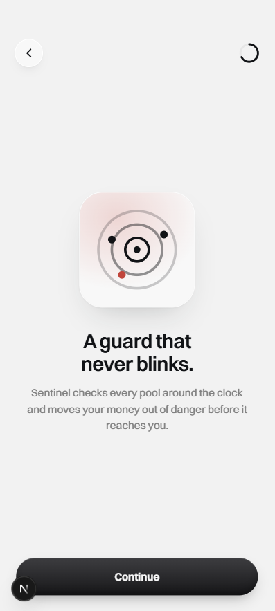
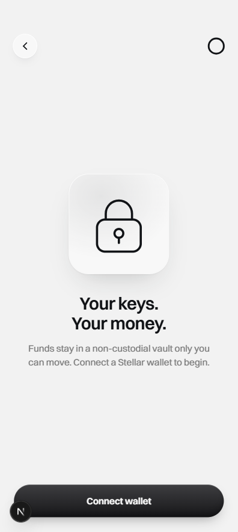
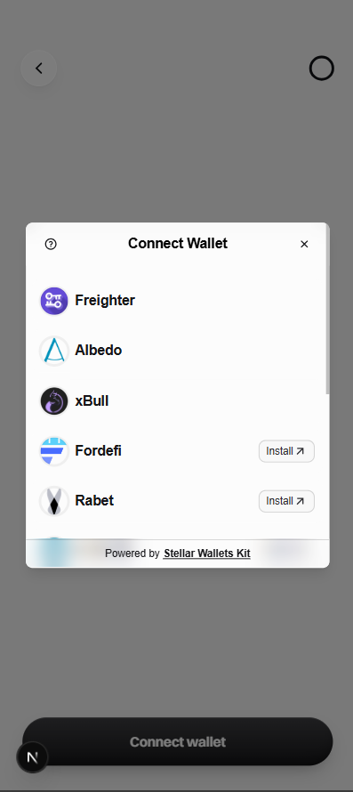
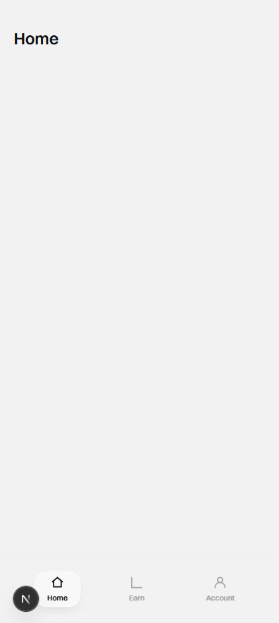

# U13 (STE-23) — E2E / verification evidence

**Unit:** U13 — Next.js scaffold + wallet-connect + app shell
**Ticket:** [STE-23](https://linear.app/steries-stellar-hackathon-apac/issue/STE-23) · parent [STE-7](https://linear.app/steries-stellar-hackathon-apac/issue/STE-7)
**Branch:** `ancungaulia-ste-23-u13-nextjs-scaffold-wallet-connect-app-shell`
**Design source of truth:** `docs/mockups/sorosense-mock-2.html`
**PM sign-off:** onboarding tour + mock-2 additions ACC'd by @axelmatsama on [STE-36](https://linear.app/steries-stellar-hackathon-apac/issue/STE-36) ("Lanjut implement 🚀").

## Environment

| | |
|---|---|
| Stack | Next.js 16.2.10 (App Router, Turbopack) · React 19.2.4 · Tailwind v4 (`@theme`, CSS-first) · TypeScript 5 |
| Wallet | `@creit.tech/stellar-wallets-kit@2.5.0` (Freighter-first) · `@stellar/freighter-api@6.0.1` |
| Tests | Vitest 2.1.x + React Testing Library (`vitest.config.mts`, jsdom) |
| Font | Switzer (Fontshare, self-hosted via `next/font/local`) |
| Local URL | `http://localhost:3007` (`pnpm -C frontend dev`) |
| Commit range | `9267b5f` (scaffold baseline) → `49f2ede` (HEAD) |

## What changed (before → after)

| | Before (scaffold) | After (U13) |
|---|---|---|
| `/` | create-next-app "Hello World" | Welcome → 3-screen value tour (Earn / Safety / Non-custodial) → Connect wallet |
| Wallet | none | Freighter-first Stellar Wallets Kit modal; non-custodial connection persisted in `localStorage` |
| App shell | none | `(app)` route group with bottom-nav (Home / Earn / Account) + client auth-gate |
| Design system | Tailwind defaults | Monochrome + Switzer `@theme` tokens; `Button`/`Card`/`Chip`/`BottomSheet`/`Toast`/`BottomNav` primitives |
| `src/` skeleton | empty scaffold dirs | removed (root `components/`, `lib/`, `providers/`, `hooks/`) |

## Automated verification (all green)

Run from repo root:

```
pnpm -C frontend test        # 9 files / 17 tests passed
pnpm -C frontend typecheck    # tsc --noEmit — clean, exit 0
pnpm -C frontend lint         # eslint — clean, 0 problems
pnpm -C frontend build        # Turbopack — compiled clean, no "window is not defined"
```

Build output (routes prerendered as static content):

```
Route (app)
┌ ○ /
├ ○ /account
├ ○ /earn
└ ○ /home
○  (Static)  prerendered as static content
```

Unit tests cover the U13 test scenarios from the spec:
- wallet-connect returns an address with the kit **mocked** (`connect()` → `authModal()` → address); Freighter-first init asserted;
- provider hydrates/persists/clears `localStorage["soro.wallet"]`; `getKit()` throws outside the browser (no SSR `window` access, KTD7);
- `BottomNav` marks the active tab by `usePathname()`;
- `(app)` shell renders nav + children when connected, and redirects to `/` (`router.push("/")`) when not connected.

## Runtime route checks (dev server, `curl`)

| Route | Status | Key content served |
|---|---|---|
| `/` | 200 | "Stablecoin yield, guarded around the clock", **Get started**, **Connect wallet** |
| `/home` | 200 | bottom-nav `aria-label="Main"` + Home/Earn/Account tabs |
| `/earn` | 200 | bottom-nav + tabs |
| `/account` | 200 | bottom-nav + tabs |

(The `(app)` pages render the shell server-side; the client auth-gate redirects unauthenticated users to `/` on mount.)

## Invariants (STE-7) — verified

- [x] 3-tab nav **Home / Earn / Account** only (no 4th tab)
- [x] No risk labels / tiers
- [x] No chatbot
- [x] No hub / explore catalog
- [x] Wallet-connect **Freighter-first** (Wallets Kit modal, not passkey, no hardcoded per-wallet buttons)
- [x] Primitives are DRY (composed, never re-styled per screen)
- [x] Monochrome + semantic-only palette; font weights ≤ 600

## Visual evidence

Captured from a local browser at 390px (mobile). Onboarding flow, wallet-connect, and the authenticated shell:

| Welcome | Tour · Earn | Tour · Safety | Tour · Non-custodial |
|---|---|---|---|
|  |  |  |  |

| Connect modal (Freighter-first) | Home shell | Earn tab | Account tab |
|---|---|---|---|
|  |  |  |  |

`05-connect-modal.png` shows **Freighter detected and floated to the top with no "Install" badge**, confirming the Freighter-first configuration end-to-end. (Note: DevTools *device-mode* emulation sends a mobile user-agent, under which the desktop Freighter extension does not inject and the kit correctly shows "Install"; capturing at a normal desktop viewport detects it. This is Freighter/kit behaviour, not app logic.)

## Post-capture hardening (connect error handling)

Manual dogfooding surfaced two dev-only issues, both fixed on this branch:

- **`[object Object]` on modal close** — Stellar Wallets Kit rejects with plain `{ code, message }` objects (`kit.js` → `reject({ code: -1, message: "The user closed the modal." })`), not `Error`s; the unhandled rejection rendered as `[object Object]`. Fixed by normalising kit rejections to a `WalletError` at the wallet boundary (`lib/wallet-error.ts`, `lib/wallet.ts`) and handling them in `onConnect` (silent on user-cancel `code -1`, auto-dismissing toast on real errors, no navigation on failure). Covered by `app/__tests__/landing.test.tsx` (happy / error-toast / silent-cancel).
- **Hydration mismatch on `<html>`** — the kit injects `--swk-*` theme CSS vars onto `<html>` at runtime; resolved with `suppressHydrationWarning` (`app/layout.tsx`).

Re-verified after the fix: **test 22/22 · typecheck · lint · build — all exit 0.**

## Known limitations / deferred (not U13 scope)

- Placeholder Home/Earn/Account pages — real content is U14/U16.
- `isConnected` is **optimistic** (restored from `localStorage`); the selected wallet id is not yet persisted. A future signing flow (U14) should persist the wallet id and re-verify the live session before signing. Documented in-code (`providers/WalletProvider.tsx`, `lib/wallet.ts`).
- e2e (Playwright) deferred to U17.
