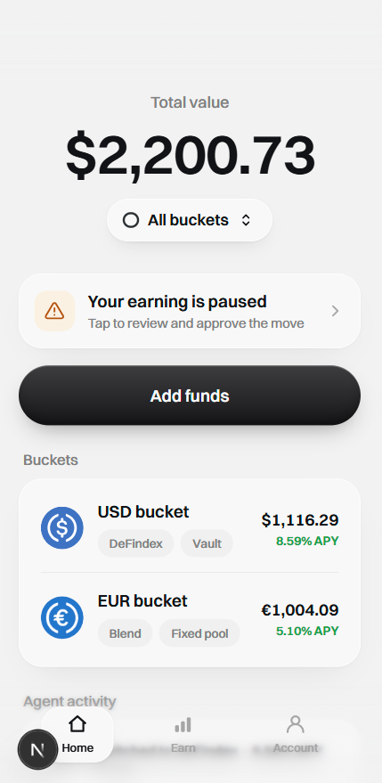
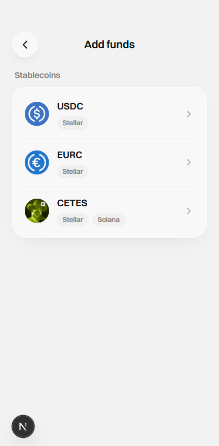
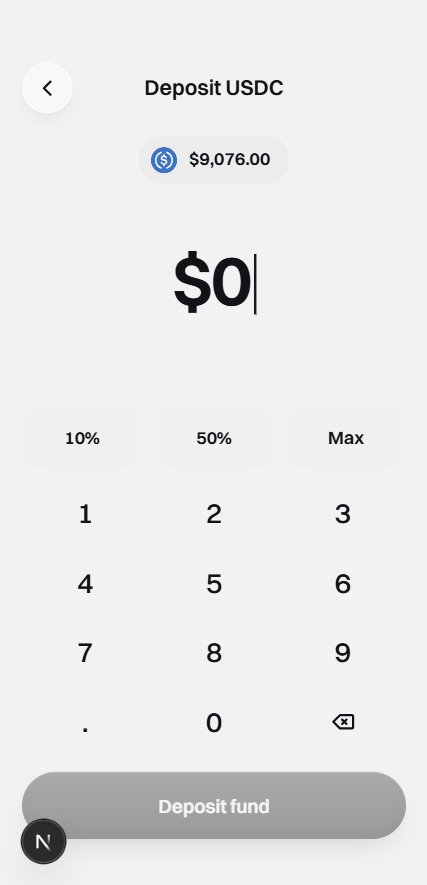
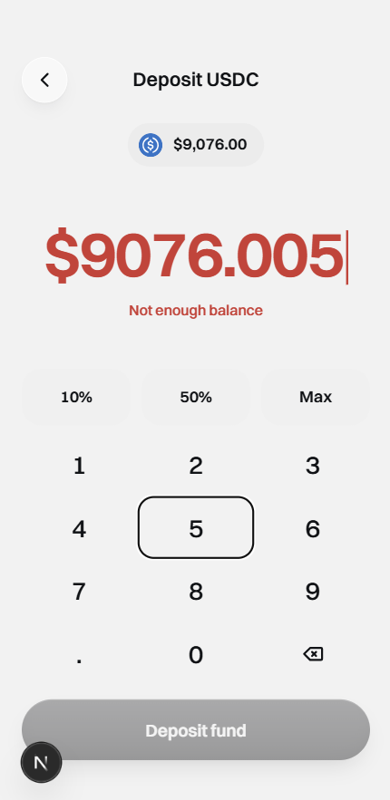
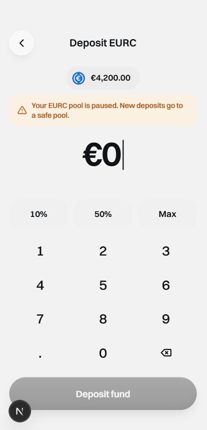
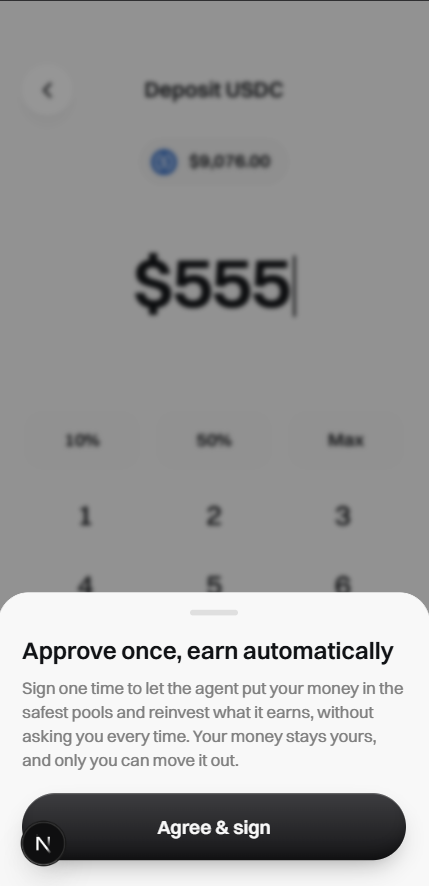
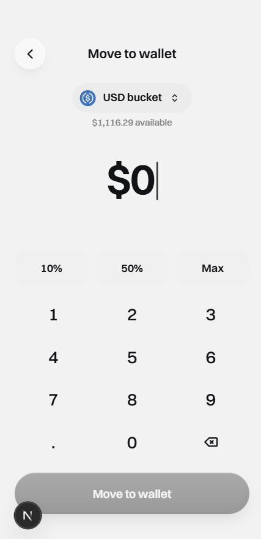
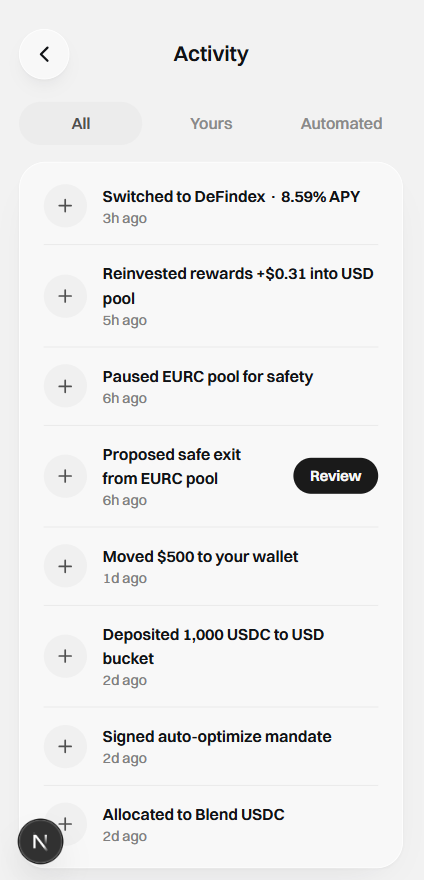
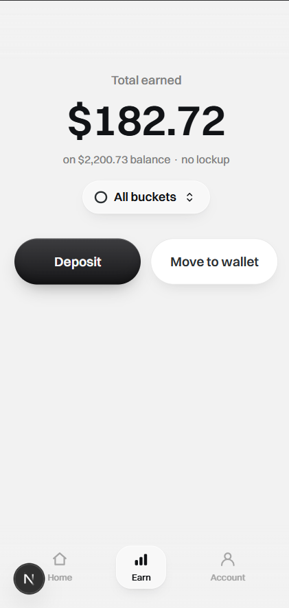

## Summary
- **U14 (STE-24)** — core deposit-to-earn surfaces from `docs/mockups/sorosense-mock-2.html`, built against the mock vault seam (`@sorosense/vault-client` `MockVaultClient`):
  - **Home** — per-currency buckets (token logo, venue, APY — no risk label), agent-activity preview, "View all" → `/account/activity`, freeze banner when a pool is paused, bucket toggle, top progressive blur.
  - **Add funds** — fundable stablecoins only (USDC/EURC/CETES), no explore/RWA catalog (R19).
  - **Deposit** — full-page keypad (10%/50%/Max), **no risk tier**, one-time consent on the first deposit (KTD3), amber "pool is paused" note when the currency's active pool is frozen, "Not enough balance" guard.
  - **Withdraw** ("Move to wallet") — bucket picker (chevron only with ≥2 buckets), amount→shares, Max.
  - **Earn** — "Total earned" (lifetime, withdrawal-proof `value − net contributions`) + balance subline + bucket toggle.
  - **Activity** — All/Yours/Automated filter.
- Data is mocked via `MockVaultClient` + frontend fixtures that mirror the backend `CatalogEntry`/`ActivityEntry`/cost-basis shapes, so the live wiring at U15/U17/U20 is a one-file swap. Signing reuses the U13 wallet.
- This unit **builds** the screens (the U13 "before" state was placeholder stubs), so the evidence below is the built "after" state with the invariants visible.

## E2E evidence

Dev browser verification

Passed on dev.

Environment:
- Branch: `AncungAulia/ancungaulia-ste-24-u14-home-add-funds-deposit-withdraw` · Commit: `7bd20ba` · URL: `http://localhost:3000` (`pnpm -C frontend dev`)
- Freighter connected at a **desktop viewport** (device-mode hides Freighter). Mock seeded: USD bucket ≈ $1,116.29, EUR bucket ≈ €1,004.09, with the **EUR pool frozen**.

Screens (in `docs/tests/linear-STE-24/screenshots/`):

- **Home** — total value + bucket toggle (token logo), "Your earning is paused" freeze banner, Buckets (USDC/EURC logos, venue, APY), agent activity, top blur:
  
- **Add funds** — fundable stablecoins only, no RWA/explore catalog:
  
- **Deposit USDC** — full-page keypad, **no risk tier** control anywhere:
  
- **Deposit USDC — "Not enough balance"** — amount over the wallet balance reddens, shows the hint, disables the CTA:
  
- **Deposit EURC — amber note** — "Your EURC pool is paused. New deposits go to a safe pool." (EUR pool seeded frozen; USDC shows no note — the contrast is the evidence):
  
- **Consent (KTD3)** — first deposit opens the one-time consent sheet; plain copy, "Agree & sign" only (dismiss via the scrim):
  
- **Withdraw** — bucket picker (chevron, ≥2 buckets) + available + keypad:
  
- **Activity** — All / Yours / Automated filter over the agent + user feed:
  
- **Earn** — "Total earned" (lifetime) + balance subline + bucket toggle:
  

Result:
- Deposit against the mock updates the bucket balance reflected on Home (shared singleton).
- First deposit triggers the consent signature then the deposit signature; later deposits sign once.
- Deposit keypad has no risk-tier control; the amber note appears only when the currency's active pool is frozen.
- Add funds lists only fundable stablecoins.
- Withdraw shows the bucket chevron only with ≥2 buckets; Max withdraws the full share balance.
- "Not enough balance" reddens the amount and disables the CTA when the amount exceeds the available balance.
- Loading / empty / error states render.

Console/network notes:
- One pre-existing U13 warning: `[TWIND_INVALID_CLASS] Unknown class "easy-in-out"` from `lib/wallet.ts:44` (harmless typo, unrelated to U14).

Automated coverage (green): `pnpm -C frontend test` — 30 files / 55 tests. `pnpm -r typecheck`, `pnpm -C frontend lint`, `pnpm -C frontend build` (9 routes) all pass; repo-root `pnpm -r test` (vault-client + backend + frontend) green.

## Checklist
- [x] Sesuai `docs/mockups/sorosense-mock-2.html` (UI menyesuaikan)
- [x] TIDAK ada: label risiko, risk tier, chatbot, hub/explore catalog
- [x] Test scenarios unit (plan) lulus
- [x] Screenshots ter-render

## Notes / deferred (non-blocking)
- Approve-safe-exit sheet + freeze-status detail + the Activity "Review" action → **U15 (STE-25)**; the freeze banner and Review are display-only placeholders in U14.
- Full Earn page (growth chart, per-month breakdown) + full Account UI → **U16**. The Earn "Total earned" hero + bucket toggle were pulled forward.
- RWA "Real world assets" section in Add funds → **dropped** per PM decision (2026-07-08); Add funds stays stablecoins-only per R19 (RWA are agent allocation targets, not user-deposit assets).
- Real contract/backend wiring, live APY/TVL/activity, real FX → **U20 (STE-21)** / U17.
