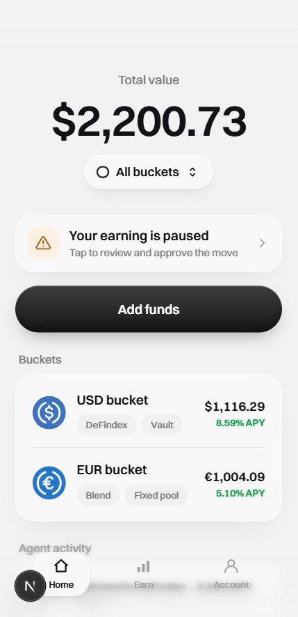
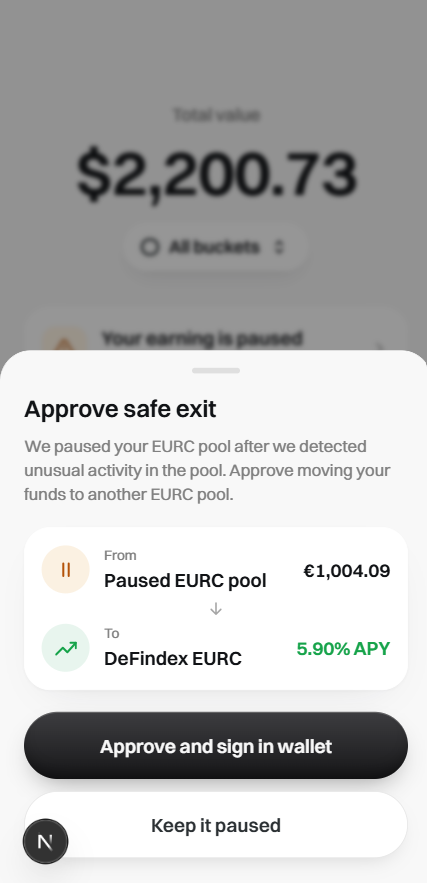
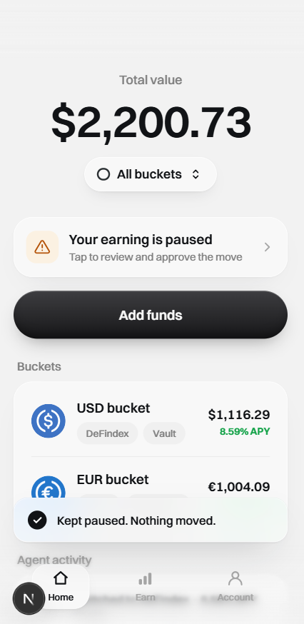
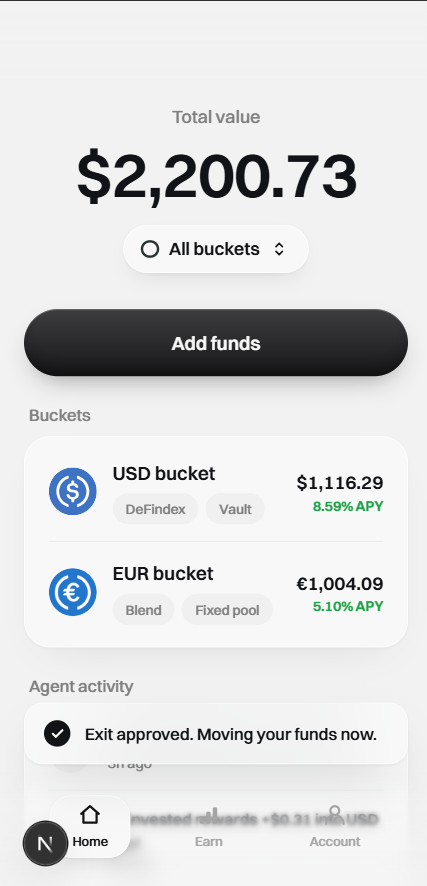
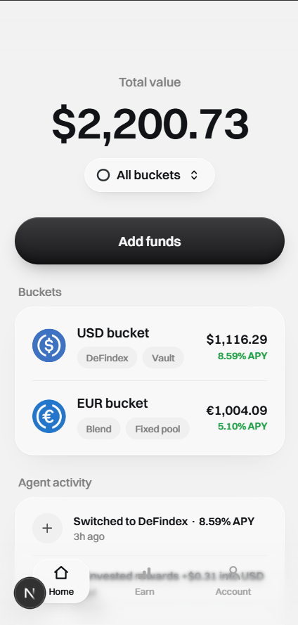
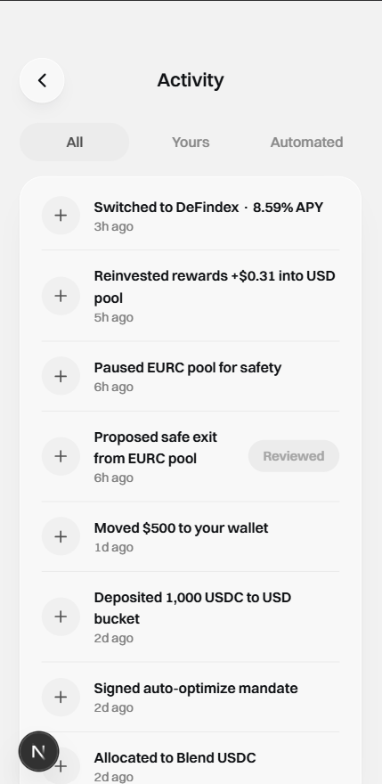
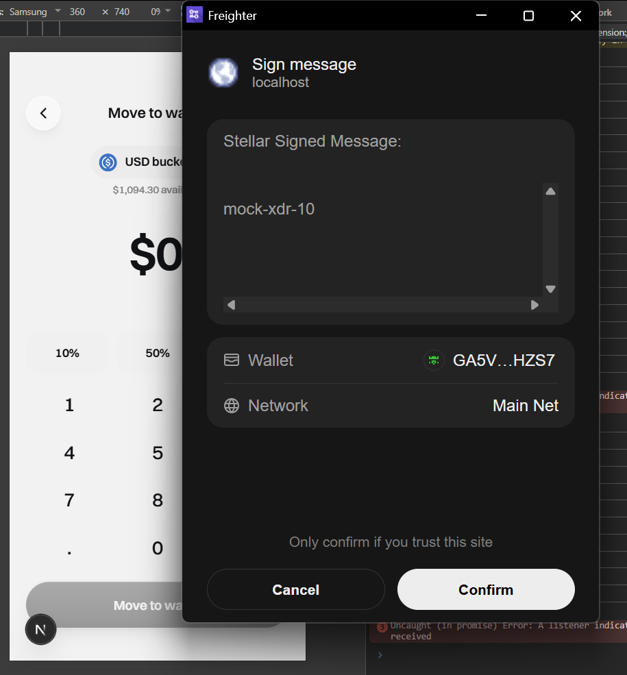

## Summary
- **U15 (STE-25)** — the single approval surface for SoroSense, built against the mock vault seam (`@sorosense/vault-client` `MockVaultClient`), from `docs/mockups/sorosense-mock-2.html` (`#exitSheet` + `.freezebanner`):
  - **Freeze status banner** — prominent "Your earning is paused" banner on Home when a held pool is frozen (invisible-safety copy: no "Sentinel"/"risk"). Wired to open the exit sheet directly (was a display-only placeholder in U14).
  - **Approve-safe-exit sheet** (`components/proposal/ExitApproval.tsx`) — after a Sentinel freeze, offers **Approve / Decline**: From "Paused EURC pool" → To "DeFindex EURC · 5.90% APY". **Approve** signs the movement in the wallet (reusing the U13/U14 `depositorSigner` path); **Decline** ("Keep it paused") moves nothing.
  - **Withdraw signing** — unchanged, shares the same `depositorSigner` + `signAndSubmit` path.
  - Auto-compound and auto-rebalance stay **silent** — activity entries only, **no approval prompt** (AE1).
- State machine: frozen-but-not-yet-proposed (interstitial) → exit proposed → signing → confirmed/failed; Decline is a no-op on funds.
- New plumbing: `usePendingExit()` (single source for banner visibility + sheet content), `VaultProvider.bump()` (live re-read so the banner clears after approve without a navigation), `getPoolMeta` (target-pool display), and a dev-seed `proposeExit("EUR", …)`. `FreezeBanner` relocated to `components/status/` per the ticket. No changes to `packages/vault-client`, `WithdrawKeypad`, or `DepositKeypad`.

## E2E evidence

Dev browser verification

Passed on dev.

Environment:
- Branch: `AncungAulia/ancungaulia-ste-25-u15-approve-exit-freeze-status-withdraw-signing` · Commit: `<COMMIT>` · URL: `http://localhost:3000` (`pnpm -C frontend dev`)
- Freighter connected at a **desktop viewport** (device-mode hides Freighter). Mock seeded: USD ≈ $1,116.29, EUR ≈ €1,004.09, **EUR pool frozen + a safe exit proposed** (EUR → DeFindex EURC 5.90%).

Screens (in `docs/tests/linear-STE-25/screenshots/`):

- **Home — freeze banner** — "Your earning is paused / Tap to review and approve the move" (invisible-safety, no "Sentinel"/"risk"):
  
- **Approve safe exit sheet** — From "Paused EURC pool" ≈ €1,004.09 → To "DeFindex EURC · 5.90% APY"; "Approve and sign in wallet" + "Keep it paused":
  
- **Decline** — "Keep it paused" → toast "Kept paused — your funds stay safe."; banner still present (nothing moved):
  
- **Approve** — "Approve and sign in wallet" → wallet sign → toast "Exit approved. Moving to a safe pool.":
  
- **Home after approve** — freeze banner cleared + EUR bucket no longer paused (live re-read via `bump()`):
  
- **Activity — AE1** — only the "Proposed safe exit from EURC pool" row has "Review"; rebalance/compound rows have none:
  
- **Withdraw** — still signs via the wallet (unchanged shared signing path):
  

Result:
- Freeze banner appears when the EUR pool is frozen; the funds are **protected, not moved** (the EUR bucket value is unchanged until approval).
- The exit proposal shows the From→To movement + rationale; Approve signs and moves funds to the safe pool (the banner clears live), Decline keeps it paused and moves nothing.
- Auto-compound / auto-rebalance activity rows show **no** Review action — no approval prompt (AE1).
- Withdraw signs via the wallet.

Console/network notes:
- One pre-existing U13 warning: `[TWIND_INVALID_CLASS] Unknown class "easy-in-out"` from `lib/wallet.ts` (harmless, unrelated to U15). <!-- update/remove after checking the console -->

Automated coverage (green): `pnpm -C frontend test` — 32 files / 66 tests. `pnpm -r typecheck`, `pnpm -C frontend lint` clean; repo-root `pnpm -r test` (vault-client 13 + backend 82 + frontend 66) green.

## Checklist
- [ ] Sesuai `docs/mockups/sorosense-mock-2.html` (`#exitSheet` + `.freezebanner`)
- [ ] TIDAK ada: label risiko, risk tier, chatbot, hub/explore catalog; no "Sentinel"/"risk" copy
- [ ] Test scenarios unit (plan) lulus — approve/decline/AE1/withdraw
- [ ] Before/after screenshots ter-render (bukan `Uploading...`)

## Notes / deferred (non-blocking)
- The "frozen-but-not-yet-proposed" interstitial state is modeled in `ExitApproval` but the dev seed proposes the exit immediately, so it isn't reachable in this demo.
- Real contract/backend wiring (live freeze/propose/approve on testnet) → **U20 (STE-21)** / U17.
