## Summary
- **U16 (STE-26)** — the Earn tab's two states + a slimmed Account tab, built against the mock vault seam (`@sorosense/vault-client` `MockVaultClient`), from `docs/mockups/sorosense-mock-2.html`:
  - **Earn — empty state** — zero-balance hero + a deterministic **"Simulate earnings"** card (`lib/earn/simulate.ts`). The user picks a **currency** (USD/EUR/MXN), an amount, and a period; the agent picks the pool. There is **no pool selector and no risk label** (R11).
  - **Earn — funded state** — consumes an `EarningsView`-shaped seam (`hooks/useEarnings.ts`): **"Total earned"** hero with a `balance · APY` subline (value-weighted, not a plain mean), a **Growth** card of per-interval bars windowed Day/Week/Month/Year, and a newest-first **monthly breakdown** with 3 + 3 "Load more" pagination.
  - **Account** — deterministic identicon, address chip with a copy toast, "Connected via Freighter", an **Activity** row routing to `/account/activity`, a **read-only** auto-reinvest switch reflecting `hasConsent()`, and a **Log out** confirm drawer.
- Both tabs are **read-only**: every action routes back into the U14/U15 flows. Consent is granted by signing the mandate in the deposit flow, never from Account.
- New plumbing: `lib/earn/simulate.ts` (frontend mirror of the deterministic projection), `hooks/useEarnings.ts`, `lib/earnings/fixtures.ts` (clock-injected, normalized), `components/earn/Bars.tsx` (one bar primitive shared by the simulator and the Growth card), `components/earn/GrowthCard.tsx`, `components/earn/MonthlyBreakdown.tsx`, `components/simulator/Simulator.tsx`, `hooks/useConsent.ts` (fail-closed), `components/account/Identicon.tsx`, `components/ui/Switch.tsx` + `Segmented.tsx`.

## E2E evidence

Dev browser verification

Passed on dev.

Environment:
- Branch: `AncungAulia/ancungaulia-ste-26-u16-earn-simulator-account-ui-no-risk-labels` · Commit: `8ef4fa1` · URL: `http://localhost:3000` (`pnpm -C frontend dev`)
- Freighter connected at a **desktop viewport** (device-mode hides Freighter). Mock seeded: USD ≈ $1,116.29 (8.59% APY) + EUR ≈ €1,004.09 (5.10% APY) → blended balance ≈ $2,200.73, earned ≈ $182.72, APY ≈ 6.87%.
- Shots 1–4 need the empty state, which the running app can't reach: `/earn` sits behind `AuthGate`, and `VaultProvider` seeds the moment an address appears. They were taken with the `seedVault()` call temporarily commented out, then the file restored (`git checkout -- frontend/providers/VaultProvider.tsx`) before shots 5–12. That edit is **not** in this branch — see `screenshots/SHOTS.md`.

Screens (in `docs/tests/linear-STE-26/screenshots/`):

**Earn — empty state (deterministic simulator)**

- **USD, Year** — hero "Earn balance" `$0.00` + `8.59% APY`; stepper `$1,000`, "You would earn" `$85.90`, 20 bars. No risk word, no pool selector:
  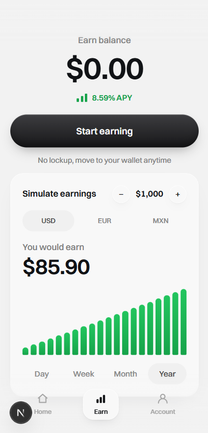
- **EUR** — the hero APY flips to `5.10%` alongside the stepper's `€1,000` and a `€51.00` projection: the hero and the simulator read **one** `currency` state. The projection stays in EUR — never converted to USD (R3). The bars redraw because a different APY bends the compound curve:
  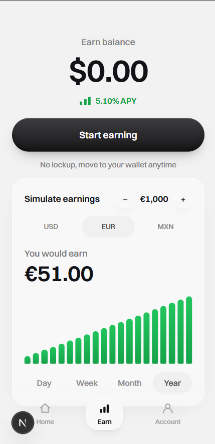
- **EUR, `+` twice** — `€2,000` → `€102.00`, exactly double: the projection is linear in principal:
  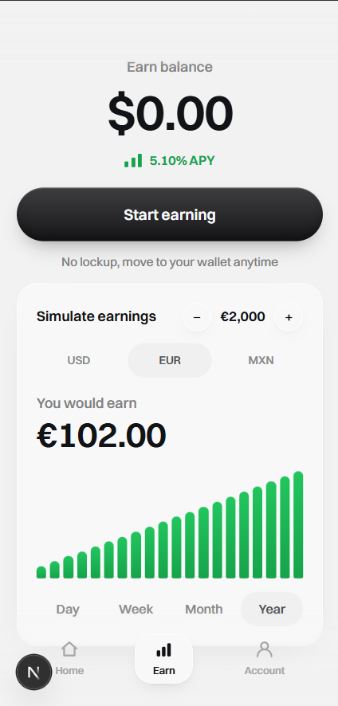
- **MXN, Month** — hero `5.57% APY`, stepper `MX$2,000`, projection `MX$8.93`. `MX$` (not `$`) disambiguates the peso; the bars redraw for the shorter horizon:
  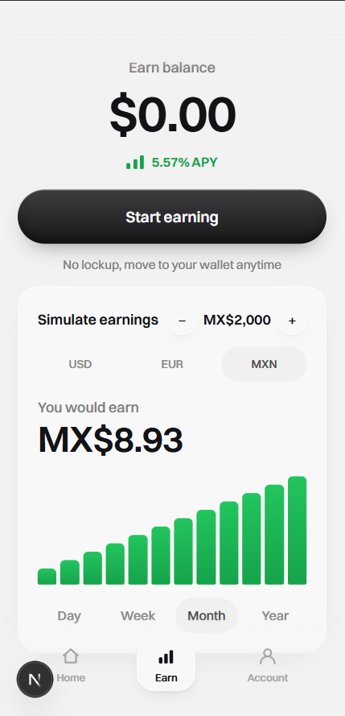

**Earn — funded state**

- **Hero** — "Total earned" `$182.72`, subline `$2,200.73 balance · 6.87% APY` (the U16 change; U14 read "on $X balance · no lockup"). The APY is value-weighted, not a mean of 8.59/5.10. Below: the "All buckets" pill, Deposit / Move to wallet, and the Growth card with the monthly breakdown's first 3 rows + "Load more":
  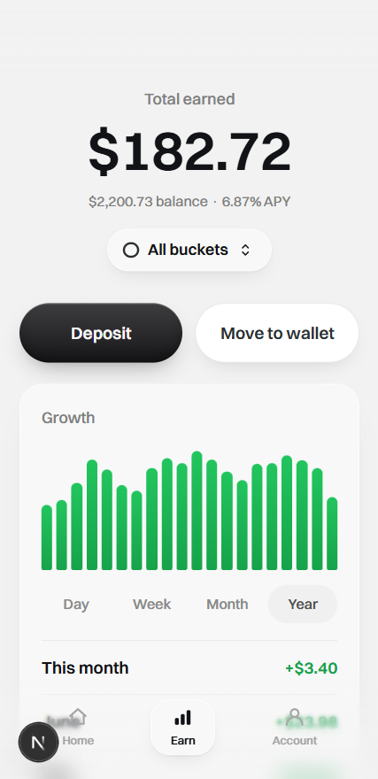
- **Growth → Day** — the chart redraws to 24 bars (one per hour; Week → 7, Month/Year → 20). The bars are **earned per interval**, not the cumulative total, which is why a short window isn't 24 identical bars:
  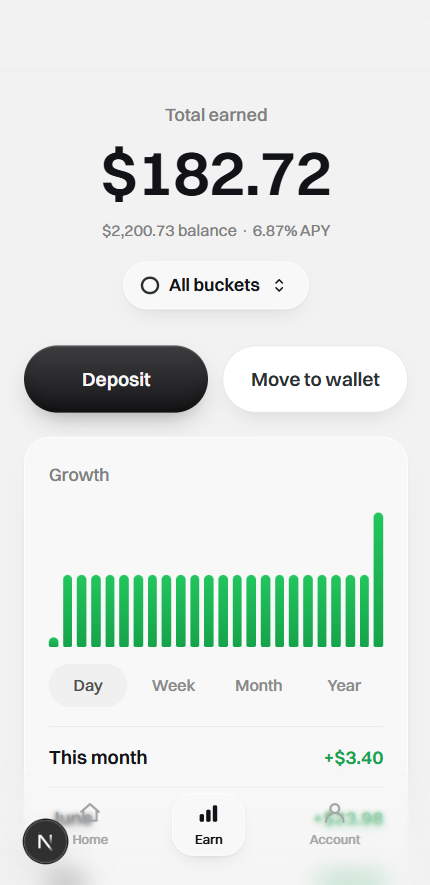
- **Breakdown → "Load more" ×2** — rows go 3 → 6 → 9 and the button disappears on the last click. Labels read "This month", then bare month names for this year, then "December 2025"-style for last year (the year disambiguates two Decembers). Amounts are green `+$X` and sum to the hero's earned figure:
  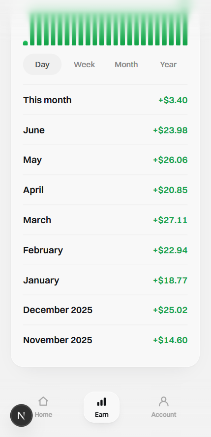
- **Bucket toggle** — tapping "All buckets" switches the **hero** to "USD bucket" with its own earned `$92.00` / `$1,116.30` balance / `8.59% APY`. The **Growth card does not change** — chart and breakdown stay blended, because `getEarnings()` returns one blended timeline, not one per bucket. Anything else would invent data the backend doesn't have:
  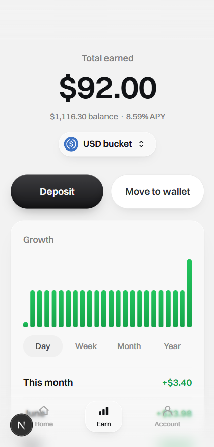

**Account**

- **Account tab** — deterministic 5×5 identicon, address chip `GA5V…HZS7`, "Connected via Freighter", the Activity row, the auto-reinvest row with its switch **off and visibly dimmed**, and Log out in red. **No "since July 2026"** — nothing records when a wallet first connected, so we don't claim it (a deliberate divergence from mock-2):
  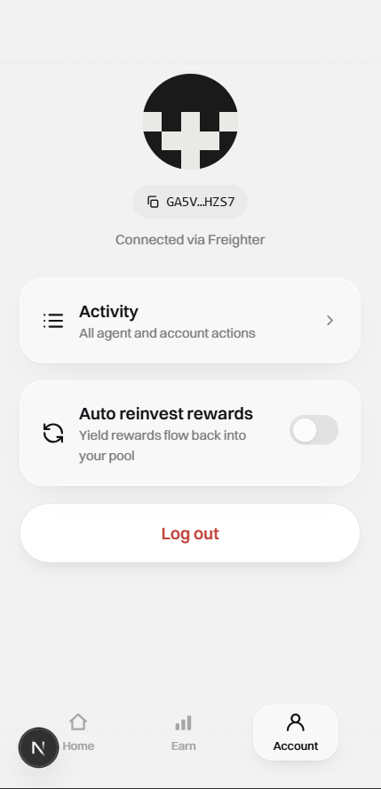
- **Copy** — tapping the address chip → toast "Address copied":
  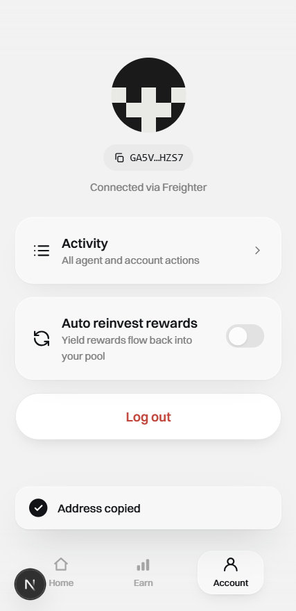
- **Log out** — the confirm drawer: "Log out?" + "Your funds stay in the vault. Reconnect your wallet any time to see them again." + "Yes, log out" / "Cancel". Cancelled here, since logging out would end the session before the next shot:
  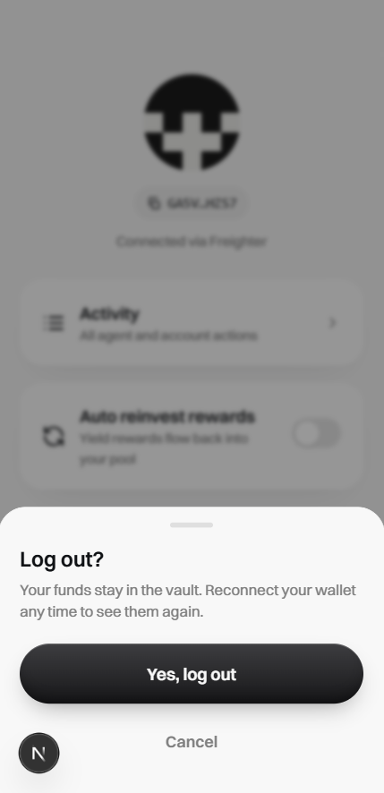
- **Consent, live** — after depositing (consent sheet → sign in Freighter), the same switch is **on**, read from `hasConsent()` — still dimmed, still not pressable. Off → on was moved by signing the mandate in the deposit flow and by **nothing on this screen**:
  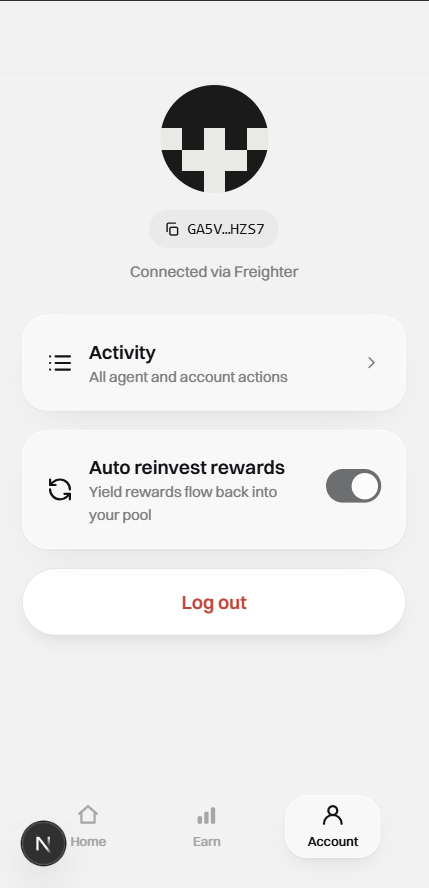

Result:
- The user picks a **currency**, never a pool, and the projection stays in that bucket's currency (R11, R3, R15).
- The empty hero's APY and the simulator read one `currency` state; the funded hero's APY is a value-weighted blend (R5).
- Growth bars are per-interval deltas windowed Day/Week/Month/Year (R8); the monthly breakdown is newest-first with 3 + 3 pagination (R9).
- Auto-reinvest is a **status row**, not a control: the seam has `setPolicyConsent()` (idempotent) and `hasConsent()` (boolean) but no revoke, and granting is a write — which STE-26 forbids from this tab. A live switch lands in STE-38/39/40.
- **No risk label, tier, or score appears on any surface** (R11), and neither tab offers an execution path — every action routes back into the U14/U15 flows.

Console/network notes:
- One pre-existing U13 warning: `[TWIND_INVALID_CLASS] Unknown class "easy-in-out"` from `lib/wallet.ts` (harmless, unrelated to U16).

Automated coverage (green): `pnpm -C frontend test` — 44 files / 133 tests. `pnpm -r typecheck` and `pnpm -C frontend lint` clean; repo-root tests green (vault-client 13 + backend 82 + frontend 133).

## Checklist
- [x] Sesuai `docs/mockups/sorosense-mock-2.html` (Earn 2-state + Account)
- [x] TIDAK ada: label risiko, risk tier, chatbot, hub/explore catalog, pool selector
- [x] Test scenarios unit (plan) lulus — empty↔funded, currency/period redraw, breakdown, no execution path
- [x] Screenshots ter-render (bukan `Uploading...`)

## Notes / deferred (non-blocking)
- The Earn empty state is unreachable in the seeded dev app (see Environment above); shots 1–4 required temporarily disabling the seed. It is covered by `app/(app)/earn/__tests__/earn-empty.test.tsx` without that tweak.
- The auto-reinvest switch is read-only by design. Making it a live control (grant/revoke) → **STE-38/39/40**.
- The Growth card is blended-only; a per-bucket timeline needs a backend read that doesn't exist yet.
