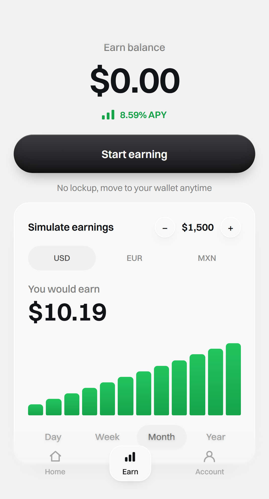
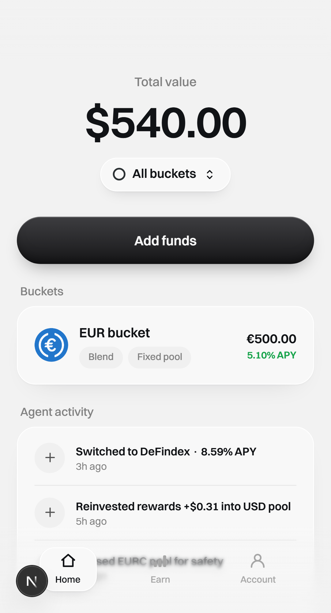
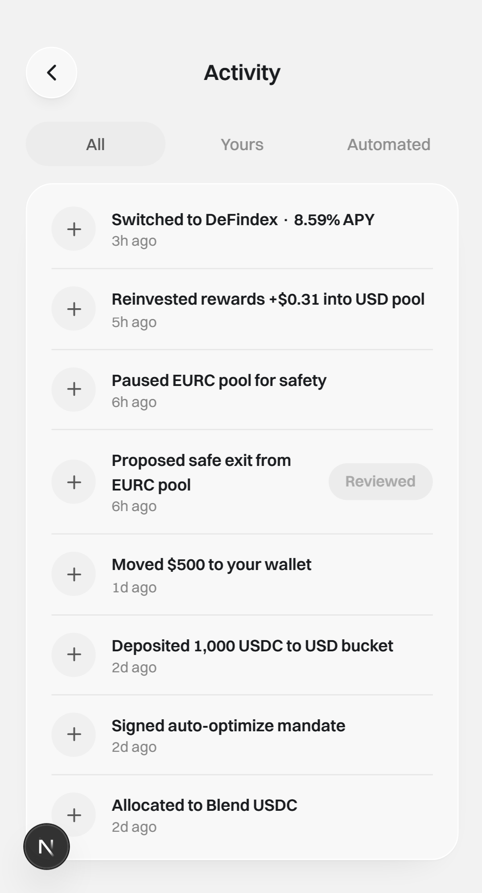
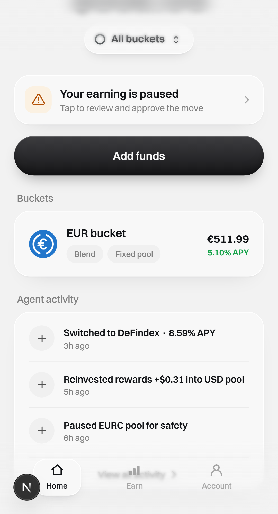

## Summary

- **U17 (STE-27)** — the repo's first Playwright harness, plus `frontend/e2e/demo-flow.spec.ts`: the full demo journey and the two UI-level invariants, green under `pnpm e2e` against `MockVaultClient` and a keeper stub. No new feature; no production DOM change; no new `data-testid`.
- The ticket was written on 3 July, before U13–U16 exposed three facts that made its approach unrunnable as written. Each is answered by a seam gated on one build-time flag, `NEXT_PUBLIC_E2E === "1"`, which Next inlines — so every branch below is dead code in a production build:
  - **Playwright was not installed at all.** `frontend/playwright.config.ts` + `pnpm e2e` (root passthrough → `frontend`). One project, Chromium at the `Pixel 5` viewport, because the app is mobile-first. The e2e server runs on **port 3100 with `reuseExistingServer: false`** — an e2e server is defined by its environment, so adopting a hand-run `pnpm dev` on 3000 would silently test the real wallet.
  - **"Connect wallet" cannot be automated.** Freighter is a browser extension. `lib/wallet.ts` is now a six-line dispatcher over `lib/wallet-real.ts` (Stellar Wallets Kit, moved verbatim) and `lib/wallet-e2e.ts` (in-memory stub: deterministic `G…` address, `signTransaction` returns a marker the mock discards).
  - **The state the journey needs was unreachable.** `<Simulator>` renders only in Earn's *empty* branch, while the freeze banner and exit proposal existed only because `seedVault()` froze a pool before first paint. Under the flag `VaultProvider` skips the seed and installs `window.__sorosense__.keeper` (`lib/e2e/bridge.ts`) — the "backend stub" the ticket names. The vault starts empty, and **every state change in the journey has a visible cause**: the user deposits, the keeper allocates, the keeper freezes.
- Amounts cross the Node↔browser boundary as decimal strings, never `bigint`. `freeze` and `proposeExit` are separate bridge calls, so the interstitial ("Preparing your safe exit.") is assertable. Keeper actions sign with `mockSigner("keeper")` and read pool ids from the existing `SEED_POOLS` / `SEED_SAFE_EXIT`.
- **Scope held:** `useActivity` stays a fixture (STE-42), per-currency APY stays hardcoded (STE-41), no testnet wiring (U20).

### Two pre-existing bugs found, filed, not fixed here

- **STE-43** — a hard load of any gated route bounces to the landing page even with a session in localStorage: `AuthGate`'s effect runs before `WalletProvider` hydrates `address` (React runs child effects first). The specs navigate by clicking rather than `page.goto()`, which is the truer journey anyway.
- **STE-44** — the deposit's "Deposited. Agent is allocating." toast unmounts with the screen that pushes to `/home`, so the user never sees it. The journey asserts the bucket row and balance instead — the only confirmation that actually reaches them.

## E2E evidence

<details>
<summary>Dev browser verification</summary>

Passed on dev.

Environment:
- Branch: `AncungAulia/ancungaulia-ste-27-u17-frontend-e2e-tests-wiring` · Commit: `40efaee` · `pnpm e2e` (Playwright `webServer` → `pnpm dev --port 3100`, `NEXT_PUBLIC_E2E=1`)
- Chromium, `Pixel 5` viewport. **No Freighter, no wallet popup** — the wallet is stubbed at the `lib/wallet.ts` seam. Unlike U13–U16, no screenshot here was taken by hand and no source was commented out to reach a state: `E2E_EVIDENCE=1 pnpm e2e` captures them from the running journey.
- The vault starts **empty**. Every figure below is the arithmetic of what the test did: deposit €500 → keeper `compound` €12 → the exit sheet offers €511.99 (the residue is the mock's virtual-offset NAV rounding).

```
Running 3 tests using 1 worker

  ok 1 [mobile-chromium] › e2e\demo-flow.spec.ts:5:5 › the demo journey: connect → simulate → deposit → agent works → approve a safe exit (11.2s)
  ok 2 [mobile-chromium] › e2e\demo-flow.spec.ts:92:5 › no user surface exposes a risk label, tier, or score (11.5s)
  ok 3 [mobile-chromium] › e2e\demo-flow.spec.ts:150:5 › a rebalance never asks the user to approve anything (5.0s)

  3 passed (38.7s)
```

Screens (in `docs/tests/linear-STE-27/screenshots/`):

**The journey**

- **Earn — empty, with a wallet connected.** This screen was previously unreachable in a running app; it is the point of the bridge. Hero `$0.00`, and the deterministic simulator (R15) responding to both controls: `$1,500` after one `+`, horizon `Month` → `$10.19`, twelve bars. No pool selector, no risk word:
  
- **Consent sheet** — the first deposit surfaces the one-time auto-optimize mandate. The seed never granted consent, and under e2e there is no seed at all, so this is a genuine first deposit:
  
- **Home, funded** — `EUR bucket · €500.00`. The deposit was signed through the stub, submitted to the mock, and read back by `useBuckets`:
  
- **Activity** — the agent's work is shown, never approved. `Allocated to Blend USDC` and `Reinvested rewards` are visible after the keeper's `allocate` + `compound`. (Home renders only the top three rows, so the allocate row lives on `/account/activity`. These rows are a fixture — STE-42 — so what is under test is that agent work is *displayed*, not that the deposit manufactured the row):
  
- **Freeze banner** — after `keeper.freeze("EUR")`. A freeze moves nothing; it only pauses. "Your earning is paused", no risk wording:
  
- **Approve safe exit** — after `keeper.proposeExit("EUR")`. From `Paused EURC pool` **€511.99** (the €500 deposit plus the €12 the keeper compounded) to `DeFindex EURC` at `5.90% APY`. This is the **only** surface in the app that asks the user for a signature to move funds:
  
- **Approved** — the banner clears and the `Review` affordance dies into a dead `Reviewed` pill:
  

Before reaching the proposal the sheet shows only "Preparing your safe exit." — asserted in the journey, which is why `freeze` and `proposeExit` are separate bridge calls rather than one.

**The invariants**

- **No risk label, tier, or score** (R11). The scan reads `document.body.innerText` on the landing page, `/home` (frozen), the safe-exit sheet, `/account/activity`, `/earn` (funded), `/withdraw`, `/add-funds`, `/deposit/eurc` (pool paused) and `/account`, matching `/\b(risk|risks|risky|tier|tiers|score|scores)\b/i`. `safety` is deliberately not in the pattern: "Paused EURC pool for safety" is the agent explaining an action, not a rating pinned to the user's money.
  The test was confirmed to bite: with a temporary `Buckets (low risk)` heading on Home it fails with `risk wording on /home (frozen)`. The heading was reverted (`git checkout --`) and is **not** in this branch.
- **A rebalance never asks.** `keeper.rebalance("USD")` moves funds between healthy pools under the standing mandate; afterwards no dialog is open, no "Approve" button exists, no freeze banner shows, and the `Switched to DeFindex` activity row carries no `Review` pill. `BottomSheet` keeps `role="dialog"` even while closed (`aria-hidden={!open}`), so the assertions use `getByRole`, which skips aria-hidden subtrees — that distinction *is* the test.

</details>

## Green gate

- `pnpm -r typecheck` — clean. The Playwright config and specs sit inside `frontend/tsconfig.json`'s include, so `noUncheckedIndexedAccess` covers them. It caught a real modelling error: typing the bridge as `Record<KeeperAction, (currency, amount) => …>` forced `freeze("EUR")` to pass an amount it never uses. The bridge now declares each action's true signature and the spec helper dispatches on a `switch` rather than casting.
- `pnpm -C frontend lint` — clean. `eslint.config.mjs` now ignores `playwright-report/` and `test-results/` (bundled vendor JS, not ours).
- `pnpm -r test` — 260 passed (frontend 143, backend 104, vault-client 13), including 5 new unit tests for `lib/wallet-e2e.ts` and 5 for `lib/e2e/bridge.ts`. `vitest.config.mts` excludes `e2e/**` so the two runners do not overlap.
- `pnpm e2e` — 3 passed.
