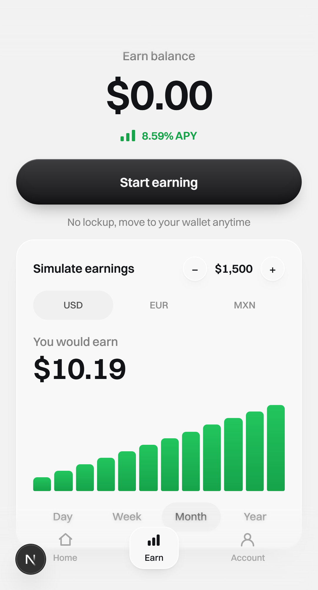
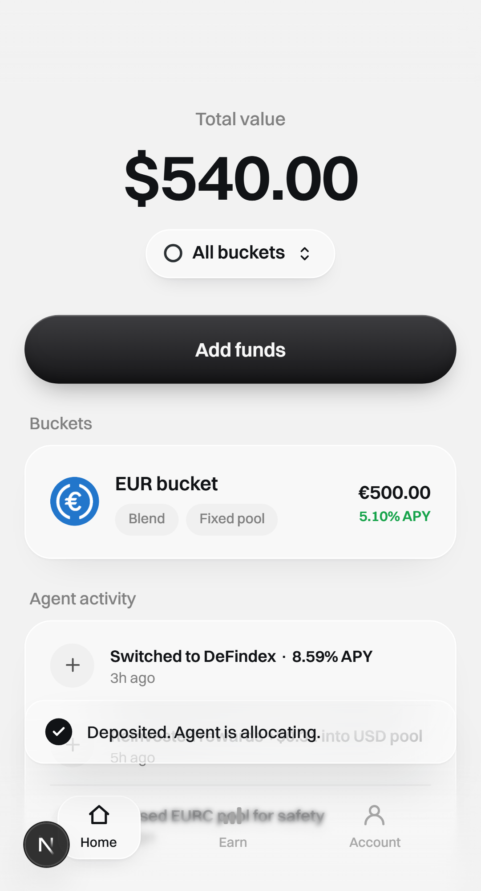
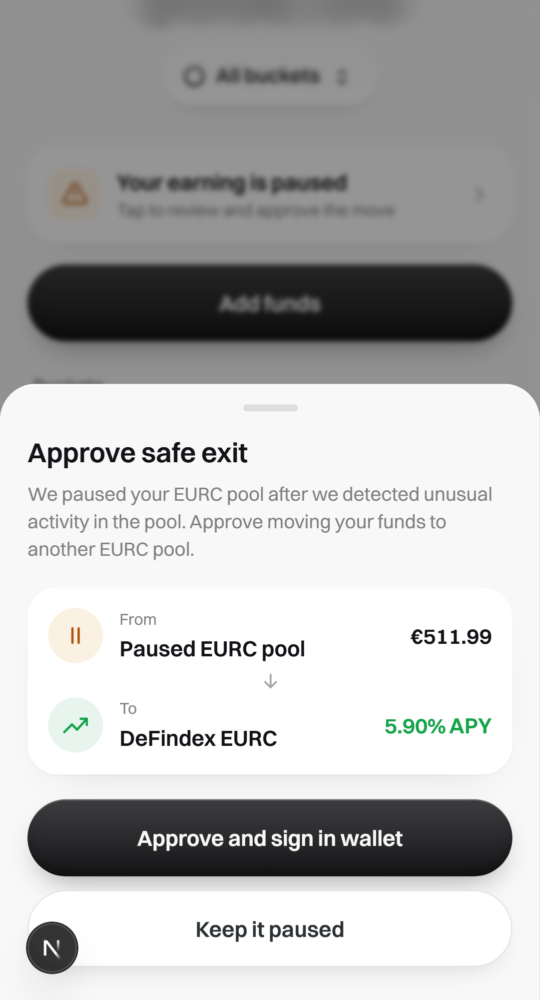
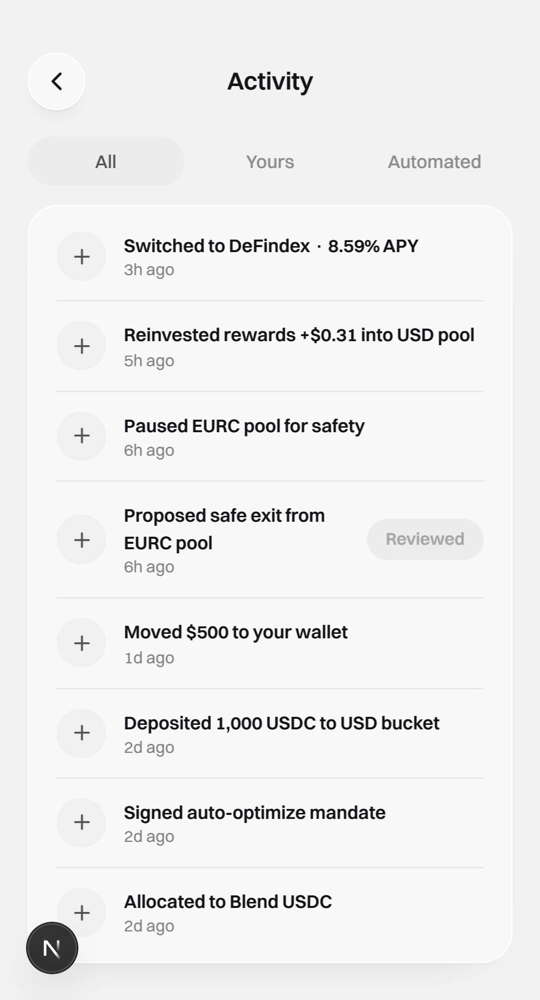
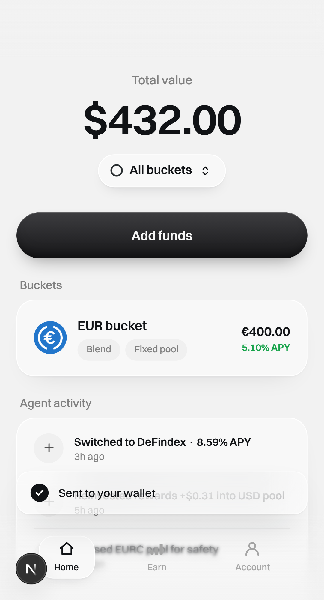

## Summary

- **STE-44** — the deposit success toast ("Deposited. Agent is allocating.") never showed: `DepositKeypad` called `setToast(...)` immediately before `router.push("/home")`, so the toast mounted and unmounted with the screen that was pushing it, and the confirmation never reached the user. U17 (STE-27) found the bug, named it, and worked around it — `demo-flow.spec.ts` carried a comment explaining why the deposit toast could *not* be asserted.
- **Root cause and fix (Tasks 1-3, already merged on this branch):**
  - Task 1 (`0e07811`) — a `ToastProvider` was added at the root layout (`app/layout.tsx`), above both route groups. A message handed to `useToast().show()` now lives in state owned by a component that never unmounts on route change, and auto-dismisses after `TOAST_MS` (2500 ms) instead of dying with the screen.
  - Task 2 (`d45f7b9`) — `DepositKeypad` migrated from its own local `<Toast>` to `useToast()`. The deposit toast now survives the push to `/home`.
  - Task 3 (`5bd1e61`) — `WithdrawKeypad` had the identical shape (`setToast(...)` immediately before `router.push("/home")`) and the identical bug, never named in the ticket. It was migrated the same way. The withdraw toast is "Sent to your wallet".
- **This unit (Task 4)** adds no production code. It:
  1. Points the e2e evidence directory at `docs/tests/linear-STE-44/screenshots` (`frontend/e2e/support/journey.ts:4`, the only line changed in that file).
  2. Adds one screenshot call, `await shot(page, "03a-deposit-toast")`, immediately after the new deposit-toast assertion in `demo-flow.spec.ts`, so the toast is captured deterministically rather than relying on `03-home-funded` (taken after two more assertions) to still show it before the 2500 ms auto-dismiss.
  3. Captures the full evidence run and runs the repo's green gate.
- **What's new in the spec vs. the STE-27 baseline:**
  - The deposit toast assertion (`await expect(page.getByText("Deposited. Agent is allocating.")).toBeVisible();`) is new. Before this branch, the spec carried a comment at this point explaining why the assertion could not be made, naming STE-44. That comment is gone — the assertion replaced it.
  - The withdraw toast (`Sent to your wallet`) was the same bug, never named in the ticket. No spec had ever completed a withdrawal before; `a completed withdrawal confirms itself on /home` is the first test to do so.
- **Deliberately out of scope:** four other `<Toast>` callers (`app/page.tsx` ×2, `app/(app)/account/page.tsx`, `components/proposal/ExitApproval.tsx`) were **not** migrated. Their screens don't navigate away on success, so they were never broken by this bug — unifying all six callers onto `ToastProvider` is a separate design decision that needs PM sign-off, not a fix for this ticket. `components/ui/Toast.tsx` itself is unchanged; only its callers moved to a shared provider.
- **Timing change, intentional:** error toasts on the deposit/withdraw screens now auto-dismiss after 2500 ms where they previously persisted until the screen unmounted. This is a direct consequence of moving them onto the shared `ToastProvider` and is called out in the spec.
- **STE-43** (a hard load of any gated route bounces to the landing page — `AuthGate` races `WalletProvider` hydration) remains open and untouched. Every spec still reaches gated routes by clicking, never `page.goto()`.

## E2E evidence

<details>
<summary>Dev browser verification</summary>

Passed on dev.

Environment:
- Branch: `AncungAulia/ancungaulia-ste-44-deposit-success-toast-never-shows-it-unmounts-with-its` · `E2E_EVIDENCE=1 pnpm e2e` (Playwright `webServer` → `pnpm dev --port 3100`, `NEXT_PUBLIC_E2E=1`)
- Chromium, `Pixel 5` viewport. No Freighter, no wallet popup — the wallet is stubbed at the `lib/wallet.ts` seam, same as STE-27.
- The vault starts **empty**, module-shared across all four tests in the file (they run serially, one worker), which is why the withdrawal test withdraws a partial amount (€100) rather than "Max": the bucket's absolute balance at that point is not its own to assume, only that it holds more than €100.

```
Running 4 tests using 1 worker

  ok 1 [mobile-chromium] › e2e\demo-flow.spec.ts:5:5 › the demo journey: connect → simulate → deposit → agent works → approve a safe exit (16.7s)
  ok 2 [mobile-chromium] › e2e\demo-flow.spec.ts:94:5 › no user surface exposes a risk label, tier, or score (11.6s)
  ok 3 [mobile-chromium] › e2e\demo-flow.spec.ts:152:5 › a rebalance never asks the user to approve anything (6.8s)
  ok 4 [mobile-chromium] › e2e\demo-flow.spec.ts:178:5 › a completed withdrawal confirms itself on /home (8.6s)

  4 passed (1.0m)
```

Screens (in `docs/tests/linear-STE-44/screenshots/`):

**The journey (carried over from STE-27, unchanged behavior)**

- **Earn — empty, with a wallet connected.** Hero `$0.00`, the deterministic simulator responding to both controls:
  
- **Consent sheet** — the first deposit surfaces the one-time auto-optimize mandate:
  
- **Deposit toast, captured deterministically (new for STE-44).** Taken immediately after `await expect(page.getByText("Deposited. Agent is allocating.")).toBeVisible();`, before any further assertion can let the 2500 ms auto-dismiss run out. This is the toast STE-44 says never shows — it is visible here, sitting above "Reinvested rewards" in the Agent activity list, still on `/home` after the push from the deposit screen:
  
- **Home, funded** — `EUR bucket · €500.00`. Taken a few assertions after the toast above. `03a-deposit-toast` is captured immediately after the toast's own `toBeVisible()` assertion so it can never race the 2500 ms auto-dismiss; the two `shot()` calls are separated only by further `toBeVisible()` assertions, which change no state, so in this run `03a-deposit-toast.png` and `03-home-funded.png` are byte-for-byte identical. That redundancy is expected, not a bug in the capture, and is exactly why `03a-deposit-toast` exists as its own deterministic capture rather than relying on this one:
  
- **Activity** — the agent's work (`Allocated to Blend USDC`, `Reinvested rewards`) after the keeper's `allocate` + `compound`:
  
- **Freeze banner** — after `keeper.freeze("EUR")`. "Your earning is paused", no risk wording:
  
- **Approve safe exit** — after `keeper.proposeExit("EUR")`, from `Paused EURC pool` to `DeFindex EURC`:
  
- **Approved** — the banner clears and the `Review` affordance dies into a dead `Reviewed` pill:
  

**The withdraw toast — new test, new screenshot**

- **Withdraw toast on /home (STE-44's twin bug, new for this ticket).** `a completed withdrawal confirms itself on /home` deposits €500, withdraws €100 through `WithdrawKeypad`, and asserts `page.getByText("Sent to your wallet")` is visible after the push to `/home`. No spec had ever completed a withdrawal before this test — the toast is captured right after that assertion, sitting above "Reinvested rewards +$0.31 into USD pool" in the Agent activity list, the same position the deposit toast occupies:
  

</details>

## Green gate

- `pnpm -r typecheck` — clean (`vault-client`, `frontend`, `backend`). `noUncheckedIndexedAccess` covers the e2e specs (they sit inside `frontend/tsconfig.json`'s include); no changes here touched typed code.
- `pnpm -C frontend lint` — clean, no output beyond the `eslint` invocation.
- `pnpm -r test` — 296 passed (`vault-client` 18, `backend` 131, `frontend` 147), including the existing `providers/__tests__/ToastProvider.test.tsx` (4 cases, from Task 1) and the `DepositKeypad`/`WithdrawKeypad` suites, migrated to `useToast()` in Tasks 2-3, plus the `ExitApproval` suite, which still runs but covers a component that was **not** migrated (it stays on its own page-local `<Toast>`, per the Summary above). No test file changed in this unit.
- `pnpm e2e` — 4 passed, all four specs in `frontend/e2e/demo-flow.spec.ts` including the new withdrawal test.
